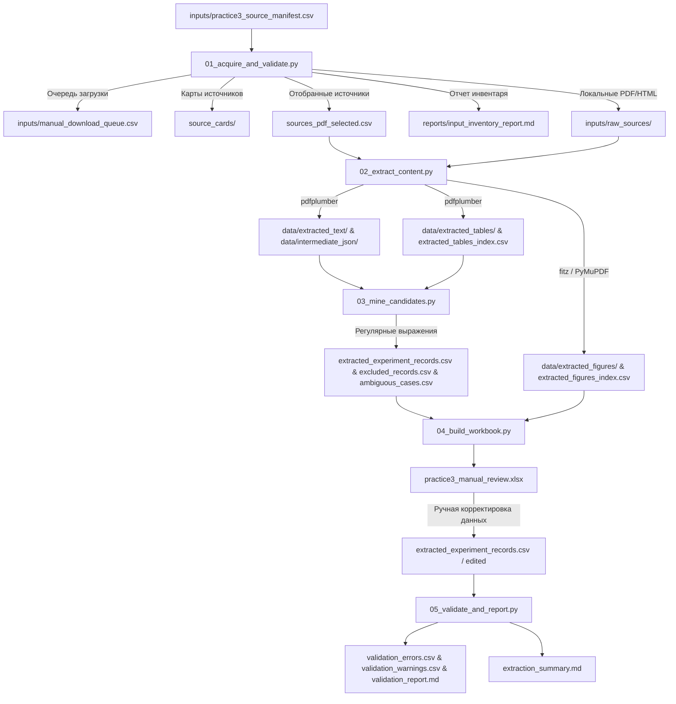

# Архитектура проекта: Practice 3 PDF Extraction (Упрощенная)

Проект представляет собой простой и наглядный учебный конвейер (pipeline) на Python для извлечения, структурирования и валидации экспериментальных данных по фотокаталитической деструкции органических красителей из научных публикаций (PDF-файлов).

---

## 1. Схема конвейера данных (Mermaid Flowchart)



---

## 2. Описание этапов конвейера

### Этап 1. Сбор и валидация инвентаря
* **Скрипт**: 01_acquire_and_validate.py
* **Входы**: `inputs/practice3_source_manifest.csv`
* **Действие**: Читает манифест источников, пытается автоматически скачать PDF-файлы (в сетевом режиме), готовит отчет инвентаризации в `reports/input_inventory_report.md` и помещает недоступные файлы в очередь `inputs/manual_download_queue.csv` для ручного скачивания. Также генерирует краткие карточки источников в `source_cards/`.

### Этап 2. Извлечение контента (Парсинг PDF)
* **Скрипт**: 02_extract_content.py
* **Входы**: Локальные PDF-файлы и список источников `sources_pdf_selected.csv`
* **Действие**:
  * С помощью `pdfplumber` извлекает текст страниц в Markdown-файлы (`data/extracted_text/`) и в JSON (`data/intermediate_json/`).
  * Извлекает таблицы и сохраняет их в индивидуальные CSV-файлы (`data/extracted_tables/`), формируя индекс таблиц `extracted_tables_index.csv`.
  * Рендерит страницы PDF в PNG-изображения с помощью `fitz` (`PyMuPDF`) для ручной сверки графиков, формируя индекс рисунков `extracted_figures_index.csv`.

### Этап 3. Поиск кандидатов (Data Mining)
* **Скрипт**: 03_mine_candidates.py
* **Входы**: Извлеченные тексты и таблицы
* **Действие**: Применяет регулярные выражения и правила фильтрации красителей к тексту и таблицам для автоматического обнаружения условий экспериментов (концентрация красителя, pH, загрузка катализатора, время, степень деградации). Записывает кандидаты в `extracted_experiment_records.csv`, подозрительные случаи в `ambiguous_cases.csv` и исключенные абзацы в `excluded_records.csv`.

### Этап 4. Сборка рабочей книги Excel
* **Скрипт**: 04_build_workbook.py
* **Входы**: Все сгенерированные на прошлых шагах CSV-индексы и списки кандидатов
* **Действие**: Объединяет кандидаты, таблицы, рисунки, аномалии, исключенные записи и справочники в единую книгу `practice3_manual_review.xlsx`. Она служит удобным интерфейсом для ручной проверки исследователем.

### Этап 5. Валидация и отчетность
* **Скрипт**: 05_validate_and_report.py
* **Входы**: Итоговые записи после ручного обзора `extracted_experiment_records.csv`
* **Действие**: Выполняет автоматические проверки: обязательные поля, диапазоны (pH, % деградации), контролируемые словари. Экспортирует лог ошибок/предупреждений (`validation_errors.csv`, `validation_warnings.csv`), отчет `validation_report.md` и сводный отчет о результатах извлечения `extraction_summary.md`.

---

## 3. Структура директорий проекта

```text
├── config/                         # Конфигурации словарей и схем (.yaml)
├── data/                           # Данные на разных этапах конвейера
│   ├── raw_pdfs/                   # Локальные PDF-файлы статей
│   ├── raw_supplements/            # Локальные дополнительные материалы
│   ├── extracted_text/             # Извлеченный текст в Markdown
│   ├── extracted_tables/           # Извлеченные таблицы в CSV
│   ├── extracted_figures/          # Рендеры страниц с рисунками (PNG)
│   └── intermediate_json/          # Постраничные JSON-структуры
├── inputs/                         # Входные спецификации и манифесты
│   ├── practice3_source_manifest.csv  # Манифест источников
│   ├── download_log.csv            # Лог автоматической загрузки
│   └── manual_download_queue.csv   # Очередь для ручного скачивания
├── reports/                        # Отчеты о валидации инвентаря
│   └── input_inventory_report.md   # Отчет об инвентаризации
├── scripts/                        # Скрипты конвейера
│   ├── 01_acquire_and_validate.py  # Сбор источников и валидация инвентаря
│   ├── 02_extract_content.py       # Извлечение текста, таблиц и рендеринг рисунков
│   ├── 03_mine_candidates.py       # Поиск кандидатов на эксперименты с помощью регулярных выражений
│   ├── 04_build_workbook.py        # Создание книги ручного обзора Excel
│   ├── 05_validate_and_report.py   # Валидация записей и генерация финального отчета
│   └── run_practice3_pipeline.py   # Главный скрипт для запуска всего конвейера
├── src/                            # Модули с общей логикой
│   ├── __init__.py                 # Инициализация пакета
│   └── helpers.py                  # Единый вспомогательный файл со всей общей логикой
├── requirements.txt                # Зависимости Python
├── practice3_manual_review.xlsx   # Книга для ручной верификации
├── extraction_summary.md           # Итоговый отчет о результатах извлечения
└── ARCHITECTURE.md                 # Документ об архитектуре проекта (этот файл)
```

---

## 4. Технологический стек

* **Среда выполнения**: Python 3.8+
* **Анализ и трансформация данных**: `pandas`
* **Извлечение текста и таблиц**: `pdfplumber`
* **Рендеринг графиков/иллюстраций**: `PyMuPDF` (`fitz`)
* **Генерация книги Excel**: `openpyxl`
* **Сетевые запросы**: `requests`
* **Поиск по правилам**: Регулярные выражения (`re`)