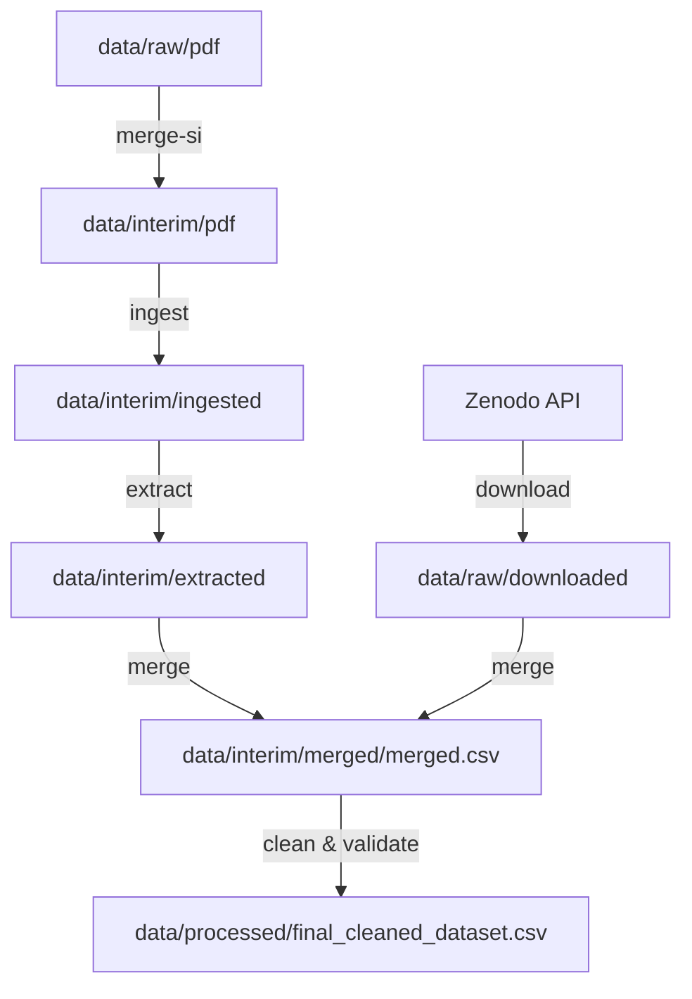

# Photocatalysis Data Extraction & Cleaning Pipeline

Репозиторий проекта по автоматическому извлечению, очистке и стандартизации данных о фотокаталитической деструкции органических красителей. Данный проект представляет собой воспроизводимый инструмент для создания качественного химического датасета на основе научных публикаций и открытых репозиториев (Zenodo).

---

## 1. Overview (Обзор)
Этот проект предназначен для извлечения структурированных параметров фотокатализа (химическая формула катализатора, название красителя, дозировки, тип источника света, время облучения и степень деградации) из научных статей и Supplementary Information (в формате PDF) с помощью систем разметки документов (MinerU) и больших языковых моделей (Gemini API). Полученные данные объединяются с табличными датасетами, скачиваемыми с Zenodo, проходят обогащение через PubChem API, очищаются и приводятся к единому стандарту качества.

---

## 2. What's inside (Содержимое)
Архитектура репозитория строго соответствует требованиям воспроизводимости и стандартизации данных:

```text
├── CITATION.cff           # Машиночитаемый файл цитирования датасета
├── LICENSE                # Лицензия проекта (MIT)
├── README.md              # Главная точка входа и описание проекта (этот файл)
├── environment.yml        # Конфигурационный файл окружения Conda
├── requirements.txt       # Список зависимостей Python для pip
├── run_pipeline.py        # Главный скрипт-оркестратор для запуска пайплайна
├── config/
│   └── default.yaml       # Файл глобальной конфигурации параметров и путей
├── schemas/
│   ├── schema.json        # JSON-схема структуры данных для валидации
│   └── schema.yaml        # YAML-эквивалент схемы структуры данных
├── metadata/              # Словари контролируемых терминов и единиц измерения
│   ├── units.csv          # Справочник и маппинг единиц измерения
│   └── vocabularies.csv   # Словарь соответствия тривиальных имен красителей
├── data/                  # Хранилище данных, разделенное по этапам обработки
│   ├── raw/               # ТОЛЬКО ДЛЯ ЧТЕНИЯ: исходные необработанные файлы
│   │   ├── pdf/           # Оригинальные научные статьи в формате PDF
│   │   └── downloaded/    # Скачанные "сырые" датасеты с Zenodo
│   ├── interim/           # Промежуточные частично предобработанные файлы
│   │   ├── pdf/           # Результаты работы merge-si (объединенные PDF)
│   │   ├── ingested/      # Распознанный текст и разметка от MinerU (Markdown)
│   │   ├── extracted/     # Извлеченные JSON-файлы с помощью Gemini API
│   │   ├── merged/        # Объединенная сырая таблица (merged.csv)
│   │   └── pubchem_cache.json # Кэш запросов к PubChem API для оптимизации лимитов
│   └── processed/         # Финальный валидированный и стандартизированный датасет
│       └── final_cleaned_dataset.csv  # Итоговый опубликованный продукт
├── scripts/               # Пайплайны обработки данных
│   ├── merge_si.py        # Слияние основных статей с файлами Supplementary Info (SI)
│   ├── ingest.py          # Парсинг структуры и текста PDF-файлов (MinerU)
│   ├── extract.py         # Семантическое извлечение данных (Gemini LLM)
│   ├── download_zenodo.py # Поиск, скачивание и фильтрация датасетов с Zenodo
│   ├── merge_extracted.py # Слияние извлеченных JSON и загруженных таблиц
│   ├── clean_and_validate.py # Очистка, нормализация и валидация датасета по схеме
│   └── utils/             # Вспомогательные модули (логгер, конфигурация, окружение)
└── reports/               # Папка для отчетов по качеству данных
    ├── validation_report.md # Отчет о результатах валидации на соответствие схеме
    ├── conflicts.csv        # Лог неразрешенных конфликтов и ошибок парсинга
    └── missing_values_report.md # Отчет по пропущенным значениям (NaN)
```

---

## 3. How it was created (Процесс создания)
Создание финального датасета осуществляется через воспроизводимый пошаговый пайплайн обработки:



### Этапы обработки:
1. **`merge-si`**: Находит файлы дополнительных материалов (`*_si.pdf`) в `data/raw/pdf` и склеивает их с основным текстом статьи в `data/interim/pdf`. Оригинальные сырые файлы при этом остаются неизменными.
2. **`ingest`**: С помощью MinerU преобразует PDF в Markdown, извлекая таблицы и разметку.
3. **`extract`**: Использует модель `gemini-2.5-flash` для извлечения экспериментальных точек из текста и таблиц согласно JSON-схеме.
4. **`download`**: Опрашивает Zenodo по запросу и скачивает подходящие табличные датасеты в `data/raw/downloaded`, используя LLM для фильтрации нерелевантного контента.
5. **`merge`**: Объединяет локально извлеченные JSON с таблицами Zenodo на основе сгенерированных маппингов колонок.
6. **`clean`**: Выполняет очистку единиц измерения по словарю `metadata/units.csv`, сопоставляет названия красителей с тривиальных имен на официальные термины с помощью `metadata/vocabularies.csv` и PubChem API (кэшируя запросы в `data/interim/pubchem_cache.json`), фильтрует строки без корректного CID и проверяет соответствие JSON-схеме.

*Воспроизводимость:* Все случайные процессы (например, температура генерации LLM) зафиксированы в скриптах через параметры API.

---

## 4. Data schema and columns (Схема данных)
Каждая строка финального датасета `data/processed/final_cleaned_dataset.csv` представляет собой одно измерение эффективности деградации в конкретный момент времени в рамках одного эксперимента.

| Название колонки | Тип данных | Обязательное? | Описание | Пример |
| :--- | :--- | :---: | :--- | :--- |
| `source` | String | Нет | Идентификатор источника (DOI статьи или Zenodo ID) | `ao3c07326` |
| `catalyst_formula` | String | Нет | Химическая формула фотокатализатора | `TiO2` |
| `pubchem_cid` | Integer | **Да** | Официальный PubChem Compound ID красителя | `6099` |
| `initial_dye_conc_value` | Number | Нет | Начальная концентрация красителя | `10.0` |
| `initial_dye_conc_unit` | String | Нет | Единица начальной концентрации (приводится к `mg/L`) | `mg/L` |
| `catalyst_dosage_value` | Number | Нет | Концентрация/дозировка фотокатализатора | `0.25` |
| `catalyst_dosage_unit` | String | Нет | Единица дозировки катализатора (приводится к `g/L`) | `g/L` |
| `light_type` | String | Нет | Тип излучения (`UV`, `Visible`, `Solar`, `LED`, `Dark`) | `Visible` |
| `time_value` | Number | **Да** | Время от начала облучения | `120.0` |
| `time_unit` | String | **Да** | Единица времени (приводится к `min`, `hours`, `s`) | `min` |
| `efficiency_value` | Number | **Да** | Эффективность деградации (%) в интервале 0-100 | `95.5` |

---

## 5. Units and controlled vocabularies (Единицы измерения и словари)
Для исключения разночтений в физико-химических данных используются внешние справочники:
*   **Единицы измерения (`metadata/units.csv`)**: Содержит сопоставление различных обозначений единиц к стандартизированным видам. Например, `ppm`, `mg l-1`, `mg/l` приводятся к строгому `mg/L`.
*   **Словарь наименований красителей (`metadata/vocabularies.csv`)**: Сопоставляет сокращения с полными названиями (например, `rhb` -> `rhodamine b`, `mb` -> `methylene blue`).
*   **PubChem API**: Позволяет верифицировать краситель по названию, получить его структурную формулу и единый идентификатор `pubchem_cid`, отсекая несуществующие или ошибочно распознанные соединения.

---

## 6. Data sources and licenses (Источники и лицензии)
*   **Исходные PDF-статьи**: Собраны из авторитетных научных журналов по химии (ACS Omega, Scientific Reports и др.). Права на тексты оригинальных статей принадлежат соответствующим издателям.
*   **Сторонние датасеты**: Загружены с Zenodo (например, репозиторий [zenodo_16640173](https://zenodo.org/records/16640173)), распространяемый под лицензией Creative Commons Attribution 4.0 International (CC-BY-4.0).
*   **Код проекта**: Поставляется под лицензией **MIT License** (см. файл [LICENSE](file:///home/arutamonofu/dev/study/itmo_extraction/LICENSE)).

---

## 7. Data quality and validation (Качество данных и валидация)
Проверка качества осуществляется автоматически при каждом прогоне скрипта очистки. Все отчеты формируются в папке `reports/`:
1.  **[validation_report.md](file:///home/arutamonofu/dev/study/itmo_extraction/reports/validation_report.md)** — содержит общие метрики валидации, информацию о примененной схеме и лог ошибок валидации по строкам.
2.  **[missing_values_report.md](file:///home/arutamonofu/dev/study/itmo_extraction/reports/missing_values_report.md)** — содержит детальный анализ пропущенных значений (количественный и процентный состав) в разрезе каждого признака до и после фильтрации.
3.  **[conflicts.csv](file:///home/arutamonofu/dev/study/itmo_extraction/reports/conflicts.csv)** — фиксирует детальные логи всех неразрешенных нестыковок (например, неподтвержденные красители в PubChem или несоответствие типов данных схемы).

---

## 8. How to use the data (Как использовать данные)

### Требования
Для работы требуется установленный Python версии 3.10+ или Conda.

### Настройка окружения
Установите зависимости с помощью Conda:
```bash
conda env create -f environment.yml
conda activate itmo_extraction
```
Или используйте стандартный pip:
```bash
pip install -r requirements.txt
```

### Запуск пайплайна
1. Поместите исходные статьи в `data/raw/pdf/`.
2. Добавьте API ключи в файл `.env` в корневой папке:
   ```env
   GEMINI_API_KEY="ваш_ключ_gemini"
   MINERU_TOKEN="ваш_токен_mineru"
   ```
3. Запустите оркестратор:
   ```bash
   python run_pipeline.py --config config/default.yaml
   ```

### Импорт данных в Python
Итоговый датасет легко загрузить с помощью библиотеки pandas:
```python
import pandas as pd
df = pd.read_csv("data/processed/final_cleaned_dataset.csv")
print(df.head())
```

---

## 9. Known limitations (Известные ограничения)
*   **Ограничение по типам загрязнителей**: Текущая версия датасета сфокусирована только на трех популярных красителях: Родамин Б, Метиленовый синий и Метиловый оранжевый.
*   **Зависимость от LLM**: Качество распознавания сложных таблиц и неявных параметров из текста статьи зависит от точности Gemini API.
*   **Отсутствие параметров реакторов**: Такие характеристики, как мощность лампы (Вт), геометрия реактора и pH среды, не включены в текущую спецификацию схемы данных.

---

## 10. Citation and contact (Цитирование и контакты)
При использовании данного датасета или кода в научных работах, пожалуйста, ссылайтесь в соответствии с файлом [CITATION.cff](file:///home/arutamonofu/dev/study/itmo_extraction/CITATION.cff):

```bibtex
@misc{PhotocatalysisDataset2026,
  author       = {Ivanov, Ivan and Petrov, Petr},
  title        = {Photocatalytic Dye Degradation Dataset},
  year         = 2026,
  publisher    = {Zenodo},
  version      = {1.0.0},
  doi          = {10.5281/zenodo.1234567}
}
```

*Контакты для связи:* support@itmo.ru

---

## 11. Changelog (История изменений)
*   **`v0.1`** (Внутренняя рабочая версия):
    *   Создана базовая структура пайплайна и интеграция с Gemini API.
*   **`v1.0`** (Релизная версия):
    *   Реализована строгая архитектура директорий `raw/`, `interim/`, `processed/`.
    *   Внедрены метаданные стандартизации (`units.csv`, `vocabularies.csv`).
    *   Добавлены автоматические валидационные отчеты (`reports/`).
    *   Оформлены академические файлы `CITATION.cff` и `LICENSE`.