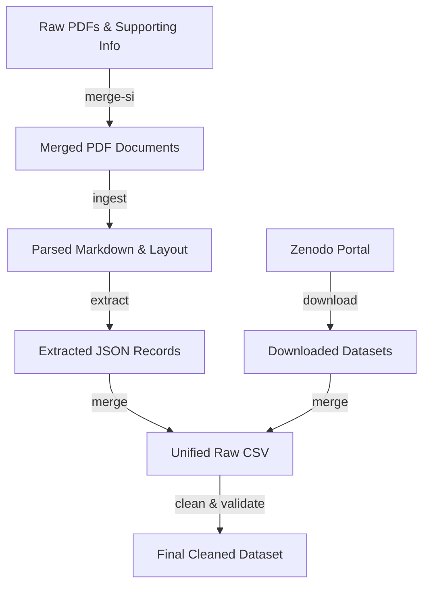

# Photocatalysis Data Extraction Pipeline

An automated data extraction and cleaning pipeline for building an experiment-level dataset on the photocatalytic degradation of organic dyes. The pipeline extracts structured metrics from scientific articles (PDFs and Supplementary Information) using layout analysis and LLMs, downloads relevant external datasets, merges them, and cleans the final data using chemistry-specific validations and external APIs.

---

## Pipeline Workflow

The data flows through the following stages:



---

## Project Structure

*   `run_pipeline.py` - Core orchestrator script to run stages sequentially or selectively.
*   `schema.json` - Target JSON schema for validating extracted articles.
*   `environment.yml` - Conda environment dependency file.
*   `config/`
    *   `default.yaml` - Pipeline and stage parameters configuration.
*   `scripts/`
    *   `merge_si.py` - Associates and merges Supplementary Information PDFs with main articles.
    *   `ingest.py` - Ingests and parses PDFs using MinerU layout analysis.
    *   `extract.py` - Uses Gemini API to extract structured data from parsed text.
    *   `download_zenodo.py` - Downloads and filters external tabular data.
    *   `merge_extracted.py` - Consolidates extracted files and external files.
    *   `clean_and_validate.py` - Performs data schema validation, normalization, and PubChem checks.
    *   `utils/` - Shared logic for configuration, env loading, and logging.
*   `data/` (Auto-created structure)
    *   `pdf/` - Directory for input PDF documents.
    *   `ingested/` - Markdown text and layout output from MinerU.
    *   `extracted/` - JSON files extracted by Gemini.
    *   `downloaded/` - Datasets queried and filtered from Zenodo.
    *   `merged/` - Intermediate CSV holding the combined dataset.
*   `logs/` - Chronological, run-specific folders containing execution logs.

---

## Environment Setup

### 1. Conda Environment
To set up the environment using Conda and install all dependencies:
```bash
# Create the Conda environment
conda env create -f environment.yml

# Activate the environment
conda activate itmo_extraction
```

### 2. API Credentials
Create a `.env` file in the root directory to store your API tokens:
```env
# Required for MinerU layout analysis (Precision Mode)
MINERU_TOKEN="your_mineru_token_here"

# Required for Gemini LLM stages (extraction and Zenodo filtering)
GEMINI_API_KEY="your_gemini_api_key_here"
```

---

## Pipeline Orchestrator

The pipeline can be executed end-to-end or in specific parts using `run_pipeline.py`. The active stages are configured in the configuration file (under `pipeline.stages`).

```bash
# Run stages configured in the configuration file
python run_pipeline.py --config config/default.yaml
```

### Orchestrator Options:
*   `--config` (default: `config/default.yaml`): Path to the YAML configuration file.

---

## Stage-by-Stage Script Reference

You can also run individual scripts from the `scripts/` directory. All scripts support CLI configuration override.

### 1. Merge SI (`scripts/merge_si.py`)
Merges Supplementary Information (SI) PDF files with main articles.
*   `--config`: Path to the YAML configuration file.

### 2. Document Ingestion (`scripts/ingest.py`)
Extracts content from PDFs using MinerU layout analysis.
*   `--config`: Path to configuration file.
*   `--force`, `-f`: Force layout extraction even if output markdown exists.

### 3. LLM-Based Extraction (`scripts/extract.py`)
Extracts structured JSON records from ingested markdown using Gemini API.
*   `--config`: Path to configuration file.
*   `--force`, `-f`: Force re-extraction even if the output JSON exists.
*   `--model`, `-m`: Name of the Gemini model to use (overrides configuration).

### 4. Zenodo Downloader (`scripts/download_zenodo.py`)
Queries Zenodo for tabular datasets and filters them based on schema matching.
*   `--config`: Path to configuration file.
*   `--query`, `-q`: Custom Zenodo search query (e.g. `"photocatalysis degradation"`).
*   `--limit`, `-l`: Maximum number of search records to inspect.
*   `--filter`, `-m`: Filtering mode. Choices: `none` (keep all), `llm` (LLM-guided validation), `interactive`.

### 5. Dataset Merger (`scripts/merge_extracted.py`)
Combines raw extracted JSON files and Zenodo datasets into a single CSV.
*   `--config`: Path to configuration file.

### 6. Clean & Validate (`scripts/clean_and_validate.py`)
Applies schema checks, cleans chemistry strings, and queries PubChem API to cache compound data.
*   `--config`: Path to configuration file.

---

## What is a Single Record?

Each row in the final dataset represents **one measurement** of dye degradation efficiency at a specific time step during a photocatalysis experiment.

## Dataset Schema

| Field Name | Type | Required? | Description | Example |
| :--- | :--- | :---: | :--- | :--- |
| `source` | String | No | Source article DOI or identifier | `10.1021/acsomega.3c07326` |
| `catalyst_formula` | String | No | Photocatalyst chemical formula | `MicNo-ZnO` |
| `pubchem_cid` | Integer | **Yes** | PubChem Compound ID (resolves dye identifier) | `6099` |
| `initial_dye_conc_value` | Number | No | Initial dye concentration value | `10.0` |
| `initial_dye_conc_unit` | String | No | Initial dye concentration unit | `mg/L` |
| `catalyst_dosage_value` | Number | No | Amount of catalyst used | `0.25` |
| `catalyst_dosage_unit` | String | No | Catalyst amount unit | `g/l` |
| `light_type` | String | No | Light source used (`UV`, `Visible`, `Solar`, `LED`, `Dark`) | `UV` |
| `time_value` | Number | **Yes** | Time elapsed since the reaction started | `180.0` |
| `time_unit` | String | **Yes** | Unit of time (`min`, `hours`, `s`) | `min` |
| `efficiency_value` | Number | **Yes** | Degradation efficiency percentage (0 to 100) | `96.04` |

---

## Logging & Output Files

Every run of `run_pipeline.py` creates a unique subdirectory inside `logs/` structured as `logs/run_YYYYMMDD_HHMMSS/`.
This directory will contain:
*   `pipeline.log` - Orchestrator summary log.
*   Individual stage logs (e.g. `ingest.log`, `extract.log`).

The final, cleaned dataset is written to `data/final_cleaned_dataset.csv`.
Chemistry caches (such as PubChem queries) are saved to `data/pubchem_cache.json` to optimize API rates on subsequent runs.