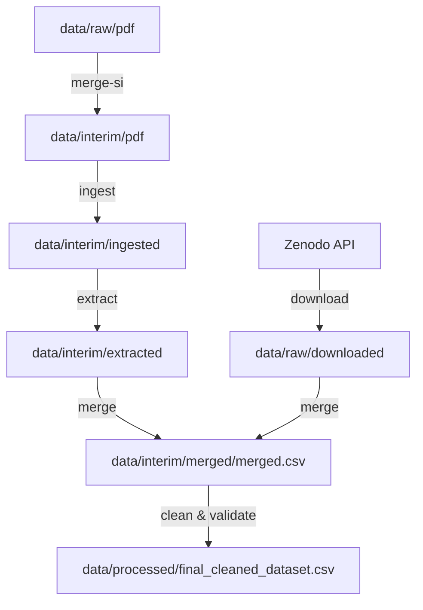

# Photocatalysis Data Extraction & Cleaning Pipeline

Repository of the project for automatic extraction, cleaning, and standardization of photocatalytic degradation data of organic dyes. This project represents a reproducible tool for creating a high-quality chemical dataset based on scientific publications and open repositories (Zenodo).

---

## 1. Overview
This project is designed to extract structured photocatalysis parameters (catalyst chemical formula, dye name, dosages, light source type, irradiation time, and degradation efficiency) from scientific articles and Supplementary Information (in PDF format) using document layout analysis systems (MinerU) and large language models (Gemini API). The extracted data are combined with tabular datasets downloaded from Zenodo, enriched via the PubChem API, cleaned, and brought to a single quality standard.

---

## 2. What's inside
The repository architecture strictly complies with reproducibility and data standardization requirements:

```text
├── CITATION.cff           # Machine-readable dataset citation file
├── LICENSE                # Project license (MIT)
├── README.md              # Main entry point and description of the project (this file)
├── environment.yml        # Conda environment configuration file
├── requirements.txt       # List of Python dependencies for pip
├── run_pipeline.py        # Main orchestrator script to run the pipeline
├── config/
│   └── default.yaml       # Global configuration file for parameters and paths
├── schemas/
│   ├── schema.json        # JSON schema of the data structure for validation
│   └── schema.yaml        # YAML equivalent of the data structure schema
├── metadata/              # Controlled vocabulary and unit dictionaries
│   ├── units.csv          # Reference and mapping of measurement units
│   └── vocabularies.csv   # Vocabulary mapping dye trivial names to formal names
├── data/                  # Data storage, split by processing stages
│   ├── raw/               # READ-ONLY: original raw files
│   │   ├── pdf/           # Original scientific articles in PDF format
│   │   └── downloaded/    # Raw datasets downloaded from Zenodo
│   ├── interim/           # Interim partially preprocessed files
│   │   ├── pdf/           # Outputs from merge-si (merged PDFs)
│   │   ├── ingested/      # Recognized text and layout from MinerU (Markdown)
│   │   ├── extracted/     # Extracted JSON files via Gemini API
│   │   ├── merged/        # Merged raw table (merged.csv)
│   │   └── pubchem_cache.json # Cache of PubChem API queries to optimize rate limits
│   └── processed/         # Final validated and standardized dataset
│       └── final_cleaned_dataset.csv  # Final published product
├── scripts/               # Data processing pipelines
│   ├── merge_si.py        # Merging main articles with Supplementary Information (SI) files
│   ├── ingest.py          # Parsing PDF file structure and text (MinerU)
│   ├── extract.py         # Semantic data extraction (Gemini LLM)
│   ├── download_zenodo.py # Searching, downloading, and filtering datasets from Zenodo
│   ├── merge_extracted.py # Merging extracted JSONs and downloaded tables
│   ├── clean_and_validate.py # Dataset cleaning, normalization, and validation by schema
│   └── utils/             # Helper modules (logger, config, environment)
└── reports/               # Folder for data quality reports
    ├── validation_report.md # Report on validation results against the schema
    ├── conflicts.csv        # Log of unresolved conflicts and parsing errors
    └── missing_values_report.md # Report on missing values (NaN)
```

---

## 3. How it was created
The final dataset is created through a reproducible step-by-step processing pipeline:



### Processing Steps:
1. **`merge-si`**: Locates supplementary material files (`*_si.pdf`) in `data/raw/pdf` and merges them with the main article text in `data/interim/pdf`. The original raw files remain unmodified.
2. **`ingest`**: Uses MinerU to convert PDFs into Markdown, extracting tables and layout structures.
3. **`extract`**: Employs the `gemini-2.5-flash` model to extract experimental data points from text and tables in accordance with a JSON schema.
4. **`download`**: Queries Zenodo and downloads suitable tabular datasets to `data/raw/downloaded`, utilizing an LLM to filter out irrelevant content.
5. **`merge`**: Merges locally extracted JSONs with Zenodo tables based on generated column mappings.
6. **`clean`**: Performs unit cleaning using the `metadata/units.csv` vocabulary, maps dye names from trivial names to official terms using `metadata/vocabularies.csv` and the PubChem API (caching queries in `data/interim/pubchem_cache.json`), filters out rows without a valid CID, and validates compliance with the JSON schema.

*Reproducibility:* All stochastic processes (such as LLM generation temperature) are fixed in scripts via API parameters.

---

## 4. Data schema and columns
Each row of the final dataset `data/processed/final_cleaned_dataset.csv` represents a single measurement of degradation efficiency at a specific point in time within one experiment.

| Column Name | Data Type | Required? | Description | Example |
| :--- | :--- | :---: | :--- | :--- |
| `source` | String | No | Source identifier (article DOI or Zenodo ID) | `ao3c07326` |
| `catalyst_formula` | String | No | Chemical formula of the photocatalyst | `TiO2` |
| `pubchem_cid` | Integer | **Yes** | Official PubChem Compound ID of the dye | `6099` |
| `initial_dye_conc_value` | Number | No | Initial concentration of the dye | `10.0` |
| `initial_dye_conc_unit` | String | No | Initial dye concentration unit (converted to `mg/L`) | `mg/L` |
| `catalyst_dosage_value` | Number | No | Photocatalyst dosage/concentration | `0.25` |
| `catalyst_dosage_unit` | String | No | Catalyst dosage unit (converted to `g/L`) | `g/L` |
| `light_type` | String | No | Type of radiation (`UV`, `Visible`, `Solar`, `LED`, `Dark`) | `Visible` |
| `time_value` | Number | **Yes** | Time elapsed since the start of irradiation | `120.0` |
| `time_unit` | String | **Yes** | Time unit (converted to `min`, `hours`, `s`) | `min` |
| `efficiency_value` | Number | **Yes** | Degradation efficiency (%) within the range of 0-100 | `95.5` |

---

## 5. Units and controlled vocabularies
External reference dictionaries are used to eliminate discrepancies in physical and chemical data:
*   **Measurement units (`metadata/units.csv`)**: Contains mappings of various unit representations to standardized formats. For example, `ppm`, `mg l-1`, `mg/l` are normalized to a strict `mg/L`.
*   **Dye names dictionary (`metadata/vocabularies.csv`)**: Maps abbreviations to full names (e.g., `rhb` -> `rhodamine b`, `mb` -> `methylene blue`).
*   **PubChem API**: Allows verifying the dye by name, retrieving its structural formula and a single identifier (`pubchem_cid`), and filtering out non-existent or incorrectly recognized compounds.

---

## 6. Data sources and licenses
*   **Original PDF articles**: Collected from authoritative scientific chemistry journals (ACS Omega, Scientific Reports, etc.). Rights to the original articles belong to their respective publishers.
*   **Third-party datasets**: Downloaded from Zenodo (e.g., repository [zenodo_16640173](https://zenodo.org/records/16640173)), distributed under the Creative Commons Attribution 4.0 International license (CC-BY-4.0).
*   **Project code**: Supplied under the **MIT License** (see [LICENSE](file:///home/arutamonofu/dev/study/itmo_extraction/LICENSE)).

---

## 7. Data quality and validation
Quality validation is performed automatically during each run of the cleaning script. All reports are generated in the `reports/` folder:
1.  **[validation_report.md](file:///home/arutamonofu/dev/study/itmo_extraction/reports/validation_report.md)** — contains general validation metrics, information on the applied schema, and a row-by-row log of validation errors.
2.  **[missing_values_report.md](file:///home/arutamonofu/dev/study/itmo_extraction/reports/missing_values_report.md)** — contains a detailed analysis of missing values (quantitative and percentage summary) for each feature before and after filtering.
3.  **[conflicts.csv](file:///home/arutamonofu/dev/study/itmo_extraction/reports/conflicts.csv)** — records detailed logs of all unresolved discrepancies (e.g., unconfirmed dyes in PubChem or schema data type mismatches).

---

## 8. How to use the data

### Prerequisites
Requires Python 3.10+ or Conda.

### Environment Setup
Install dependencies using Conda:
```bash
conda env create -f environment.yml
conda activate itmo_extraction
```
Or use standard pip:
```bash
pip install -r requirements.txt
```

### Running the Pipeline
1. Place raw articles into `data/raw/pdf/`.
2. Add API keys to the `.env` file in the root folder:
   ```env
   GEMINI_API_KEY="your_gemini_key"
   MINERU_TOKEN="your_mineru_token"
   ```
3. Run the orchestrator:
   ```bash
   python run_pipeline.py --config config/default.yaml
   ```

### Importing Data in Python
The final dataset can be easily loaded using the pandas library:
```python
import pandas as pd
df = pd.read_csv("data/processed/final_cleaned_dataset.csv")
print(df.head())
```

---

## 9. Known limitations
*   **Pollutant types limitation**: The current version of the dataset is focused only on three popular dyes: Rhodamine B, Methylene Blue, and Methyl Orange.
*   **Dependency on LLMs**: The quality of extracting complex tables and implicit parameters from article texts depends on the accuracy of the Gemini API.
*   **Lack of reactor parameters**: Characteristics such as lamp power (W), reactor geometry, and medium pH are not included in the current data schema specification.

---

## 10. Citation and contact
When using this dataset or code in scientific publications, please cite it in accordance with the [CITATION.cff](file:///home/arutamonofu/dev/study/itmo_extraction/CITATION.cff) file:

```bibtex
@misc{PhotocatalysisDataset2026,
  author       = {Ivanov, Ivan and Petrov, Petr},
  title        = {Photocatalytic Dye Degradation Dataset},
  year         = 2026,
  publisher    = {Zenodo},
  version      = {1.0.0},
  doi          = {10.5281/zenodo.1234567}
}
```

*Contact:* support@itmo.ru

---

## 11. Changelog
*   **`v0.1`** (Internal working version):
    *   Created the basic pipeline structure and integration with Gemini API.
*   **`v1.0`** (Release version):
    *   Implemented strict directory structure: `raw/`, `interim/`, `processed/`.
    *   Introduced metadata standardization (`units.csv`, `vocabularies.csv`).
    *   Added automatic validation reports (`reports/`).
    *   Created academic files `CITATION.cff` and `LICENSE`.