# Research Article

# Kinetic Investigation of Photocatalytic Degradation of Methyl Orange Dye Using Mg-Doped $\mathbf { A g } _ { 2 } \mathbf { O }$ Nanoparticle

Gul Asimullah Khan Nabi , 1 Sajjad Hussain , 1 Mati Ullah , 2 Shohreh Azizi , 3 Ilunga Kamika ,4 and Malik Maaza 3

1 Department of Chemistry, Bacha Khan University, Charsadda 24420, Khyber Pakhtunkhwa, Pakistan 2 Department of Physics, Abdul Wali Khan University Mardan, Mardan 23200, Khyber Pakhtunkhwa, Pakistan 3 UNESCO-UNISA Africa Chair in Nanosciences/Nanotechnology, College of Graduate Studies, University of South Africa, P.O. Box 392, Muckleneuk Ridge, Pretoria, South Africa 4 Institute for Nanotechnology and Water Sustainability, College of Science, Engineering and Technology, University of South Africa, Florida, Johannesburg 1709, South Africa

Correspondence should be addressed to Shohreh Azizi; azizis@unisa.ac.za

Received 10 June 2025; Revised 5 October 2025; Accepted 27 November 2025

Academic Editor: Muhammad Iqhrammullah

Copyright © 2026 Gul Asimullah Khan Nabi et al. Scientifca published by John Wiley & Sons Ltd. Tis is an open access article under the terms of the Creative Commons Attribution License, which permits use, distribution and reproduction in any medium, provided the original work is properly cited.

In the current research, the Mg-doped Ag2O nanoparticles were produced by the coprecipitation method. Te characterization of the as-prepared nanoparticles was conducted through a series of techniques. SEM confrmed homogenous morphology of a sphere with minimal agglomeration. Te band gap of Mg–AgO2 was determined to be 2.6 eV. Te materials were observed to possess a particle dimension of 23.87 nm. X-ray difraction (EDX) proved that the substance is 97% Ag, 1.58% oxygen, and 1.42% Mg. Te FTIR, PL, DRS, PZC, TEM, and XRD results proved that Mg-doped Ag2O nanoparticles were successfully doped. In this study, the frst application of the synthesized Mg-doped Ag2O particles was studied for the decolorization of methyl orange in an aqueous solution. At ideal conditions of dye (30 ppm), neutral pH and the dosage of catalyst (0.4 g), 96.1% of decolorization was obtained in 150 min. Te degradation was frst order and the activation energy was found to be 13.19 kJ/mol. Te recyclability of the material was studied, and it was confrmed that the material could be reused multiple times.

Keywords: double-distilled water; kinetic and thermodynamic studies; methyl orange; Mg-doped Ag O NPs

# 1. Introduction

Industrial wastewater pollution is considered the major world environmental challenge, especially in areas that are dealing with rapid industrialization and water scarcity [1, 2].

Industries include food manufacturing, paper, and textiles, which generate a high volume of dye-containing wastewater [3–6]. Dyes are highly hazardous chemicals, which are nonbiodegradable [7]. Among various pollutants, methyl orange (MO) is generally used in the textile industry and poses signifcant environmental threats [8]. Tus, it is required that it be removed from wastewater.

Although several treatment techniques have been studied, photocatalysis has been shown to be the ideal approach for the removal of organic dyes [9, 10]. In this process, the organic pollutants are totally decomposed at low cost and without any toxic substances being released into the environment [11, 12]. $\mathrm { T i O } _ { 2 }$ and ZnO are considered as conventional photocatalysis that have been extensively studied due to their availability and stability [13–15]. However, their wide band gaps limit their capability and efectiveness under visible light [16]. On the other hand, silver oxide $( \mathrm { A g } _ { 2 } \mathrm { O } ) ,$ , with a lower band gap and strong visible-light absorption capacity, has become an excellent candidate for photocatalytic activity [17, 18]. However, the stability and activity of $\mathrm { A g } _ { 2 } \mathrm { O }$ are reported as major drawbacks in photocatalytic applications [19, 20]. Various modifcation techniques have been used to increase the performance of metal oxides to address these drawbacks [21, 22]. In order to address these tackles, the most efective approach has been proposed to be metal doping, which can alter the band gap and improve charge separation [19, 23, 24]. Tis study aims to synthesize Mg-doped $\mathrm { A g } _ { 2 } \mathrm { O }$ nanoparticles via the coprecipitation method and their application in the photocatalytic degradation of MO.

# 2. Experimental Section

2.1. Materials. Reagent-grade silver nitrate $( \mathrm { A g N O } _ { 3 } ,$ ≥ 99.9%, Cat. No. 3456456) and magnesium nitrate hexahydrate $( \mathrm { M g ( N O _ { 3 } ) _ { 2 } . 6 H _ { 2 } O } , \geq 9 9 \%$ , Cat. No. M8266) were obtained from Sigma-Aldrich. Reagent-grade MO (MW � 327.33 g/mol, ≥ 99%, Cat. No. 32456) and sodium hydroxide (NaOH, ≥ 98%, Cat. No. 345678) were obtained from Merck. All solutions were prepared in double-distilled water.   
2.2. Synthesis of Mg-Doped Ag2O NPs. Mg-doped $\mathrm { A g } _ { 2 } \mathrm { O }$ nanoparticles were synthesized via the coprecipitation method (illustrated in Figure 1). Briefy, a 0.07 M solution of magnesium nitrate (0.44 g in 50 mL water) was mixed with a 0.7 M solution of silver nitrate (5.94 g in 50 mL water) under continuous stirring. Separately, a 1.4 M solution of sodium hydroxide (2.8 g in 50 mL water) was prepared and added dropwise to the metal nitrate mixture with continuous stirring for 4 h at room temperature. Te resulting suspension was allowed to stand undisturbed for 10 h to ensure complete precipitation. Te obtained precipitates were repeatedly washed with double-distilled water to remove residual ions, followed by drying at 100°C. Te dried powder was subsequently calcined at 300°C for 3 h in air using a mufe furnace (MTI KSL-1100X, Nabertherm LE series) at a heating rate of 5°C min−1 .   
2.3. Characterization of Mg-Doped $A g _ { 2 } O$ NPs. Te morphological features of the synthesized nanoparticles were examined using scanning electron microscopy (SEM; JEOL JSM-5800) with a resolution of 3.0 nm operated at 30 kV. Te crystalline structure was analyzed by X-ray difraction (XRD) using a JEOL JDX-5332 difractometer equipped with Cu Kα radiation $( \lambda = 1 . 5 4 0 6 \mathring \mathrm { A } )$ , scanned over a 2θ range of $1 0 ^ { \circ } - 8 0 ^ { \circ }$ at a rate of $2 ^ { \circ } \mathrm { m i n } ^ { - 1 }$ . Fourier-transform infrared (FTIR) spectra were recorded on a PerkinElmer 95120 spectrophotometer within the range of $4 0 0 0 { - } 4 0 0 { \mathrm { c m } } ^ { - 1 }$ at a spectral resolution of $4 { \mathrm { c m } } ^ { - 1 }$ . Optical properties were evaluated using a Shimadzu UV-1800 double-beam spectrophotometer, recording absorption spectra in the wavelength range of 200–800 nm.   
2.4. Photocatalytic Activity of Synthesized Mg-Doped $A g _ { 2 } O$ NPs. Photocatalytic degradation experiments were conducted in a custom-built reactor (schematic shown in Figure 2). Te reactor comprised a quartz beaker placed

flowchart

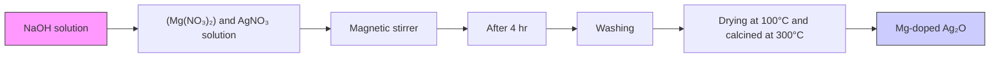

Figure 1: Te schematic procedure for the synthesis of Mg-doped $\mathrm { A g } _ { 2 } \mathrm { O }$ nanoparticles.

natural_image

Experimental setup with a beaker containing green liquid, connected to wires and a wooden block on a base, under a glowing light fixture (no visible text or symbols)

Figure 2: A schematic illustration of the photoreactor used for the decolorization of methyl orange using Mg-doped Ag2O nanoparticles.

within a refective chamber with a 365-nm UV lamp (intensity $1 0 \mathrm { m W / c m } ^ { 2 } )$ positioned 10 cm above the sample surface. Te setup was fully enclosed to prevent UV exposure, and all experiments were performed under appropriate shielding and personal protective equipment (PPE). Te reaction temperature was monitored and maintained at $2 5 ^ { \circ } \mathrm { C } \pm 1 ^ { \circ } \mathrm { C }$ without external heating. In a typical run, 0.01 g of Mg-doped $\mathrm { A g } _ { 2 } \mathrm { O }$ catalyst was dispersed in 50 mL of 30 ppm MO solution prepared in double-distilled water and magnetically stirred. Prior to irradiation, the suspension was kept in the dark for 25 min to establish adsorption– desorption equilibrium. Photocatalytic degradation was initiated by irradiating the suspension with the UV lamp for predetermined time intervals. At each interval, 5 mL of the aliquots was withdrawn and centrifuged at 6000 rpm for 5 min, and the supernatant was analyzed by UV–visible spectrophotometry. When required, samples were additionally fltered through a 0.22-μm membrane flter to prevent catalyst loss.

2.5. Degradation Efciency Calculation. Te percentage degradation of MO was calculated using the following:

$$
\text { Degradation } = \left(\frac {C _ {0}}{C _ {t}} C _ {0}\right) \times 1 0 0, \tag {1}
$$

where $C _ { 0 }$ is the initial concentration and $C _ { t }$ is the concentration at irradiation time t. Concentrations were determined from UV–Vis absorbance at $\lambda _ { \operatorname* { m a x } } = 4 6 4$ nm using a preestablished calibration curve.

2.6. Kinetic Analysis. Te kinetics of photocatalytic degradation of MO were evaluated using pseudo-frst-order and pseudo-second-order models. Te pseudo-frst-order model is expressed as

$$
- \frac {d c}{d t} = k _ {\mathrm{App}} C, \tag {2}
$$

where $C _ { 0 }$ and $C _ { t }$ are the initial and time-dependent concentrations of the dye, respectively, and $k _ { \mathrm { A p p } }$ is the apparent rate constant.

Te pseudo-second-order model is expressed as

$$
\frac {1}{C} - \frac {1}{C _ {0}} = k _ {\mathrm{App}}. t, \tag {3}
$$

where $k _ { 2 }$ is the second-order rate constant. Te temperature dependence of the reaction rate was analyzed using the following Arrhenius equation:

$$
k = A e \frac {- E _ {a}}{R T}, \tag {4}
$$

where k is the rate constant, A is the preexponential factor, $E _ { a }$ is the activation energy, R is the gas constant, and T is the absolute temperature. Activation energy was obtained from the slope of the ln $k _ { \nu _ { s } } 1 / T$ plot.

# 3. Results and Discussion

3.1. Optical Band Gap of $A g _ { 2 } O$ and Mg-Doped Ag2O NPs. Te UV–Vis absorption spectrum of Mg-doped $\mathrm { A g } _ { 2 } \mathrm { O }$ nanoparticles is presented in Figure 3(a). Te undoped Ag O exhibited an absorption edge around ∼425 nm, corresponding to a band gap of 2.92 eV, while Mg-doped $\mathrm { A g } _ { 2 } \mathrm { O }$ showed a redshift to ∼418 nm, resulting in a narrow band gap of $2 . 6 0 \mathrm { e V }$ . Te absorption peak at 418 nm shows the efect of Mg interaction on the electronic structure of $\mathrm { A g } _ { 2 } \mathrm { O } ;$ particularly the transfer of electrons from the valence band to the conduction band. Tis transition corresponds to the light absorption at this wavelength, indicating the presence of energy levels, which allow such transitions. Te band gap energy (Eg) of the Mg-doped $\operatorname { A g } _ { 2 } \mathrm { O }$ nanoparticles was precisely determined using the Tauc plot method (Figure 3(b)). By plotting $( \alpha \bar { h } \nu ) ^ { 2 }$ against h] and examining the intercept on the energy axis, the band gap value was determined to be 2.60 eV. Te minimum energy required for the transition of electrons from the valence band to the conduction band which is considered as a key factor for understanding the optical and electronic behavior of the material. Te results show that the band gap energy decreased upon Mg doping due to $\mathrm { M g } ^ { 2 + }$ ions facilitating electron excitation. Te electronic alternation increases visible-light absorption and is expected to suppress electron–hole recombination, thereby improving photocatalytic performance [25].

3.2. FTIR Spectroscopic Analysis. Te FTIR spectra of Mgdoped $\mathrm { A g } _ { 2 } \mathrm { O }$ nanoparticle are shown in Figure 4. Mg-doped $\mathrm { A g 2 O }$ sample exhibited characteristic absorption bands associated with $\mathrm { A g - O }$ stretching vibrations $( \sim 7 2 1 \mathrm { c m } ^ { - 1 } )$ and adsorbed water (H–O–H bending at ${ \sim } 1 4 0 9 \ c m ^ { - 1 } )$ . Te peak $\mathrm { a t } \sim 1 3 2 3 \mathrm { c m } ^ { - 1 }$ corresponds to ${ \bar { \mathsf { N O } _ { 3 } } } ^ { - }$ ions, likely originating from precursor residues. Importantly, a new absorption band attributed to the $\mathrm { M g - O }$ stretching mode appeared at $\sim 5 2 3 \mathrm { c m } ^ { - 1 }$ for Mg-doped $\mathrm { A g } _ { 2 } \mathrm { O } ;$ , accompanied by a slight shift $( \sim 5 3 2 \mathrm { c m } ^ { - 1 } )$ relative to Mg-doped $\mathrm { A g } _ { 2 } \mathrm { O }$ . Tis shift confrms the successful incorporation of $\mathrm { M g } ^ { 2 \mp }$ into the $\mathrm { A g } _ { 2 } \mathrm { O }$ lattice. Te reduced intensity suggests partial substitution without major lattice distortion.

3.3. SEM and EDX Analysis. SEM micrographs (Figure 5(a)) reveal that undoped $\mathrm { A g } _ { 2 } \mathrm { O }$ nanoparticles tend to form irregularly shaped agglomerates, whereas Mg-doped $\mathrm { A g } _ { 2 } \mathrm { O }$ exhibits a more uniform spherical and well-defned spherical morphology. Quantitative image analysis indicated an average particle size of $2 4 . 1 \pm 3 . 2$ nm for Mg-doped $\mathrm { A g } _ { 2 } \mathrm { O }$ , slightly smaller than that of undoped $\mathrm { A g } _ { 2 } \mathrm { O } \left( 2 7 . 8 \pm 3 . 6 \mathrm { n m } \right)$ , suggesting that Mg doping suppresses particle growth during synthesis. Te particle size distribution histogram derived from SEM images is shown in Figure 5(b). Higher-resolution SEM images (Figure 6(a)) further confrm the spherical morphology, while the corresponding histogram (Figure 6(b)) shows a mean particle size of $2 3 . 9 \pm 2 . 8 $ nm, which is in good agreement with the crystallite size estimated from XRD analysis.

3.4. XRD Analysis of Mg-Doped $A g _ { 2 } O$ Nanoparticles. Te analysis of Mg-doped $\mathrm { A g } _ { 2 } \mathrm { O }$ nanoparticles, synthesized through the coprecipitation technique, is elucidated through the XRD pattern presented in Figure 6. A notable feature in the XRD pattern is the presence of a highly intense difraction peak at $3 8 ^ { \circ }$ , indicating the orientation of Mg-doped $\mathrm { A g } _ { 2 } \mathrm { O }$ nanoparticles along the (111) axes. Tis distinctive difraction pattern is indicative of a cubic phase structure for the Mgdoped $\mathrm { A g } _ { 2 } \mathrm { O }$ nanoparticles. Te cubic phase structure is further confrmed by the agreement of the observed peaks at $2 \boldsymbol { \Theta } = 3 8 ^ { \circ }$ , 44°, 64°, and $7 7 ^ { \circ }$ with the expected difraction peaks for (111), (200), (220), and (311) crystallographic planes, respectively. Tis alignment with specifc crystallographic planes supports the identifcation of the cubic phase structure in Mg-doped $\mathrm { A g } _ { 2 } \mathrm { O }$ nanoparticles. Moreover, the XRD data closely resemble the reference pattern provided by the JCPDS card # 76-1393. Tis correlation reinforces the structural integrity and composition of the synthesized Mg-doped $\mathrm { A g } _ { 2 } \mathrm { O }$ nanoparticles, establishing their crystalline nature and confrming the successful incorporation of magnesium into the silver oxide matrix. Te presented XRD analysis ofers valuable insights into the structural characteristics and phase identifcation of the Mg-doped $\mathrm { A g } _ { 2 } \mathrm { O }$ nanoparticles [26]:

$$
D = \frac {K \lambda}{\beta \cos \Theta}, \tag {5}
$$

$$
D = 0. \frac {9 \lambda}{\beta \cos \Theta}, \tag {6}
$$

$$
D = \frac {0 . 9 \times 1 . 5 4}{0 . 3 5 \times 0 . 0 1 7 4 \times \cos (1 8 . 1 2)}, \tag {7}
$$

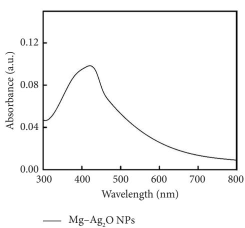

line

| Wavelength (nm) | Absorbance (a.u.) |
| --------------- | ----------------- |
| 300             | 0.04              |
| 400             | 0.10              |
| 500             | 0.06              |
| 600             | 0.03              |
| 700             | 0.01              |
| 800             | 0.00              |

(a)

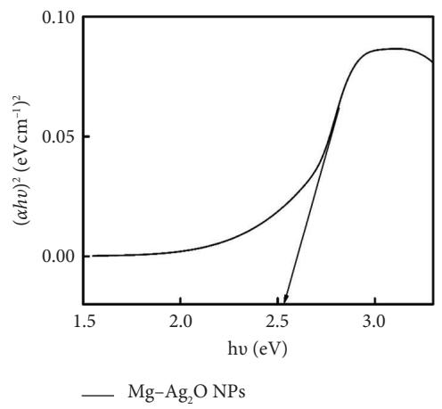

line

| hv (eV) | (αħν)² (eV cm⁻¹)² |
| ------- | ----------------- |
| 1.5     | 0.00              |
| 2.0     | 0.00              |
| 2.5     | 0.00              |
| 3.0     | 0.08              |
| 3.5     | 0.08              |

(b)

Figure 3: (a) UV–Vis absorption spectrum and (b) Tauc plot of Mg-doped Ag2O photocatalysts.   
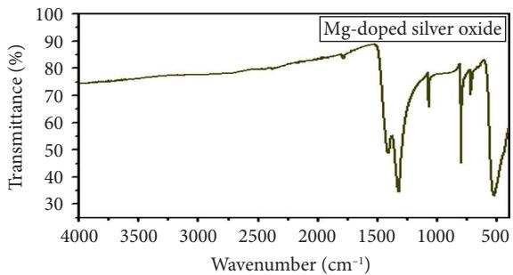

line

| Wavenumber (cm⁻¹) | Transmittance (%) |
| ----------------- | ----------------- |
| 4000              | 75                |
| 3500              | 76                |
| 3000              | 77                |
| 2500              | 78                |
| 2000              | 80                |
| 1500              | 90                |
| 1000              | 75                |
| 500               | 35                |

Figure 4: FTIR spectrum of Mg-doped $\mathrm { A g } _ { 2 } \mathrm { O }$ NPs.

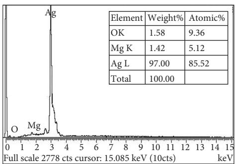

line

| Element | Weight% | Atomic% |
| ------- | ------- | ------- |
| OK      | 1.58    | 9.36    |
| Mg K    | 1.42    | 5.12    |
| Ag L    | 97.00   | 85.52   |
| Total   | 100.00  |         |

natural_image

Microscopic surface texture image showing granular morphology at 5,000x magnification (no text or symbols visible)

(b)   
Figure 5: (a) EDX image and (b) SEM image of Mg-doped Ag O NPs.

$$
D = 2 3. 8 7 \mathrm{nm}, \tag {8}
$$

where K is the crystallite shape factor constant (0.9), β is the full width at half maximum (FWHM) in radians, θ is Bragg’s difraction angle, and λ is the X-ray wavelength for Cu Kα radiation (1.54 A). Expansive and distinct peaks were seen, ˚ indicating the purity and size of the crystallites in the Mgdoped $\mathrm { A g } _ { 2 } \mathrm { O }$ NPs [27].

3.5. Transmission Electron Microscopic (TEM) Analysis of Mg-Doped $A g _ { 2 } O$ NPs. Te morphology of Mg-doped $\mathrm { A g } _ { 2 } \mathrm { O }$ nanoparticles was examined using TEM, as shown in Figure 7. Te micrograph, captured at a scale of 100 nm, reveals that the nanoparticles possess an approximately spherical morphology with well-defned boundaries, indicating uniform particle formation and a controlled synthesis process. Te TEM image exhibited the distinct structure of the nanoparticles, highlighting their uniformity and clearly defned boundaries. As an essential parameter, it was quantitatively shown that the average particle size was 23.87 nm. Tis measurement provides insights into the nanoscale dimensions of the Mg-doped Ag O particles, reinforcing the precision achieved in the synthesis. Tis consistency confrms that the synthesized Mg-doped $\mathrm { A g } _ { 2 } \mathrm { O }$ nanoparticles are highly uniform in size and exhibit excellent nanoscale structural integrity.

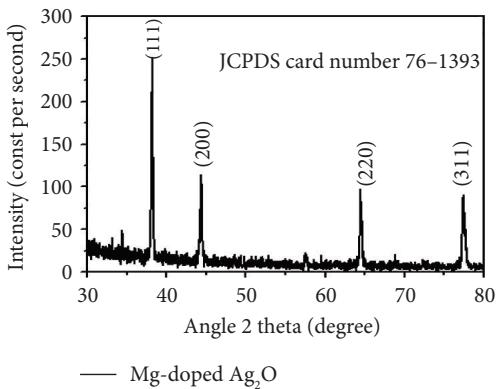

line

| Angle 2 theta (degree) | Intensity (const per second) |
| ---------------------- | ---------------------------- |
| 38                     | 250                          |
| 45                     | 120                          |
| 65                     | 100                          |
| 78                     | 90                           |

Figure 6: XRD analysis using Mg-doped Ag2O nanoparticles.

natural_image

Microscopic image showing granular or clustered structures with a 100 nm scale bar (no text or symbols beyond scale indicator)

Figure 7: TEM analysis of Mg-doped Ag2O NPs.

3.6. Photoluminescence (PL) Study. PL spectroscopy serves as an efective technique for evaluating the charge carrier separation efciency in semiconductor materials. Figure 8 illustrates the PL spectra of the produced $\mathrm { A g } _ { 2 } \mathrm { O }$ nanoparticles, recorded under room temperature conditions. Te undoped $\mathrm { A g } _ { 2 } \mathrm { O }$ nanoparticles exhibit two distinct emission peaks at 552 and 589 nm, which are attributed to defectrelated transitions associated with oxygen vacancies and surface states. Tis diminished PL intensity signifes a lower recombination rate of photogenerated electron–hole pairs, suggesting that Mg doping efectively enhances the charge separation efciency. Such behavior indicates that Mg incorporation into the $\mathrm { A g } _ { 2 } \mathrm { O }$ lattice improves its potential photocatalytic performance by minimizing charge carrier recombination losses.

3.7. Point of Zero Charge (PZC). Te PZC of Mg-doped $\mathrm { A g } _ { 2 } \mathrm { O }$ nanoparticles was determined to evaluate the surface charge behavior under varying pH conditions. Eight separate 0.1 M $\mathrm { K N O } _ { 3 }$ solutions were prepared, and their initial pH (pH ) values were adjusted between 3 and 10

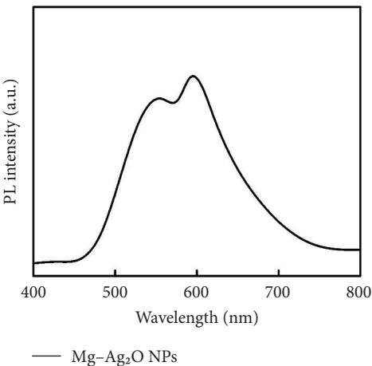

line

| Wavelength (nm) | PL intensity (a.u.) |
| --------------- | ------------------- |
| 400             | ~0                  |
| 500             | ~1.5                |
| 600             | ~3.0                |
| 700             | ~1.0                |
| 800             | ~0.5                |

Figure 8: Photoluminescence study of Mg-doped $\mathrm { A g } _ { 2 } \mathrm { O }$ NPs.

using 0.01 M HCl or 0.01 M NaOH. After adding 18 mg of Mg-doped $\mathrm { A g } _ { 2 } \mathrm { O }$ to the solutions, they were stirred for 24 h at 60 rpm using a magnetic stirrer. After equilibration, the solutions were fltered, and their fnal pH values were recorded. A plot of $\mathrm { p H } _ { 0 }$ versus the change in pH $( \Delta \mathsf { p H } = \mathsf { p H } .$ \_fnal $\mathrm { - \ p H _ { 0 } ) }$ was constructed to determine the $\mathrm { P } \bar { Z } \mathrm { C } ,$ as shown in Figure 9. Te intersection point where ΔpH equals zero corresponds to the PZC value. For the Mg-doped $\mathrm { A g } _ { 2 } \mathrm { O }$ nanoparticles, the PZC was found to be 6.8, indicating that the surface becomes positively charged at pH $\Gamma < 6 . 8$ and negatively charged at pH > 6.8. At $\mathrm { p H } < \mathrm { P Z C } ,$ the catalyst surface is positively charged, enhancing the adsorption of anionic MO dye through electrostatic attraction; at $\mathrm { p H } > \mathrm { P Z C } ,$ electrostatic repulsion reduces adsorption efciency. Tese fndings correlate directly with the pH-dependent photocatalytic results in Section 3.9.

3.8. Efect of Concentration and Time. Te infuence of initial dye concentration and irradiation time on the photocatalytic degradation of MO using Mg-doped $\mathrm { A g } _ { 2 } \mathrm { O }$ was systematically investigated. Dye concentrations of 30, 35, 40, 45, and 50 ppm were exposed to UV radiation in the presence of 0.01 g of catalyst Mg-doped $\mathrm { A g } _ { 2 } \mathrm { O } .$ . Te variations in the percentage of MO dye degradation during various time intervals are displayed in Figures 10(a) and 10(b). Te results clearly show that the degradation efciency increased continuously with illumination time. After 150 min, the photodegradation efciency of Mg-doped $\mathrm { A g } _ { 2 } \mathrm { O }$ was found to be 96.10%. Table 1 shows percent degradation of MO with diferent catalysts in the literature and the present study.

Tis behavior can be attributed to the increased availability of active surface sites on the catalyst at lower dye concentrations, facilitating efective adsorption and photon absorption. As dye concentration increases, the quantity of dye molecules adsorbed on the catalyst surface also increases. Tis high concentration diminishes the efcacy of the photocatalyst by reducing the number of molecules needed to absorb light photons and subsequently reach the catalyst surface [8, 32]. As a result, MO dye degraded more efectively at 30 ppm.

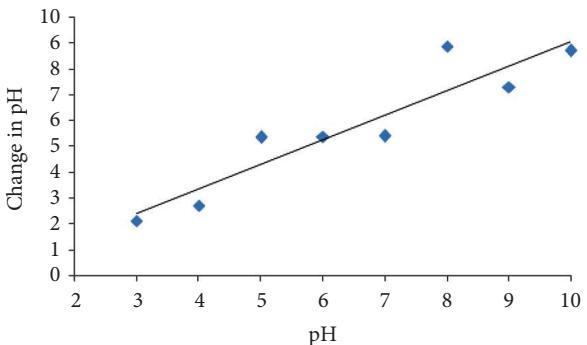

scatter

| pH | Change in pH |
|---|---|
| 3 | 2.0 |
| 4 | 2.7 |
| 5 | 5.4 |
| 6 | 5.3 |
| 7 | 5.3 |
| 8 | 6.1 |
| 9 | 7.2 |
| 10 | 8.7 |

Figure 9: Point of zero charge of Mg-doped Ag2O NPs.

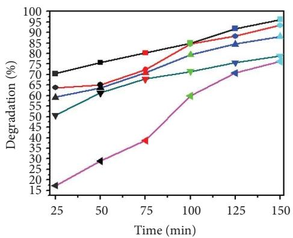

line

| Time (min) | Black Line | Red Line | Blue Line | Green Line | Purple Line |
| ---------- | ---------- | -------- | --------- | ---------- | ----------- |
| 25         | 70         | 65       | 60        | 50         | 15          |
| 50         | 75         | 68       | 62        | 55         | 25          |
| 75         | 80         | 72       | 68        | 60         | 35          |
| 100        | 85         | 80       | 75        | 65         | 45          |
| 125        | 90         | 85       | 80        | 70         | 60          |
| 150        | 95         | 90       | 85        | 75         | 70          |

-30 ppm   
45 ppm   
• 35 ppm   
50 ppm   
40 ppm

(a)   
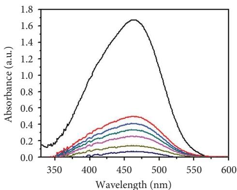

line

| Wavelength (nm) | Absorbance (a.u.) |
| --------------- | ----------------- |
| 350             | ~0.1              |
| 400             | ~0.8              |
| 450             | ~1.7              |
| 500             | ~1.2              |
| 550             | ~0.1              |
| 600             | ~0.0              |

— Original   
100 min   
25 min   
125 min   
50 min   
150 min   
75 min

(b)   
Figure 10: (a) Efect of initial dye concentration on methyl orange dye degradation and (b) efect of time on methyl orange dye degradation.   
Table 1: Percent degradation of methyl orange with diferent catalysts in the literature and the present study. 

<table><tr><td>Dye</td><td>Nanoparticles</td><td>Time</td><td>Degradation</td></tr><tr><td rowspan="5">Methyl orange</td><td> $\alpha\text{-Fe}_2\text{O}_3$ </td><td>100 min</td><td>95.31% [28]</td></tr><tr><td>Al-doped ZnO</td><td>40 min</td><td>99% [29]</td></tr><tr><td>Sn-doped TiO2</td><td>3 h</td><td>90% [30]</td></tr><tr><td>CoFe2O4-SiO2-TiO2</td><td>160 min</td><td>93.46% [31]</td></tr><tr><td>Mg-doped Ag2O</td><td>150 min</td><td>93% present study</td></tr></table>

3.9. Catalyst Dose. Te efect of catalyst dosage on the photocatalytic degradation efciency of MO using Mgdoped $\mathrm { A g } _ { 2 } \mathrm { O }$ nanoparticles was investigated under UV– visible irradiation (wavelength range: 200–800 nm) for 150 min. Te results are illustrated in Figures 11(a) and 11(b). When the reaction was conducted without the catalyst, the self-degradation of MO was almost negligible under visible light illumination. Te rate of decomposition has been markedly accelerated in the presence of Mg-doped $\mathrm { A g } _ { 2 } \mathrm { O }$ nanoparticles. After 150 min, the degradation efciency increased with increasing catalyst doses of Mg-doped

$\mathrm { A g } _ { 2 } \mathrm { O }$ nanoparticles, peaking at 93.22% at 0.4 g. Tereafter, the degradation efciency decreased with further catalyst additions. Heterogeneous photocatalysis is characterized by an increase in dye degradation with increasing catalyst concentration. Te most common explanation ofered for this is that a higher amount of catalyst results in more active sites on the photocatalyst surface, which in turn produces more hydroxyl radicals that can cause dye solution discoloration. However, the degradation rate falls when the catalyst concentration rises over the optimal level because too much catalyst prevents light penetration. Te photocatalytic system’s major oxidant, hydroxyl radical, diminished, and as a result, the efectiveness of the degradation dropped [24, 31, 33].

3.10. pH Study Using Mg-Doped Ag O NPs. Te infuence of solution pH on the photocatalytic degradation of MO using Mg-doped $\mathrm { A g } _ { 2 } \mathrm { O }$ nanoparticles was systematically examined, as shown in Figures 12(a) and 12(b). Te results revealed that pH had a considerable efect on the degradation efciency. At a pH of 7, the greatest rate of MO elimination was achieved [33]. Nevertheless, it has been reported in the literature that using Mg-doped $\mathrm { A g } _ { 2 } \mathrm { O }$ nanoparticles to catalyze the photodegradation of MO led to a greater rate of elimination at lower pH values. Various studies on the impact of pH on the photodegradation of MO using $\mathrm { A g } _ { 2 } \mathrm { O }$ nanoparticles doped with Mg have been conducted. Although neutral conditions (pH 7) yielded the highest degradation efciency, slightly acidic environments $\mathrm { ( p \bar { H } < 6 . 8 ) }$ also favored adsorption due to enhanced surface–dye interactions. At highly basic conditions, the repulsive forces between the catalyst surface and dye molecules hindered adsorption and reduced photocatalytic performance. Tese fndings are consistent with previously reported studies, confrming that surface charge interactions governed by pH play a pivotal role in the photocatalytic degradation process.

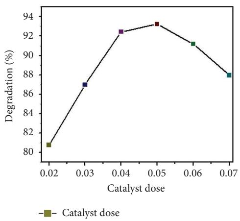

line

| Catalyst dose | Degradation (%) |
| ------------- | --------------- |
| 0.02          | 80.5            |
| 0.03          | 87.0            |
| 0.04          | 92.5            |
| 0.05          | 93.2            |
| 0.06          | 91.0            |
| 0.07          | 88.0            |

(a)

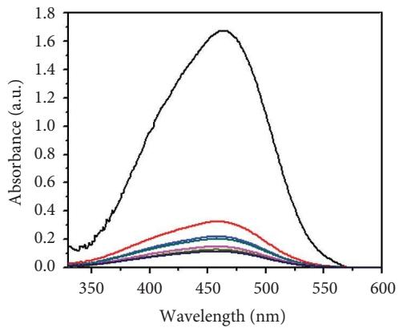

line

| Wavelength (nm) | Absorbance (a.u.) |
| --------------- | ----------------- |
| 350             | ~0.1              |
| 400             | ~1.0              |
| 450             | ~1.7              |
| 500             | ~1.0              |
| 550             | ~0.1              |
| 600             | ~0.0              |

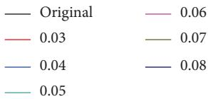

other

| Category | Original | 0.06 |
|---|---|---|
| - | 0.03 | 0.07 |
| - | 0.04 | 0.08 |
| - | 0.05 | |

(b)   
Figure 11: (a) Efect of catalyst’s dose on methyl orange dye degradation and (b) the absorbance spectrum of methyl orange dye using Mgdoped $\mathrm { A g } _ { 2 } \mathrm { O }$ NPs.

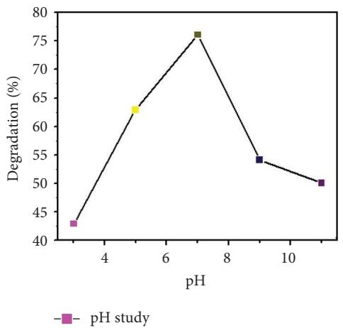

line

| pH  | Degradation (%) |
| --- | --------------- |
| 3   | 43              |
| 5   | 63              |
| 7   | 76              |
| 9   | 54              |
| 11  | 50              |

(a)

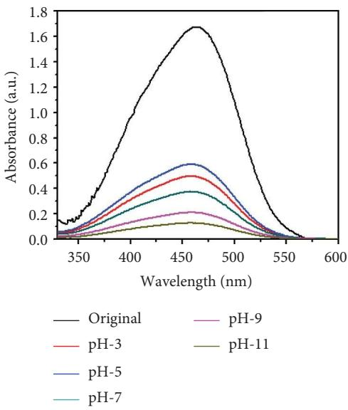

line

| Wavelength (nm) | Original | pH-9 | pH-3 | pH-11 | pH-5 | pH-7 |
| --------------- | -------- | ---- | ---- | ----- | ---- | ---- |
| 350             | 0.1      | 0.05 | 0.08 | 0.02  | 0.03 | 0.04 |
| 400             | 1.0      | 0.2  | 0.3  | 0.1   | 0.25 | 0.2  |
| 450             | 1.7      | 0.3  | 0.5  | 0.15  | 0.6  | 0.4  |
| 500             | 1.6      | 0.25 | 0.45 | 0.1   | 0.5  | 0.35 |
| 550             | 0.2      | 0.1  | 0.15 | 0.05  | 0.1  | 0.05 |
| 600             | 0.0      | 0.0  | 0.0  | 0.0   | 0.0  | 0.0  |

(b)   
Figure 12: (a) Efect of diferent pH values on methyl orange dye degradation and (b) the absorbance spectrum of methyl orange dye using Mg-doped $\mathbf { A g } _ { 2 } \mathbf { O }$ NPs.

An important aspect of sustainable heterogeneous catalysis is the catalyst’s reusability. To determine the recyclability of the synthesized Mg-doped $\operatorname { A g } _ { 2 } \mathrm { O }$ nanoparticles, the used catalyst was collected at each run, washed with an ethanol–water solution, dried, and reused for the photodegradation of MO under diferent reaction conditions. Figures 13(a) and 13(b) indicate that the synthesized catalyst

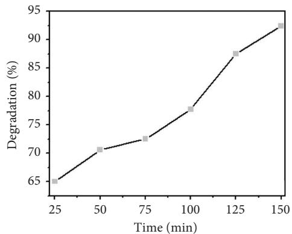

line

| Time (min) | Degradation (%) |
| ---------- | --------------- |
| 25         | 65              |
| 50         | 70              |
| 75         | 72              |
| 100        | 78              |
| 125        | 88              |
| 150        | 92              |

Catalyst recovery   
(a)

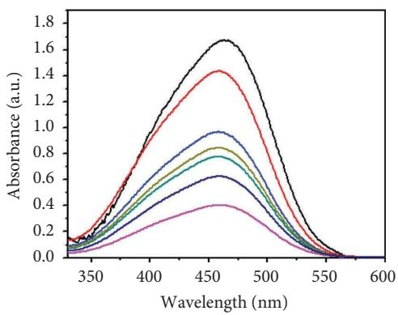

line

| Wavelength (nm) | Absorbance (a.u.) - Black | Absorbance (a.u.) - Red | Absorbance (a.u.) - Blue | Absorbance (a.u.) - Green | Absorbance (a.u.) - Teal | Absorbance (a.u.) - Purple |
| --------------- | ------------------------- | ----------------------- | ------------------------ | ------------------------- | ------------------------ | -------------------------- |
| 350             | ~0.1                      | ~0.1                    | ~0.1                     | ~0.1                      | ~0.1                     | ~0.05                      |
| 400             | ~0.8                      | ~0.9                    | ~0.6                     | ~0.5                      | ~0.4                     | ~0.2                       |
| 450             | ~1.7                      | ~1.4                    | ~0.9                     | ~0.8                      | ~0.7                     | ~0.4                       |
| 500             | ~1.2                      | ~1.0                    | ~0.7                     | ~0.6                      | ~0.5                     | ~0.3                       |
| 550             | ~0.2                      | ~0.2                    | ~0.1                     | ~0.1                      | ~0.1                     | ~0.05                      |
| 600             | ~0.0                      | ~0.0                    | ~0.0                     | ~0.0                      | ~0.0                     | ~0.0                       |

Original   
25 min   
50 min   
75 min   
100 min   
125 min   
150 min

(b)

Figure 13: Photocatalytic degradation of MO dye: (a) percent degradation and (b) absorbance spectra of MO dye with reusable catalyst Mgdoped Ag2O.

has high photocatalytic activity with minor performance loss. Particularly, Mg-doped $\mathrm { A g } _ { 2 } \mathrm { O }$ maintained 94%, 92%, 90%, and 88% of its initial activity after four cycles. Te minimal loss indicates suitable structural stability and reusability, providing its potential for wastewater treatment application [29].

3.11. Efect of Temperature. Temperature is an important parameter that could afect photocatalytic reaction time. Te impact of temperature (65–75°C) was assessed by using 0.01 g catalyst and 30 ppm of MO dye. Te results are shown in Figures 14(a), 14(b), 14(c), and 14(d), and the degradation of MO dye increased from 85.32% to 88.91% with increasing temperature. Te highest degradation at high temperatures was due to improved particle activation, which maximizes the catalyst’s contact with dye molecules and accelerates the dye’s conversion to carbon dioxide and water molecules [29]. In the previous study by Rauf and Ashraf [30], methyl orange dye degradation efciency increased from 64% at 20° C to 98% at 80°C.   
3.12. Kinetic Analysis. To evaluate the reaction kinetics, the experimental data were ftted to pseudo-frst- and pseudosecond-order models at diferent initial dye concentrations (30–50 mg L−1 ). Te corresponding linear plots are shown in Figures 15(a) and 15(b). Te apparent rate constants $( K _ { \mathrm { A p p } } )$ and correlation coefcients $( R ^ { 2 } )$ are listed in Table 2. Te data show that the degradation process follows predominantly the pseudo-frst-order model, indicating that the surface reaction between active sites and dye molecules governs the overall rate [30].

Te efect of temperature also on the apparent constant rate was examined, as shown in Figures 15(c), and 15(d). Te result showed the reaction rate improved as the temperature increases from 65°C to 75°C. Te activation energy $\overset { \vartriangle } { ( \boldsymbol { E } _ { a } ) }$ was achieved from the Arrhenius plot (Figure 16) and was found to be 13.19 kJ mol−1 . Te strong linear correlation $\left( R ^ { 2 } = 0 . 9 7 2 \right)$ shows that the photocatalytic process follows Arrhenius behavior, confrming its temperature-dependent kinetics. Table 2 summarizes the values of the kinetic constant parameter for photocatalytic degradation at different temperatures.

3.13. Dye Mechanism. Te photocatalytic degradation of MO over $\mathrm { M g - A g _ { 2 } O }$ follows the conventional semiconductor mechanism, but Mg doping enhances performance by modulating band gap, charge separation, and surface interactions. Upon illumination with photons of energy ≥ 2.60 eV, electrons are promoted from the valence band to the conduction band, leaving holes behind.

$$
\mathrm{Mg} \text { doped } \mathrm{Ag} _ {2} \mathrm{O} + \mathrm{hv} (\text { light }) \longrightarrow \mathrm{e} ^ {-} + \mathrm{h} ^ {+} \tag {9}
$$

Te excited electrons reduce dissolved oxygen to superoxide radicals $( \bullet \mathrm { O } _ { 2 } ^ { - } )$ , while holes oxidize water or hydroxide to hydroxyl radicals (•OH), as illustrated in Figure 17 [33].

$$
\mathrm{e} ^ {-} + \mathrm{O} _ {2} \longrightarrow . \mathrm{O} _ {2 ^ {-}} \tag {10}
$$

$$
\mathrm{OH} + \text { dye   molecules } \longrightarrow \text { degraded   products } \tag {11}
$$

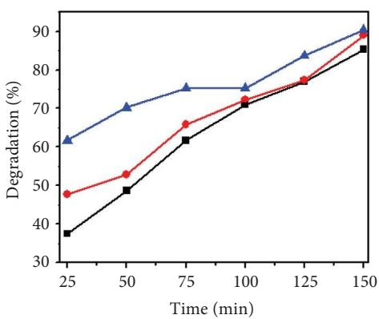

line

| Time (min) | Degradation (%) - Series 1 | Degradation (%) - Series 2 | Degradation (%) - Series 3 |
| ---------- | -------------------------- | -------------------------- | -------------------------- |
| 25         | 62                         | 48                         | 37                         |
| 50         | 70                         | 53                         | 49                         |
| 75         | 75                         | 66                         | 62                         |
| 100        | 75                         | 72                         | 71                         |
| 125        | 85                         | 78                         | 78                         |
| 150        | 90                         | 88                         | 85                         |

7 65   
• 70   
75

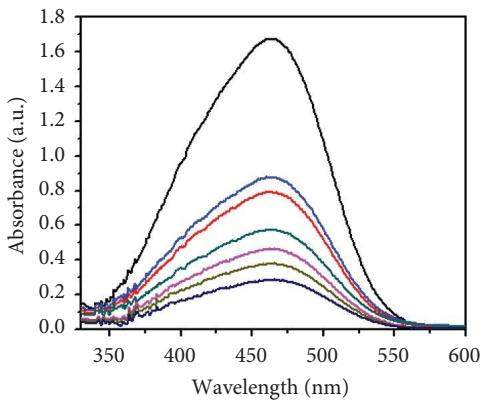

line

| Wavelength (nm) | Absorbance (a.u.) - Series 1 | Absorbance (a.u.) - Series 2 | Absorbance (a.u.) - Series 3 | Absorbance (a.u.) - Series 4 | Absorbance (a.u.) - Series 5 | Absorbance (a.u.) - Series 6 | Absorbance (a.u.) - Series 7 |
| --------------- | ---------------------------- | ---------------------------- | ---------------------------- | ---------------------------- | ---------------------------- | ---------------------------- | ---------------------------- |
| 350             | ~0.1                         | ~0.1                         | ~0.1                         | ~0.1                         | ~0.1                         | ~0.1                         | ~0.1                         |
| 400             | ~0.8                         | ~0.6                         | ~0.5                         | ~0.4                         | ~0.3                         | ~0.2                         | ~0.1                         |
| 450             | ~1.7                         | ~0.9                         | ~0.7                         | ~0.5                         | ~0.4                         | ~0.3                         | ~0.2                         |
| 500             | ~1.6                         | ~0.8                         | ~0.6                         | ~0.4                         | ~0.3                         | ~0.2                         | ~0.1                         |
| 550             | ~0.1                         | ~0.1                         | ~0.1                         | ~0.1                         | ~0.1                         | ~0.1                         | ~0.1                         |
| 600             | ~0.0                         | ~0.0                         | ~0.0                         | ~0.0                         | ~0.0                         | ~0.0                         | ~0.0                         |

Original 100 min   
25 min 125 min   
50 min 150 min   
75 min

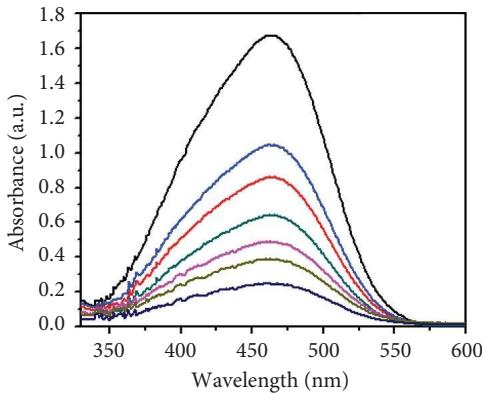

line

| Wavelength (nm) | Absorbance (a.u.) - Black | Absorbance (a.u.) - Blue | Absorbance (a.u.) - Red | Absorbance (a.u.) - Green | Absorbance (a.u.) - Purple | Absorbance (a.u.) - Brown |
| --------------- | ------------------------- | ------------------------ | ----------------------- | ------------------------- | -------------------------- | ------------------------- |
| 350             | ~0.1                      | ~0.1                     | ~0.1                    | ~0.1                      | ~0.1                       | ~0.1                      |
| 400             | ~1.2                      | ~0.6                     | ~0.5                    | ~0.4                      | ~0.3                       | ~0.2                      |
| 450             | ~1.7                      | ~1.0                     | ~0.8                    | ~0.6                      | ~0.5                       | ~0.3                      |
| 500             | ~1.4                      | ~0.9                     | ~0.7                    | ~0.5                      | ~0.4                       | ~0.2                      |
| 550             | ~0.2                      | ~0.1                     | ~0.1                    | ~0.1                      | ~0.1                       | ~0.1                      |
| 600             | ~0.0                      | ~0.0                     | ~0.0                    | ~0.0                      | ~0.0                       | ~0.0                      |

Original 100 min   
25 min 125 min   
50 min 150 min   
75 min

(b)   
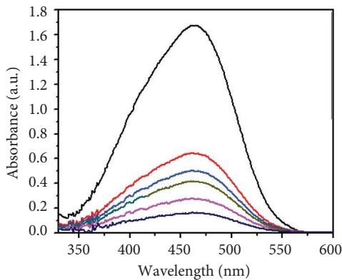

line

| Wavelength (nm) | Absorbance (a.u.) - Black | Absorbance (a.u.) - Red | Absorbance (a.u.) - Blue | Absorbance (a.u.) - Green | Absorbance (a.u.) - Purple | Absorbance (a.u.) - Dark Blue |
| --------------- | ------------------------- | ----------------------- | ------------------------ | ------------------------- | -------------------------- | ----------------------------- |
| 350             | ~0.1                      | ~0.05                   | ~0.05                    | ~0.05                     | ~0.05                      | ~0.05                         |
| 400             | ~1.2                      | ~0.3                    | ~0.2                     | ~0.15                     | ~0.1                       | ~0.05                         |
| 450             | ~1.7                      | ~0.6                    | ~0.4                     | ~0.3                      | ~0.2                       | ~0.1                          |
| 500             | ~1.4                      | ~0.5                    | ~0.3                     | ~0.2                      | ~0.15                      | ~0.05                         |
| 550             | ~0.1                      | ~0.05                   | ~0.05                    | ~0.05                     | ~0.05                      | ~0.0                          |
| 600             | ~0.0                      | ~0.0                    | ~0.0                     | ~0.0                      | ~0.0                       | ~0.0                          |

Original 100 min   
25 min 125 min   
50 min 150 min   
75 min

(d)   
Figure 14: (a) Efect of diferent temperatures on methyl orange dye degradation and the absorbance spectrum of methyl orange dye at (b) $6 5 ^ { \circ } \mathrm { C } ,$ (c) $7 0 ^ { \circ } \mathrm { C } ,$ and (d) 75°C using Mg-doped Ag2O nanoparticles.   
Table 2: Values of the kinetic constant parameter for photocatalytic degradation at various dye concentrations. 

<table><tr><td rowspan="2" colspan="2">Initial concentration (ppm)</td><td colspan="2">First-order kinetics</td><td colspan="2">Second-order kinetics</td></tr><tr><td> $K_{\text{App}}$ </td><td> $R^2$ </td><td> $K_{\text{App}}$ </td><td> $R^2$ </td></tr><tr><td rowspan="5">Mg-doped Ag2O</td><td>30 ppm</td><td>0.01564</td><td>0.22737</td><td>0.09417</td><td>2.6949</td></tr><tr><td>35 ppm</td><td>0.01421</td><td>0.17592</td><td>0.05546</td><td>1.20676</td></tr><tr><td>40 ppm</td><td>0.01065</td><td>0.06778</td><td>0.02037</td><td>0.26078</td></tr><tr><td>45 ppm</td><td>0.01036</td><td>0.03726</td><td>0.0093</td><td>0.02475</td></tr><tr><td>50 ppm</td><td>0.00659</td><td>0.08496</td><td>0.00837</td><td>0.00121</td></tr><tr><td rowspan="2">Temperature °C</td><td colspan="2">First-order kinetics</td><td colspan="2">Second-order kinetics</td><td>Activation energy (kJ/mol)</td></tr><tr><td> $K_{\text{App}}$ </td><td> $R^2$ </td><td> $K_{\text{App}}$ </td><td> $R^2$ </td><td>13.96</td></tr><tr><td rowspan="3">Mg-doped Ag2O</td><td>65</td><td>0.02335</td><td>0.56879</td><td>0.00995</td><td>0.0643</td></tr><tr><td>70</td><td>0.02953</td><td>0.78569</td><td>0.01135</td><td>0.1628</td></tr><tr><td>75</td><td>0.03226</td><td>0.36999</td><td>0.01162</td><td>0.1565</td></tr></table>

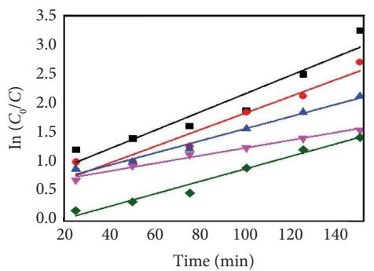

line

| Time (min) | Black Square | Red Circle | Blue Triangle | Purple Triangle | Green Diamond |
| ---------- | ------------ | ---------- | ------------- | --------------- | ------------- |
| 20         | 1.2          | 1.0        | 0.8           | 0.7             | 0.1           |
| 40         | 1.4          | 1.2        | 0.9           | 0.8             | 0.2           |
| 60         | 1.6          | 1.4        | 1.0           | 0.9             | 0.3           |
| 80         | 1.8          | 1.6        | 1.1           | 1.0             | 0.4           |
| 100        | 2.0          | 1.8        | 1.2           | 1.1             | 0.5           |
| 120        | 2.4          | 2.1        | 1.4           | 1.3             | 0.7           |
| 140        | 3.2          | 2.7        | 2.1           | 1.5             | 1.4           |

30 ppm   
C 35 ppm   
40 ppm   
45 ppm   
50 ppm

(a)   
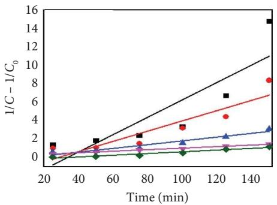

line

| Time (min) | 1/C - 1/C₀ (Black Square) | 1/C - 1/C₀ (Red Circle) | 1/C - 1/C₀ (Blue Triangle) | 1/C - 1/C₀ (Purple Diamond) |
| ---------- | ------------------------- | ----------------------- | -------------------------- | --------------------------- |
| 20         | 1.0                       | 1.0                     | 0.5                        | 0.5                         |
| 40         | 2.0                       | 1.5                     | 0.8                        | 0.6                         |
| 60         | 3.0                       | 2.0                     | 1.0                        | 0.7                         |
| 80         | 4.0                       | 3.0                     | 1.2                        | 0.8                         |
| 100        | 6.0                       | 4.0                     | 1.5                        | 0.9                         |
| 120        | 8.0                       | 5.0                     | 2.0                        | 1.0                         |
| 140        | 10.0                      | 8.0                     | 3.0                        | 1.1                         |
| 150        | 15.0                      | —                       | —                          | —                           |

30 ppm   
0 35 ppm   
40 ppm   
45 ppm   
50 ppm

(b)   
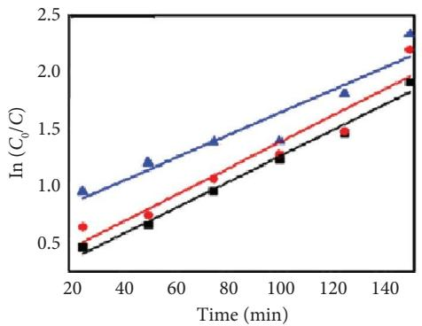

line

| Time (min) | Blue Line | Red Line | Black Line |
| ---------- | --------- | -------- | ---------- |
| 20         | 0.9       | 0.6      | 0.4        |
| 40         | 1.2       | 0.8      | 0.6        |
| 60         | 1.4       | 1.0      | 0.8        |
| 80         | 1.6       | 1.2      | 1.0        |
| 100        | 1.8       | 1.4      | 1.2        |
| 120        | 2.0       | 1.6      | 1.4        |
| 140        | 2.3       | 2.2      | 1.8        |

65°   
0 70   
75

(c)   
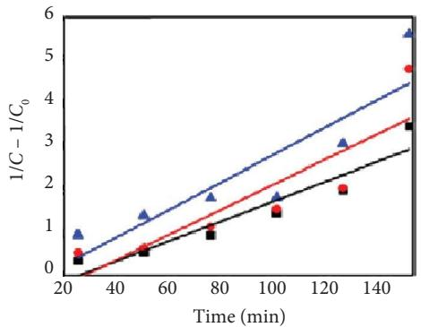

line

| Time (min) | Blue Triangle | Red Circle | Black Square |
| ---------- | ------------- | ---------- | ------------ |
| 20         | 0.8           | 0.3        | 0.2          |
| 40         | 1.2           | 0.6        | 0.4          |
| 60         | 1.6           | 0.9        | 0.7          |
| 80         | 2.0           | 1.3        | 1.0          |
| 100        | 2.4           | 1.7        | 1.4          |
| 120        | 2.8           | 2.1        | 1.8          |
| 140        | 3.2           | 2.5        | 2.2          |
| 150        | 5.5           | 4.7        | 3.4          |

65   
70   
75

(d)   
Figure 15: Kinetic analysis of methyl orange degradation using Mg-doped $\mathrm { A g } _ { 2 } \mathrm { O }$ nanoparticles: (a, b) pseudo-frst- and pseudo-secondorder kinetic models at varying dye concentrations and (c, d) pseudo-frst- and pseudo-second-order kinetic models at diferent temperatures.   
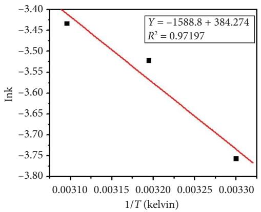

scatter

| 1/T (kelvin) | Ink     |
| ------------ | ------- |
| 0.00310      | -3.45   |
| 0.00320      | -3.52   |
| 0.00330      | -3.75   |

Figure 16: Outcomes of applying the Arrhenius equation to the experimental data with $\mathrm { A g } _ { 2 } \mathrm { O }$ nanoparticles doped with magnesium.

flowchart

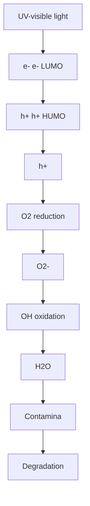

Figure 17: Mechanism for the photocatalytic degradation of methyl orange over Mg-doped $\mathrm { A g } _ { 2 } \mathrm { O }$ nanoparticles.

both of which are highly reactive toward dye molecules. MO adsorbed on the catalyst surface undergoes oxidative degradation to intermediates and mineralizes into $\mathrm { C O } _ { 2 }$ and $_ \mathrm { H } \mathrm { _ 2 O }$ [28].

$$
\mathrm{O} _ {2 ^ {-}} + \text { dye   molecules } \longrightarrow \text { degraded   products } \tag {12}
$$

# 4. Conclusion

By applying coprecipitation techniques, Mg-doped $\mathrm { A g } _ { 2 } \mathrm { O }$ NPs were successfully synthesized. Te average particle size of the synthesized materials was 15 nm. Te synthesized nanoparticles were used for the degradation of MO. Te photodegradation study revealed that the an increase in time, temperature, and catalyst dose, the rate of degradation increased, while it decreased with an increase in the initial concentration of the dye. Photodegradation of MO over Mgdoped $\mathrm { A g } _ { 2 } \mathrm { O }$ followed frst-order reaction kinetics. Te reusability study showed that the recovered catalyst could be used for the degradation of the same dye many times. Mg doping in $\mathrm { A g } _ { 2 } \mathrm { O }$ efectively narrowed the band gap from 2.92 to 2.60 eV, improved visible-light absorption, and reduced electron–hole recombination. Te catalyst showed excellent photocatalytic activity (96% in 150 min), stability (88% after four cycles), and favorable PZC characteristics for pH tuning. Tese results highlight Mg-doped $\mathrm { A g } _ { 2 } \mathrm { O }$ as a promising photocatalyst for dye wastewater treatment.

# Data Availability Statement

All data supporting the fndings of this work are presented within the article; no supporting information was used.

# Ethics Statement

Tis study did not involve the use of human or animal subjects; therefore, ethics clearance was not required.

# Disclosure

All authors have reviewed the fnal manuscript and agree to be accountable for all aspects of the work presented.

# Conflicts of Interest

Te authors declare no conficts of interest.

# Author Contributions

All authors have contributed to this study at diferent stages. Gul Asimullah Khan Nabi: study design, method design, analytical protocol design, writing, reviewing, and editing.

Sajjad Hussain and Mati Ullah: experimental assistant and discussion during writing and reviewing.

Gul Asimullah Khan Nabi, Sajjad Hussain, and Mati Ullah: characterization of the materials and data analysis of the results.

Shohreh Azizi, Ilunga Kamika, and Malik Maaza: reviewing and editing.

# Funding

Te authors did not receive support from any organization for the submitted work.

# Acknowledgments

Artifcial intelligence (AI) assistance was used for language editing and grammar correction. Specifcally, ChatGPT (OpenAI, San Francisco, USA) was used under a paid, single-user subscription (ChatGPT Plus) by the corresponding author to improve clarity and style in selected sections of the manuscript.

# References

[1] B. J. Singh, A. Chakraborty, and R. Sehgal, “A Systematic Review of Industrial Wastewater Management: Evaluating Challenges and Enablers,” Journal of Environmental Management 348 (2023): 119230, https://doi.org/10.1016/ j.jenvman.2023.119230.   
[2] B. de Campos Ventura-Camargo and M. A. Marin-Morales, “Azo Dyes: Characterization and Toxicity-A Review,” (2013), https://api.semanticscholar.org/CorpusID:138928774.   
[3] R. Al-Tohamy, S. S. Ali, F. Li, et al., “A Critical Review on the Treatment of Dye-Containing Wastewater: Ecotoxicological and Health Concerns of Textile Dyes and Possible Remediation Approaches for Environmental Safety,” Ecotoxicology and Environmental Safety 231 (2022): 113160, https:// doi.org/10.1016/j.ecoenv.2021.113160.   
[4] S. Hussain, N. Khan, S. Gul, et al., “Contamination of Water Resources by Food Dyes and Its Removal Technologies,” Water Chemistry (2019): https://api.semanticscholar.org/Co rpusID:213763459.   
[5] M. Kumar, V. P. Singh, S. B. Bhat, and R. Kumar, “Environmental Risks of Textile Dyes and Photocatalytic Materials for Sustainable Treatment: Current Status and Future Directions,” Discover Environment 3, no. 1 (2025): 132, https:// doi.org/10.1007/s44274-025-00337-0.   
[6] H. Mahdizadeh, Y. Dadban Shahamat, and S. Rodr´ıguez-Couto, “Discoloration and Mineralization of a Textile Azo Dye Using a Hybrid UV/O3/SBR Process,” Applied Water Science 11, no. 10 (2021): 159, https://doi.org/ 10.1007/s13201-021-01479-1.

[7] N. L. Yong, A. Ahmad, and A. W. Mohammad, “Synthesis and Characterization of Silver Oxide Nanoparticles by a Novel Method,” International Journal of Scientifc Engineering and Research, 4.   
[8] P. Siriwong, T. Tongtem, A. Phuruangrat, and S. Tongtem, “Hydrothermal Synthesis, Characterization, and Optical Properties of Wolframite ZnWO4 Nanorods,” CrystEngComm 13, no. 5 (2011): 1564–1569, https://doi.org/ 10.1039/c0ce00402b.   
[9] M. Mishra and D.-M. Chun, “α-Fe2O3 as a Photocatalytic Material: A Review,” Applied Catalysis A: General 498 (2015): 126–141, https://doi.org/10.1016/j.apcata.2015.03.023.   
[10] O. Yayapao, T. Tongtem, A. Phuruangrat, and S. Tongtem, “Synthesis and Characterization of Highly Efcient Gd Doped ZnO Photocatalyst Irradiated With Ultraviolet and Visible Radiations,” Materials Science in Semiconductor Processing 39 (2015): 786–792, https://doi.org/10.1016/j.mssp.2015.06.039.   
[11] S. Faisal, H. Jan, S. A. Shah, et al., “Green Synthesis of Zinc Oxide (ZnO) Nanoparticles Using Aqueous Fruit Extracts of Myristica Fragrans: Teir Characterizations and Biological and Environmental Applications,” ACS Omega 6, no. 14 (2021): 9709–9722, https://doi.org/10.1021/acsomega.1c00310.   
[12] G. Nagaraju, T. N. Ravishankar, K. Manjunatha, et al., “Ionothermal Synthesis of TiO2 Nanoparticles: Photocatalytic Hydrogen Generation,” Materials Letters 109 (2013): 27–30, https://doi.org/10.1016/j.matlet.2013.07.031.   
[13] T. Tjardts, M. Elis, M. Hicke, et al., “Critical Assessment of a TiO2-Ag-ZnO Nanocomposite Photocatalyst on Improved Photocatalytic Activity Under Mixed UV-Visible Light,” Applied Surface Science Advances 18 (2023): 100500, https:// doi.org/10.1016/j.apsadv.2023.100500.   
[14] W. Jiang, X. Wang, Z. Wu, et al., “Silver Oxide as Superb and Stable Photocatalyst Under Visible and Near-Infrared Light Irradiation and Its Photocatalytic Mechanism,” Industrial & Engineering Chemistry Research 54, no. 3 (2015): 832–841, https://doi.org/10.1021/ie503241k.   
[15] R. Priya, K. V. Baiju, S. Shukla, et al., “Comparing Ultraviolet and Chemical Reduction Techniques for Enhancing Photocatalytic Activity of Silver Oxide/Silver Deposited Nanocrystalline Anatase Titania,” Journal of Physical Chemistry C 113, no. 15 (2009): 6243–6255, https://doi.org/10.1021/ jp8105343.   
[16] Y. Fang, Q. Wu, H. Li, et al., “Photocatalytic Activity of Silver Oxide Capped Ag Nanoparticles Constructed by Air Plasma Irradiation,” Applied Physics Letters 112, no. 16 (2018): 163101, https://doi.org/10.1063/1.5024770.   
[17] H. Li, T. Chen, Y. Wang, J. Tang, Y. Sang, and H. Liu, “Surface-Sulfurized Ag2O Nanoparticles With Stable Full-Solar-Spectrum Photocatalytic Activity,” Chinese Journal of Catalysis 38, no. 6 (2017): 1063–1071, https://doi.org/10.1016/ s1872-2067(17)62806-7.   
[18] V. Lojpur, “Recent Advances in Photocatalysis for Environmental Applications,” Catalysts 15, no. 11 (2025): 1063, https://doi.org/10.3390/catal15111063.   
[19] S. S. Wagh, C. V. Jagtap, V. S. Kadam, et al., “Silver Doped ZnO Nanoparticles Synthesized for Photocatalysis Application,” ES Energy and Environment 17 (2022): 94–105.   
[20] Y. Liu, H. Yu, Z. Lv, et al., “Simulated-Sunlight-Activated Photocatalysis of Methylene Blue Using Cerium-Doped SiO2/ TiO2 Nanostructured Fibers,” Journal of Environmental Sciences 24, no. 10 (2012): 1867–1875, https://doi.org/10.1016/ s1001-0742(11)61008-5.   
[21] S. P. Vinay, S. H. N. Udayabhanu, G. Nagaraju, S. Harishkumar, and N. Chandrasekhar, “Facile Combustion

Synthesis of Ag2O Nanoparticles Using Cantaloupe Seeds and Teir Multidisciplinary Applications,” Applied Organometallic Chemistry 34, no. 10 (2020): e5830, https://doi.org/ 10.1002/aoc.5830.   
[22] J. Zhang, H. Liu, and Z. Ma, “Flower-Like Ag2O/Bi2MoO6 pn Heterojunction With Enhanced Photocatalytic Activity Under Visible Light Irradiation,” Journal of Molecular Catalysis A: Chemical 424 (2016): 37–44, https://doi.org/10.1016/ j.molcata.2016.08.009.   
[23] M. Kumar, A. Sharma, I. K. Maurya, A. Takur, and S. Kumar, “Synthesis of Ultra Small Iron Oxide and Doped Iron Oxide Nanostructures and Teir Antimicrobial Activities,” Journal of Taibah University for Science 13, no. 1 (2019): 280–285, https://doi.org/10.1080/16583655.2019.1565437.   
[24] S. Alkaykh, A. Mbarek, and E. E. Ali-Shattle, “Photocatalytic Degradation of Methylene Blue Dye in Aqueous Solution by MnTiO3 Nanoparticles Under Sunlight Irradiation,” Heliyon 6, no. 4 (2020): e03663, https://doi.org/10.1016/ j.heliyon.2020.e03663.   
[25] H. M. Hadi and H. S. Wahab, “Visible Light Photocatalytic Decolourization of Methyl Orange Using n-Doped TiO2 Nanoparticles,” Al-Nahrain Journal of Science 18, no. 3 (2015): 1–9, https://doi.org/10.22401/jnus.18.3.01.   
[26] ˙I. Kaba, R. N. Bozkurt, and B. Kılıç, “Investigation of Photocatalytic Degradation of Methyl Orange Using Zinc Oxide-Supported Chitosan Hydrogel Beads,” Chemical Engineering Communications, 1–18.   
[27] M. Siddique, N. M. Khan, M. Saeed, and Z. Shah, “Green Synthesis of Cobalt Oxide Nanoparticles Using Citrus Medica Leaves Extract: Characterization and Photo-Catalytic Activity,” Zeitschrift f¨ur Physikalische Chemie 235, no. 6 (2021): 663–681, https://doi.org/10.1515/zpch-2019-1583.   
[28] S. Ali, F. A. Jan, R. Ullah, and Wajidullah, “Kinetic and Termodynamic Study of the Photo Catalytic Degradation of Methylene Blue (MB) in Aqueous Solution Using Cadmium Sulphide (CdS) Nanocatalysts,” Chemistry Africa 5, no. 2 (2022): 293–304, https://doi.org/10.1007/s42250-022-00327-2.   
[29] U. G. Akpan and B. H. Hameed, “Parameters Afecting the Photocatalytic Degradation of Dyes Using TiO2-Based Photocatalysts: A Review,” Journal of Hazardous Materials 170, no. 2-3 (2009): 520–529, https://doi.org/10.1016/ j.jhazmat.2009.05.039.   
[30] M. A. Rauf and S. S. Ashraf, “Fundamental Principles and Application of Heterogeneous Photocatalytic Degradation of Dyes in Solution,” Chemical Engineering Journal 151, no. 1-3 (2009): 10–18, https://doi.org/10.1016/j.cej.2009.02.026.   
[31] R. M. Abhang, D. Kumar, and S. V. Taralkar, “Design of Photocatalytic Reactor for Degradation of Phenol in Wastewater,” International Journal of Chemical Engineering and Applications 2 (2011): 337–341, https://doi.org/10.7763/ ijcea.2011.v2.130.   
[32] V. Rajendran, B. Deepa, and R. Mekala, “Studies on Structural, Morphological, Optical and Antibacterial Activity of Pure and Cu-Doped MgO Nanoparticles Synthesized by Co-Precipitation Method,” Materials Today Proceedings 5, no. 2 (2018): 8796–8803, https://doi.org/10.1016/j.matpr.2017.12.308.   
[33] S. Ali, F. Akbar Jan, R. Ullah, Wajidullah, and Salman, “UV-Light-Driven Cadmium Sulphide (CdS) Nanocatalysts: Synthesis, Characterization, Terapeutic and Environmental Applications; Kinetics and Termodynamic Study of Photocatalytic Degradation of Eosin B and Methyl Green Dyes,” Water Science and Technology 85, no. 4 (2022): 1040–1052, https://doi.org/10.2166/wst.2021.637.