# Visible Light-Driven Photocatalytic Degradation of Methylene Blue Dye Using a Highly Efficient Mg−Al LDH@g $\mathsf { \Lambda } _ { - \mathsf { C } _ { 3 } \mathsf { N } _ { 4 } \ @ \mathsf { A } \mathsf { g } _ { 3 } \mathsf { P } \mathsf { O } _ { 4 } }$ Nanocomposite

Ghazal Salehi, Mojtaba Bagherzadeh,\* Reza Abazari, Mojtaba Hajilo, and Davood Taherinia

Cite This: ACS Omega 2024, 9, 4581−4593

Read Online

ACCESS

Metrics & More

Article Recommendations

Supporting Information

ABSTRACT: The issue of water resource pollution resulting from the discharge of dyes is a matter of great concern for the environment. In this investigation, a new ternary heterogeneous Mg−Al $\mathrm { L D H } @ \mathrm { g } _ { - } \mathrm { C } _ { 3 } \mathrm { N } _ { 4 } X @ \mathrm { A } \bar { \mathrm { g } } _ { 3 } \mathrm { P O } _ { 4 } Y$ (X = wt % of $\mathrm { g - C _ { 3 } N _ { 4 } }$ with respect to $\operatorname { M g - A l }$ layered double hydroxide (LDH) and Y = wt % of ${ \mathrm { A g } } _ { 3 } { \mathrm { P O } } _ { 4 }$ loaded on Mg−Al $\mathrm { L D H } @ \mathrm { g - } \mathrm { C } _ { 3 } \mathrm { N } _ { 4 } 3 0 )$ nanocomposite was prepared with the aim of increasing charge carrier separation and enhancement of photocatalytic performance to degrade methylene blue (MB) dye. The prepared samples were subjected to characterization via Fourier-transform infrared spectroscopy, field emission scanning electron microscopy, energy-dispersive $\mathrm { X } \mathrm { - }$ ray, transmission electron microscopy, X-ray diffraction, UV−vis diffuse reflectance spectroscopy, photoluminescence, and photo-

electrochemical analysis. It was observed that in the presence of the composite of Mg−Al LDH and $\mathrm { g - C } _ { 3 } \mathrm { N } _ { 4 } ,$ , the photocatalytic decomposition of MB under 150 W mercury lamp illumination increases significantly as opposed to $\mathrm { M g - A l }$ LDH alone, and the $\mathrm { M g - A \hat { l } L D H } @ \mathrm { g - C _ { 3 } N _ { 4 } }$ level with ${ \mathrm { A g } } _ { 3 } { \mathrm { P O } } _ { 4 }$ coating causes the complete degradation of MB to occur in less time. The outcomes show that the $\mathrm { M g - A l \ L D H } @ g . C _ { 3 } N _ { 4 } 3 0 @ A g _ { 3 } \mathrm { P O } _ { 4 } 5$ nanocomposite demonstrated the highest photodegradation activity (99%). Scavenger tests showed that the two most effective agents in the photodegradation of MB are holes and hydroxyl radicals, respectively. Finally, a type II heterojunction photocatalytic degradation mechanism for MB by Mg−Al $\mathrm { L D H } @ \mathrm { g } _ { - } \dot { \mathrm { C } } _ { 3 } \mathrm { N } _ { 4 } 3 \dot { 0 } @ \mathrm { A g } _ { 3 } \mathrm { P O } _ { 4 } 5$ was proposed.

text_image

Mg-Al LDH
Mg-Al LDH@g-C5H20@Ag2PO4
Mg-Al LDH@g-C5H20@Ag2PO4
CB = 0.29 V
VB = 2.63 V
h' + H2O → 'OH'
MBI
MBI
MBI
MBI
MBI
MBI
MBI
MBI
MBI
MBI
MBI
MBI
MBI
MBI
MBI
MBI
MBI
MBI
MBI
MBI
MBI
MBI
MBI
MBI
MBI
MBI
MBI
MBI
MBI
MBI
MBI
MBI
MBI
MBI
mb10000000000000000000000000000000000000000000000000000000000000000000000000000000000000000000000000000
Pollenal in MIE (V)
CB = 1.16V
e⁻ e⁻ e⁻
E⁺2.7kV
E⁻2.3kV
E⁻1.6kV
E⁻1.1kV
E⁻1.6kV
E⁻1.1kV
E⁻1.6kV
E⁻1.1kV
E⁻1.6kV
E⁻1.1kV
E⁻1.6kV
E⁻1.1kV
E⁻1.6kV
E⁻1.1kV
E⁻1.6kV
E⁻1.1kV
CBr = 1.6V
e⁻ e⁻ e⁻
CB = 4.61V
e⁻ + O₂ → 'O₂'
CB = 8.7O₂ + 6.33V
CB = 4.61V
e⁻ + O₂ → 'O₂'
CB = 4.61V
e⁻ + O₂ → 'O₂'
CB = 4.61V
e⁻ + O₂ → 'O₂'
CB = 4.61V
e⁻ + O₂ → 'O₂'
CB = 4.61V
e⁻ + O₂ → 'O₂'
CB = 4.61V
e⁻ + O₂ → 'O₂'
CB = 4,61V - 3.9V
CB = 4,61V - 3.9V

# 1. INTRODUCTION

The increase in urbanization and the rapid growth of industries, as well as the increase in population and the resulting increase in demand, have caused a severe shortage of clean water resources.1 Clean water is less readily available due to the contamination of water supplies by industrial dyes, hefty metals, and organic compounds.2 Therefore, wastewater recycling for reuse is necessary to increase the limited fresh water supply and compensate for potential water resources for a long time.3 Besides beauty, the dyes make the layers resistant to fading caused by water, light, oxidizing agents, sweat, and microbial attack.4 This has caused different dyes to be used in various industries such as textile, food, paper, plastic, leather, printing, cosmetics, and medicine for multiple purposes.5,6 Thus, more than 100,000 commercial paints are produced worldwide, approximately $1 0 ^ { 9 }$ kg per year.7 One of the principal pollutants in wastewater known to cause serious health risks, even in low quantities, is dyes.8

Methylene blue (MB) dye is widely used in the textile, paper, wood, and cotton industries, as well as in human and veterinary medicine and research laboratories.9,10 MB is toxic, carcinogenic, and biostable, and in concentrations higher than the standard, it can cause serious problems for human health

and harmful environmental effects.11 Various techniques have been reported for eliminating contaminants from water, encompassing adsorption,12 coagulation−flocculation,13 electrocoagulation,14 vacuum membrane distillation,15 nanofiltration,16 ultrafiltration,17 and advanced oxidation processes (AOPs).18−20 AOPs have advantages such as fast reaction speed, decomposition of target compounds into harmless minerals such as $\mathrm { C O } _ { 2 }$ and $\mathrm { H } _ { 2 } \bar { \mathrm { O } } _ { \mathrm { i } }$ , and providing different routes for generating $\mathrm { O H } ^ { \bullet } , \mathrm { O } _ { 2 } ^ { \bullet - }$ , and other reactive species, which lead to better adaptation to specific treatment needs.21,22 An example of AOPs is heterogeneous photocatalysis, which has advantages such as low cost, high efficiency, and nontoxicity. With these properties, photocatalysts have the potential to be widely used to remove organic dyes and pesticides. 23,24

In the past decade, photocatalytic applications based on layered double hydroxides (LDHs) for environmentally

Received: October 4, 2023

Revised: December 22, 2023

Accepted: January 5, 2024

Published: January 22, 2024

Scheme 1. Preparation Steps of Samplesa   

flowchart

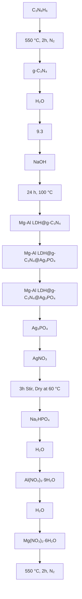
```mermaid
graph TD
    A["C₃N₆H₆"] --> B["550 °C, 2h, N₂"]
    B --> C["g-C₃N₄"]
    C --> D["H₂O"]
    D --> E["9.3"]
    E --> F["NaOH"]
    F --> G["24 h, 100 °C"]
    G --> H["Mg-Al LDH@g-C₃N₄"]
    H --> I["Mg-Al LDH@g-C₃N₄@Ag₃PO₄"]
    I --> J["Mg-Al LDH@g-C₃N₄@Ag₃PO₄"]
    J --> K["Ag₃PO₄"]
    K --> L["AgNO₃"]
    L --> M["3h Stir, Dry at 60 °C"]
    M --> N["Na₂HPO₄"]
    N --> O["H₂O"]
    O --> P["Al(NO₃)₃·9H₂O"]
    P --> Q["H₂O"]
    Q --> R["Mg(NO₃)₂·6H₂O"]
    R --> S["550 °C, 2h, N₂"]
```

a Created with http://BioRender.com.

friendly purposes such as photocatalytic water splitting as a green technology leading to hydrogen (H ) production, $\mathrm { C O } _ { 2 }$ reduction, and degradation of harmful substances and toxic organic pollutants as harmless and less toxic has been the focus of researchers. For instance, $\mathrm { 2 D { - } C _ { 3 } N _ { 4 } / N i F e { - } L D H }$ has been synthesized and utilized in the $\mathrm { H } _ { 2 }$ evolution.25 The $\mathrm { C O } _ { 2 }$ reduction process has been investigated using $\mathrm { ~ a ~ } \mathrm { C s P b B r } _ { 3 } /$ CoAl-LDH composite.26 Additionally, $\mathrm { N i A l - L D H / ( B i O ) _ { 2 } C O _ { 3 } }$ has been employed for the photocatalytic degradation of antibiotics,27 while Al−Li/Th-LDH@CNT has been utilized in the photodegradation of malachite green dye.28 Furthermore, the decomposition of Congo red and tetracycline has been studied using CoAl-LDH $/ { \bf g } { \bf - C } _ { 3 } \mathrm { N _ { 4 } } / \mathrm { R G O . }$ 9 2

LDHs are cationic layers with the structural formula $[ { \bf M } _ { 1 - x } { } ^ { 2 + } { \bf M } _ { x } { } ^ { 3 + } { \bf \Delta } ( \mathrm { O H } ) _ { 2 } ] ^ { x + } { \bf \Delta } ( \dot { \bf A } ^ { n - } ) _ { x / n } { \bf \cdot } m { \bf H } _ { 2 } { \bf O } _ { 1 }$ , where ${ \mathsf { A } } ^ { n - }$ refers to the interlayer anion. $\mathbf { M } ^ { 2 + }$ and $\mathbf { M } ^ { 3 + }$ denote metal ions with +2 and +3 charges, respectively.30 This singular structure gives LDH attractive structural features, including broad selectivity of different metal cations, $\mathbf { M } ^ { 2 + } / \mathbf { M } ^ { 3 + }$ molar ratios, tunable interlayer spaces, excellent ion exchange property, oxo-bridged linkages, and exfoliation from bulk LDH solids to functional ultrathin nanosheets.31 LDH-based photocatalysts are up-andcoming candidates for photocatalytic processes because of their layered structure, defects, adjustable band gap, durability, cost-effectiveness, substantial specific surface area, simple and environmentally friendly synthesis, and ease of scale-up.32,33 However, rapid electron−hole recombination and sluggish charge carrier mobility lower their photocatalytic efficiency.34

In this respect, one possible solution is to create a heterostructure material by combining LDHs with other semiconductors, such as metal-free polymeric carbon nitride $\left( \mathrm { C } _ { 3 } \mathrm { N } _ { 4 } \right) . ^ { 3 5 }$ Unlike other conductive semiconducting polymers, $\mathrm { C } _ { 3 } \mathrm { N } _ { 4 }$ is thermally and chemically stable, and its preparation is not complex and expensive. $\mathrm { C } _ { 3 } \mathrm { N } _ { 4 }$ exists in various allotropes with distinct characteristics; nonetheless, the graphitic phase is considered the most stable regarding environmental factors. Graphitic carbon nitride exhibits a band gap of approximately $2 . 7 \ \mathrm { e V } ,$ , indicating its absorption potential in the blue range of the visible spectrum.36 However, like pure LDHs, $\mathrm { g - C } _ { 3 } \mathrm { N } _ { 4 }$ alone, its quick photoexcited electron−hole pair recombination decreases its photocatalytic efficiency. Electrostatic interactions can facilitate the assembly of the $\mathrm { g - C } _ { 3 } \mathrm { N } _ { 4 }$ and LDH layers because LDH and carbon nitride have positive and negative surface charges, respectively.37,38 Our previous studies demonstrated that the synergist of Ni−Al LDH and $\mathrm { g - C } _ { 3 } \mathrm { N } _ { 4 }$ limits the recombining of holes and electrons.39 Although the coupling of LDH and $\mathrm { g } – \mathrm { C } _ { 3 } \mathrm { N } _ { 4 }$ can promote separating holes and electrons, in order to achieve higher photocatalytic efficiency, more and faster transfer of charge carriers is required in some $\mathrm { L D H } @ \mathrm { g } – \mathrm { C } _ { 3 } \mathrm { N } _ { 4 }$ photocatalysts to participate in electron transfer reactions.11 Thus, the design of LDH@g-$\mathrm { C } _ { 3 } \mathrm { N } _ { 4 } @ X$ ternary photoactive catalysts is regarded. X can be different semiconductors and noble metals. This approach will facilitate the transfer of current carriers between the junction of $\mathrm { g - C _ { 3 } N _ { 4 } }$ and LDH, enhancing the ability to harvest visible light.40

Recently, Ag-based compounds such as $\mathbf { A g } / \mathbf { Z n O }$ and Ag@ AgX $\begin{array} { r } { { \bf \Xi } ( \bf X { \bf \Xi } = { \bf \Xi } , { \bf \bar { \Lambda } } ) } \end{array}$ Br, and Cl) have captured the interest of researchers as promising photocatalysts.41− 43 Silver phosphate, ${ \mathrm { A g } } _ { 3 } { \mathrm { P O } } _ { 4 } ,$ has been reported as an efficient photocatalyst due to its high quantum yield and visible light response.44 Compared to other visible light photocatalysts, the reaction rates shown for the photodegradation of organic pollutants are significantly higher. Such remarkable activity is due to the 2.34 eV band gap, enabling the efficient absorption of visible light. Two problems are noticeable in using ${ \mathrm { A g } } _ { 3 } { \mathrm { P O } } _ { 4 }$ as a photocatalyst: (1) poor stability (photocorrosion phenomenon) and formation of metallic silver, and (2) fast rate of recombination of charge carriers produced by light. One approach to solve these problems is to combine ${ \mathrm { A g } } _ { 3 } { \mathrm { P O } } _ { 4 }$ with other semiconductor materials and make heterogeneous composites.45

Focusing on the above explanations in mind, to obtain a nanocomposite with significant photocatalytic properties for the degradation of dyes, a ternary nanocomposite between $\operatorname { M g - A l }$ LDH, $\mathrm { g } – \mathrm { C } _ { 3 } \mathrm { N } _ { 4 } ,$ and ${ \mathrm { A g } } _ { 3 } { \mathrm { P O } } _ { 4 }$ was designed and synthesized. The synthesized compound was named $\mathrm { M g - A l }$ $\mathrm { L D H } @ \mathbf { g } - \mathbf { C } _ { 3 } \mathbf { N } _ { 4 } @ \mathrm { A g } _ { 3 } \mathrm { P O } _ { 4 } .$ According to the latest knowledge, this nanocomposite has been reported for the first time. Achieving 100% degradation of MB dye after 45 min of visible light irradiation is significantly better than previous literature reports.

# 2. EXPERIMENTAL PROCEDURES

2.1. Preparation of the Mg−Al LDH@g- $\mathsf { \Lambda } . \mathsf { C } _ { 3 } \mathsf { N } _ { 4 } @ \mathsf { A } \mathsf { g } _ { 3 } \mathsf { P } \mathsf { O } _ { 4 }$ Nanocomposites. 500 mg of Mg−Al $\mathrm { L D H } @ \mathbf { g } _ { - } \mathbf { C } _ { 3 } \mathbf { N } _ { 4 } 3 0$ and the appropriate amount of ${ \tt A g } _ { 3 } { \tt P O } _ { 4 }$ (5 and 10%) were dispersed separately in 50 mL of deionized (DI) water with 30 min of sonication. Then, both suspension solutions were mixed, and after continuous stirring for 60 min, the precipitate was rinsed with ethanol; to remove any impurities, followed by drying at $\mathrm { ~ a ~ } ~ 6 0 ~ ^ { \circ } \mathrm { C }$ temperature. In this way, ternary nanocomposites with different ${ \mathrm { A g } } _ { 3 } { \mathrm { P O } } _ { 4 }$ percentages were prepared, and these nanocomposites were determined as $\mathrm { \bar { M g { - A l } \ L D H { @ g { - C _ { 3 } } N _ { 4 } 3 0 @ A g _ { 3 } P \bar { O } _ { 4 } } } } Y ( Y = 5 $ and 10 wt %). The preparation steps of all of the samples are schematically and briefly shown in Scheme 1 and Figure S1.

2.2. Photocatalysis. The effectiveness of the manufactured photocatalysts in the decomposition of MB in aqueous solutions was examined when irradiated with visible light and in the absence of light. For this aim, the suspension was prepared by spreading 50 mg of photocatalyst powder in 0.04 L of MB solution $( 1 \breve { 0 } \mathrm { ~ m g ~ L ^ { - 1 } } )$ using an ultrasonic bath (200 W). Then, the mixture was magnetically agitated in the absence of light for 15 min to provide the absorption and desorption balance of dye molecules on the photocatalyst surface. After that, the photodegradation test was performed for 45 min under visible light irradiation. A mercury light source (150 W) possessing a 420 nm filter cutoff was employed to provide visible light. To quantify the concentration of MB, samples were taken from the reaction vessel every 15 min, and the catalyst particles were separated by centrifugation (6000 rpm, 5 min). Then, the UV−visible spectra of the solutions were logged by using a UV−visible spectrometer between the wavelengths of 200 and 800 nm. The MB degradation percentage was determined using eq 1, where $A _ { 0 }$ and $C _ { 0 }$ refer to the initial absorption and initial concentration of MB solution, and A and $C _ { t }$ correspond to the absorption and concentration of MB at a specific time (t), respectively,

$$
D = \left[ 1 - \frac {A _ {t}}{A _ {0}} \right] \times 1 0 0 = \left[ 1 - \frac {C _ {t}}{C _ {0}} \right] \times 1 0 0 \tag {1}
$$

2.3. Photoelectrochemical Measurements. For the measurement of photoelectrochemical properties, a threeelectrode quartz cell with a platinum counter electrode (20 mm × 10 mm) and an $\mathrm { \ A g / A g C l }$ reference electrode were employed in the experiment. To prepare the working electrodes, a uniform ink mixture was made by dispersing 5 mg of the material that had been prepared earlier in 80 $\mu \mathrm { L }$ of ethanol, 300 $\mu \mathrm { L }$ of DI water, and 20 μL of Nafion (5 wt % in ethanol) using an ultrasonic bath. 60 μL of the ink was then drop-cast on top of 1 cm2 FTO glass, which was fluorinedoped tin oxide glass, undergoing a cleaning process by being washed with ethanol for 30 min using an ultrasonic bath. After cleaning, it was left to dry naturally at room temperature.

The irradiation source for the experiments was a 300 W xenon lamp system, which was furnished with a cutoff filter at 420 nm and applied. The photoelectrode was positioned at a distance of around 3.5 cm from the lamp, and at this distance, the light intensity was 100 m ${ \mathrm { W / c m } } ^ { 2 } ,$ as measured by a lux meter. Measurements using electrochemical impedance spectroscopy (EIS) were performed in a 0.5 M KCl aqueous electrolyte solution at the open circuit potential, which contained a 0.01 M one-to-one ratio of $\mathrm { K } _ { 3 } \big [ \mathrm { F e ( C N ) } _ { 6 } \big ] /$ $\mathrm { K } _ { 4 } [ \mathrm { F e } ( \mathrm { C N } ) _ { 6 } ]$ . Measurements of cyclic voltammograms were conducted in the same electrolyte used for the EIS measurements. Linear sweep voltammetry (LSV) was employed to acquire cathodic polarization curves in an aqueous solution of 0.1 M ${ \mathrm { N a } } _ { 2 } S { \mathrm { O } } _ { 4 } .$ Photocurrent densities were obtained by the chronoamperometry technique in an aqueous solution of 0.2 M ${ \mathrm { N a } } _ { 2 } S { \mathrm { O } } _ { 4 } ,$ by turning on and off the visible light irradiation every 20 s.

# 3. RESULTS AND DISCUSSION

3.1. Study of the Synthesized Substances. The Fourier-transform infrared spectroscopy (FT-IR) spectrum of the samples after preparation is shown in Figure 1. As stated in Figure $1 , \mathrm { M g - A l }$ LDH shows two broad bands at around 3460 and 1636 $\mathrm { c m } ^ { - 1 } .$ , which correspond to both symmetric and asymmetric stretching modes of hydroxyl groups, along with water molecule bending modes residing in the surface and the interlayer gallery of LDH nanoplates, respectively. Furthermore, the peak of nitrate and carbonate ion vibrations in the area between layers of Mg−Al LDH appeared in $1 3 6 6 ~ \mathrm { c m ^ { - 1 } }$ . The bands observed at less than $8 0 0 ~ \mathrm { { c m } ^ { - 1 } }$ are related to metal−OH (and O) modes.46,47 According to Figure 1, pure g-$\mathrm { C } _ { 3 } \mathrm { N } _ { 4 }$ shows a $3 2 0 0 ~ \mathrm { { c m } ^ { - 1 } }$ broad peak, which correlates with the N−H stretching mode. The bands from 1200 to $1 7 0 0 ~ \mathrm { c m ^ { - 1 } }$ are stretch modes for C−N and $\mathrm { C } { = } \mathrm { N } ,$ while heptazine ring bending vibrations are responsible for the band at $\mathrm { \hat { 8 } 0 9  c m ^ { - 1 } }$ . In the spectrum of the Mg−Al LDH@g- ${ \mathrm { . C } } _ { 3 } { \mathrm { N } } _ { 4 }$ -X nanocomposites, the vibrational bands of $\mathrm { g - C } _ { 3 } \mathrm { N } _ { 4 }$ and Mg−Al LDH are discernible. The FT-IR band intensity of binary nanocomposites is increasing with an upward trend in the $\mathrm { g - C } _ { 3 } \mathrm { N } _ { 4 }$ weight percentage in nanocomposites. ${ \mathrm { A g } } _ { 3 } { \mathrm { P O } } _ { 4 }$ demonstrates that two peaks at 1000 and $5 6 4 ~ \mathrm { { c m } ^ { - 1 } }$ are caused by stretching vibration in P−O. According to Figure 1, the presence of characteristic peaks of Mg−Al LDH, pure $\mathrm { g } { \mathrm { - } } \mathrm { C } _ { 3 } \mathrm { N } _ { 4 } ,$ and ${ \mathrm { A g } } _ { 3 } { \mathrm { P O } } _ { 4 }$ can be an apparent confirmation of the correct preparation of the Mg−Al LDH@g- $\mathrm { C } _ { 3 } \mathrm { N } _ { 4 } 3 0 @ \mathrm { A g } _ { 3 } \mathrm { P O } _ { 4 } \mathrm { - } Y$ nanocomposites.48

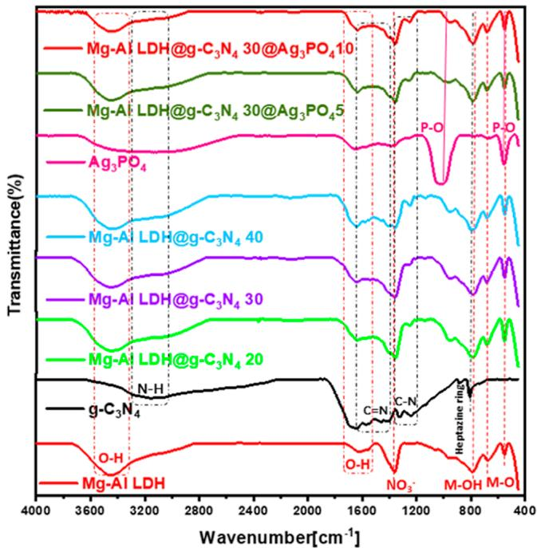

line

| Wavenumber[cm⁻¹] | Mg-Al LDH@g-C₃N₄ 30@Ag₃PO₄ 10 | Mg-Al LDH@g-C₃N₄ 30@Ag₃PO₄ 5 | Ag₃PO₄ | Mg-Al LDH@g-C₃N₄ 40 | Mg-Al LDH@g-C₃N₄ 30 | Mg-Al LDH@g-C₃N₄ 20 | g-C₃N₄ | O-H | NO₃⁻ | Heptazine ring | M-OH | M-OI |
| ---------------- | ----------------------------- | ----------------------------- | ------ | ------------------- | ------------------- | ------------------- | ------ | ---- | ---- | -------------- | ---- | ---- |
| 4000             | ~98%                          | ~98%                          | ~98%   | ~98%                | ~98%                | ~98%                | ~98%   | ~98% | ~98% | ~98%           | ~98% | ~98% |
| 3600             | ~98%                          | ~98%                          | ~98%   | ~98%                | ~98%                | ~98%                | ~98%   | ~98% | ~98% | ~98%           | ~98% | ~98% |
| 3200             | ~98%                          | ~98%                          | ~98%   | ~98%                | ~98%                | ~98%                | ~98%   | ~98% | ~98% | ~98%           | ~98% | ~98% |
| 2800             | ~98%                          | ~98%                          | ~98%   | ~98%                | ~98%                | ~98%                | ~98%   | ~98% | ~98% | ~98%           | ~98% | ~98% |
| 2400             | ~98%                          | ~98%                          | ~98%   | ~98%                | ~98%                | ~98%                | ~98%   | ~98% | ~98% | ~98%           | ~98% | ~98% |
| 2000             | ~98%                          | ~98%                          | ~98%   | ~98%                | ~98%                | ~98%                | ~98%   | ~98% | ~98% | ~98%           | ~98% | ~98% |
| 1600             | ~98%                          | ~98%                          | ~98%   | ~98%                | ~98%                | ~98%                | ~98%   | ~98% | ~98% | ~98%           | ~98% | ~98% |
| 1200             | ~98%                          | ~98%                          | ~98%   | ~98%                | ~98%                | ~98%                | ~98%   | ~98% | ~98% | ~98%           | ~98% | ~98% |
| 800              | ~98%                          | ~98%                          | ~98%   | ~98%                | ~98%                | ~98%                | ~98%   | ~98% | ~98% | ~98%           | ~98% | ~98% |
| 400              | ~98%                          | ~98%                          | ~98%   | ~98%                | ~98%                | ~98%                | ~98%   | ~98% | ~98% | ~98%           | ~98% | ~98% |
The chart displays transmittance (%) on the Y-axis against wavenumber (cm⁻¹) on the X-axis. Key features include:
- A prominent peak labeled "P-O" near 1600 cm⁻¹; a broad peak labeled "Heptazine ring" near 1200 cm⁻¹; and a dip at C=N near 1600 cm⁻¹.
- The legend identifies different catalysts: Mg-Al LDH, Mg-Al LDH@g-C₃N₄ 30@Ag₃PO₄ 10, Mg-Al LDH@g-C₃N₄ 30@Ag₃PO₄ 5, Mg-Al LDH@g-C₃N₄ 40, Mg-Al LDH@g-C₃N₄ 30, Mg-Al LDH@g-C₃N₄ 20, g-C₃N₄, and O-H.

Legend indicates specific catalysts or conditions.

Figure 1. FT-IR spectra of the synthesized samples.

Figure 2 shows the field emission scanning electron microscopy (FE-SEM) images of the produced materials. According to Figure 2a,b, $\mathsf { g } – \dot { \mathbf { C } } _ { 3 } \mathbf { N } _ { 4 }$ and Mg−Al LDH show an agglomerated and hexagonal-like morphology, respectively, as depicted in Figure ${ 2 \mathsf { c } } ,$ and ${ \bf g } – { \bf C } _ { 3 } { \bf N } _ { 4 }$ particles spread on LDH’s surface and cover their surface. LDH’s hexagonal plates prevent the agglomeration of the $\mathrm { g } – \mathrm { C } _ { 3 } \mathrm { N } _ { 4 }$ particles. In Figure 2d, both spherical and cubic morphologies can be seen in the ${ \mathrm { A g } } _ { 3 } { \mathrm { P O } } _ { 4 }$ particles. Figure 2e illustrates the morphology of $\mathrm { M g - }$ Al $\mathrm { \ D H } @ \mathrm { g - } \mathrm { C } _ { 3 } \mathrm { N } _ { 4 } 3 0 @ \mathrm { A g } _ { 3 } \mathrm { P O } _ { 4 } 5$ . Due to the minimal amount of ${ \mathrm { A g } } _ { 3 } { \mathrm { P O } } _ { 4 }$ in the nanocomposite, the presence of its particles is not significant. Moreover, transmission electron microscopy (TEM) analysis was performed to determine the presence of three components in the heterostructure. As shown in Figure $2 \mathrm { f } ,$ the three components overlap well, which is good evidence for the correct synthesis of the heterostructure. The particle size distribution of $\operatorname { M g - A l }$ LDH is somewhat uniform, as confirmed by SEM (Figure S2a) and TEM (Figure S2b−d) images. Conversely, measurements of silver phosphate particles in SEM images (Figure S2e−h) show a broad size distribution, with particles ranging from approximately 100 to 400 nm. To confirm the correct synthesis of the samples, energy-dispersive X-ray (EDX) analysis (Figure S3a−e) and elemental mapping (Figure S3f−j) of the synthesized samples were checked. Figure S3 confirms the presence of the expected elements in the composition of each sample and the proper distribution of the elements.

The X-ray diffraction (XRD) pattern was utilized to analyze the crystalline form of the synthesized materials. According to Figure 3, the pattern for pure Mg−Al LDH shows some distinct diffraction peaks at 11.42, 23.22, 34.27, 39.97, 47.42, 60.82, and 62.27°, which are indexed to (003), (006), (012), (015), (018), (110), and (113) planes, respectively (JCPDS $1 5 . 0 0 8 7 ) . ^ { 4 9 }$ A distinct diffraction peak in the diffraction pattern of pure $\mathrm { g } – \mathrm { C } _ { 3 } \mathrm { N } _ { 4 }$ sample at approximately $2 7 . 4 2 ^ { \circ }$ corresponds to the (002) planes of $\mathrm { g } – \mathrm { C } _ { 3 } \mathrm { N } _ { 4 }$ (JCPDS 87- $1 5 2 6 ) . ^ { \overset { \cdot } { 5 } 0 }$ 3 4 The LDH sample is exceptionally pure and has no impressive peaks. The XRD pattern of Mg−Al LDH@g-$\mathrm { C } _ { 3 } \mathrm { N } _ { 4 } 3 0$ comprises Mg−Al LDH and ${ \bf g } { \bf - C } _ { 3 } { \bf N } _ { 4 }$ diffraction peaks. As depicted in Figure 3, the pattern for pure ${ \mathrm { A g } } _ { 3 } { \mathrm { P O } } _ { 4 }$ shows some distinct diffraction peaks at 20.87, 29.72, 33.32, 37.07,

text_image

a)
SEM MAG: 330 kx
WD: 4.71 mm
BI: 7.00
100 nm
b)
SEM MAG: 100 kx
WD: 5.28 mm
BI: 7.00
500 nm
c)
SEM MAG: 50.0 kx
WD: 4.96 mm
BI: 7.00
1 µm
View field: 0.629 µm
Date(m/d/y): 08/06/21
d)
SEM MAG: 100.0 kx
WD: 5.02 mm
BI: 7.00
500 nm
e)
SEM MAG: 100 kx
WD: 4.96 mm
BI: 7.00
500 nm
f)
Ag₃PO₄
Mg-Al LDH
6-C₃N₄
8-C₃N₂
Ag₃PO₄
100 nm

Figure 2. FE-SEM images of the pristine g-C3N4 (a), pristine Mg−Al LDH (b), Mg−Al LDH@g- $\mathrm { C } _ { 3 } \mathrm { N } _ { 4 } 3 0$ (c), pure $\mathrm { A g } _ { 3 } \mathrm { P O } _ { 4 } \left( \mathrm { d } \right)$ , Mg−Al LDH@g-$\mathrm { C } _ { 3 } \mathrm { \overline { { N } } _ { 4 } 3 0 @ A g _ { 3 } P O _ { 4 } 5 \ ( e ) }$ , and TEM image of Mg−Al LDH@g-C3N430@Ag3PO45 (f).

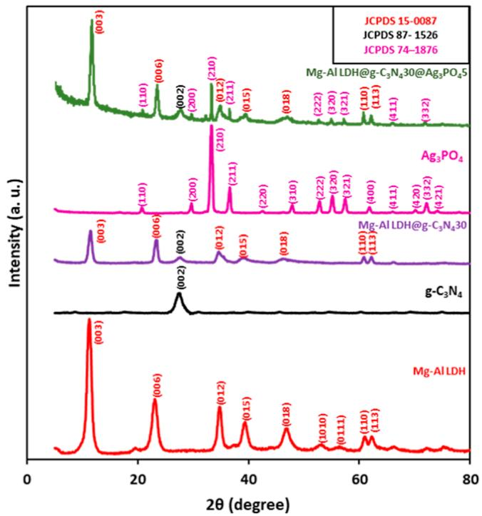

line

| 2θ (degree) | Intensity (a.u.) | Sample        |
|-------------|------------------|---------------|
| ~15         | (003)            | JCPDS 15-0087 |
| ~20         | (110)            | JCPDS 87-1526 |
| ~25         | (006)            | JCPDS 74-1876 |
| ~30         | (200)            | Mg-Al LDH@g-C₃N₄30@Ag₃PO₄5 |
| ~35         | (210)            | Ag₃PO₄        |
| ~40         | (211)            | Mg-Al LDH@g-C₃N₄30 |
| ~45         | (220)            | Ag₃PO₄        |
| ~50         | (310)            | Mg-Al LDH@g-C₃N₄30 |
| ~55         | (222)            | Ag₃PO₄        |
| ~60         | (320)            | Mg-Al LDH@g-C₃N₄30 |
| ~65         | (321)            | Ag₃PO₄        |
| ~70         | (110)            | Mg-Al LDH@g-C₃N₄30 |
| ~75         | (113)            | Ag₃PO₄        |
| ~80         | (118)            | Mg-Al LDH       |
| ~15         | (003)            | g-C₃N₄        |
| ~20         | (006)            | g-C₃N₄        |
| ~25         | (002)            | g-C₃N₄        |
| ~30         | (012)            | g-C₃N₄        |
| ~35         | (015)            | g-C₃N₄        |
| ~40         | (018)            | g-C₃N₄        |
| ~45         | (1010)           | g-C₃N₄        |
| ~50         | (1111)           | g-C₃N₄        |
| ~55         | (113)            | g-C₃N₄        |
| ~60         | (110)            | g-C₃N₄        |
| ~65         | (113)            | g-C₃N₄        |
| ~70         | (332)            | g-C₃N₄        |
| ~75         | (420)            | g-C₃N₄        |
| ~80         | (332)            | g-C₃N₄        |

Figure 3. XRD patterns of the synthesized samples.

42.47, 47.82, 52.87, 55.17, 57.37, 61.72, 70.47, 72.07, and 74.72°, which correspond, respectively, to the (110), (200), (210), (211), (220), (310), (222), (320), (321), (400), (420), (421), and (332) planes (JCPDS 74-1876).51 As seen in Figure 3, all three XRDs of primary constituents are present in the XRD pattern of Mg−Al LDH@g-C N 30@Ag PO 5, and it shows that the desired nanostructure is well synthesized.

The light absorption characteristics of semiconductor materials have a significant impact on their photocatalytic behavior. Also, the photo response range is a determining factor in the photocatalyst’s photodegradation efficiency. In this regard, the optical characteristics and energy band structures of the samples were studied using UV−vis diffuse reflectance spectroscopy (DRS). As stated in Figure 4f, $\mathrm { M g - A l }$ LDH was absorbed in the UV region only and exhibited a steep edge at about 260 nm. Charge transfer from the ligand to the metal causes a significant absorption band below 300 nm.52 This was expected, as this sample contains $\mathbf { M } ^ { 2 + }$ cations with ${ \bf d } ^ { 0 }$ electron configurations; hence, d−d transitions at visible wavelengths were impossible.53 As shown in Figure 4f, ${ \bf g } - { \bf \delta }$ ${ \mathrm { C } } _ { 3 } { \mathrm { N } } _ { 4 }$ and ${ \mathrm { A g } } _ { 3 } { \mathrm { P O } } _ { 4 }$ display a broad absorption in the spectral range visible with absorption edges located at 449 and 530 nm, respectively. The $\mathrm { g - C } _ { 3 } \mathrm { \bar { N } _ { 4 } }$ absorption band edge is assigned to the $\mathfrak { n } ^ { * }$ transitions caused by the nitrogen atoms in the triazine and heptazine rings, which possess lone pairs of electrons.54 Compared to LDH, the Mg−Al $\mathrm { L D H } @ \mathbf { g } – \mathbf { C } _ { 3 } \mathbf { N } _ { 4 } 3 0$ double composite exhibits a significant shift of the absorption edge toward longer wavelengths because the absorption band covers a more fantastic visible range because of the quantum confinement phenomenon of $\mathrm { g } – \mathrm { C } _ { 3 } \mathrm { N } _ { 4 }$ on Mg−Al LDH and indicates the strong coordination between two components.40

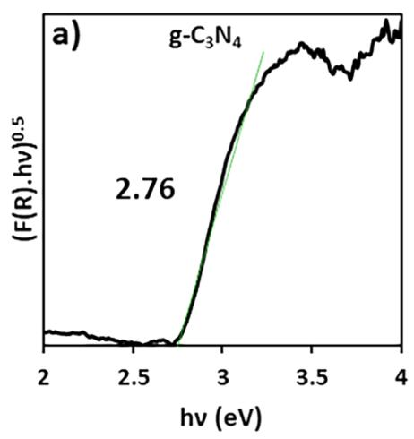

line

| hv (eV) | (F(R).hv)^0.5 |
| ------- | ------------- |
| 2.76    | 0.5           |

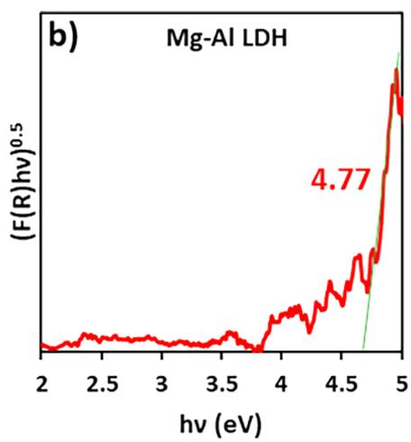

line

| hv (eV) | (F(R)hv)^0.5 |
| ------- | ------------ |
| 4.77    | 0.5          |

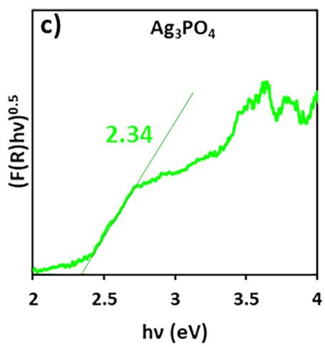

line

| hv (eV) | (F(R)ħv)^0.5 |
| ------- | ------------ |
| 2.34    | 2.34         |

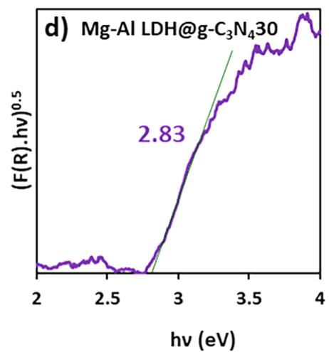

line

| hv (eV) | (F(R).hv)^0.5 |
| ------- | ------------- |
| 2.83    | 0.5           |

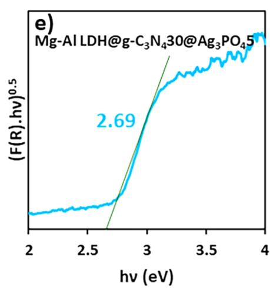

line

| hv (eV) | (F(R).hv)^0.5 |
| ------- | ------------- |
| 2.69    | 0.5           |

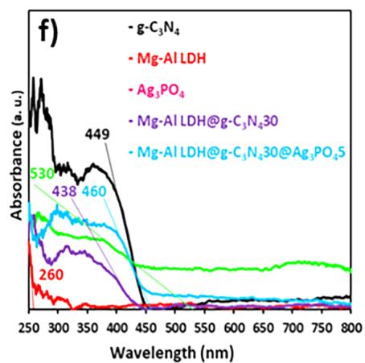

line

| Wavelength (nm) | g-C₃N₄ | Mg-Al LDH | Ag₃PO₄ | Mg-Al LDH@g-C₃N₄30 | Mg-Al LDH@g-C₃N₄30@Ag₃PO₄5 |
| --------------- | ------ | --------- | ------ | ------------------- | --------------------------- |
| 260             |        |           |        |                     |                             |
| 449             |        |           |        |                     |                             |
| 438             |        |           |        |                     |                             |
| 460             |        |           |        |                     |                             |
| 530             |        |           |        |                     |                             |

Figure 4. Tauc plots (a−e) and UV−vis DRS (f) of synthesized samples.

Upon the loading of ${ \mathrm { A g } } _ { 3 } { \mathrm { P O } } _ { 4 } ,$ the $\mathrm { M g - A l \ L D H } @ \mathrm { g - C _ { 3 } N } _ { 4 } 3 0 @$ ${ \mathrm { A g } } _ { 3 } { \mathrm { P O } } _ { 4 } 5$ composite possesses improved absorption in the visible spectrum as compared to the other three samples (Mg− Al LDH, $\mathrm { g - C _ { 3 } N _ { 4 } } ,$ and $\hat { \mathrm { M g - A l \ L D H } } @ \mathrm { g - C } _ { 3 } \mathrm { N } _ { 4 } 3 0 )$ . At present, to estimate the energy of band gap of the samples with DRS results, the functions of Kubelka−Munk (F(R)) and Tauc’s equation were used.55 Estimated band gap energies for pure g-C N , Mg−Al LDH, ${ \mathrm { A g } } _ { 3 } { \mathrm { P O } } _ { 4 } ,$ Mg−Al LDH@g-C N 30, and $\mathrm { M g - A l \ L D H } @ g . C _ { 3 } \mathrm { N } _ { 4 } 3 0 @ { \mathrm { A g } } _ { 3 } \mathrm { P O } _ { 4 } 5$ are 2.76, 4.77, 2.34, 2.83, and $2 . 6 9 \ \mathrm { e V } ,$ respectively (Figure 4a−e).

In order to survey and compare the electron−hole recombination and photocatalytic performance of the synthesized samples, the photoluminescence (PL) spectra were noted. Figure 5 shows the PL spectra of the synthesized materials. All of the samples were excited at 385 nm and room temperature, and the PL spectra were captured. According to Figure 5, Mg−Al LDH shows a very high-intensity peak. Because of the band−band PL incidence, $\bar { \bf g } { - } \bar { \bf C } _ { 3 } \mathrm { N } _ { 4 }$ displays a broad emission peak with a 450 nm central wavelength. The g-$\mathrm { C } _ { 3 } \mathrm { N } _ { 4 }$ band gap energy is about equivalent to this light energy. As indicated in Figure 5, because of the synergy of LDH and g-$\mathrm { C } _ { 3 } \mathrm { N } _ { 4 } ,$ the emission peaks of composites show a blue shift. As a consequence of the suppression of recombination of current carriers, primarily caused by the significant quantum confinement impact of highly distributed $\mathrm { g } – \mathrm { C } _ { 3 } \mathrm { N } _ { 4 }$ on Mg−Al LDH, the PL signal becomes significantly quenched.40 The maximum quenching is observed for $\mathrm { M g - A l \ L D H } @ \mathrm { g - C _ { 3 } N _ { 4 } } 3 0 @$ $\mathrm { A g } _ { 3 } \mathrm { P O } _ { 4 } 5 ,$ indicating that the rate at which electron−hole pairs produced by photons recombine is fiercely repressed. These observations indicate an improvement in photocatalytic performance. Among the binary composites, the $\operatorname { M g - A l }$ $\mathrm { L D H } @ \mathrm { g - } \mathrm { C } _ { 3 } \mathrm { N } _ { 4 } 4 0$ composite shows the highest intensity peak, virtually as intense as $\bar { \mathsf { g } } – \mathsf { C } _ { 3 } \mathsf { N } _ { 4 } . \mathsf { A }$ more significant concentration of $\mathrm { g } – \mathrm { C } _ { 3 } \mathrm { N } _ { 4 }$ can protect the active catalytic sites; it is known as the shielding effect.54

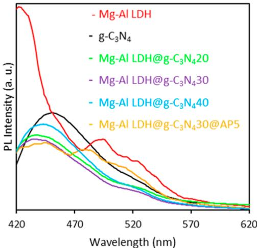

line

| Wavelength (nm) | Mg-Al LDH | g-C₃N₄ | Mg-Al LDH@g-C₃N₄20 | Mg-Al LDH@g-C₃N₄30 | Mg-Al LDH@g-C₃N₄40 | Mg-Al LDH@g-C₃N₄30@AP5 |
| --------------- | --------- | ------ | ------------------ | ------------------ | ------------------ | ------------------------ |
| 420             | High      | Low    | Low                | Low                | Low                | Low                      |
| 470             | Medium    | Peak   | Medium             | Medium             | Medium             | Medium                   |
| 520             | Low       | Low    | Low                | Low                | Low                | Low                      |
| 570             | Very Low  | Very Low | Very Low           | Very Low           | Very Low           | Very Low                 |
| 620             | Very Low  | Very Low | Very Low           | Very Low           | Very Low           | Very Low                 |

Figure 5. PL spectra of the synthesized samples.

To study the destiny and transfer of electrons generated by light, a set of photoelectrochemical characterizations were performed on the photocatalysts that intimately correlated to the photoactivity of photocatalysts.56 As shown in Figure 6, the cyclic voltammetry (CV) curves exhibit both anodic and cathodic peaks for each of the samples, which shows higher current density and faster electron transfer in the $\mathrm { M g - A l }$ $\mathrm { L D H } @ \mathrm { g } _ { - } \mathrm { C } _ { 3 } \mathrm { N } _ { 4 } 3 0 @ \mathrm { A g } _ { 3 } \mathrm { P O } _ { 4 } 5$ composite in front of $\mathrm { g } { \mathrm { - } } \mathrm { C } _ { 3 } \mathrm { N } _ { 4 } ,$ c.lo Mg−Al LDH, Mg−Al LDH@g- ${ \bf \bar { C } } _ { 3 } { \bf N } _ { 4 } 3 0 ,$ and $\mathrm { \bf A g } _ { 3 } \mathrm { P O } _ { 4 } \mathrm { \overline { { { \psi } } } } ^ { 5 7 }$ The redox reaction of $\mathrm { F e ( I I I ) / \bar { F e } ( I I ) }$ in the electrolyte is responsible for the observed peaks of oxidation and reduction in the cyclic voltammogram. For each sample, the anodic and cathodic peaks in CV demonstrate the current density of the redox reaction of $\mathrm { F e ( I I I ) / F e ( I I ) }$ , which indicates faster electron transport between the electrolyte and electrode interface. The preparation method of the electrodes and electrolyte in CV measurements is the same; therefore, the electron transfer rate of the electrode materials is related to the current density of the electrodes.58,59

As shown in Nyquist plots of the electrochemical impedance spectra (Figure 6b,c), the $\mathrm { M g - A l \ L D H } @ g . C _ { 3 } N _ { 4 } 3 0 @ \bar { \mathrm { A g } } _ { 3 } \mathrm { P O } _ { 4 } 5$ composite material exhibits a smaller semicircle at higher frequencies in comparison to Mg−Al LDH@g-C3N430, Mg− Al LDH, $\mathrm { g } { \mathrm { - } } \mathrm { C } _ { 3 } \mathrm { N } _ { 4 } ,$ and ${ \mathrm { A g } } _ { 3 } { \mathrm { P O } } _ { 4 }$ indicating a lower resistance for the transfer of charges in the Mg−Al LDH@g-C N 30@ $\mathrm { A g } _ { 3 } \mathrm { P O } _ { 4 } 5$ composite, which facilitates the transfer of charge 3 4 carriers.60 Additionally, Mg−Al $\mathrm { L D H } @ \mathbf { g } \mathbf { - } \mathbf { C } _ { 3 } \mathbf { N } _ { 4 } 3 0$ utilized in the synthesis of the primary Mg−Al $\mathrm { L D H } @ \mathrm { g } _ { - } \mathrm { C } _ { 3 } \mathrm { N } _ { 4 } 3 0 @$ $\mathrm { A g } _ { 3 } \mathrm { P O } _ { 4 } 5$ composite shows a smaller semicircle as compared to other mass combinations of $\mathrm { M g - A l \ L D H } @ g { \mathrm { - } } \mathrm { C } _ { 3 } \mathrm { N } _ { 4 } X \ ( X =$ 20 and 40). The EIS Nyquist plots (Figure 6d,e) obtained before illumination exhibit a larger semicircle at higher frequencies compared to the EIS Nyquist plots obtained under illumination (Figure 6b,c), indicating a higher chargetransfer resistance. Nyquist plots (Figure 6f) of Mg−Al LDH@ $\mathrm { g { - } C _ { 3 } N _ { 4 } } 3 0 @ \mathrm { A g _ { 3 } P O _ { 4 } } 5$ obtained before and after illumination are almost the same and show no difference in the amount of charge-transfer resistance.

The transient photocurrent responses of $\mathrm { { \bf M g - A l \ L D H } , }$ g-$\mathrm { C _ { 3 } N _ { 4 } , \ M g - A l { \ L D H } \ @ g - C _ { 3 } N _ { 4 } 3 0 , \ A g _ { 3 } P O _ { 4 } , }$ and the $\mathrm { M g - A l }$ $\mathrm { L D H } @ \mathrm { g } _ { - } \mathrm { C } _ { 3 } \mathrm { N } _ { 4 } 3 0 @ \mathrm { A g } _ { 3 } \mathrm { P O } _ { 4 } 5$ composite measured under in-off intermittent light irradiation are shown in Figure 6g. The high photocurrent density of the $\mathrm { M g - A l \ L D H } @ \bar { \mathrm { g - } } \mathrm { C } _ { 3 } \mathrm { N } _ { 4 } 3 0 \bar { \ @ }$ $\mathrm { A g } _ { 3 } \mathrm { P O } _ { 4 } 5$ composite is compared with the low photocurrent density of Mg−Al LDH, Mg−Al LDH@g-C N 30, and ${ \mathrm { A g } } _ { 3 } { \mathrm { P O } } _ { 4 } ,$ implying a longer lifetime for the photogenerated charge carriers.61 The polarization curves obtained through $\mathrm { L S V }$ in Figure 6h revealed an increase in the photocurrent density with an applied negative potential. The composite material exhibited a higher current density compared to those of $\mathrm { g - C _ { 3 } N _ { 4 ) } }$ , Mg−Al LDH, Mg−Al $\mathrm { L D H } @ \mathrm { g - C } _ { 3 } \mathrm { N } _ { 4 } 3 0 ,$ and $\mathrm { A g } _ { 3 } \mathrm { P O } _ { 4 } .$ . This enhanced current density can be attributed to the composite’s effective electron transport mechanism, indicating its enhanced photoactivity.62 These findings suggest that the composite possesses favorable characteristics, including a large surface area, abundant active sites for redox reactions, and a reduced charge-transfer resistance. As a result, the generation and transportation of charge carriers to the electrolyte under light illumination are facilitated.63,64 The above observation cooperatively validates that the Mg−Al $\mathrm { L D H } @ \mathrm { g } _ { - } \mathrm { C } _ { 3 } \mathrm { N } _ { 4 } 3 0 @ \mathrm { A g } _ { 3 } \mathrm { P O } _ { 4 } 5$ composited from $\mathrm { M g - A l \ L D H , }$ $\mathrm { M g - A l \ L D H } @ \mathrm { g - } \mathrm { C } _ { 3 } \mathrm { N } _ { 4 } 3 0 _ { \mathrm { i } }$ , and ${ \mathrm { A g } } _ { 3 } { \mathrm { P O } } _ { 4 }$ aids in facilitating the efficacious transferring and separating charge carriers, thus enhancing the efficiency of the photocatalytic activity.

The diagrams in Figure 7a−d depict the Bode phase and Bode magnitude plot, respectively, which displays the change in phase angle for frequency, and the Bode magnitude plot illustrates the changes in impedance magnitude (|Z|) to frequency. The measurements were taken in an aqueous electrolyte with a 1:1 ratio of 0.01 M $\mathrm { K } _ { 3 } [ \mathrm { F e } \ ( \mathrm { C N } ) _ { 6 } ]$ and $\mathrm { K _ { 4 } [ F }$ e $\left( \mathrm { C N } \right) _ { 6 } ]$ under light and across a frequency span of 1 to $1 0 ^ { 5 }$ Hz. The data was obtained from EIS, Figure $^ { 6 , }$ in the manuscript. Using the fm value obtained from the Bode phase plot, which represents the frequency at which the maximum phase angle occurs, the characteristic lifetime of electrons (τ) can be calculated as $\displaystyle \big ( \tau = 1 / 2 \pi f m \big ) . ^ { 6 5 }$ The electron lifetime values for the $\mathrm { M g - A l }$ LDH@g-C3N430@Ag3PO45, Mg−Al LDH@g-$\mathrm { C } _ { 3 } \mathrm { N } _ { 4 } 3 0 ,$ , Mg−Al LDH, $\mathrm { g } { \mathrm { - } } \mathrm { C } _ { 3 } \mathrm { N } _ { 4 } ,$ and ${ \mathrm { A g } } _ { 3 } { \mathrm { P O } } _ { 4 }$ photoanodes were found to be $5 8 , 0 . 6 , 0 . 4 , 1 ,$ and 1 ms, respectively. The threecomponent nanocomposite exhibited greater electron lifetime (τ) values, which suggests a reduced rate of charge carrier recombination within these materials.66,67

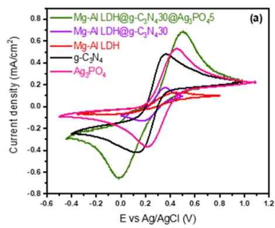

line

| E vs Ag/AgCl (V) | Mg-Al LDH@g-C₃N₄30@Ag₃PO₄5 | Mg-Al LDH@g-C₃N₄30 | Mg-Al LDH | g-C₃N₄ | Ag₃PO₄ |
| ---------------- | -------------------------- | ------------------- | --------- | ------ | ------ |
| -0.6             | -0.8                       | -0.2                | -0.1      | -0.3   | -0.1   |
| -0.4             | -0.6                       | 0.0                 | 0.0       | -0.2   | 0.0    |
| -0.2             | -0.4                       | 0.1                 | 0.1       | -0.1   | 0.1    |
| 0.0              | -0.2                       | 0.2                 | 0.2       | 0.0    | 0.2    |
| 0.2              | 0.0                        | 0.3                 | 0.3       | 0.1    | 0.3    |
| 0.4              | 0.2                        | 0.4                 | 0.4       | 0.2    | 0.4    |
| 0.6              | 0.4                        | 0.5                 | 0.5       | 0.3    | 0.5    |
| 0.8              | 0.6                        | 0.6                 | 0.6       | 0.4    | 0.6    |
| 1.0              | 0.8                        | 0.7                 | 0.7       | 0.5    | 0.7    |
| 1.2              | 1.0                        | 0.8                 | 0.8       | 0.6    | 0.8    |

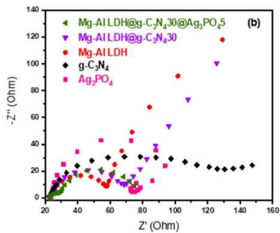

scatter

| Catalyst | Z' (Ohm) | -Z'' (Ohm) |
| -------- | -------- | ---------- |
| Mg-AILDH@g-C₃N₄30@Ag₃PO₄·5 | ~20-140 | ~0-120 |
| Mg-AILDH@g-C₃N₄30 | ~60-120 | ~20-100 |
| Mg-AILDH | ~60-120 | ~20-120 |
| g-C₃N₄ | ~20-140 | ~0-25 |
| Ag₃PO₄ | ~20-140 | ~0-40 |

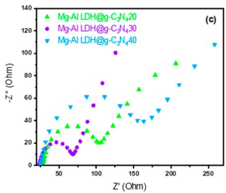

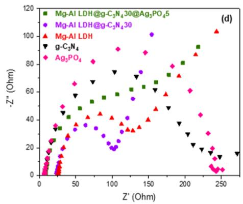

scatter

| Catalyst | Z' (Ohm) | -Z'' (Ohm) |
| -------- | -------- | ---------- |
| Mg-Al LDH@g-C₃N₄30@Ag₃PO₄5 | ~10-250 | ~0-100 |
| Mg-Al LDH@g-C₃N₄30 | ~10-250 | ~0-100 |
| Mg-Al LDH | ~10-250 | ~0-100 |
| g-C₃N₄ | ~10-250 | ~0-100 |
| Ag₃PO₄ | ~10-250 | ~0-100 |

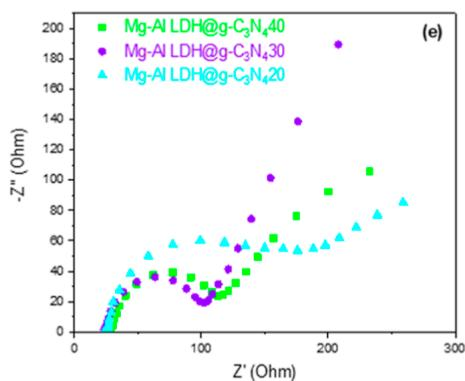

scatter

| Z' (Ohm) | -Z'' (Ohm) | Series                  |
| -------- | ---------- | ----------------------- |
| ~20      | ~10        | Mg-Al LDH@g-C₃N₄40     |
| ~50      | ~30        | Mg-Al LDH@g-C₃N₄40     |
| ~70      | ~40        | Mg-Al LDH@g-C₃N₄40     |
| ~90      | ~20        | Mg-Al LDH@g-C₃N₄30     |
| ~110     | ~30        | Mg-Al LDH@g-C₃N₄30     |
| ~130     | ~60        | Mg-Al LDH@g-C₃N₄30     |
| ~150     | ~80        | Mg-Al LDH@g-C₃N₄30     |
| ~170     | ~100       | Mg-Al LDH@g-C₃N₄30     |
| ~190     | ~140       | Mg-Al LDH@g-C₃N₄30     |
| ~210     | ~180       | Mg-Al LDH@g-C₃N₄30     |
| ~230     | ~100       | Mg-Al LDH@g-C₃N₄20     |
| ~250     | ~80        | Mg-Al LDH@g-C₃N₄20     |
| ~270     | ~60        | Mg-Al LDH@g-C₃N₄20     |
| ~290     | ~40        | Mg-Al LDH@g-C₃N₄20     |

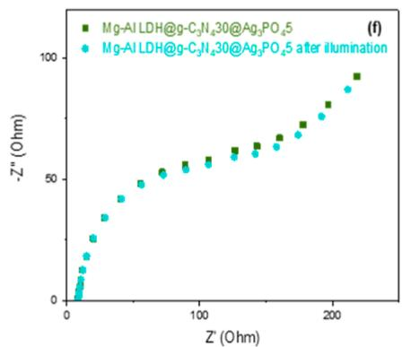

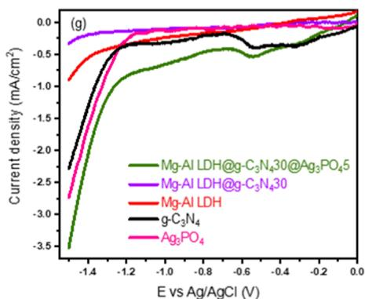

line

| E vs Ag/AgCl (V) | Mg-Al LDH@g-C₃N₄30@Ag₃PO₄5 | Mg-Al LDH@g-C₃N₄30 | Mg-Al LDH | g-C₃N₄ | Ag₃PO₄ |
| ---------------- | -------------------------- | ------------------- | --------- | ------ | ------ |
| -1.4             | -2.8                       | -0.2                | -0.6      | -2.5   | -2.7   |
| -1.2             | -1.5                       | -0.1                | -0.3      | -1.2   | -1.4   |
| -1.0             | -0.8                       | 0.0                 | 0.0       | -0.6   | -0.7   |
| -0.8             | -0.5                       | 0.0                 | 0.0       | -0.3   | -0.4   |
| -0.6             | -0.3                       | 0.0                 | 0.0       | 0.0    | -0.2   |
| -0.4             | -0.1                       | 0.0                 | 0.0       | 0.0    | 0.0    |
| -0.2             | 0.0                        | 0.0                 | 0.0       | 0.0    | 0.0    |
| 0.0              | 0.0                        | 0.0                 | 0.0       | 0.0    | 0.0    |

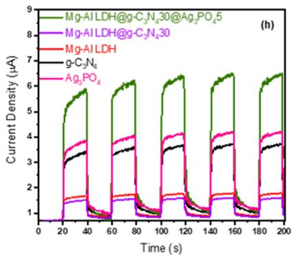

line

| Time (s) | Mg-AlLDH@g-C₃N₄·30@Ag₃PO₄·5 | Mg-AlLDH@g-C₃N₄·30 | Mg-AlLDH | g-C₃N₄ | Ag₃PO₄ |
| -------- | ----------------------------- | ------------------- | -------- | ------ | ------ |
| 0        | 1.0                           | 1.0                 | 1.0      | 1.0    | 1.0    |
| 20       | 5.5                           | 1.5                 | 1.5      | 3.0    | 3.5    |
| 40       | 6.0                           | 1.5                 | 1.5      | 3.5    | 4.0    |
| 60       | 6.0                           | 1.5                 | 1.5      | 3.5    | 4.0    |
| 80       | 6.0                           | 1.5                 | 1.5      | 3.5    | 4.0    |
| 100      | 6.0                           | 1.5                 | 1.5      | 3.5    | 4.0    |
| 120      | 6.0                           | 1.5                 | 1.5      | 3.5    | 4.0    |
| 140      | 6.0                           | 1.5                 | 1.5      | 3.5    | 4.0    |
| 160      | 6.0                           | 1.5                 | 1.5      | 3.5    | 4.0    |
| 180      | 6.0                           | 1.5                 | 1.5      | 3.5    | 4.0    |
| 200      | 6.0                           | 1.5                 | 1.5      | 3.5    | 4.0    |

Figure 6. (a) CV curves, (b,c) EIS Nyquist plots, (d,e) EIS Nyquist plots obtained before illumination, with (f) corresponding to the afterilluminated state, (g) LSV transient photocurrent responses of Mg−Al LDH, Mg−Al LDH@g- $\mathrm { . C _ { 3 } N _ { 4 } 3 0 , g { \mathrm { - } } C _ { 3 } N _ { 4 } , A g _ { 3 } P O _ { 4 } , }$ and the Mg−Al LDH@g-$\mathrm { C } _ { 3 } \mathrm { N } _ { 4 } 3 0 @ \mathrm { A g } _ { 3 } \mathrm { P O } _ { 4 } 5$ nanocomposite, (h).

3.2. Photocatalysis. The effect of the existence of $\mathrm { M g - A l }$ LDH, ${ \bf g } – { \bf C } _ { 3 } { \bf N } _ { 4 }$ , Mg−Al LDH@g- ${ \mathrm { . C } } _ { 3 } { \mathrm { N } } _ { 4 } X ,$ and the Mg−Al

$\mathrm { L D H } @ \mathrm { g } _ { - } \mathrm { C } _ { 3 } \mathrm { N } _ { 4 } X @ \mathrm { A g } _ { 3 } \mathrm { P O } _ { 4 } Y$ composite on photocatalytic decomposition of MB under irradiation with visible light was investigated. Figure 8 (and Figure S4) depicts the photocatalytic breakdown of MB after 45 min of exposure to visible light. In order to achieve an equilibrium between the molecules of dye and the photocatalyst, the MB solutions were magnetically agitated for 15 min in the dark before beginning the catalyzed degradation reactions. As shown in Figure $^ { 8 , }$ the surface adsorption of dye by Mg−Al LDH, $\mathrm { g - C _ { 3 } N _ { 4 } , \ M g { - } A l }$ $\mathrm { L D H } @ \mathrm { g - } \mathrm { C } _ { 3 } \mathrm { N } _ { 4 } 2 0 .$ , Mg−Al LDH@g- $\mathrm { C } _ { 3 } \mathrm { N } _ { 4 } 3 0 ,$ , Mg−Al LDH@g-$\mathrm { C _ { 3 } N _ { 4 } 4 0 , ~ M g - A l ~ \ L D H } @ \mathrm { g - C _ { 3 } N _ { 4 } } \bar { 3 } 0 @ \mathrm { A g _ { 3 } P O } _ { 4 } 5 ,$ and Mg−Al LD $\mathrm { H } @ \mathrm { g - } \mathrm { C } _ { 3 } \mathrm { N } _ { 4 } 3 0 @ \mathrm { A g } _ { 3 } \mathrm { P O } _ { 4 } 1 0$ is recorded as 7, 80, 42, 51, $4 2 , 4 3 ,$ , and 33%, respectively. Following 45 min of visible light irradiation, the color removal percentages escalate to 26, 92, 61, 82, 75, 99, and 75%, respectively. These results highlight the distinctive photocatalytic degradation potential exhibited by each sample. The MB removal percentage in the presence of Mg−Al LDH is relatively low. On the other hand, although the percentage of dye removal is high in the presence of $\mathrm { g } – \mathrm { C } _ { 3 } \mathrm { N } _ { 4 } , \mathrm { g } –$ $\bar { \bf C } _ { 3 } \mathrm { N } _ { 4 }$ primarily acts as an adsorbent. The high adsorption of MB by $\mathrm { g - C } _ { 3 } \mathrm { N } _ { 4 }$ depends on the surface area and negative surface charge of $\mathrm { g } { \bar { \mathbf { C } } } _ { 3 } \mathrm { N } _ { 4 } ,$ leading to the adsorption of cationic pollutant MB through electrostatic interactions. As shown in Figure $^ { 8 , }$ in the presence of $\mathrm { g - C } _ { 3 } \mathrm { N } _ { 4 } ,$ the concentration of MB remains almost constant after the dark period and under light irradiation, and $\mathrm { g } – \mathrm { C } _ { 3 } \mathrm { N } _ { 4 }$ remains in the reaction vessel as a blue sludge due to the absorption of MB at the end of the reaction. This observation emphasizes that in the presence of g- ${ \mathrm { . C } } _ { 3 } { \mathrm { N } } _ { 4 } ,$ mainly the adsorption process occurs, and the photocatalytic degradation is negligible; in contrast, $\mathrm { M g - A l \ L D H } @ \mathrm { g - } \mathrm { C } _ { 3 } \dot { \mathrm { N } } _ { 4 } X$ nanocomposites exhibit more photocatalytic activity within the same time. $\mathrm { M g - A l \ L D H } @ \mathrm { g - C _ { 3 } N } _ { 4 } X \left( X = 2 0 , 3 0 \right.$ , and 40 wt %) eliminates about 61, 82, and 75% of MB at the maximum point (45 min), respectively. Given this, the increase in the photocatalytic function of composites is in light of the combination of two components. Furthermore, the $\mathrm { g - C } _ { 3 } \mathrm { N } _ { 4 }$ weight percentage is an essential variable determining the photocatalytic effectiveness of the nanocomposites. Upping the $\mathrm { g - C } _ { 3 } \mathrm { N } _ { 4 }$ content to 30% from 20% leads to an improvement in the efficiency of MB degradation. However, increasing the concentration of $\mathrm { g - C } _ { 3 } \mathrm { N } _ { 4 }$ to 40% lacks an effect in enhancing the photocatalytic function. Owing to this, the best $\mathrm { g - C } _ { 3 } \mathrm { N } _ { 4 }$ content for nanocomposite is 30 wt %. By addition of ${ \mathrm { A g } } _ { 3 } { \mathrm { P O } } _ { 4 } ,$ the MB degradation efficiency increases. The Mg−Al LDH@g-$\mathrm { C } _ { 3 } \mathrm { N } _ { 4 } 3 0 @ \bar { \mathrm { A g } } _ { 3 } \mathrm { P O } _ { 4 } 5$ nanocomposite is the optimal photocatalyst, and it can provide 99% MB degradation efficiency under the illumination of visible light in 45 min. The completely clear solution and the absence of MB particles on the catalyst surface after the reaction in the presence of Mg−Al $\mathrm { L D H } @ \mathbf { g } _ { - } \mathbf { C } _ { 3 } \mathrm { N } _ { 4 } \mathbf { X } @ \mathbf { A } \mathbf { g } _ { 3 } \mathrm { P O } _ { 4 } \bar { \mathbf { S } }$ confirm the photocatalytic degradation of MB by $\mathrm { \bar { M g } - A l \ L D H { @ g - C _ { 3 } } \bar { N } _ { 4 } X { @ A g _ { 3 } } \bar { P } O _ { 4 } } 5 .$ . The changes in the absorbance of the MB solution after its reaction with prepared compounds under the influence of visible light are illustrated in Figure S5. In addition, in order to research the impact of dye surface absorption and desorption, the absorption of MB by pure Mg−Al LDH, pure $\mathrm { } _ { 5 } \mathrm { - } \mathrm { C } _ { 3 } \mathrm { N } _ { 4 } ,$ and

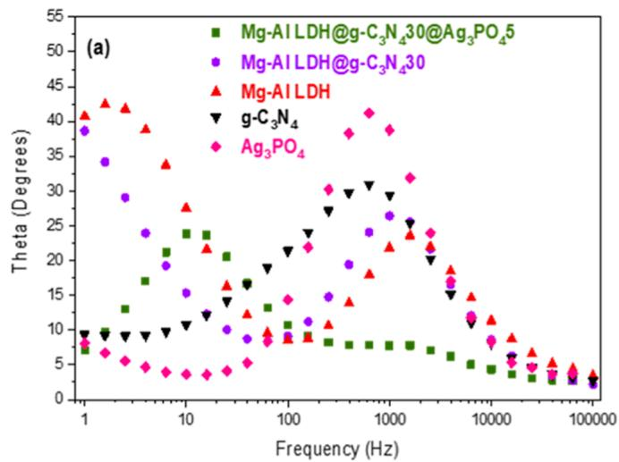

scatter

| Frequency (Hz) | Mg-Al LDH@g-C₃N₄30@Ag₃PO₄5 | Mg-Al LDH@g-C₃N₄30 | Mg-Al LDH | g-C₃N₄ | Ag₃PO₄ |
| -------------- | -------------------------- | ------------------- | --------- | ------ | ------ |
| 1              | 8                          | 38                  | 41        | 9      | 7      |
| 2              | 10                         | 34                  | 42        | 8      | 6      |
| 5              | 12                         | 29                  | 40        | 8      | 5      |
| 10             | 16                         | 24                  | 35        | 10     | 4      |
| 20             | 20                         | 19                  | 28        | 12     | 3      |
| 50             | 24                         | 15                  | 22        | 16     | 2      |
| 100            | 28                         | 11                  | 18        | 20     | 1      |
| 200            | 32                         | 9                   | 15        | 24     | 0.5    |
| 500            | 36                         | 7                   | 12        | 28     | 0.3    |
| 1000           | 40                         | 5                   | 10        | 32     | 0.2    |
| 2000           | 44                         | 3                   | 8         | 36     | 0.1    |
| 5000           | 48                         | 2                   | 6         | 40     | 0.05   |
| 10000          | 52                         | 1                   | 4         | 44     | 0.03   |
| 20000          | 56                         | 0.5                 | 2         | 48     | 0.02   |
| 50000          | 60                         | 0.3                 | 1         | 52     | 0.01   |
| 100000         | 64                         | 0.2                 | 0.5       | 56     | 0.005  |

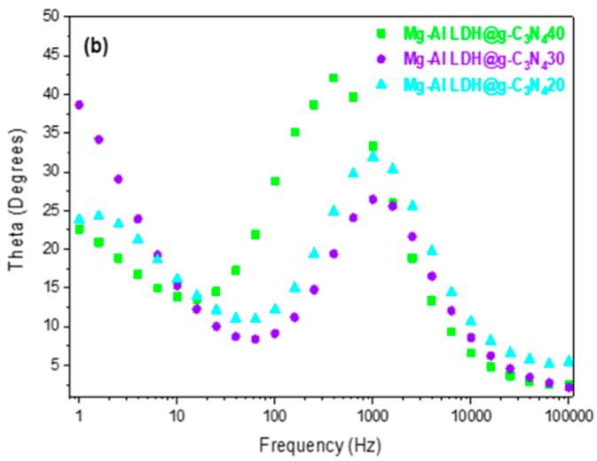

scatter

| Frequency (Hz) | Mg-Al LDH@g-C₃N₄0 Theta (Degrees) | Mg-Al LDH@g-C₃N₄30 Theta (Degrees) | Mg-Al LDH@g-C₃N₄20 Theta (Degrees) |
| -------------- | ---------------------------------- | ----------------------------------- | ------------------------------------ |
| 1              | 23                                 | 38                                  | 24                                   |
| 2              | 21                                 | 34                                  | 23                                   |
| 5              | 19                                 | 29                                  | 22                                   |
| 10             | 17                                 | 24                                  | 16                                   |
| 20             | 15                                 | 20                                  | 14                                   |
| 50             | 13                                 | 16                                  | 12                                   |
| 100            | 11                                 | 14                                  | 10                                   |
| 200            | 9                                  | 12                                  | 8                                    |
| 500            | 7                                  | 10                                  | 6                                    |
| 1000           | 5                                  | 8                                   | 4                                    |
| 2000           | 3                                  | 6                                   | 3                                    |
| 5000           | 2                                  | 4                                   | 2                                    |
| 10000          | 1                                  | 2                                   | 1                                    |
| 20000          | 1                                  | 1                                   | 1                                    |
| 50000          | 1                                  | 1                                   | 1                                    |
| 100000         | 1                                  | 1                                   | 1                                    |

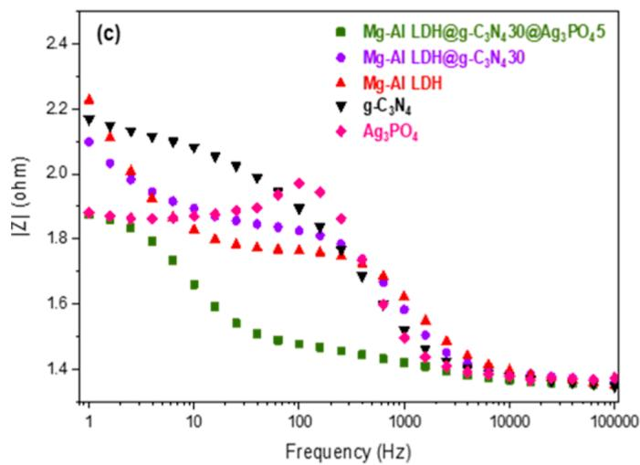

scatter

| Frequency (Hz) | Mg-Al LDH@g-C₃N₄30@Ag₃PO₄5 | Mg-Al LDH@g-C₃N₄30 | Mg-Al LDH | g-C₃N₄ | Ag₃PO₄ |
| -------------- | -------------------------- | ------------------- | --------- | ------ | ------ |
| 1              | 2.2                        | 2.1                 | 2.2       | 2.2    | 1.9    |
| 10             | 1.8                        | 1.9                 | 1.9       | 2.1    | 1.8    |
| 100            | 1.6                        | 1.8                 | 1.8       | 2.0    | 1.9    |
| 1000           | 1.4                        | 1.7                 | 1.7       | 1.8    | 1.7    |
| 10000          | 1.4                        | 1.4                 | 1.4       | 1.4    | 1.4    |
| 100000         | 1.4                        | 1.4                 | 1.4       | 1.4    | 1.4    |

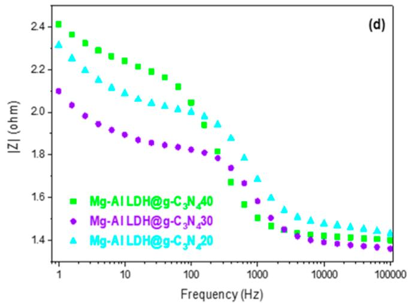

scatter

| Frequency (Hz) | Mg-Al LDH@g-C₃N₄40 (Z) | Mg-Al LDH@g-C₃N₄30 (Z) | Mg-Al LDH@g-C₃N₄20 (Z) |
| -------------- | ------------------------ | ------------------------ | ------------------------ |
| 1              | 2.4                      | 2.1                      | 2.3                      |
| 10             | 2.3                      | 1.95                     | 2.15                     |
| 100            | 2.1                      | 1.85                     | 2.0                      |
| 1000           | 1.6                      | 1.5                      | 1.7                      |
| 10000          | 1.4                      | 1.4                      | 1.5                      |
| 100000         | 1.4                      | 1.4                      | 1.4                      |

Figure 7. Bode phase (a,b) and Bode magnitude (c,d) plots acquired from EIS measurements for the photoanodes in their as-prepared state.   
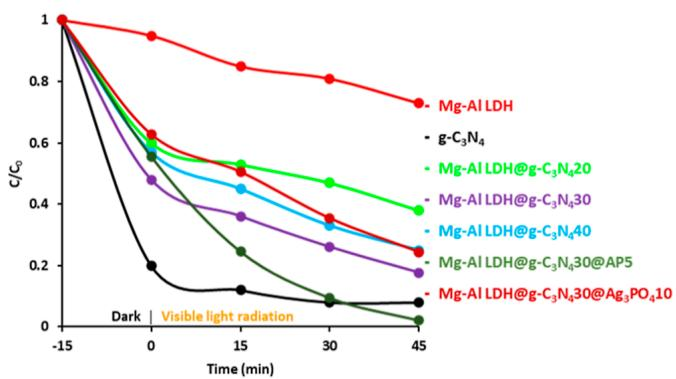

line

| Time (min) | Mg-Al LDH | g-C₃N₄ | Mg-Al LDH@g-C₃N₄20 | Mg-Al LDH@g-C₃N₄30 | Mg-Al LDH@g-C₃N₄40 | Mg-Al LDH@g-C₃N₄30@AP5 | Mg-Al LDH@g-C₃N₄30@Ag₃PO₄10 |
| ---------- | --------- | ------ | ------------------ | ------------------ | ------------------ | ------------------------ | ----------------------------- |
| -15        | 1.0       | 1.0    | 1.0                | 1.0                | 1.0                | 1.0                      | 1.0                           |
| 0          | 0.9       | 0.6    | 0.6                | 0.5                | 0.5                | 0.5                      | 0.6                           |
| 15         | 0.8       | 0.2    | 0.5                | 0.4                | 0.4                | 0.3                      | 0.5                           |
| 30         | 0.7       | 0.1    | 0.4                | 0.3                | 0.3                | 0.2                      | 0.4                           |
| 45         | 0.7       | 0.1    | 0.4                | 0.2                | 0.2                | 0.1                      | 0.3                           |

Figure 8. Photocatalytic efficacy of the prepared compounds.

Mg−Al $\mathrm { L D H } @ \mathrm { g } . \mathrm { C } _ { 3 } \mathrm { N } _ { 4 } 3 0 @ \mathrm { A g } _ { 3 } \mathrm { P O } _ { 4 } 5$ was investigated in the absence of light. The UV−visible absorption spectra of MB dye after 60 min in dark conditions are shown in Figure S6. Based on observations, the surface absorption of MB by $\operatorname { M g - A l }$ $\mathrm { L D H } @ \mathrm { g } . \mathrm { C } _ { 3 } \mathrm { N } _ { 4 } 3 0 @ \mathrm { A g } _ { 3 } \mathrm { P O } _ { 4 } 5 ,$ , pure Mg−Al LDH, and pure g-$\mathrm { C } _ { 3 } \mathrm { N } _ { 4 }$ is about 43, 7, and 88%, respectively. $\mathrm { g } – \mathrm { C } _ { 3 } \mathrm { N } _ { 4 }$ has a high absorption potential for dye removal, while $\mathrm { M g - A l }$ LDH absorbs a low percentage of dye. In the presence of $\mathrm { \bf { g } } { \mathrm { - } } \mathrm { \bf { C } } _ { 3 } \mathrm { \bf { N } } _ { 4 } ,$ the characteristics of Mg−Al LDH ’s absorption are enhanced.

One of the parameters that must be studied in photocatalytic reactions is the amount of photocatalyst used. At the saturation level, the photon absorption coefficient does not increase with an increasing catalyst dosage. The active surface of the reaction decreases due to the covering of active sites by extra photocatalyst particles, ultimately reducing the photocatalytic activity. Thus, the highest effectiveness can be observed with a particular quantity of the photocatalyst. In this study, 10 ppm MB solution was photocatalytically degraded in the presence of 0.3, 0.5, and 0.7 g of Mg−Al $\mathrm { L D } \mathrm { \bar { H } } @ \mathrm { g } . \mathrm { C } _ { 3 } \mathrm { N } _ { 4 } 3 0 \mathrm { \bar { \ @ } } \mathrm { A g } _ { 3 } \mathrm { P O } _ { 4 } 5 .$ . According to Figure 9 (and Figure S7), the proper amount of the photocatalyst for MB removal was determined to be 0.5 g of the nanocomposite. Figure S8 shows the absorption changes in the MB concentration in different dosages of the prepared nanocomposite.

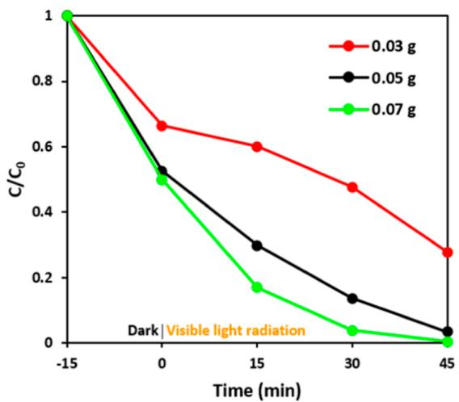

line

| Time (min) | 0.03 g | 0.05 g | 0.07 g |
| ---------- | ------ | ------ | ------ |
| -15        | 1.0    | 1.0    | 1.0    |
| 0          | 0.67   | 0.52   | 0.50   |
| 15         | 0.60   | 0.30   | 0.18   |
| 30         | 0.48   | 0.14   | 0.04   |
| 45         | 0.28   | 0.03   | 0.01   |

Figure 9. Effects of the amount of Mg−Al LDH@g-C3N430@ ${ \mathrm { A g } } _ { 3 } { \mathrm { P O } } _ { 4 } 5$ for MB decomposition.

The pH of the reaction medium is another effective parameter in photocatalytic processes. In fact, due to various surface properties, each semiconductor has a different activity at a different $\mathrm { p H } . ^ { 6 8 }$ Three 40 mL solutions containing ten ppm of MB were prepared for this purpose. The pH of the solutions was set to 3 (acidic), 7 (neutral), and 11 (basic) to determine the optimum pH for MB photocatalytic decomposition. Figure 10 (and Figure S9) illustrates the results. Considering Figure 10, the pH value confirmed that the maximum degradation of MB was 11. The results of the zeta potential test show that at $\mathrm { p H } = 3 ,$ , the nanocomposite shows a positive surface charge and a negative 1 at pH = 11 (Figure S10). The positively charged surface of the nanocomposite, along with the presence of positively charged hydronium ions at acidic pH, leads to repulsion among the nanocomposite, MB, and hydronium ions. As a result, this repulsion reduces MB absorption of the photocatalyst. That is why the degradation of MB at pH = 3 is less significant compared to $\mathrm { \ p H } \stackrel { \sim } { = } 7$ and 11. Figure 10 verifies

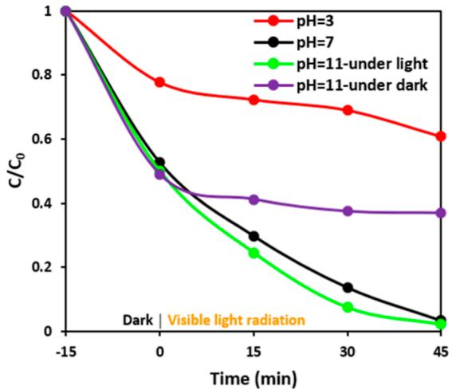

line

| Time (min) | pH=3  | pH=7  | pH=11-under light | pH=11-under dark |
| ---------- | ----- | ----- | ----------------- | ---------------- |
| -15        | 1.0   | 1.0   | 1.0               | 1.0              |
| 0          | 0.8   | 0.5   | 0.5               | 0.5              |
| 15         | 0.7   | 0.3   | 0.25              | 0.4              |
| 30         | 0.65  | 0.15  | 0.05              | 0.35             |
| 45         | 0.6   | 0.0   | 0.0               | 0.35             |

Figure 10. Impact of pH on MB dye degradation by photocatalysis.

this conclusion by describing the least amount of dye decomposition at a pH of 3. Two things stand out in Figure 11. First, MB adsorption on the nanocomposite is lower under acidic conditions. Since MB, hydronium ions, and the positively charged surface of the nanocomposite repel each other, this prevents MB from sticking to the catalytic surface. Second, because positive charges repel each other in an acidic solution, MB is less likely to adsorb, even under dark conditions. Considering the importance of absorption in pollutant decomposition, MB absorption was investigated in dark conditions at optimal pH and catalyst dosage (pH 11, 0.05 g photocatalyst). In this condition, 62% of dye absorption occurred. The high adsorption of MB is due to its cationic nature and the negative surface charge of the nanocomposite, which promotes cationic MB adsorption on the nanocomposite surface. Figure 10 illustrates how the nanocomposite’s surface charges affect dye absorption. The UV− visible absorption spectra of $\mathrm { M g - A l \ L D H } @ \mathrm { g - C _ { 3 } N _ { 4 } } 3 0 @$ $\mathrm { A g } _ { 3 } \mathrm { P O } _ { 4 } 5$ nanocomposites for MB decomposition in the presence of light at three different pH values and dark conditions at optimal pH are shown in Figure S11.

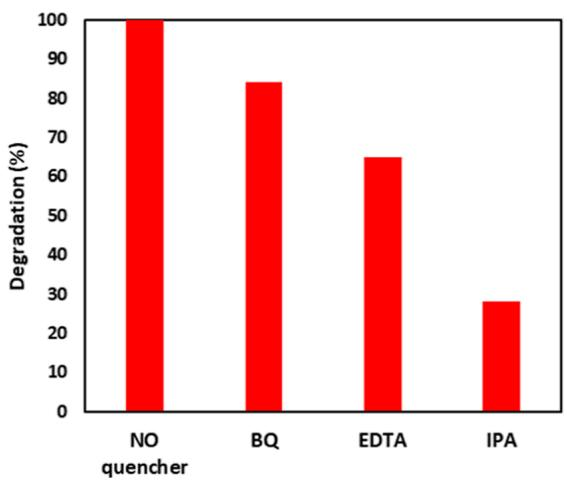

bar

| Quencher Type | Degradation (%) |
| :--- | :--- |
| NO quencher | 100 |
| BQ | 84 |
| EDTA | 65 |
| IPA | 28 |

Figure 11. Effects of different scavengers on the decomposition of MB paint by the $\operatorname { M g - A l }$ LDH@g-C3N430@Ag3PO45 nanocomposite after 45 min of exposure to visible light.

Total organic carbon (TOC) estimation was used to determine the mineralization efficiency. The maximum TOC removal efficiency was 88%, and the MB removal efficiency was 99%. Therefore, the MB dye was mineralized at a high percentage. The outcomes are displayed in Table 1.

Table 1. MB and TOC Removal Efficiency (%) under Light Irradiation 

<table><tr><td colspan="3">MB</td><td colspan="3">TOC</td></tr><tr><td>initial (mg/L)</td><td>final (mg/L)</td><td>efficacy of degradation (%)</td><td>initial (mg/L)</td><td>final (mg/L)</td><td>TOC removal efficiency (%)</td></tr><tr><td>10</td><td>0.1</td><td>99</td><td>3.51</td><td>0.42</td><td>88</td></tr></table>

The stability of the nanocomposite structure after photocatalytic processes was investigated by XRD pattern and FE-SEM images of the Mg−Al $\mathrm { L D H } @ \mathrm { g } _ { - } \mathrm { C } _ { 3 } \mathrm { N } _ { 4 } 3 0 @ \mathrm { A g } _ { 3 } \mathrm { P O } _ { 4 } 5$ nanocomposite. The obtained results confirm its structural and morphological stability (Figure S12).

To elucidate the photodegradation mechanism of MB, we identified the key oxidants participating in the process. In this regard, the produced oxidants were trapped and measured using IPA, EDTA-2Na, and BQ, which act as scavengers of hydroxyl radicals, holes, and superoxide radical anions $\bar { ( \mathrm { O } _ { 2 } \cdot ^ { - } ) }$ , respectively. According to Figure 11, adding IPA significantly lowers the rate of MB photodegradation by the ideal nanocomposite; meanwhile, BQ and EDTA-2Na are more ineffective when added. As a result, all three components are active species in catalytic dye photodegradation. From the electronic point of view, the valence band (VB) electrons travel to the conduction band (CB) when photons with energies equal to or over the band gap are absorbed, and holes are also created in the VB at the exact moment. The results of the scavenger experiments show that the active species, hydroxyl radical, hole, and superoxide ion, were involved in the degradation of MB to the mineralized products. Based on this, and with the help of VB and CB calculations of $\operatorname { M g - A l }$ LDH, $\mathrm { g } – \mathrm { C } _ { 3 } \mathrm { N } _ { 4 } 3 0 ,$ , and ${ \mathrm { A g } } _ { 3 } { \mathrm { P O } } _ { 4 } ,$ a possible photocatalytic decomposition mechanism of MB by Mg−Al LDH@g-$\mathrm { C } _ { 3 } \mathrm { N } _ { 4 } 3 0 @ \mathrm { A g } _ { 3 } \mathrm { P O } _ { 4 } 5$ is proposed in Figure 12. Equations 2 and 3 were used to determine the compound’s CB and VB potential values, where X is the absolute electronegativity (Mulliken) of material atoms, which can be defined as the geometric mean of their absolute electronegativity. In other words, the arithmetic mean of the initial ionization energy and the atomic electron affinity is defined as X (eq 4). $E _ { \mathrm { e } }$ and $E _ { \mathrm { g } }$ represent hydrogen-scale free electron energy $\left( \sim 4 . 5 0 ~ \mathrm { e V } \right)$ and band gap energy, respectively,69

$$
E _ {\mathrm{CB}} = X - E _ {\mathrm{e}} - 0. 5 E _ {\mathrm{g}} \tag {2}
$$

$$
E _ {\mathrm{VB}} = E _ {\mathrm{CB}} + E _ {\mathrm{g}} \tag {3}
$$

$$
X = 0. 5 \left(E _ {\mathrm{EA}} + E _ {\mathrm{ion}}\right) \tag {4}
$$

As a result of irradiation from a visible light source, electrons are excited on $\mathrm { g } – \mathrm { C } _ { 3 } \mathrm { N } _ { 4 }$ and ${ \mathrm { A g } } _ { 3 } { \mathrm { P O } } _ { 4 } ,$ and electrons move from the VB of these semiconductor materials to the CB (eq 5). The

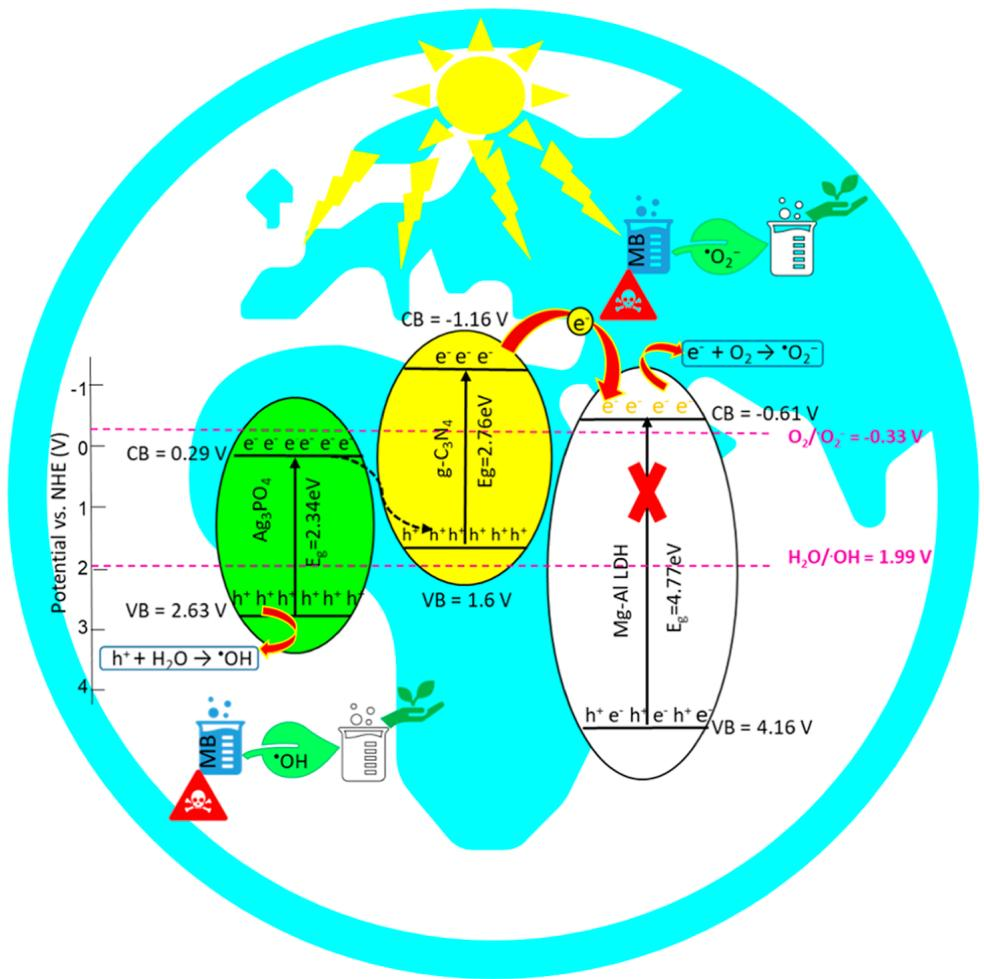

other

| Process | Potential (V) |
|---------|--------------|
| Ag₃PO₄ | 2.34 |
| g-C₃N₄ | 2.76 |
| Mg-Al LDH | 4.77 |
| H₂O/OH | 1.99 |
| VB | 1.6 |
| VB + H₂O → •OH | 2.63 |
| MB | 0.29 |
| e⁻ + O₂ → •O₂ | -0.61 |
| e⁻ + O₂ → e⁻ + O₂ | -0.33 |
| e⁻ + O₂ → e⁻ + O₂ | -1.16 |

Figure 12. MB photocatalytic decomposition by the $\mathrm { M g - A l \ L D H } @ g . C _ { 3 } \mathrm { N } _ { 4 } 3 0 @ { \mathrm { A g } } _ { 3 } \mathrm { P O } _ { 4 } 5$ nanocomposite: a proposed mechanism.

CB level of ${ \mathrm { A g } } _ { 3 } { \mathrm { P O } } _ { 4 }$ is closer to the ${ \bf g } – { \bf C } _ { 3 } { \bf N } _ { 4 }$ VB level; hence the electrons stimulated by the light of ${ \mathrm { A g } } _ { 3 } { \mathrm { P O } } _ { 4 }$ would recombine with the holes created by the light of $\check { \mathbf { g } } { - } \check { \mathbf { C } } _ { 3 } \mathbf { N } _ { 4 } \left( \mathbf { e q } \ 6 \right)$ . From the combination of VB holes (2.63 V) of ${ \mathrm { A g } } _ { 3 } { \mathrm { P O } } _ { 4 }$ with $_ { \mathrm { H _ { 2 } O } , }$ , hydroxyl radicals (OH• ) are produced $\mathrm { ( H _ { 2 } O / O H ^ { \bullet } = 1 . 9 9 V }$ vs $\mathrm { N H E } ) ^ { \dag _ { 0 } }$ and would take part in MB oxidation (eqs 10 and 12).

Given that $\mathrm { g - C _ { 3 } N _ { 4 } } ^ { \mathbf { \rho } } \mathbf { s }$ CB position is more negative, electrons migrate from this position to the CB of Mg−Al LDH (eq 8). The CB of Mg−Al LDH (−0.61 V) has a lesser potential than usual for superoxide radicals $\left( \mathrm { O } _ { 2 } / \mathrm { O } _ { 2 } ^ { \bullet - } = - 0 . 3 3 \right.$ V vs NHE).70 As a result, LDH can produce $\mathrm { O } _ { 2 } ^ { \bullet - }$ by reducing the adsorbed molecule of oxygen $( \bar { \mathsf { e q } } 9 )$ . Then, produced $\mathrm { O } _ { 2 } ^ { \mathbf { \check { \bullet } } \cdot }$ − participates in the degradation reaction of MB $\left( \mathsf { e q } \ 1 1 \right)$ . Also, these transitions lead to reduced electron−hole pair recombination, which is beneficial for enhancing photocatalytic efficiency.21 In the end, reactive species are formed to cause the degradation of MB.

The photocatalytic reactions occurring in the $\operatorname { M g - A l }$ $\mathrm { L D H } @ \bar { \mathbf { g } } { \cdot } \bar { \mathbf { C } } _ { 3 } \mathrm { N } _ { 4 } 3 0 @ \dot { \mathbf { A } } \mathbf { g } _ { 3 } \mathrm { P O } _ { 4 } 5$ composite could be summed up by the equations below

$$
\mathrm{g} - \mathrm{C} _ {3} \mathrm{N} _ {4} / \mathrm{Ag} _ {3} \mathrm{PO} _ {4} + \mathrm{h} \nu
$$

$$
\rightarrow \mathrm{g} - \mathrm{C} _ {3} \mathrm{N} _ {4} \left(\mathrm{e} ^ {-} + \mathrm{h} ^ {+}\right) / \mathrm{Ag} _ {3} \mathrm{PO} _ {4} \left(\mathrm{e} ^ {-} + \mathrm{h} ^ {+}\right) \tag {5}
$$

$$
\mathrm{g} - \mathrm{C} _ {3} \mathrm{N} _ {4} \left(\mathrm{h} ^ {+}\right) + \mathrm{Ag} _ {3} \mathrm{PO} _ {4} \left(\mathrm{e} ^ {-}\right)\rightarrow \text {recombination of e} ^ {-} + \mathrm{h} ^ {+} \tag {6}
$$

$$
\text { recombination   of } e ^ {-} (A g _ {3} P O _ {4}) + h ^ {+} (g - C _ {3} N _ {4})
$$

$$
\rightarrow \mathrm{g} - \mathrm{C} _ {3} \mathrm{N} _ {4} (\mathrm{e} ^ {-}) / \mathrm{Ag} _ {3} \mathrm{PO} _ {4} (\mathrm{h} ^ {+}) \tag {7}
$$

electron migration from CB $\mathrm { g } { \mathrm { - } } \mathrm { C } _ { 3 } \mathrm { N } _ { 4 } \mathrm { t o }$ CB $\mathrm { M g - A l }$ LDH

$$
\rightarrow \mathrm{Mg} - \mathrm{AlLDH} (\mathrm{e} ^ {-}) \tag {8}
$$

$$
\mathrm{Mg} - \mathrm{AlLDH} (\mathrm{e} ^ {-}) + \mathrm{O} _ {2} \rightarrow \mathrm{O} _ {2} ^ {\bullet -} \tag {9}
$$

$$
\mathrm{Ag} _ {3} \mathrm{PO} _ {4} (\mathrm{h} ^ {+}) + \mathrm{H} _ {2} \mathrm{O} \rightarrow \mathrm{OH} \tag {10}
$$

$$
\mathrm{O} _ {2} ^ {\bullet -} + \mathrm{MB} \rightarrow \mathrm{H} _ {2} \mathrm{O} + \mathrm{CO} _ {2} \tag {11}
$$

$$
\mathrm{OH} ^ {\bullet} + \mathrm{MB} \rightarrow \mathrm{H} _ {2} \mathrm{O} + \mathrm{CO} _ {2} \tag {12}
$$

The Mg−Al $\mathrm { L D H } @ \mathrm { g } _ { - } \mathrm { C } _ { 3 } \mathrm { N } _ { 4 } 3 0 @ \mathrm { A g } _ { 3 } \mathrm { P O } _ { 4 } 5$ composite shows superior performance in MB dye degradation as evaluated by parameters such as degradation time, light source type and power, and degradation percentage. It outperforms many catalysts designed based on $\operatorname { M g - A l }$ LDH and other compounds. Several reports comparing its performance with other catalysts are listed in Table S1.

# 4. CONCLUSIONS

In this work, the new nanocomposite of Mg−Al LDH@g-$\mathrm { C } _ { 3 } \mathrm { N } _ { 4 } 3 0 @ \mathrm { A g } _ { 3 } \mathrm { P O } _ { 4 } 5$ was designed and synthesized using a hydrothermal method and showed enhanced photocatalysis in the decomposition of MB dye. The key factor contributing to the enhanced photocatalytic efficiency is the intimate interface among $\operatorname { M g - A l }$ LDH, $\mathrm { g } { \mathrm { - } } \mathrm { C } _ { 3 } \mathrm { N } _ { 4 } ,$ and $\mathrm { A g } _ { 3 } \mathrm { P O } _ { 4 } .$ . This unique heterojunction architecture facilitates rapid charge-transfer processes, improving the photocatalytic efficiency. Additionally, the reduced arc of the Nyquist plot indicates efficient charge separation and reduced charge recombination, contributing to the increased photocatalytic efficiency of the nanocomposite. Notably, Mg−Al LDH@g- $\mathrm { \cdot } \mathrm { C } _ { 3 } \mathrm { N } _ { 4 } 3 0 @ \mathrm { A g } _ { 3 } \mathrm { P O } _ { 4 } 5$ exhibited greater photocatalytic efficiency in the degradation of MB compared with Mg−Al LDH, $\mathrm { g - C _ { 3 } N _ { 4 } , A g _ { 3 } P O _ { 4 } , }$ , and $\mathrm { M g - }$ Al $\mathrm { L D H } \bar { @ } \mathrm { g } \mathrm { - } \mathrm { C } _ { 3 } \mathrm { N } _ { 4 } 3 0 .$ . These results demonstrate the potential of LDH-based photocatalysts for achieving maximum photon absorption and effective environmental remediation.

# ASSOCIATED CONTENT

# \*sı Supporting Information

The Supporting Information is available free of charge at https://pubs.acs.org/doi/10.1021/acsomega.3c07326.

Materials and methods, material synthesis method, EDX spectra, dye degradation’s UV−vis absorption spectrum, photodegradation spectrum in percent, zeta potential diagrams, and FE-SEM images and XRD pattern after photocatalysis (PDF)

# AUTHOR INFORMATION

# Corresponding Author

Mojtaba Bagherzadeh − Chemistry Department, Sharif University of Technology, Tehran 19166, Iran; orcid.org/ 0000-0003-3009-3693; Email: bagherzadeh@sharif.edu

# Authors

Ghazal Salehi − Chemistry Department, Sharif University of Technology, Tehran 19166, Iran

Reza Abazari − Chemistry Department, Faculty of Science, University of Maragheh, Maragheh 83111, Iran; orcid.org/0000-0002-3725-2557

Mojtaba Hajilo − Chemistry Department, Sharif University of Technology, Tehran 19166, Iran

Davood Taherinia − Chemistry Department, Sharif University of Technology, Tehran 19166, Iran; orcid.org/0000- 0002-3097-766X

Complete contact information is available at: https://pubs.acs.org/10.1021/acsomega.3c07326

# Notes

The authors declare no competing financial interest.

# ACKNOWLEDGMENTS

The Research Council of Iran’s Sharif University of Technology provided funding for this work. The authors appreciate the financial assistance.

# REFERENCES

(1) Dong, S.; Feng, J.; Fan, M.; Pi, Y.; Hu, L.; Han, X.; Liu, M.; Sun, J.; Sun, J. Recent developments in heterogeneous photocatalytic water treatment using visible light-responsive photocatalysts: a review. RSC Adv. 2015, 5 (19), 14610−14630.   
(2) Deng, H.; Yin, J.; Ma, J.; Zhou, J.; Zhang, L.; Gao, L.; Jiao, T. Exploring the enhanced catalytic performance on nitro dyes via a novel template of flake-network Ni-Ti LDH/GO in-situ deposited with $\mathrm { { \bf A g } _ { 3 } P \mathrm { \bar { O } } _ { 4 } \ N P s . }$ . Appl. Surf. Sci. 2021, 543, 148821.   
(3) Qu, J.; Fan, M. The current state of water quality and technology development for water pollution control in China. Crit. Rev. Environ. Sci. Technol. 2010, 40 (6), 519−560.   
(4) Khan, I.; Khan, I.; Usman, M.; Imran, M.; Saeed, K. Nanoclaymediated photocatalytic activity enhancement of copper oxide nanoparticles for enhanced methyl orange photodegradation. J. Mater. Sci.: Mater. Electron. 2020, 31 (11), 8971−8985.   
(5) Bhat, A. P.; Gogate, P. R. Degradation of nitrogen-containing hazardous compounds using advanced oxidation processes: a review on aliphatic and aromatic amines, dyes, and pesticides. J. Hazard. Mater. 2021, 403, 123657.

(6) Javaid, R.; Qazi, U. Y. Catalytic oxidation process for the degradation of synthetic dyes: an overview. Int. J. Environ. Res. Public Health 2019, 16 (11), 2066.   
(7) Bouras, H. D.; Isik, Z.; Arikan, E. B.; Yeddou, A. R.; Bouras, N.; Chergui, A.; Favier, L.; Amrane, A.; Dizge, N. Biosorption characteristics of methylene blue dye by two fungal biomasses. Int. J. Environ. Stud. 2021, 78 (3), 365−381.   
(8) Kaveh, R.; Bagherzadeh, M. Simultaneous removal of mercury ions and cationic and anionic dyes from aqueous solution using epichlorohydrin cross-linked chitosan@ magnetic Fe O /activated carbon nanocomposite as an adsorbent. Diam. Relat. Mater. 2022, 124, 108923.   
(9) Houas, A.; Lachheb, H.; Ksibi, M.; Elaloui, E.; Guillard, C.; Herrmann, J.-M. Photocatalytic degradation pathway of methylene blue in water. Appl. Catal., B 2001, 31 (2), 145−157.   
(10) Hou, C.; Hu, B.; Zhu, J. Photocatalytic degradation of methylene blue over TiO2 pretreated with varying concentrations of NaOH. Catalysts 2018, 8 (12), 575.   
(11) Zhang, P.; Xiang, M.; Liu, H.; Yang, C.; Deng, S. Novel twodimensional magnetic titanium carbide for methylene blue removal over a wide pH range: insight into removal performance and mechanism. ACS Appl. Mater. Interfaces 2019, 11 (27), 24027−24036.   
(12) Abazari, R.; Salehi, G.; Mahjoub, A. R. Ultrasound-assisted preparation of a nanostructured zinc (II) amine pillar metal-organic framework as a potential sorbent for 2, 4-dichlorophenol adsorption from aqueous solution. Ultrason. Sonochem. 2018, 46, 59−67.   
(13) Lau, Y.-Y.; Wong, Y.-S.; Teng, T.-T.; Morad, N.; Rafatullah, M.; Ong, S.-A. Degradation of cationic and anionic dyes in coagulationflocculation process using bi-functionalized silica hybrid with aluminum-ferric as auxiliary agent. RSC Adv. 2015, 5 (43), 34206− 34215.   
(14) Golder, A.; Hridaya, N.; Samanta, A.; Ray, S. Electrocoagulation of methylene blue and eosin yellowish using mild steel electrodes. J. Hazard. Mater. 2005, 127 (1−3), 134−140.   
(15) Mukherjee, A.; Satish, A.; Mullick, A.; Rapolu, J.; Moulik, S.; Roy, A.; Ghosh, A. K. Paradigm Shift toward Developing a Zero Liquid Discharge Strategy for Dye-Contaminated Water Streams: A Green and Sustainable Approach Using Hydrodynamic Cavitation and Vacuum Membrane Distillation. ACS Sustainable Chem. Eng. 2021, 9 (19), 6707−6719.   
(16) Qu, H.; Xiao, X.; Han, Z.; Hu, M.; Shen, S.; Yang, L.; Jia, F.; Wang, T.; Ye, Z.; Sun, W.; et al. Graphene Oxide Nanofiltration Membrane Based on Three-Dimensional Size-Controllable Metal-Organic Frameworks for Water Treatment. ACS Appl. Nano Mater. 2022, 5 (4), 5196−5207.   
(17) Kim, S.; Yu, M.; Yoon, Y. Fouling and retention mechanisms of selected cationic and anionic dyes in a Ti C T x MXene-ultrafiltration hybrid system. ACS Appl. Mater. Interfaces 2020, 12 (14), 16557− 16565.   
(18) Mokhtarifar, M.; Kaveh, R.; Bagherzadeh, M.; Lucotti, A.; Pedeferri, M.; Diamanti, M. V. Heterostructured TiO /SiO /γ- $\mathrm { F e } _ { 2 } \mathrm { O } _ { 3 } / \mathrm { r G O }$ coating with highly efficient visible-light-induced selfcleaning properties for metallic artifacts. ACS Appl. Mater. Interfaces 2020, 12 (26), 29671−29683.   
(19) Bagherzadeh, M.; Kaveh, R.; Mahmoudi, H. Facile synthesis of a recyclable Pd-rGO/CNT/CaFe O nanocomposite with high multifunctional photocatalytic activity under visible light irradiation. J. Mater. Chem. A 2019, 7 (27), 16257−16266.   
(20) Abazari, R.; Mahjoub, A. R.; Salehi, G. Preparation of amine functionalized g-C N @ H/SMOF NCs with visible light photocatalytic characteristic for 4-nitrophenol degradation from aqueous solution. J. Hazard. Mater. 2019, 365, 921−931.   
(21) Yang, Z.-z.; Zhang, C.; Zeng, G.-m.; Tan, X.-f.; Wang, H.; Huang, D.-l.; Yang, K.-h.; Wei, J.-j.; Ma, C.; Nie, K. Design and engineering of layered double hydroxide based catalysts for water depollution by advanced oxidation processes: a review. J. Mater. Chem. A 2020, 8 (8), 4141−4173.

(22) Kanakaraju, D.; Glass, B. D.; Oelgemöller, M. Advanced oxidation process-mediated removal of pharmaceuticals from water: a review. J. Environ. Manage. 2018, 219, 189−207.   
(23) Bessaha, H.; Harrats, C.; Bouraada, M.; Deménorval, L. C. Photocatalytic efficiency of ZnAl-layered double hydroxide on degradation of a cationic dye under UV and solar radiation. Chem. Pap. 2018, 72 (4), 1031−1040.   
(24) Pan, Y.; Abazari, R.; Yao, J.; Gao, J. Recent progress in 2D metal-organic framework photocatalysts: Synthesis, photocatalytic mechanism and applications. JPhys Energy 2021, 3 (3), 032010.   
(25) Yan, J.; Zhang, X.; Zheng, W.; Lee, L. Y. S. Interface engineering of a 2D-C3N4/NiFe-LDH heterostructure for highly efficient photocatalytic hydrogen evolution. ACS Appl. Mater. Interfaces 2021, 13 (21), 24723−24733.   
(26) Li, D.; Zhou, J.; Zhang, Z.; Jiang, Y.; Dong, Z.; Xu, J.; Yao, C. Enhanced photocatalytic activity for CO reduction over a CsPbBr / CoAl-LDH composite: insight into the S-scheme charge transfer mechanism. ACS Appl. Energy Mater. 2022, 5 (5), 6238−6247.   
(27) Sun, C.; Hu, J.; Wu, L.; Xia, Q.; Jiao, F. Construction of a Novel Visible-Light-Driven Z-Scheme NiAl-LDH Modified (BiO) CO Heterostructure for Enhanced Photocatalytic Degradation Antibiotics Performance in Natural Water Bodies. Ind. Eng. Chem. Res. 2023, 62 (1), 466−477.   
(28) Manea, Y. K.; Khan, A. M.; Wani, A. A.; Saleh, M. A.; Qashqoosh, M. T.; Shahadat, M.; Rezakazemi, M. In-grown flower like Al-Li/Th-LDH@ CNT nanocomposite for enhanced photocatalytic degradation of MG dye and selective adsorption of Cr (VI). J. Environ. Chem. Eng. 2022, 10 (1), 106848.   
(29) Jo, W.-K.; Tonda, S. Novel CoAl-LDH/g-C3N4/RGO ternary heterojunction with notable 2D/2D/2D configuration for highly efficient visible-light-induced photocatalytic elimination of dye and antibiotic pollutants. J. Hazard. Mater. 2019, 368, 778−787.   
(30) Xue, L.; Lü, Z.; Cheng, Y.; Sun, X.; Lin, H.; Xiao, X.; Liu, X.; Zhuo, S. Three-dimensional layered double hydroxide membranes: fabrication technique, growth mechanism, and enhanced photocatalytic activity. Chem. Commun. 2018, 54 (61), 8494−8497.   
(31) Sanati, S.; Rezvani, Z.; Abazari, R.; Hou, Z.; Dai, H. Hierarchical CuAl-layered double hydroxide/CoWO 4 nanocomposites with enhanced efficiency for use in supercapacitors with long cycling stability. New J. Chem. 2019, 43 (38), 15240−15248.   
(32) Zhao, S.; Liang, Q.; Gao, W.; Zhou, M.; Yao, C.; Xu, S.; Li, Z. In situ growth of ZnIn S on MOF-derived Ni-Fe LDH to construct ternary-shelled nanotubes for efficient photocatalytic hydrogen evolution. Inorg. Chem. 2021, 60 (13), 9762−9772.   
(33) Pan, Y.; Sanati, S.; Abazari, R.; Noveiri, V. N.; Gao, J.; Kirillov, A. M. Pillared-MOF@ NiV-LDH composite as a remarkable electrocatalyst for water oxidation. Inorg. Chem. 2022, 61 (51), 20913−20922.   
(34) Sahoo, D. P.; Patnaik, S.; Parida, K. Construction of a Z-scheme dictated WO -X/Ag/ZnCr LDH synergistically visible light-induced photocatalyst towards tetracycline degradation and H2 evolution. ACS Omega 2019, 4 (12), 14721−14741.   
(35) Shen, R.; Zhang, L.; Li, N.; Lou, Z.; Ma, T.; Zhang, P.; Li, Y.; Li, X. W-N bonds precisely boost Z-scheme interfacial charge transfer in g-C N /WO heterojunctions for enhanced photocatalytic H2 evolution. ACS Catal. 2022, 12 (16), 9994−10003.   
(36) Wang, X.; Maeda, K.; Thomas, A.; Takanabe, K.; Xin, G.; Carlsson, J. M.; Domen, K.; Antonietti, M. A metal-free polymeric photocatalyst for hydrogen production from water under visible light. Nat. Mater. 2009, 8 (1), 76−80.   
(37) Sun, H.; Park, S.-J. Bimetallic CuPd nanoparticle-decorated MgAl-LDH/g-C N composites for efficient photocatalytic reduction of aqueous Cr (VI). J. Ind. Eng. Chem. 2022, 111, 183−191.   
(38) Yang, M.; Wang, P.; Li, Y.; Tang, S.; Lin, X.; Zhang, H.; Zhu, Z.; Chen, F. Graphene aerogel-based NiAl-LDH/g-C N with ultratight sheet-sheet heterojunction for excellent visible-light photocatalytic activity of CO reduction. Appl. Catal., B 2022, 306, 121065.   
(39) Salehi, G.; Abazari, R.; Mahjoub, A. R. Visible-light-induced graphitic-C3N4@ nickel-aluminum layered double hydroxide nano-

composites with enhanced photocatalytic activity for removal of dyes in water. Inorg. Chem. 2018, 57 (14), 8681−8691.   
(40) Nayak, S.; Parida, K. Dynamics of charge-transfer behavior in a plasmon-induced quasi-type-II p-n/n-n dual heterojunction in Ag@ Ag PO /g-C N /NiFe LDH nanocomposites for photocatalytic Cr (VI) reduction and phenol oxidation. ACS Omega 2018, 3 (7), 7324− 7343.   
(41) Sun, D.; Zhang, Y.; Liu, Y.; Wang, Z.; Chen, X.; Meng, Z.; Kang, S.; Zheng, Y.; Cui, L.; Chen, M.; et al. In-situ homodispersely immobilization of Ag@ AgCl on chloridized g-C N nanosheets as an ultrastable plasmonic photocatalyst. Chem. Eng. J. 2020, 384, 123259.   
(42) Mohanty, S.; Babu, P.; Parida, K.; Naik, B. Surface-plasmonresonance-induced photocatalysis by core-shell SiO2@ Ag NCs@ ${ \mathrm { A g } } _ { 3 } { \mathrm { P O } } _ { 4 }$ toward water-splitting and phenol oxidation reactions. Inorg. Chem. 2019, 58 (15), 9643−9654.   
(43) Su, F.; Li, P.; Huang, J.; Gu, M.; Liu, Z.; Xu, Y. Photocatalytic degradation of organic dye and tetracycline by ternary Ag2O/AgBr-CeO2 photocatalyst under visible-light irradiation. Sci. Rep. 2021, 11 (1), 85.   
(44) Liang, Y.; Shang, R.; Lu, J.; Liu, L.; Hu, J.; Cui, W. Ag PO @ UMOFNs core-shell structure: two-dimensional MOFs promoted photoinduced charge separation and photocatalysis. ACS Appl. Mater. Interfaces 2018, 10 (10), 8758−8769.   
(45) Garg, R.; Mondal, S.; Sahoo, L.; Vinod, C.; Gautam, U. K. Nanocrystalline Ag PO for sunlight-and ambient air-driven oxidation of amines: high photocatalytic efficiency and a facile catalyst regeneration strategy. ACS Appl. Mater. Interfaces 2020, 12 (26), 29324−29334.   
(46) Rabiee, N.; Bagherzadeh, M.; Ghadiri, A. M.; Salehi, G.; Fatahi, Y.; Dinarvand, R. ZnAl nano layered double hydroxides for dual functional CRISPR/Cas9 delivery and enhanced green fluorescence protein biosensor. Sci. Rep. 2020, 10 (1), 20672.   
(47) Kiani, M.; Bagherzadeh, M.; Fatahi, Y.; Daneshgar, H.; Safarkhani, M.; Salehi, G.; Makvandi, P.; Saeb, M. R.; Lima, E. C.; Rabiee, N. Successive cytotoxicity control by evolutionary surface decorated electronic push-pull green ZnCr-LDH nanostructures: Drug delivery enlargement for targeted breast cancer chemotherapy. OpenNano 2022, 8, 100093.   
(48) Tao, R.; Yang, S.; Shao, C.; Li, X.; Li, X.; Liu, S.; Zhang, J.; Liu, Y. Reusable and flexible g-C N /Ag PO /polyacrylonitrile heterojunction nanofibers for photocatalytic dye degradation and oxygen evolution. ACS Appl. Nano Mater. 2019, 2 (5), 3081−3090.   
(49) Wang, L.; Li, Y.; Zhang, C.; Deng, D.; He, H.; Yan, X.; Li, Z.; Luo, L. Hierarchical NiMn layered double hydroxide nanostructures on carbon cloth for electrochemical detection of hydrogen peroxide. ACS Appl. Nano Mater. 2022, 5 (12), 17741−17749.   
(50) Mehtab, A.; Alshehri, S. M.; Ahmad, T. Photocatalytic and photoelectrocatalytic water splitting by porous g-C N nanosheets for hydrogen generation. ACS Appl. Nano Mater. 2022, 5 (9), 12656− 12665.   
(51) Kumar, S.; Surendar, T.; Baruah, A.; Shanker, V. Synthesis of a novel and stable gC N -Ag PO hybrid nanocomposite photocatalyst and study of the photocatalytic activity under visible light irradiation. J. Mater. Chem. A 2013, 1 (17), 5333−5340.   
(52) Chen, C.-R.; Zeng, H.-Y.; Xiong, J.; An, D.-S.; Li, S. Multiple Hierarchical Heterojunction g-C N /LDH/Ag PO with Enhanced Visible-Light Photocatalytic Activity for Cr (VI) Reduction. Clays Clay Miner. 2021, 69 (2), 243−253.   
(53) Bai, S.; Wang, Z.; Tan, L.; Waterhouse, G. I.; Zhao, Y.; Song, Y.-F. 600 nm irradiation-induced efficient photocatalytic CO reduction by ultrathin layered double hydroxide nanosheets. Ind. Eng. Chem. Res. 2020, 59 (13), 5848−5857.   
(54) Nayak, S.; Mohapatra, L.; Parida, K. Visible light-driven novel gC N /NiFe-LDH composite photocatalyst with enhanced photocatalytic activity towards water oxidation and reduction reaction. J. Mater. Chem. A 2015, 3 (36), 18622−18635.   
(55) Landi, S.; Segundo, I. R.; Freitas, E.; Vasilevskiy, M.; Carneiro, J.; Tavares, C. J. Use and misuse of the Kubelka-Munk function to

obtain the band gap energy from diffuse reflectance measurements. Solid State Commun. 2022, 341, 114573.   
(56) Clavero, C. Plasmon-induced hot-electron generation at nanoparticle/metal-oxide interfaces for photovoltaic and photocatalytic devices. Nat. Photonics 2014, 8 (2), 95−103.   
(57) Han, C.; Chen, Z.; Zhang, N.; Colmenares, J. C.; Xu, Y. J. Hierarchically CdS decorated 1D ZnO nanorods-2D graphene hybrids: low temperature synthesis and enhanced photocatalytic performance. Adv. Funct. Mater. 2015, 25 (2), 221−229.   
(58) Yue, Z.; Liu, A.; Zhang, C.; Huang, J.; Zhu, M.; Du, Y.; Yang, P. Noble-metal-free hetero-structural CdS/Nb2O5/N-doped-graphene ternary photocatalytic system as visible-light-driven photocatalyst for hydrogen evolution. Appl. Catal., B 2017, 201, 202−210.   
(59) Peng, L.; Yu, C.; Ma, Y.; Xie, G.; Xie, X.; Wu, Z.; Zhang, N. Self-assembled transition metal chalcogenides@ CoAl-LDH 2D/2D heterostructures with enhanced photoactivity for hydrogen evolution. Inorg. Chem. Front. 2022, 9 (5), 994−1005.   
(60) Ye, X.; Chen, Y.; Ling, C.; Zhang, J.; Meng, S.; Fu, X.; Wang, X.; Chen, S. Chalcogenide photocatalysts for selective oxidation of aromatic alcohols to aldehydes using O2 and visible light: A case study of CdIn S , CdS and In S . Chem. Eng. J. 2018, 348, 966−977.   
(61) Huang, H.; Jiang, X.; Li, N.; Chen, D.; Xu, Q.; Li, H.; He, J.; Lu, J. Noble-metal-free ultrathin MXene coupled with In S nanoflakes for ultrafast photocatalytic reduction of hexavalent chromium. Appl. Catal., B 2021, 284, 119754.   
(62) Kumar, A.; Samanta, S.; Srivastava, R. Systematic investigation for the photocatalytic applications of carbon nitride/porous zeolite heterojunction. ACS Omega 2018, 3 (12), 17261−17275.   
(63) Yang, M.-Q.; Xu, Y.-J.; Lu, W.; Zeng, K.; Zhu, H.; Xu, Q.-H.; Ho, G. W. Self-surface charge exfoliation and electrostatically coordinated 2D hetero-layered hybrids. Nat. Commun. 2017, 8 (1), 14224.   
(64) Nayak, D.; Kumar, A.; Thangavel, R. Synthesis of MoS Nanoflowers for Photocatalytic Degradation of Organic Dyes. ACS Appl. Nano Mater. 2023, 6 (20), 19476−19490.   
(65) Ben Naceur, J.; Ouertani, R.; Chakhari, W.; Chtourou, R. Photo-electrochemical properties of Sb S /TiO heterostructures integrally synthesis by hydrothermal method. J. Mater. Sci. Mater. Electron. 2019, 30, 5631−5639.   
(66) Elbakkay, M. H.; El Rouby, W. M.; El-Dek, S.; Farghali, A. A. S-TiO /S-reduced graphene oxide for enhanced photoelectrochemical water splitting. Appl. Surf. Sci. 2018, 439, 1088−1102.   
(67) Elbakkay, M. H.; El Rouby, W. M.; Mariño-López, A.; Sousa-Castillo, A.; Salgueirino, V.; El-Dek, S.; Farghali, A. A.; Correa-Duarte, M. A.; Millet, P. One-pot synthesis of TiO /Sb S /RGO complex multicomponent heterostructures for highly enhanced photoelectrochemical water splitting. Int. J. Hydrogen Energy 2021, 46 (61), 31216−31227.   
(68) Takanabe, K. Photocatalytic water splitting: quantitative approaches toward photocatalyst by design. ACS Catal. 2017, 7 (11), 8006−8022.   
(69) Akintunde, O. O.; Yu, L.; Hu, J.; Kibria, M. G.; Achari, G. Visible-light driven photocatalytic degradation of 4-chlorophenol using graphitic carbon nitride-based nanocomposites. Catalysts 2022, 12 (3), 281.   
(70) Wang, K.; Li, J.; Zhang, G. Ag-bridged Z-scheme 2D/2D Bi5FeTi3O15/g-C3N4 heterojunction for enhanced photocatalysis: mediator-induced interfacial charge transfer and mechanism insights. ACS Appl. Mater. Interfaces 2019, 11 (31), 27686−27696.

# Supporting Information (SI)

# Visible Light-Driven Photocatalytic Degradation of Methylene Blue Dye Using Highly Efficient Mg-Al LDH@g-C3N4@Ag3PO4 Nanocomposite

Ghazal Salehi,† Mojtaba Bagherzadeh,†,\* Reza Abazari,‡ Mojtaba Hajilo,† Davood Taherinia†

†,\* Department of Chemistry, Sharif University of Technology, P.O. Box 11155-3615, Tehran, Iran. E-mail: bagherzadeh@sharif.edu

‡ Department of Chemistry, Faculty of Science, University of Maragheh, Maragheh , Iran.

Materials. $M g ( N O _ { 3 } ) _ { 2 } { \cdot } G H _ { 2 } O$ (Aldrich, 99.0%), $\mathsf { A l } ( \mathsf { N O } _ { 3 } ) _ { 3 } { \cdot } \mathsf { 9 H } _ { 2 } \mathsf { O }$ (Aldrich, 99.0%), NaOH (Merck India,99.5%), melamine (Aldrich, 99.0%), ${ \mathsf { A g N O } } _ { 3 }$ (Merck India, 99.9%), $\mathsf { N a } _ { 2 } \mathsf { H P O } _ { 4 } . 2 \mathsf { H } _ { 2 } \mathsf { O }$ (Merck India, 99.5%) and ethanol (Merck, 99.9%) were of analytical grade and used without further purification. The metal salt solutions were prepared by using deionized water.

General Methods. The infrared spectra (IR) data were tested in the range of 400-4000 cm−1 on Perkin Elmer (spectrum RX I) FT-IR spectrometer. The powder X-ray diffraction (PXRD) data were tested on PANalytical (XPert PRo MPD) X-ray powder diffractometer. The Field Emission Scanning Electron Microscope (FE-SEM) images were obtained on a TESCAN (MIRA 3 LMU) instrument. Transmission electron microscopic (TEM) images of the samples were obtained using a Ziess EM900 equipment. The UV\_ViS Diffused reflectance Spectroscopy (DRS) spectra of the materials were measured using a Avantes-Avaspec-2048 UV−vis spectrophotometer attached with DR accessory within the range of 200−800 nm. The PL spectra were measured and analyzed on a Varian (Varian Carry Eclips) fluorescence spectrophotometer with an excitation energy of 380 nm. Mineralization efficiency was calculated by estimating total organic carbon (TOC) using an Ana TOC (Australia) spectrophotometer. Zeta potential analysis was done with ZN Series device.

flowchart

```mermaid
graph TD
    A["a) <br>Mg(NO₃)₂·6H₂O + Al(NO₃)₃·9H₂O + 60 mL H₂O<br>8 mmol 4 mmol"] --> B["1) Stirrer for 15min"]
    A --> C["2) Adjusting pH= 9-9.5 by NaOH 0.5M"]
    A --> D["3) 24h and 100 °C (Hydrothermal)"]
    A --> E["4) Centrifuging"]
    A --> F["5) Washing with Deionized water and ethanol"]
    A --> G["6) Drying in a oven (24h - 60 °C)"]
    G --> H["Mg-Al LDH"]
    
    I["b) C₃H₆N₆ →[550 °C / 2 h"] g-C₃N₄] --> J
    K["d) g-C₃N₄ →[wt % Mg-Al LDH"] wt% Mg-Al LDH] --> L["10%: 20%, 30%, 40%, 50%: wt % Mg-Al LDH"]
    K --> M["Mg-Al LDH@g-C₃N₄30: 0.5 g + 0.025 g + 0.05 g"]
    K --> N["Dispersing (30 min): 50 ml: Ag₃PO₄ + H₂O + 10 ml: Dispersing (30 min): 1h Stirrer; Washing with ethanol; Drying in a oven (24h - 60 °C): 2) Washed with OH; Drying in a oven (24h - 60 °C): Mg-Al LDH@g-C₃N₄30@Ag₃PO₄10"]
    K --> O["Mg-Al LDH@g-C₃N₄30@Ag₃PO₄5: Mg-Al LDH@g-C₃N₄30@Ag₃PO₄10"]
```

Figure S1. The preparation steps of Mg-Al LDH (a), g-C3N4 (b), Ag3PO4 (c), Mg-Al LDH@g-C3N430 (d), Mg-Al LDH@g-C3N430@Ag3PO45(e).

text_image

(a)
D2 = 135.49 nm
D1 = 115.21 nm
D4 = 31.72 nm
D3 = 34.40 nm
SEM MAG: 320 kx Det: InBeam MIRA3 TESCAN WD: 4.96 mm BI: 7.00
View field: 0.629 µm Date(m/d/y): 09/06/21
(b)
145 nm
138 nm
134 nm
100 nm
(c)
122 nm
133 nm
50 nm
(d)
312 nm
30 nm
(e)
D2 = 348.51 nm
D1 = 365.12 nm
D6 = 234.84 nm
D8 = 135.43 nm
D9 = 147.62 nm
D7 = 165.00 nm
D4 = 296.78 nm
D3 = 307.16 nm
(f)
D3 = 198.40 nm
D2 = 230.66 nm
291 = 228.56 nm
(g)
SEM MAG: 75.0 kx WD: 13.97 mm MIRA3 TESCAN WD: 5.02 mm Btl: 7.00 MIRA3 TESCAN WD: 5.02 mm Btl: 7.00 MIRA3 TESCAN WD: 5.02 mm Btl: 7.00 MIRA3 TESCAN WD: 5.02 mm Btl: 7.00 MIRA3 TESCAN WD: 5.02 mm Btl: 7.00 MIRA3 TESCAN WD: 5.92 mm WD: 5.02 mm Btl: 7.00 Btl: 7.00 Btl: 7.00 Btl: 7.00 Btl: 7.00 Btl: 7.00 Btl: 7.00 Btl: 7.00 Btl: 7.00 Btl: 7.00 Btl: 7.00 Btl: 7.00 Btl: 7.00 Btl: N
Date(m/d/y): 11/28/23 SUT - FSEM View field: 1.84 µm Date(m/d/y): 09/06/21 View field: 2.88 µm Date(m/d/y): 09/06/21 View field: 4.15 µm Date(m/d/y): 09/06/21

Figure S2. FE-SEM (a), and TEM of Mg-Al LDH@g-C3N430@Ag3PO45 (b-d), and FE-SEM of $\mathsf { A g } _ { 3 } \mathsf { P O } _ { 4 } \left( \mathsf { e } { \cdot } \mathsf { h } \right)$ .

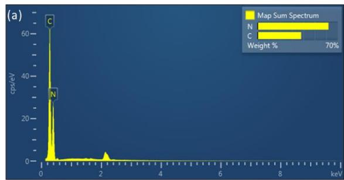

line

| keV | cps/eV |
| --- | ------ |
| 0   | 60     |
| 1.5 | 30     |
| 2.0 | 5      |

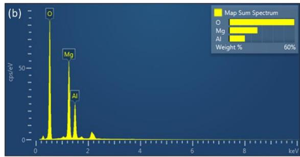

line

| keV | cps/eV |
| --- | ------ |
| ~0.5 | 60 |
| ~1.2 | 50 |
| ~1.8 | 30 |

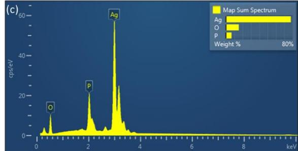

line

| keV | cps/eV |
| --- | ------ |
| ~0.5 | ~10 |
| ~2.0 | ~25 |
| ~3.0 | ~60 |
| ~4.0 | ~5 |
| ~7.5 | ~1 |

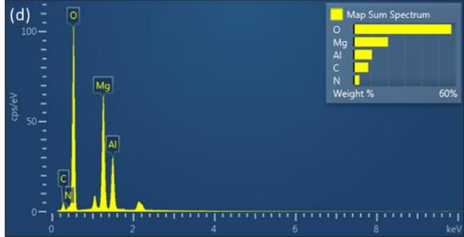

bar

| Element | Count (cps/eV) |
|---|---|
| O | 100 |
| Mg | 60 |
| Al | 30 |
| C | 5 |
| N | 2 |
| C | 1 |
| N | 1 |
(d) Map Sum Spectrum
Weight % 60%

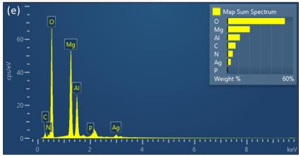

bar

| Element | Energy (keV) | qps/eV |
|---|---|---|
| O | ~0.3 | 65 |
| Mg | ~1.2 | 50 |
| Al | ~1.4 | 25 |
| P | ~2.1 | 5 |
| Ag | ~2.8 | 2 |
Map Sum Spectrum
Weight % 60%

text_image

(i)
g-C-N
Electron Image 1
C Kα1_2
N Kα1_2
500nm
500nm
500nm
(g)
Mg-AlLDH
Electron Image 1
Al Kα1
Mg Kα1_2
O Kα1
500nm
500nm
500nm
(h)
Ag La1
P Kα1
O Kα1
500nm
500nm
500nm
Ag₃PO₄
Electron Image 1
F Cu(Ca)₃(O)₅
Mg-AlLDH@g-C-N,30
Electron Image 7
DSC (Cu)₃(O)₅
Mg-AlLDH@g-C-N,30@A95
(e)
Mg-AlLDH@g-C-N,30@A95
(1)
500nm
500nm
500nm
500nm
500nm
500nm
500nm
500nm
500nm
500nm
500nm
500nm
500nm
500nm

Figure S3. EDX spectra of the pure $\mathsf { g } \mathrm { - } \mathsf { C } _ { 3 } \mathsf { N } _ { 4 } ( \mathsf { a } ) ,$ pure Mg-Al LDH (b), pure ${ \tt A g } _ { 3 } { \sf P O } _ { 4 }$ (c), Mg-Al LDH@g-C3N430 (d), Mg-Al LDH@g-C3N430@Ag3PO45 (e), and elemental mapping images of the pure g-C3N4 (f), pure Mg-Al LDH (g), pure Ag3PO4 (h), Mg-Al LDH@g-C3N430 (i), Mg-Al LDH@g-C3N430@Ag3PO45 (j).

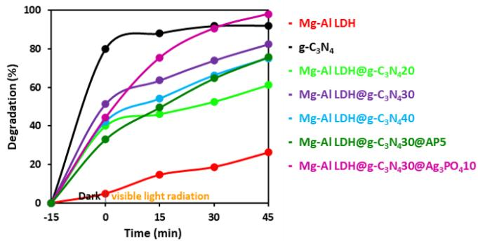

line

| Time (min) | Mg-Al LDH | g-C₃N₄ | Mg-Al LDH@g-C₃N₄20 | Mg-Al LDH@g-C₃N₄30 | Mg-Al LDH@g-C₃N₄40 | Mg-Al LDH@g-C₃N₄30@AP5 | Mg-Al LDH@g-C₃N₄30@Ag₃PO₄10 |
| ---------- | --------- | ------ | ------------------- | ------------------- | ------------------- | ------------------------ | ----------------------------- |
| -15        | 0         | 0      | 0                   | 0                   | 0                   | 0                        | 0                             |
| 0          | 15        | 80     | 40                  | 50                  | 45                  | 35                       | 45                            |
| 15         | 15        | 85     | 45                  | 60                  | 50                  | 45                       | 75                            |
| 30         | 20        | 90     | 50                  | 70                  | 60                  | 60                       | 90                            |
| 45         | 25        | 90     | 60                  | 80                  | 70                  | 75                       | 95                            |

Figure S4. Percent photo−degradation of MB dye under dark condition and visible−light irradiation after 45 min.

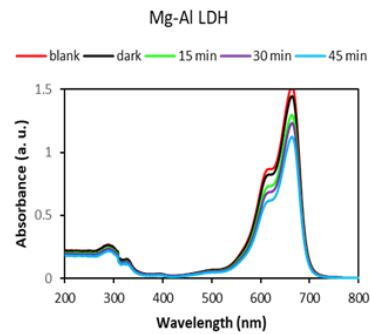

line

| Wavelength (nm) | blank | dark | 15 min | 30 min | 45 min |
| --------------- | ----- | ---- | ------ | ------ | ------ |
| 200             | 0.2   | 0.2  | 0.2    | 0.2    | 0.2    |
| 300             | 0.2   | 0.2  | 0.2    | 0.2    | 0.2    |
| 400             | 0.1   | 0.1  | 0.1    | 0.1    | 0.1    |
| 500             | 0.1   | 0.1  | 0.1    | 0.1    | 0.1    |
| 600             | 0.8   | 0.8  | 0.8    | 0.8    | 0.8    |
| 700             | 1.5   | 1.5  | 1.5    | 1.5    | 1.5    |
| 800             | 0.1   | 0.1  | 0.1    | 0.1    | 0.1    |

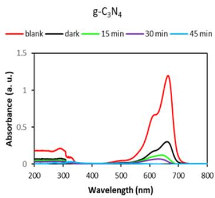

line

| Wavelength (nm) | blank | dark | 15 min | 30 min | 45 min |
| --------------- | ----- | ---- | ------ | ------ | ------ |
| 200             | 0.1   | 0.05 | 0.02   | 0.01   | 0.01   |
| 300             | 0.2   | 0.1  | 0.05   | 0.02   | 0.01   |
| 400             | 0.1   | 0.05 | 0.02   | 0.01   | 0.01   |
| 500             | 0.05  | 0.02 | 0.01   | 0.01   | 0.01   |
| 600             | 0.8   | 0.3  | 0.1    | 0.05   | 0.01   |
| 700             | 1.2   | 0.4  | 0.2    | 0.1    | 0.01   |
| 800             | 0.1   | 0.05 | 0.02   | 0.01   | 0.01   |

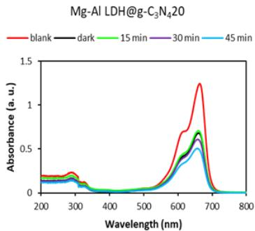

line

| Wavelength (nm) | blank | dark | 15 min | 30 min | 45 min |
| --------------- | ----- | ---- | ------ | ------ | ------ |
| 200             | 0.1   | 0.1  | 0.1    | 0.1    | 0.1    |
| 300             | 0.2   | 0.1  | 0.1    | 0.1    | 0.1    |
| 400             | 0.1   | 0.1  | 0.1    | 0.1    | 0.1    |
| 500             | 0.1   | 0.1  | 0.1    | 0.1    | 0.1    |
| 600             | 0.8   | 0.6  | 0.7    | 0.6    | 0.5    |
| 700             | 1.3   | 0.7  | 0.8    | 0.7    | 0.6    |
| 800             | 0.1   | 0.1  | 0.1    | 0.1    | 0.1    |

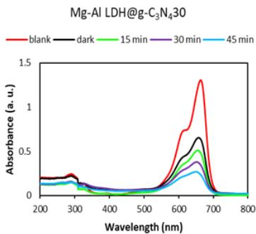

line

| Wavelength (nm) | blank | dark | 15 min | 30 min | 45 min |
| --------------- | ----- | ---- | ------ | ------ | ------ |
| 200             | 0.1   | 0.1  | 0.1    | 0.1    | 0.1    |
| 300             | 0.2   | 0.2  | 0.2    | 0.2    | 0.2    |
| 400             | 0.1   | 0.1  | 0.1    | 0.1    | 0.1    |
| 500             | 0.1   | 0.1  | 0.1    | 0.1    | 0.1    |
| 600             | 0.8   | 0.6  | 0.5    | 0.4    | 0.3    |
| 700             | 1.3   | 0.7  | 0.6    | 0.5    | 0.4    |
| 800             | 0.1   | 0.1  | 0.1    | 0.1    | 0.1    |

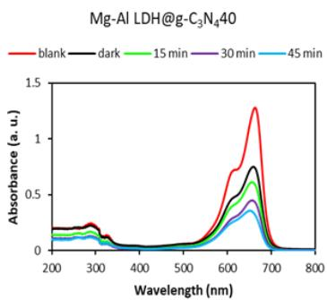

line

| Wavelength (nm) | blank | dark | 15 min | 30 min | 45 min |
| --------------- | ----- | ---- | ------ | ------ | ------ |
| 200             | 0.1   | 0.1  | 0.1    | 0.1    | 0.1    |
| 300             | 0.2   | 0.1  | 0.1    | 0.1    | 0.1    |
| 400             | 0.1   | 0.1  | 0.1    | 0.1    | 0.1    |
| 500             | 0.1   | 0.1  | 0.1    | 0.1    | 0.1    |
| 600             | 0.5   | 0.6  | 0.5    | 0.4    | 0.3    |
| 700             | 1.3   | 0.8  | 0.6    | 0.4    | 0.3    |
| 800             | 0.1   | 0.1  | 0.1    | 0.1    | 0.1    |

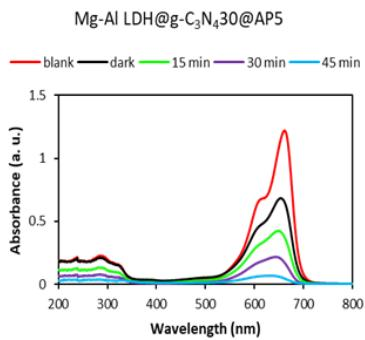

line

| Wavelength (nm) | blank | dark | 15 min | 30 min | 45 min |
| --------------- | ----- | ---- | ------ | ------ | ------ |
| 200             | 0.1   | 0.1  | 0.1    | 0.1    | 0.1    |
| 300             | 0.2   | 0.2  | 0.2    | 0.2    | 0.2    |
| 400             | 0.1   | 0.1  | 0.1    | 0.1    | 0.1    |
| 500             | 0.1   | 0.1  | 0.1    | 0.1    | 0.1    |
| 600             | 0.8   | 0.7  | 0.6    | 0.5    | 0.4    |
| 700             | 1.2   | 1.1  | 1.0    | 0.9    | 0.8    |
| 800             | 0.1   | 0.1  | 0.1    | 0.1    | 0.1    |

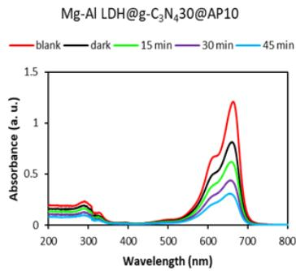

line

| Wavelength (nm) | blank | dark | 15 min | 30 min | 45 min |
| --------------- | ----- | ---- | ------ | ------ | ------ |
| 200             | 0.1   | 0.1  | 0.1    | 0.1    | 0.1    |
| 300             | 0.2   | 0.2  | 0.2    | 0.2    | 0.2    |
| 400             | 0.1   | 0.1  | 0.1    | 0.1    | 0.1    |
| 500             | 0.3   | 0.3  | 0.3    | 0.3    | 0.3    |
| 600             | 0.8   | 0.8  | 0.8    | 0.8    | 0.8    |
| 700             | 1.2   | 1.2  | 1.2    | 1.2    | 1.2    |
| 800             | 0.1   | 0.1  | 0.1    | 0.1    | 0.1    |

Figure S5. UV–visible absorption spectra of MB dye after different irradiation times during the degradation process after 45 min.

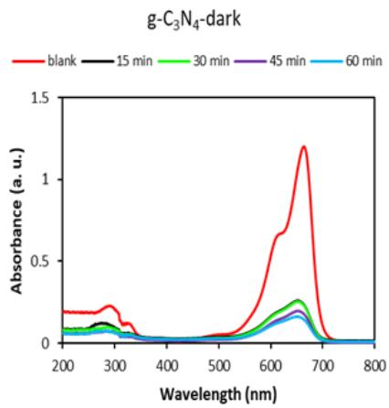

line

| Wavelength (nm) | blank | 15 min | 30 min | 45 min | 60 min |
| --------------- | ----- | ------ | ------ | ------ | ------ |
| 200             | 0.2   | 0.1    | 0.1    | 0.1    | 0.1    |
| 300             | 0.25  | 0.15   | 0.15   | 0.15   | 0.15   |
| 400             | 0.1   | 0.05   | 0.05   | 0.05   | 0.05   |
| 500             | 0.05  | 0.02   | 0.02   | 0.02   | 0.02   |
| 600             | 0.6   | 0.2    | 0.2    | 0.2    | 0.2    |
| 700             | 1.2   | 0.3    | 0.3    | 0.3    | 0.3    |
| 800             | 0.0   | 0.0    | 0.0    | 0.0    | 0.0    |

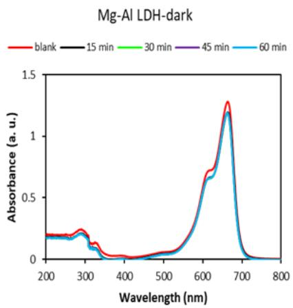

line

| Wavelength (nm) | blank | 15 min | 30 min | 45 min | 60 min |
| --------------- | ----- | ------ | ------ | ------ | ------ |
| 200             | 0.2   | 0.2    | 0.2    | 0.2    | 0.2    |
| 300             | 0.25  | 0.25   | 0.25   | 0.25   | 0.25   |
| 400             | 0.1   | 0.1    | 0.1    | 0.1    | 0.1    |
| 500             | 0.1   | 0.1    | 0.1    | 0.1    | 0.1    |
| 600             | 0.7   | 0.7    | 0.7    | 0.7    | 0.7    |
| 700             | 1.3   | 1.3    | 1.3    | 1.3    | 1.3    |
| 800             | 0.0   | 0.0    | 0.0    | 0.0    | 0.0    |

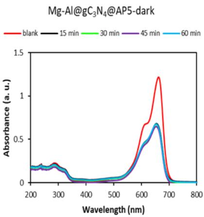

line

| Wavelength (nm) | blank | 15 min | 30 min | 45 min | 60 min |
| --------------- | ----- | ------ | ------ | ------ | ------ |
| 200             | 0.1   | 0.1    | 0.1    | 0.1    | 0.1    |
| 300             | 0.2   | 0.2    | 0.2    | 0.2    | 0.2    |
| 400             | 0.1   | 0.1    | 0.1    | 0.1    | 0.1    |
| 500             | 0.1   | 0.1    | 0.1    | 0.1    | 0.1    |
| 600             | 0.7   | 0.6    | 0.5    | 0.4    | 0.3    |
| 700             | 1.2   | 0.7    | 0.6    | 0.5    | 0.4    |
| 800             | 0.1   | 0.1    | 0.1    | 0.1    | 0.1    |

Figure S6. UV visible absorption spectrum of MB after 60 min in the dark condition.

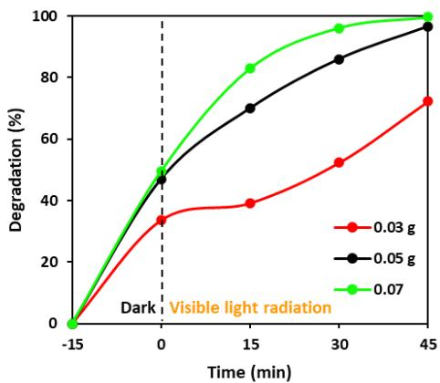

line

| Time (min) | 0.03 g | 0.05 g | 0.07   |
| ---------- | ------ | ------ | ------ |
| -15        | 0      | 0      | 0      |
| 0          | 35     | 48     | 50     |
| 15         | 40     | 70     | 85     |
| 30         | 52     | 85     | 95     |
| 45         | 72     | 98     | 100    |

Figure S7. Effects of amount of the Mg-Al LDH@g-C3N430@Ag3PO45 NCPs for percent photo−degradation of MB dye under dark condition and visible−light irradiation.

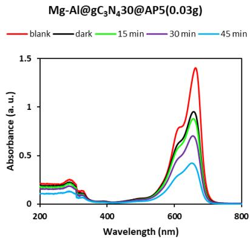

line

| Wavelength (nm) | blank | dark | 15 min | 30 min | 45 min |
| --------------- | ----- | ---- | ------ | ------ | ------ |
| 200             | 0.2   | 0.2  | 0.2    | 0.2    | 0.2    |
| 300             | 0.1   | 0.1  | 0.1    | 0.1    | 0.1    |
| 400             | 0.05  | 0.05 | 0.05   | 0.05   | 0.05   |
| 500             | 0.1   | 0.1  | 0.1    | 0.1    | 0.1    |
| 600             | 0.8   | 0.9  | 0.8    | 0.7    | 0.6    |
| 700             | 1.4   | 1.3  | 1.2    | 1.1    | 1.0    |
| 800             | 0.0   | 0.0  | 0.0    | 0.0    | 0.0    |

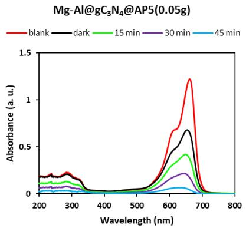

line

| Wavelength (nm) | blank | dark | 15 min | 30 min | 45 min |
| --------------- | ----- | ---- | ------ | ------ | ------ |
| 200             | ~0.1  | ~0.1 | ~0.1   | ~0.1   | ~0.1   |
| 300             | ~0.1  | ~0.1 | ~0.1   | ~0.1   | ~0.1   |
| 400             | ~0.1  | ~0.1 | ~0.1   | ~0.1   | ~0.1   |
| 500             | ~0.1  | ~0.1 | ~0.1   | ~0.1   | ~0.1   |
| 600             | ~0.7  | ~0.7 | ~0.4   | ~0.2   | ~0.1   |
| 700             | ~1.2  | ~0.7 | ~0.4   | ~0.2   | ~0.1   |
| 800             | ~0.1  | ~0.1 | ~0.1   | ~0.1   | ~0.1   |

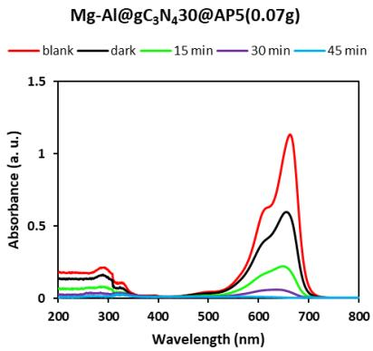

line

| Wavelength (nm) | blank | dark | 15 min | 30 min | 45 min |
| --------------- | ----- | ---- | ------ | ------ | ------ |
| 200             | 0.2   | 0.1  | 0.1    | 0.05   | 0.02   |
| 300             | 0.25  | 0.15 | 0.12   | 0.06   | 0.03   |
| 400             | 0.1   | 0.05 | 0.05   | 0.03   | 0.01   |
| 500             | 0.05  | 0.02 | 0.02   | 0.01   | 0.01   |
| 600             | 0.6   | 0.4  | 0.2    | 0.1    | 0.02   |
| 700             | 1.2   | 0.6  | 0.3    | 0.15   | 0.03   |
| 800             | 0.1   | 0.1  | 0.1    | 0.05   | 0.02   |

Figure S8. UV-visible absorption spectra of Mg-Al LDH@g- $\mathrm { . C _ { 3 } N _ { 4 } 3 0 @ A g _ { 3 } P O _ { 4 } 5 }$ nanocomposite for MB degradation under dark conditions and visible light irradiation in the presence of different amounts.

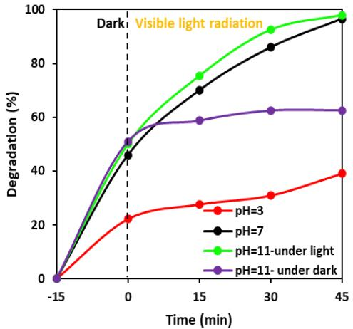

line

| Time (min) | pH=3  | pH=7  | pH=11-under light | pH=11- under dark |
| ---------- | ----- | ----- | ----------------- | ----------------- |
| -15        | 0     | 0     | 0                 | 0                 |
| 0          | 22    | 45    | 50                | 50                |
| 15         | 28    | 70    | 75                | 58                |
| 30         | 30    | 85    | 90                | 62                |
| 45         | 38    | 98    | 98                | 62                |

Figure S9. Percent photo−degradation of MB dye under dark condition (for pH= 11) and visible−light irradiation after 45 min at three different pHs.

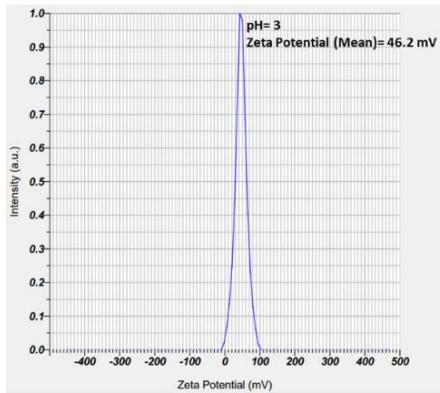

line

| Zeta Potential (mV) | Intensity (a.u.) |
| ------------------- | ---------------- |
| 0                   | 1.0              |
| 100                 | 0.0              |

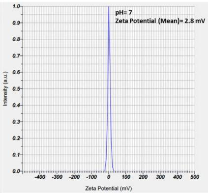

line

| Zeta Potential (mV) | Intensity (a.u.) |
| ------------------- | ---------------- |
| 0                   | 1.0              |

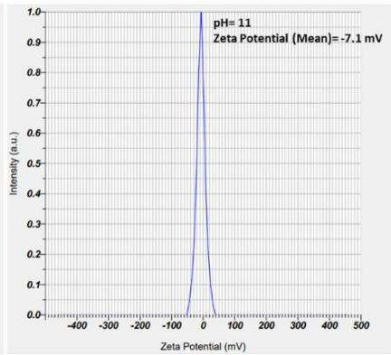

line

| Zeta Potential (mV) | Intensity (a.u.) |
| ------------------- | ---------------- |
| 0                   | 1.0              |
| -7.1                | 0.0              |

Figure S10. Graphs of zeta potential of Mg-Al LDH@g- $\mathsf { C } _ { 3 } \mathsf { N } _ { 4 } 3 0 @ \mathsf { A g } _ { 3 } \mathsf { P O } _ { 4 } 5$ nanocomposite at different pHs.

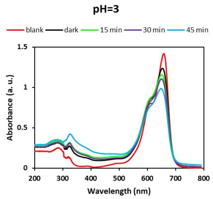

line

| Wavelength (nm) | blank | dark | 15 min | 30 min | 45 min |
| --------------- | ----- | ---- | ------ | ------ | ------ |
| 200             | 0.2   | 0.2  | 0.2    | 0.2    | 0.2    |
| 300             | 0.1   | 0.3  | 0.3    | 0.3    | 0.4    |
| 400             | 0.05  | 0.2  | 0.2    | 0.2    | 0.2    |
| 500             | 0.1   | 0.1  | 0.1    | 0.1    | 0.1    |
| 600             | 0.8   | 0.9  | 0.9    | 0.9    | 0.9    |
| 700             | 1.4   | 1.3  | 1.2    | 1.1    | 1.0    |
| 800             | 0.0   | 0.0  | 0.0    | 0.0    | 0.0    |

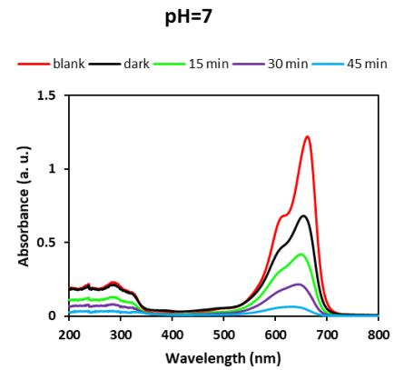

line

| Wavelength (nm) | blank | dark | 15 min | 30 min | 45 min |
| --------------- | ----- | ---- | ------ | ------ | ------ |
| 200             | ~0.1  | ~0.1 | ~0.1   | ~0.1   | ~0.1   |
| 300             | ~0.1  | ~0.1 | ~0.1   | ~0.1   | ~0.1   |
| 400             | ~0.1  | ~0.1 | ~0.1   | ~0.1   | ~0.1   |
| 500             | ~0.1  | ~0.1 | ~0.1   | ~0.1   | ~0.1   |
| 600             | ~0.5  | ~0.5 | ~0.4   | ~0.3   | ~0.2   |
| 700             | ~1.2  | ~0.7 | ~0.4   | ~0.2   | ~0.1   |
| 800             | ~0.1  | ~0.1 | ~0.1   | ~0.1   | ~0.1   |

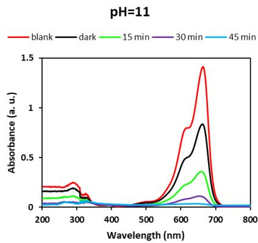

line

| Wavelength (nm) | blank | dark | 15 min | 30 min | 45 min |
| --------------- | ----- | ---- | ------ | ------ | ------ |
| 200             | 0.2   | 0.1  | 0.1    | 0.05   | 0.05   |
| 300             | 0.25  | 0.15 | 0.15   | 0.05   | 0.05   |
| 400             | 0.1   | 0.05 | 0.05   | 0.05   | 0.05   |
| 500             | 0.05  | 0.05 | 0.05   | 0.05   | 0.05   |
| 600             | 0.8   | 0.6  | 0.4    | 0.1    | 0.05   |
| 700             | 1.4   | 0.9  | 0.3    | 0.1    | 0.05   |
| 800             | 0.1   | 0.1  | 0.1    | 0.05   | 0.05   |

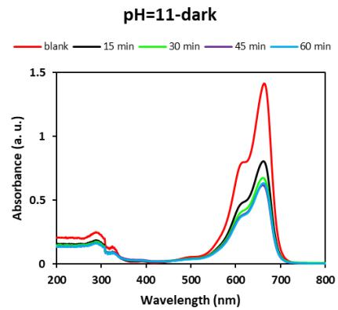

line

| Wavelength (nm) | blank | 15 min | 30 min | 45 min | 60 min |
| --------------- | ----- | ------ | ------ | ------ | ------ |
| 200             | 0.2   | 0.1    | 0.1    | 0.1    | 0.1    |
| 300             | 0.2   | 0.1    | 0.1    | 0.1    | 0.1    |
| 400             | 0.1   | 0.05   | 0.05   | 0.05   | 0.05   |
| 500             | 0.1   | 0.1    | 0.1    | 0.1    | 0.1    |
| 600             | 0.8   | 0.6    | 0.5    | 0.4    | 0.3    |
| 700             | 1.4   | 0.8    | 0.6    | 0.5    | 0.4    |
| 800             | 0.1   | 0.1    | 0.1    | 0.1    | 0.1    |

Figure S11. UV–visible absorption spectra of $\mathsf { M g - A l \mathsf { L D H } @ g - C _ { 3 } N _ { 4 } 3 0 @ A g _ { 3 } P O _ { 4 } 5 }$ NCPs for MB degradation under dark condition (for pH= 11) and visible−light irradiation at three different pHs.

text_image

SEM MAG: 135 kx WD: 5.79 mm MIRA3 TESCAN SEM MAG: 135 kx WD: 5.79 mm MIRA3 TESCAN SEM MAG: 70.0 kx WD: 5.79 mm MIRA3 TESCAN
Det: SE SEM HV: 15.0 kV 200 nm Det: SE SEM HV: 15.0 kV 200 nm Det: SE SEM HV: 15.0 kV 500 nm
Date(m/d/y): 06/06/23 SUT - FESEM Date(m/d/y): 06/06/23 SUT - FESEM Date(m/d/y): 06/06/23 SUT - FESEM

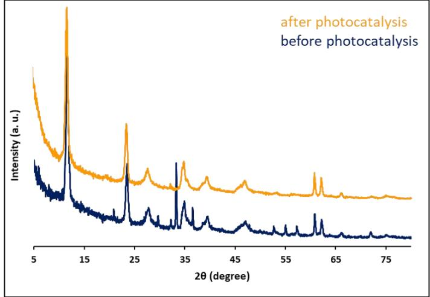

line

| 2θ (degree) | after photocatalysis | before photocatalysis |
| ----------- | -------------------- | --------------------- |
| 5           | ~1.0                 | ~0.8                  |
| 15          | ~0.6                 | ~0.4                  |
| 25          | ~0.8                 | ~0.6                  |
| 35          | ~0.7                 | ~0.5                  |
| 45          | ~0.6                 | ~0.4                  |
| 55          | ~0.5                 | ~0.3                  |
| 65          | ~0.4                 | ~0.2                  |
| 75          | ~0.3                 | ~0.1                  |

Figure S12. FE-SEM images and X-ray diffraction pattern of Mg-Al LDH@g- $\cdot \mathsf { C } _ { 3 } \mathsf { N } _ { 4 } { - } 3 0 @ \mathsf { A } \mathsf { g } _ { 3 } \mathsf { P } 0 _ { 4 } { - } 5$ nanocomposite after photocatalysis.

Table S1. Comparison of the MB degradation efficiency using the Mg-Al LDH@g- $\mathsf { \cdot C } _ { 3 } \mathsf { N } _ { 4 } @ \mathsf { A g } _ { 3 } \mathsf { P O } _ { 4 }$ photocatalyst with various other photocatalysts. 

<table><tr><td>Material</td><td>Synthesis Method</td><td>Light Source</td><td>%MB Degraded</td><td>Time</td><td>Ref</td></tr><tr><td>GFC- Mg-Al LDH - P25</td><td>Hydrothermal and co-precipitation</td><td>Irradiation with 365 nm light</td><td>~80%</td><td>180 min</td><td>1</td></tr><tr><td>MPA/Mg-Al LDH</td><td>Precipitation</td><td>CEL-HXF 300</td><td>99%</td><td>160 min</td><td>2</td></tr><tr><td>MgAlCe-HTlc</td><td>Aged and precipitation</td><td>150 W halogen</td><td>88.7%</td><td>80 min</td><td>3</td></tr><tr><td> $\gamma$ -Fe3/ Fe3O4/ SiO2</td><td>Single-stage heat-treatment process</td><td>UV-light</td><td>87.5%</td><td>120 min</td><td>4</td></tr><tr><td>70% CeO2/g-C3N4</td><td>Ball milling</td><td>UV light irradiation</td><td>90.1%</td><td>180 min</td><td>5</td></tr><tr><td>mpg-C3N4-WO3</td><td>Grinding and calcining</td><td>Sunlight</td><td>92%</td><td>120 min</td><td>6</td></tr><tr><td>WO3/g-C3N4</td><td>Wet chemical process</td><td>300 W xenon lam</td><td>97%</td><td>120 min</td><td>7</td></tr><tr><td>SnO2/MgAl-LDH</td><td>Wet impregnation</td><td>UV-light</td><td>90%</td><td>100 min</td><td>8</td></tr><tr><td>TiO2/CuMgAl-RLDH</td><td>Coprecipitation</td><td>300W Xe lamp</td><td>65%</td><td>420 min</td><td>9</td></tr><tr><td>δ-Fe2O3/Mg-Al LDH</td><td>Impregnation</td><td>tungsten lamp</td><td>67%</td><td>300 min</td><td>10</td></tr><tr><td>CdS/Mg-Al LDH- precursor</td><td>Mechanochemical</td><td>500 W xenon lamp</td><td>94.78%</td><td>90 min</td><td>11</td></tr><tr><td>Mg-Al LDH@g-C3N4@Ag3PO4</td><td>Hydrothermal</td><td>150 W mercury lamp</td><td>99%</td><td>45 min</td><td>This work</td></tr></table>

# REFERENCES:

[1] Machida, S.; Hasegawa, K.; Katsumata, K.I.; Yasumori, A., Preparation and characterization of titania supported on layered double hydroxide precipitated on glass fiber cloth. Appl. Clay Sci. 2023, 238, 106935.   
[2] Bi, R.; Yin, D.; Lei, B.; Chen, F.; Zhang, R.; Li, W., Mercaptocarboxylic acid intercalated Mg-Al layered double hydroxide adsorbents for removal of heavy metal ions and recycling of spent adsorbents for photocatalytic degradation of organic dyes. Sep. Purif. Technol. 2020, 289, 120741.   
[3] Xu, M.; Pan, G.; Meng, Y.; Guo, Y.; Wu, T.; Chen, H., Effect of Ce3+ on the photocatalytic activity of MAlCe ternary hydrotalcites-like compounds in methylene blue photodegradation. Appl. Clay Sci. 2019, 170, 46- 56.

[4] Sanad, M.M.; Farahat, M.M.; El-Hout, S.I.; El-Sheikh, S.M., Preparation and characterization of magnetic photocatalyst from the banded iron formation for effective photodegradation of methylene blue under UV and visible illumination. J. Environ. Chem. Eng. 2021, 9(2), 105127.   
[5] Wei, X.; Wang, X.; Pu, Y.; Liu, A.; Chen, C.; Zou, W.; Zheng, Y.; Huang, J.; Zhang, Y.; Yang, Y.; Naushad, M., Facile ball-milling synthesis of $\mathsf { C e O } _ { 2 } / \mathsf { g } – \mathsf { C } _ { 3 } \mathsf { N } _ { 4 }$ Z-scheme heterojunction for synergistic adsorption and photodegradation of methylene blue: characteristics, kinetics, models, and mechanisms. J. Chem. Eng. 2021, 420, 127719.   
[6] Shinde, S.B.; Nille, O.S.; Gore, A.H.; Birajdar, N.B.; Kolekar, G.B.; Anbhule, P.V., Valorization of Waste Tungsten Filament into $m p g { - } C _ { 3 } N _ { 4 } { - } \mathsf { W O } _ { 3 }$ Photocatalyst: A Sustainable e-Waste Management and Wastewater Treatment. Langmuir, 2022, 38(44), 13543-13557.   
[7] Singh, J.; Arora, A.; Basu, S., Synthesis of coral like ${ \sf W O } _ { 3 } / \tt g – C _ { 3 } \Nu _ { 4 }$ nanocomposites for the removal of hazardous dyes under visible light. J. Alloys Compd. 2019, 808, 151734.   
[8] Dvininov, E.; Ignat, M.; Barvinschi, P.; Smithers, M.A.; Popovici, E., New SnO2/MgAl-layered double hydroxide composites as photocatalysts for cationic dyes bleaching. J. Hazard. Mater. 2010, 177(1-3), 150- 158.   
[9] Lu, R.; Xu, X.; Chang, J.; Zhu, Y.; Xu, S.; Zhang, F., Improvement of photocatalytic activity of TiO2 nanoparticles on selectively reconstructed layered double hydroxide. Appl. Catal. B 2012, 111, 389-396.   
[10] Kerchich, S.; Boudjemaa, A.; Chebout, R.; Bachari, K.; Mameri, N., High performance of $S \mathrm { - F e } _ { 2 } 0 _ { 3 }$ novel photo-catalyst supported on LDH structure. J. Photochem. Photobiol. A: Chem. 2021, 406, p.113001.   
[11] Li, Z.; Chen, M.; Ai, Z.; Wu, L.; Zhang, Q., Mechanochemical synthesis of CdS/MgAl LDH-precursor as improved visible-light driven photocatalyst for organic dye. Appl. Clay Sci. 2018, 163, 265-272.