PAPER

View Article Online

View Journal | View Issue

Check for updates

Cite this: Nanoscale Adv., 2026, 8, 3009

# A BiVO4/UU-200 heterojunction for efficient visible-light photocatalytic degradation of rhodamine B

Hoang Ai Le Pham, a Huu Vinh Nguyen,b Huy Anh Bui,a Van Cuong Nguyen a and Thi Hong Anh Nguyen\*c

Heterostructured photocatalysts are widely recognized for enhancing charge separation; however, their performance under visible-light irradiation remains limited by inefficient interfacial charge transfer. In this study, ${ \mathsf { B i V O } } _ { 4 } / { \mathsf { U U } } { - } 2 0 0$ heterostructured photocatalysts were successfully synthesized via a straightforward solvothermal method. Among them, the 5% ${ \mathsf { B i V O } } _ { 4 } / { \mathsf { U U } } - 2 0 0$ composite exhibited superior photocatalytic activity, achieving a degradation efficiency of 96.79% for rhodamine B (RhB), compared to 11.85% for pristine ${ \mathsf { B i V O } } _ { 4 }$ and 92.35% for UU-200. The composite also maintained stable performance over three successive cycles. The enhanced activity is attributed to the formation of a heterojunction between ${ \mathsf { B i V O } } _ { 4 }$ and UU-200, which facilitates interfacial charge separation and suppresses electron–hole recombination. Under LED irradiation, the system is proposed to operate via an S-scheme heterojunction coupled with a dye-sensitization pathway, enabling the retention of charge carriers with strong redox potentials. This improved charge separation behavior is supported by photoluminescence and electrochemical impedance spectroscopy analyses. Radical trapping experiments reveal that superoxide radicals $( { } ^ { \cdot } { \cal O } _ { 2 } { } ^ { - } ) .$ , electrons $( \mathsf { e } ^ { - } ) .$ , and holes (h+) are the dominant active species in the degradation process. These findings suggest the role of Bi-MOF (UU-200) as an interfacial charge-transfer mediator and provide new insights into the design of efficient visible-light-driven photocatalytic systems.

Received 10th February 2026

Accepted 31st March 2026

DOI: 10.1039/d6na00104a

rsc.li/nanoscale-advances

# 1. Introduction

Recently, the contamination of aquatic ecosystems by industrial waste and effluents has become an increasingly critical environmental issue, prompting a surge in research efforts focused on developing efficient and economically viable wastewater treatment methods.1 Generally, the removal of organic pollutants from water environments, such as industrial dyes, has been addressed through various strategies, including biological, physical, and chemical methods.2,3 Among these, photocatalysis has been demonstrated as a highly effective and environmentally sustainable solution for water treatment.4,5 This approach enables the mineralization of organic contaminants into less harmful species under light irradiation, attracting signicant research interest due to its efficiency and cost-effectiveness.6

a Faculty of Chemical Engineering, Industrial University of Ho Chi Minh City, No. 12 Nguyen Van Bao, Hanh Thong Ward, Ho Chi Minh City 70000, Vietnam

b Institute of Applied Technology and Sustainable Development, Nguyen Tat Thanh University, Ho Chi Minh City, 70000, Vietnam

c Faculty of Chemical Engineering, Ho Chi Minh City University of Industry and Trade, 140 Le Trong Tan Street, Tay Thanh Ward, Ho Chi Minh City 70000, Vietnam. E-mail: anhnth@huit.edu.vn

Recent studies have explored a wide range of photocatalysts, including metal-organic frameworks,7 metal phosphides,8 graphene-based composites,9 and plasma composites.10 These materials have been widely applied in organic pollutant degradation, hydrogen production, and environmental remediation. However, a major limitation lies in the rapid recombination of photogenerated electron–hole pairs, which signicantly reduces quantum efficiency.11 Therefore, the development of advanced photocatalysts capable of efficiently degrading pollutants under LED light irradiation remains highly desirable for sustainable environmental applications.12

Metal-organic frameworks (MOFs), composed of transition metal cation centers and organic linkers within crystalline porous structures, have attracted considerable attention as emerging photocatalysts.13 Their advantages include high specic surface area, excellent adsorption capacity, structural tunability, and catalytic stability, which can be tailored through rational design of metal nodes and organic linkers.14 Nevertheless, most MOFs suffer from low electrical conductivity and limited visible-light absorption, which restrict their photocatalytic performance.15 To overcome these limitations, bismuth-based MOFs (Bi-MOFs) have been extensively investigated due to their non-toxicity, earth abundance, and unique electronic structures associated with ${ \bf B i } ^ { 3 + }$ ions possessing $6 \ { \mathrm { s } } ^ { 2 }$ lone-pair electrons.16 Among these, benzene tricarboxylatebased frameworks such as UU-200 (developed at Uppsala University) exhibit excellent chemical stability and favourable interfacial properties, making them suitable platforms for the construction of composite photocatalysts.17 However, Bi-MOFs typically possess wide bandgaps, which hinder direct excitation under visible or LED light irradiation. Previous studies have shown that Bi-MOFs can degrade RhB under visible light primarily through a dye-sensitization mechanism rather than intrinsic photoexcitation, which limits their standalone photocatalytic applicability.18

Bismuth-based MOFs have also emerged as semiconductorlike materials and versatile precursors for photocatalytically active bismuth compounds. Owing to the presence of $\mathrm { B i } ^ { \bar { 3 } + }$ ions, these materials exhibit unique electronic characteristics that inuence band-edge positions and interfacial charge-transfer behavior. Although direct measurements of work functions remain limited, recent studies have reported electronic parameters derived from X-ray photoelectron spectroscopy (XPS), UV-vis spectroscopy, and density functional theory (DFT) calculations. These ndings indicate that linker chemistry, coordination environments, and framework morphology play crucial roles in determining band alignment and charge mobility. Furthermore, Bi-MOF-derived oxides and oxyhalides oen exhibit enhanced photocatalytic performance, highlighting the adaptability of Bi-MOF electronic structures for interfacial charge-transfer applications.19,20

On the other hand, the n-type semiconductor $\mathrm { \bf B i V O _ { 4 } }$ exhibits strong visible-light absorption with a narrow bandgap of approximately $2 . 4 { - } 2 . 5 \ \mathrm { e V } . ^ { 2 1 }$ It has been widely recognized as a promising photocatalyst due to its suitable band structure and chemical stability.22 However, its photocatalytic performance is limited by poor charge transport kinetics and rapid recombination of photogenerated charge carriers, which hinder its practical applications.23 Constructing heterojunctions with appropriate materials is an effective strategy to enhance charge separation and improve photocatalytic efficiency. Although UU-200 does not exhibit intrinsic visible-light absorption, it was selected for this study based on its structural and interfacial functionalities. As a representative Bi-MOF, UU-200 provides a stable framework and functional surface that facilitates intimate interfacial contact with $\mathrm { \mathbf { B i V O _ { 4 } } , }$ thereby promoting charge transfer and suppressing electron–hole recombination. In addition, under visible-light irradiation, dye molecules can act as photosensitizers. In this process, excited RhB molecules (RhB\*) inject electrons into the conduction band of UU-200, which subsequently participates in interfacial charge transfer with $\mathrm { \mathbf { B i V O _ { 4 } } , }$ initiating photocatalytic reactions via a dyesensitization pathway. In this context, UU-200 serves as an interfacial mediator, enhancing the interaction between RhB and ${ \bf B i V O _ { 4 } }$ and thereby promoting electron transfer within the hybrid system. UU-200 attracted attention for investigation due to its structural and interfacial functionalities, despite the fact that it does not demonstrate intrinsic visible-light absorption. UU-200, a representative Bi-MOF, offers a functional surface and stable framework that enable intimate interfacial contact with $\mathrm { \mathbf { B i V O _ { 4 } } } ,$ thereby promoting charge transfer and suppressing electron–hole recombination. Furthermore, dye molecules may function as photosensitizers when exposed to visible light. In this process, excited RhB molecules (RhB\*) inject electrons into the conduction band of UU-200, which subsequently participates in interfacial charge transfer with $\mathrm { \mathbf { B i V O _ { 4 } } , }$ thereby initiating photocatalytic reactions via a dye-sensitization pathway. In this context, UU-200 functions as an interfacial mediator, thereby facilitating electron transfer within the hybrid system by improving the interaction between RhB and $\mathbf { B i V O _ { 4 } } .$ .24,25

Among various organic pollutants, rhodamine B is selected as a model pollutant due to its high chemical stability, well-dened molecular structure, and strong absorption in the visible region. In addition, RhB can act as a photosensitizer under visible-light irradiation, which allows detailed mechanistic studies of dyesensitized photocatalytic processes and enables straightforward comparison with previously reported photocatalytic systems. Recent advancements in RhB degradation have concentrated on visible light photocatalysts (including Ni–Cd doped ZnO and g ${ \bf C } _ { 3 } { \bf N } _ { 4 }$ based heterojunctions) and hybrid Fenton-like/electro-Fenton systems utilizing magnetic biochar, attaining remarkable removal efficiency (>90%) with commendable recyclability. These investigations progressively highlight mineralization, demonstrating substantial TOC reduction and a sequential transformation of RhB into minor organic intermediates, $\mathrm { C O } _ { 2 } ,$ c) and $\mathbf { H } _ { 2 } \mathbf { O } _ { 3 }$ , thus affirming effective detoxication rather than mere decolorization.17,26

Despite extensive advances in MOF-based and bismuthbased photocatalysts, key challenges persist in achieving efficient interfacial charge transfer and mechanistic clarity. Recent studies show that semiconductor-MOF coupling can enhance photocatalytic performance by improving adsorption and charge separation; however, MOFs are typically treated as passive components rather than active charge-transfer mediators.5,27 Moreover, although $\mathrm { \bf B i V O _ { 4 } }$ heterojunctions have been widely explored, their integration with Bi-MOFs remains limited, and the interfacial charge-transfer mechanisms are still poorly understood. In particular, the interplay between heterojunction effects and dye-sensitization pathways has not been systematically elucidated, despite its critical role under visiblelight irradiation.28 In this study, a $\mathrm { B i V O _ { 4 } / U U { - } } 2 0 0$ heterostructure with a pine-like morphology was successfully constructed. The composite was applied for the visible-light-driven photocatalytic degradation of RhB under LED irradiation.29 A systematic investigation was conducted to evaluate the effects of catalyst dosage, initial RhB concentration, solution pH, photocatalytic mechanism, and cycling stability. This work elucidates the dual role of UU-200 as both a structural support and an interfacial charge-transfer mediator, providing new insights into Bi-MOF-assisted heterojunction systems and dyesensitization-enhanced photocatalysis (Scheme 1).

# 2. Experimental section

# 2.1. Materials

Bismuth(III) nitrate pentahydrate $\left( \mathbf { B i } ( \mathbf { N O } _ { 3 } ) _ { 3 } \cdot 5 \mathbf { H } _ { 2 } \mathbf { O } _ { 3 } \right.$ , \$98.0%), ammonium metavanadate $( \mathrm { N H } _ { 4 } \mathrm { V O } _ { 3 } , \geq 9 8 \% ) , 1 , 3 , 5 \cdot$ -benzenetricarboxylic acid $\left( \mathrm { H } _ { 3 } \mathrm { B T C } , \mathrm { C } _ { 9 } \mathrm { H } _ { 6 } \mathrm { O } _ { 6 } , 9 5 . 0 \% \right)$ , RhB $\left( \mathbf { C } _ { 2 8 } \mathbf { H } _ { 3 1 } \mathbf { C } \mathbf { l } \mathbf { N } _ { 2 } \mathbf { O } _ { 3 } , \right.$ , \$95.0%), and p-benzoquinone (BQ, $\mathrm { C } _ { 6 } \mathrm { H } _ { 4 } \mathrm { O } _ { 2 } , \ \geq 9 9 . 0 \% )$ were purchased from Sigma-Aldrich. Ethylene glycol $\left( \mathrm { E G } , \mathrm { C } _ { 2 } \mathrm { H } _ { 6 } \mathrm { O } _ { 2 } , \right.$ , 99.0%) and ethanol $\left( \mathrm { C H _ { 3 } C H _ { 2 } O H } , \qquad 9 9 . 7 \% \right)$ , N,N-dimethylformamide (DMF, $\mathrm { C } _ { 3 } \mathrm { H } _ { 7 } \mathrm { N O } , \geq 9 9 . 8 \% )$ , methanol (MeOH, $\mathrm { C H } _ { 4 } \mathrm { O } , \geq 9 9 . 5 \% )$ , ethanol $\left( \mathrm { E t O H } , \mathrm { C } _ { 2 } \mathrm { H } _ { 6 } \mathrm { O } , \ge 9 9 . 7 \% \right)$ , iso-propanol $\left( \mathrm { I P A } , \mathrm { C } _ { 3 } \mathrm { H } _ { 8 } \mathrm { O } , \ge 9 9 . 7 \% \right)$ , sodium oxalate $\left( \mathrm { N a } _ { 2 } \mathrm { C } _ { 2 } \mathrm { O } _ { 4 } , \ge 9 9 . 8 \% \right)$ , and potassium dichromate $\left( \mathbf { K } _ { 2 } \mathbf { C r } _ { 2 } \mathbf { O } _ { 7 } , \geq 9 9 . 8 \% \right)$ were purchased from Xilong Scientic Co. Ltd deionized water from the Thermo Scientic Micro Pure system was employed throughout the experiment.

flowchart

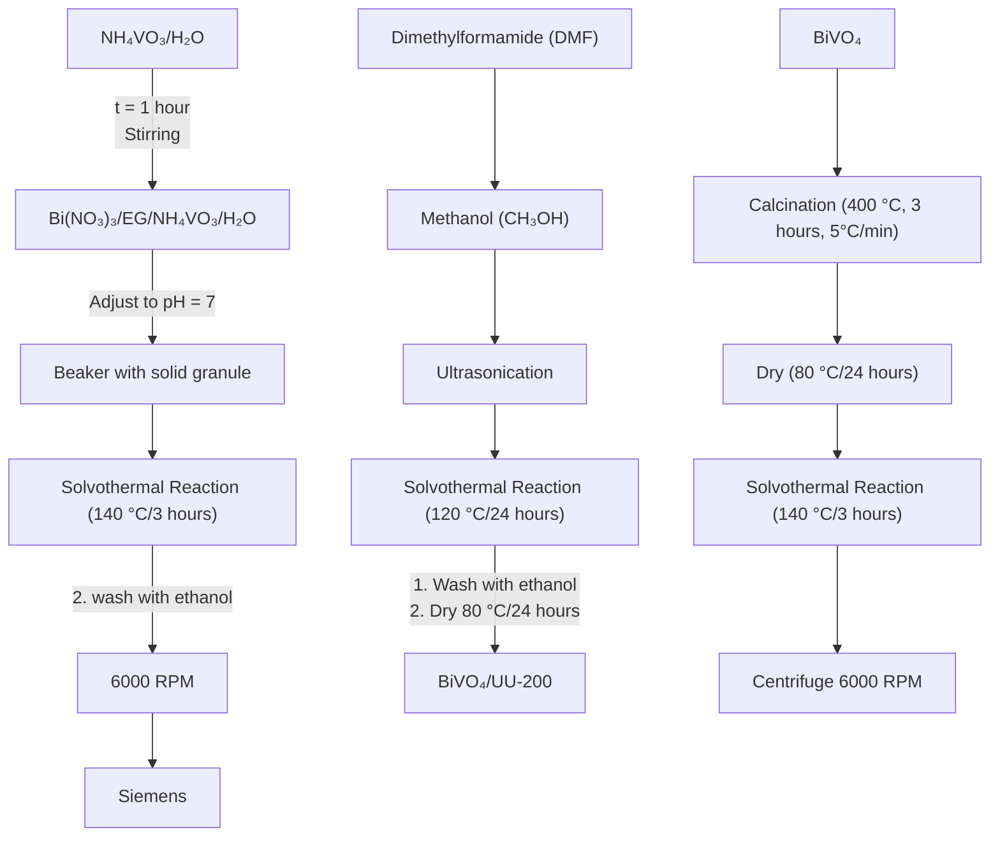

Scheme 1 Schematic illustration of the synthesis route and interfacial formation of the ${ \mathsf { B i V O } } _ { 4 } / { \mathsf { U U } } - 2 0 0$ heterostructure.

# 2.2. Synthesis of $\mathbf { B i V O _ { 4 } }$ via the solvothermal method

The ${ \bf B i V O _ { 4 } }$ catalysts, featuring a distinctive pine-like structure comprising dense branches, were synthesized through a solvothermal approach utilizing a solvent blend of EG and water.30 In this synthesis, an EG : water volume ratio of 1 : 1 was employed, with the precursors dissolved in 40 mL of EG and 40 mL of ${ \bf \ddot { H } } _ { 2 } { \bf O } ,$ respectively. Specically, $\mathbf { a _ { \delta } } 0 . 1 \mathbf { M _ { \delta } } \mathbf { B } \mathbf { i } ^ { 3 + }$ solution in EG was combined with a 0.1 M $\mathrm { v o } ^ { 3 - }$ aqueous solution and stirred for 1 h, resulting in a yellow suspension. The pH of the suspension was adjusted to a neutral level by adding an $\mathrm { N H } _ { 3 }$ solution. Subsequently, the mixture was transferred to an autoclave reactor and heated to 140 °C for 3 h under solvothermal conditions. Once the resulting suspension was cooled to room temperature, it was collected via centrifugation at 6000 rpm for 5 min, then washed multiple times with water and ethanol. The obtained $\mathrm { \bf B i V O _ { 4 } }$ powder was dried overnight at $8 0 ~ ^ { \circ } \mathrm { C } .$ Finally, the product was calcined at 400 °C for 3 h.

# 2.3. Synthesis of UU-200 via the solvothermal method

The synthesis of UU-200 was conducted using a solvothermal approach, as detailed in a previous publication.24 In this process, $\mathrm { B i } \left( \mathrm { N O } _ { 3 } \right) _ { 3 } \cdot 5 \mathrm { H } _ { 2 } \mathrm { O }$ (0.150 g, 0.303 mmol) and $\mathbf { H } _ { 3 } \mathbf { B } \mathbf { T } \mathbf { C }$ (1.340 g, 6.060 mmol) were dissolved in a mixture of 30 mL DMF and 30 mL MeOH. Subsequently, this solution was transferred into a 100 mL autoclave reactor. The solvothermal reaction was performed at $1 2 0 ~ ^ { \circ } \mathrm { C }$ for 24 h, followed by natural cooling to room temperature. The post-reaction mixture was centrifuged at 6000 rpm for 5 min to obtain the solid product. The collected UU-200 was then subjected to three washes with DMF and MeOH to remove residual $\mathbf { H } _ { 3 } \mathbf { B T C }$ molecules. The nal step involved drying the white UU-200 powder at 80 °C for 12 h.

# 2.4. Synthesis of $\mathbf { B i V O _ { 4 } / U U - 2 0 0 }$ composite via solvothermal method

A one-step solvothermal reaction was employed to synthesize $\mathrm { B i V O _ { 4 } / U U { - } } 2 0 0$ composites with varying mass ratios of $\mathrm { \bf { B i V O _ { 4 } } } .$ Initially, a specic amount of pure ${ \bf B i V O _ { 4 } }$ powder was dispersed in a 60 mL DMF and MeOH $( 1 : 1 , \mathbf { v } / \mathbf { v } )$ via ultrasonication for 60 min. Subsequently, a mixture of $\mathrm { B i } ( \mathrm { N O } _ { 3 } ) _ { 3 } { \cdot } 5 \mathrm { H } _ { 2 } \mathrm { O } \ ( 0 . 1 5 0 \ \mathrm { g } ,$ 0.303 mmol) and H3BTC (1.340 g, 6.060 mmol) was added to the above solution and stirred for 30 min. This solution was then transferred to an autoclave and heated to $1 2 0 ~ ^ { \circ } \mathrm { C }$ for 24 h. The resulting $\mathrm { B i V O _ { 4 } / U U { - } } 2 0 0$ products were collected by centrifugation and washed three times with DMF and MeOH. The solvents were then evaporated at 80 °C for 12 h. The obtained composites were denoted as x% $\mathrm { \bf B i V O _ { 4 } / U U - } 2 0 0$ , where x represents the mass percentage of $\mathrm { B i V O _ { 4 } } \left( x = 1 , 5 , 1 5 , \right.$ , and 25% w/w).

# 2.5. Material characterization

The structural, morphological, and physicochemical characteristics of the synthesized materials were comprehensively investigated using a suite of analytical techniques. Crystalline phases were examined by X-ray diffraction (XRD) employing Cu

Ka radiation over a 2q range of $5 ^ { \circ } - 8 0 ^ { \circ }$ with a step size of 0.02°. Functional groups and coordination environments were identied using Fourier-transform infrared (FT-IR) spectroscopy on a Bruker Tensor 27 in the range of 4000–500 cm−1 . Surface elemental composition and oxidation states were determined by X-ray photoelectron spectroscopy (XPS) using an AXIS SUPRA instrument (KRATOS Analytical Ltd). The morphology and elemental distribution were characterized by scanning electron microscopy (SEM) coupled with energy-dispersive X-ray spectroscopy (EDS) using a JEOL JSM-IT800 system. Ultravioletvisible diffuse reectance spectroscopy (UV-vis DRS) was conducted on a Cary 4000 UV-vis spectrophotometer to investigate the optical absorption behavior of the materials.

# 2.6. Photocatalytic activity measurement

The photocatalytic activity of the $\mathrm { B i V O _ { 4 } / U U - 2 0 0 }$ composites was evaluated via the degradation of RhB in a 100 mL glass reactor under visible-light irradiation. The light source consisted of a 40 W LED system assembled from multi-color Cree XLamp® XP-C LEDs (royal blue, blue, green, amber, red-orange, and red), providing a broad emission range of approximately 430– 630 nm. The LED array was positioned 50 cm above the liquid surface to maintain a uniform light intensity of approximately 100 mW $\mathrm { c m } ^ { - 2 }$ throughout all experiments.

In a typical photocatalytic experiment, 100 mL of RhB aqueous solution $( 1 5 ~ \mathrm { m g ~ L } ^ { - 1 } )$ was mixed with a predetermined dosage of catalyst (typically 10 mg unless otherwise stated). Prior to light irradiation, the suspension was magnetically stirred in the dark for 60 min to establish adsorption–desorption equilibrium. During irradiation, the suspension was continuously stirred to ensure uniform dispersion.

At given time intervals over a total reaction time of 120 min, 3 mL aliquots were withdrawn and immediately centrifuged to remove catalyst particles. The residual RhB concentration was determined using a UV-vis spectrophotometer (Cary 60, Agilent Technologies) by monitoring the absorbance at 554 nm.

The effects of catalyst dosage, initial RhB concentration, and solution pH on photocatalytic performance were systematically investigated using the 5% $\mathrm { B i V O _ { 4 } / U U { - } } 2 0 0$ composite. The catalyst dosage was varied from 5 to 20 mg (5, 10, 15, and 20 mg) at a xed RhB concentration of 25 mg ${ \bf L } ^ { - 1 } .$ . The initial RhB concentration was adjusted from 15 to 35 mg $\mathrm { L } ^ { - 1 } \left( 1 5 , 2 0 , 2 5 , 3 0 \right.$ , and 35 mg $\mathbf { L } ^ { - 1 } )$ at a constant catalyst dosage of 10 mg and pH 4.0. The effect of pH was evaluated in the range of 2–10 under xed conditions (catalyst dosage: 10 mg; RhB concentration: $2 5 ~ \mathrm { m g ~ L } ^ { - 1 }$ ; solution volume: 100 mL), with pH adjusted using dilute HCl or NaOH solutions.

All experiments were conducted at room temperature, and each test was performed at least in duplicate to ensure reproducibility.

# 2.7. Photoelectrochemical measurements

Electrochemical impedance spectroscopy (EIS) analysis was performed using an electrochemical workstation (AUTOLAB-PGSTAT204, Metrohm, Netherlands) equipped with a threeelectrode setup to assess the photoelectrochemical characteristics of the catalysts. The working electrode consisted of catalysts coated onto ITO glass, following established protocols from previous studies. The reference electrode was Ag/AgCl, the counter electrode was Pt, and the electrolyte was a 0.1 M ${ \bf N a } _ { 2 } { \bf S O } _ { 4 }$ solution.

# 3. Results and discussion

# 3.1. Physical structure analysis

The XRD method was employed to determine the composition and crystal structure of the $\mathrm { B i V O _ { 4 } / U U { - } } 2 0 0$ composites. As illustrated in Fig. 1A, the XRD pattern of $\mathrm { \bf B i V O _ { 4 } }$ displays characteristic peaks at 2q of 15.1°, 19.1°, 29.2°, 30.7°, 34.8°, 35.4°, 40.1° and 42.7°, corresponding to the crystal planes (011), (112), (004), (200), (020), (211), and (105), respectively. This pattern conrms the monoclinic phase of $\mathrm { \bf B i V O _ { 4 } }$ (ICSD code 100604).31,32 The XRD pattern of the UU-200 synthesized in this study closely matches the reported XRD pattern of UU-200 (CCDC 2103784), validating similar peak positions.24,33 Additionally, the prominent intensity and sharpness of the diffraction peaks suggest the high crystallinity of the synthesized UU-200. However, variations in peak intensities suggest differences in the crystal growth orientations compared to previous studies.33 In the $\mathrm { B i V O _ { 4 } / U U { - } } 2 0 0$ composites, the characteristic diffraction peaks of $\mathrm { \bf B i V O _ { 4 } }$ overlap with those of UU-200. As the $\mathrm { \bf B i V O _ { 4 } }$ content increases, the intensity of the BiVO4 diffraction peaks escalates proportionally (Fig. S1 and Table S1). Furthermore, noticeable shis are observed in the ${ \bf B i V O _ { 4 } }$ peaks at 19.1° and $2 9 . 0 ^ { \circ }$ within the $\mathrm { B i V O _ { 4 } / U U { - } } 2 0 0$ composites (Fig. S1), which could be attributed to lattice distortion induced by the formation of UU-200.25

The functional groups in $\mathrm { B i V O _ { 4 } } , \mathrm { U U - 2 0 0 } ,$ and $\mathrm { B i V O _ { 4 } / U U { - } } 2 0 0$ composites were analyzed by FT-IR spectroscopy. In the FT-IR spectrum of $\mathrm { B i V O } _ { 4 } \left( \mathrm { F i g } . \ 2 \right)$ , the bands at 740 and 850 $\mathrm { c m } ^ { - 1 }$ are assigned to the symmetric and asymmetric stretching vibrations of V–O in $\mathrm { \bf B i V O _ { 4 } } ,$ characteristic of the monoclinic phase of $\mathrm { B i V O _ { 4 } } . ^ { 3 4 }$ The FT-IR spectra of UU-200 and the $\mathrm { B i V O _ { 4 } / U U { - } } 2 0 0$ composites exhibit similar features. The band at 525 $\mathrm { c m } ^ { - 1 }$ is attributed to Bi–O vibrations, suggesting the presence of Bi–O coordination within the framework.35 Bands in the range of $7 2 5 { - } 7 6 0 ~ \mathrm { c m } ^ { - 1 }$ correspond to C–H bending vibrations of the benzene ring. Bands in the 1300– $1 7 0 0 ~ \mathrm { c m } ^ { - 1 }$ range are associated with symmetric and asymmetric stretching vibrations of carboxylate groups.24 A broad band at $3 2 0 0 { - } 3 7 0 0 ~ \mathrm { ~ c m } ^ { - 1 }$ is assigned to the stretching vibrations of O–H bonds of adsorbed water molecules.16 It is worth noting that the O–H bending vibration (typically around $1 6 3 0 ~ \mathrm { { c m } ^ { - 1 } ) }$ is not clearly observed, likely due to overlap with the intense asymmetric stretching of carboxylate groups in the $1 5 5 0 { - } 1 7 0 0 ~ \mathrm { ~ c m } ^ { - 1 }$ region. With increasing $\mathrm { \bf B i V O _ { 4 } }$ content, the relative intensity of the characteristic UU-200 bands (C–H and carboxylate vibrations) gradually decreases, which can be attributed to the reduced proportion of UU-200 and possible interfacial interactions in the composite. Similar trends have been reported in semiconductor-MOF composites, where increasing inorganic content leads to attenuation of MOF-related vibrational bands due to dilution effects and interfacial coupling, as commonly observed in semiconductor-MOF composite systems.28,36 This observation is consistent with the XRD analysis, further supporting the successful formation of the $\mathrm { B i V O _ { 4 } / U U { - } } 2 0 0$ heterostructure.

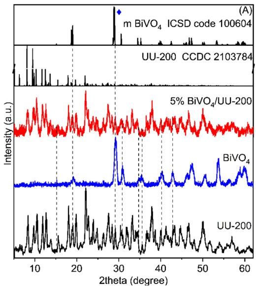

line

| 2theta (degree) | Intensity (a.u.) |
| --------------- | ---------------- |
| ~10             | ~0               |
| ~20             | ~0               |
| ~30             | ~0               |
| ~40             | ~0               |
| ~50             | ~0               |
| ~60             | ~0               |

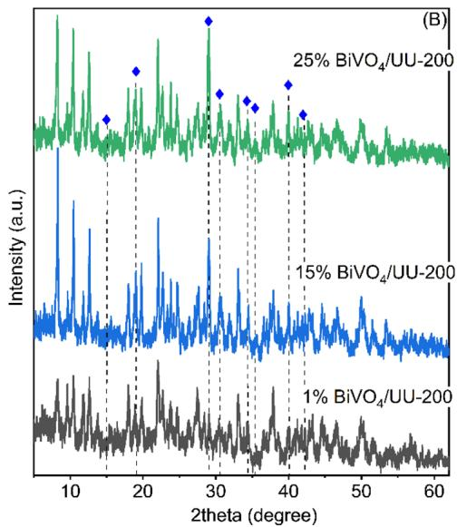

line

| 2theta (degree) | Intensity (a.u.) |
| --------------- | ---------------- |
| ~18             | ~0.8             |
| ~20             | ~0.9             |
| ~30             | ~1.0             |
| ~40             | ~0.7             |
| ~42             | ~0.6             |

Fig. 1 (A and B) XRD patterns of UU- ${ \cdot 2 0 0 , \mathsf { B i V O } _ { 4 , } }$ and ${ \mathsf { B i V O } } _ { 4 } / { \mathsf { U U } } .$ -200 composites.

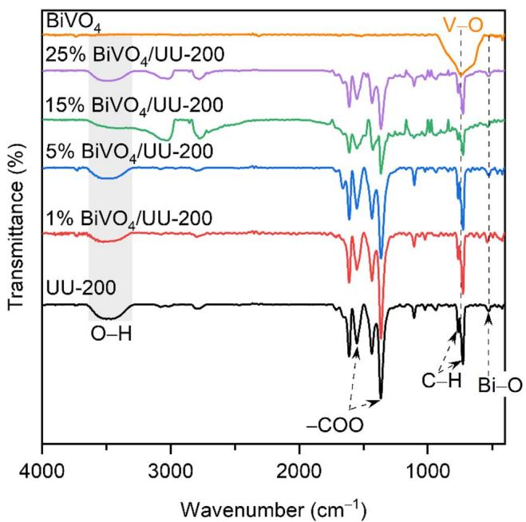  
Fig. 2 FT-IR spectra of UU-200, ${ \mathsf { B i V O } } _ { 4 }$ and ${ \mathsf { B i V O } } _ { 4 } / { \mathsf { U U } } - 2 0 0$ composites.

The morphology and elemental distribution of 5% $\mathrm { B i V O _ { 4 } } /$ UU-200 composite were recorded through SEM (Fig. 3 and S2). The pure $\mathrm { \bf B i V O _ { 4 } }$ exhibits a typical pine-like structure with numerous dense branches, varying in size from 5–10 mm $( { \mathrm { F i g } } . 3 { \mathrm { A } } 1 - { \mathrm { A } } 3 ) . ^ { 3 }$ 7 Meanwhile, UU-200 exhibits a rod-like structure, with these rods densely packed to form larger rods approximately 1.0 mm in diameter (Fig. 3B1–B3).24,33 The morphologies of $\mathrm { \bf B i V O _ { 4 } }$ and UU-200 are consistent with those reported in the existing literature. In Fig. 3C1–C3, the rod-like morphology of UU-200 persists, though the clustering appears less dense, likely inuenced by the presence of $\mathrm { \bf B i V O _ { 4 } }$ during composite synthesis. Despite the low ${ \bf B i V O _ { 4 } }$ content, its distribution is not clearly observed in the 1% $\mathrm { B i V O _ { 4 } / U U { - } } 2 0 0$ (Fig. S2A1–A3) and 5% $\mathrm { B i V O _ { 4 } / U U { - } } 2 0 0$ (Fig. 3C1–C3) composite samples. When the $\mathrm { \bf B i V O _ { 4 } }$ content increases to 15% and 25%, the pine-like structures of $\mathrm { \bf B i V O _ { 4 } }$ remain unchanged and intermingle with the UU-200 rods. Furthermore, the EDS mapping images of 5% $\mathrm { \ B i V O _ { 4 } / }$ UU-200 (Fig. 3D–G) conrm a uniform distribution of Bi, $\mathrm { \bf V , O , }$ and C elements. This uniformity signies the successful integration of $\mathrm { \bf B i V O _ { 4 } }$ and UU-200, facilitating efficient separation and transfer of photogenerated charge carriers during the photocatalytic process.25

The composition and surface chemical states of 5% $\mathrm { \bf B i V O _ { 4 } } /$ UU-200 were elucidated using XPS. All elemental peaks, including Bi, V, O, and $\mathbf { C } ,$ were observed (Fig. 4A), consistent with EDS mapping results. As shown in Fig. 4B, the peaks at binding energies (BEs) of 522.9–523.1 eV $\mathrm { ( V ~ 2 p _ { 1 / 2 } ) }$ and 516.9– 517.0 eV $\left( \mathrm { \nabla } \mathsf { V } \ 2 \mathsf { p } _ { 3 / 2 } \right)$ correspond to the V 2p doublet, which can be attributed to $\mathbf { V } ^ { 5 ^ { + } }$ ions on the surface.38 This result indicates that the vanadium ions in both ${ \bf B i V O _ { 4 } }$ and 5% $\mathrm { B i V O _ { 4 } / U U { - } } 2 0 0$ are present as $\mathbf { V } ^ { 5 ^ { + } }$ . The C 1s spectrum of UU-200 can be deconvoluted into four peaks at 286.2 $\mathrm { e V , }$ 285.0 eV, 287.9 eV, and 290.1 $\mathbf { e V } ,$ corresponding to $\scriptstyle \mathbf { C } - \mathbf { O } , \mathbf { C } - \mathbf { C } / \mathbf { C } = \mathbf { C } , \mathbf { C } = \mathbf { O } ,$ , and ${ \bf O - C = O }$ bonds of $\mathbf { H } _ { 3 } \mathbf { B T C }$ in UU-200, respectively.35 For 5% $\mathrm { B i V O _ { 4 } / U U }$ - 200, the C 1s peaks resemble those of UU-200, further con-rming the presence of UU-200 in the composite. The Bi $4 \mathrm { f } _ { 7 / 2 }$ and Bi $4 \mathrm { f } _ { 5 / 2 }$ peaks at 159.1–160.0 eV and 164.4–165.3 eV, respectively, are characteristic of ${ \bf B i } ^ { 3 + }$ , indicating that bismuth ions in both $\mathrm { \bf B i V O _ { 4 } }$ and 5% $\mathrm { B i V O _ { 4 } / U U { - } } 2 0 0$ exist in the trivalent state.39 The peaks at 530.1–531.4 eV in the O 1s spectra (Fig. 3E) can be assigned to lattice oxygen species.40 The peaks at 531.7 eV are attributed to C–O bonds within UU-200 (ref. 24) while those ranging from 531.6–532.9 eV likely stem from O–H groups related to adsorbed water on the sample surface40 as compared with single-component $\mathrm { \bf B i V O _ { 4 } }$ and UU-200, which reveals noticeable BE shis in 5% $\mathrm { \bf B i V O _ { 4 } / U U - } 2 0 0 .$ , indicating electron transfer between these two materials.35 Therefore, it can be concluded that there is an interaction at the interface of the $\mathrm { B i V O _ { 4 } / U U { - } } 2 0 0$ composite, enhancing the separation and transfer of photogenerated charge carriers, thereby improving the efficiency of the photocatalytic process.41

text_image

(A1) BiVO₄
10 µm

text_image

(A2) BiVO₄
5 µm

natural_image

Microscopic image of BiVO4 surface with 300 nm scale bar (no text or symbols on the structure itself)

natural_image

Microscopic view of fibrous material labeled (B1) UU-200 with 10 μm scale bar (no text beyond labels)

natural_image

Microscopic view of fibrous material labeled (B2) UU-200 with 5 μm scale bar, showing no readable text or symbols beyond label and scale.

natural_image

Microscopic view of fibrous structures with 300 nm scale bar, labeled (B3) UU-200 (no other text or symbols)

natural_image

Microscopic image of fibrous material under 5% BiVO4/UU-200 condition, scale bar 10 μm (no text or symbols beyond labels)

natural_image

Microscopic image of fibrous material under 5% BiVO4/UU-200 condition, scale bar 5 μm (no text or symbols on the fibers themselves)

natural_image

Microscopic image of fibrous material under BiVO4/UU-200 condition, scale bar 300 nm (no text or symbols on the fibers themselves)

natural_image

Microscopic image of fibrous structures with 5 μm scale bar, labeled (D) and Bi Mα1 (no additional text or symbols)

natural_image

Microscopic image of V Kα1 protein with 5 μm scale bar, showing purple cellular structures (no text or symbols beyond labels)

natural_image

Microscopic image of green fluorescent structures labeled O Kα1 with 5 μm scale bar (no text beyond labels)

natural_image

Microscopic image of a textured surface with scale bar indicating 5 μm, labeled (G) and C Kα1,2 (no other text or symbols)

Fig. 3 SEM images of BiVO4 (A1–A3), UU-200 (B1–B3), and 5% BiVO4/UU-200 (C1–C3); EDS elemental mapping images of 5% ${ \mathsf { B i V O } } _ { 4 } / { \mathsf { U U } } - 2 0 0 \mathrm { : }$ : Bi (D), V (E), O (F), C (G).

The specic surface area plays a pivotal role in determining the photocatalytic activity of catalysts. To ascertain these issues, the BET surface area of the samples was measured through nitrogen adsorption–desorption isotherms. In Fig. 5, the nitrogen adsorption–desorption isotherms and the pore size distribution curves for the synthesized $\mathrm { \bf B i V O _ { 4 } } ,$ UU-200, and 5% $\mathrm { B i V O _ { 4 } / U U - 2 0 0 }$ composites are depicted. Fig. 5A illustrates a type IV adsorption–desorption isotherm displaying a pronounced hysteresis loop at $P / P _ { 0 } \ \ge \ 0 . 8 .$ , characteristic of mesoporous materials.42 The pore-size distribution curves corroborate the presence of both mesopores and micropores in these samples. The specic surface areas were 2.7, 8.3, and $1 0 . 5 \ \mathrm { m } ^ { 2 } \ \mathrm { g } ^ { - 1 }$ for $\mathrm { \ B i V O _ { 4 } , }$ , UU-200, and 5% $\mathrm { \bf B i V O _ { 4 } / U U - } 2 0 0 .$ , respectively, aligning with the SEM ndings. These low BET surface areas may result from the inherent temperature sensitivity of the UU-200 framework, in which signicant linker breakdown and structural disorder occur during synthesis, leading to micropore collapse. The presence of ${ \bf B i V O _ { 4 } }$ nanoparticles within the channels of the 5% $\mathrm { B i V O _ { 4 } / U U { - } } 2 0 0$ composite obstructs adsorption paths and diminishes the available pore space. A heightened surface area is anticipated to provide more active surface sites, thereby facilitating enhanced charge-carrier transport and contributing to improved photocatalytic performance.43

The optical characteristics of $\mathrm { \bf B i V O _ { 4 } } ,$ UU-200, and their composites $\mathrm { B i V O _ { 4 } / U U { - } } 2 0 0$ were analyzed through UV-vis diffuse reectance spectroscopy. As depicted in Fig. 6A, the absorption thresholds of ${ \bf B i V O _ { 4 } }$ and UU-200 are observed at approximately

Fig. 4 XPS spectra of $B i V O _ { 4 } ,$ UU-200 and 5% ${ \mathsf { B i V O } } _ { 4 } / { \mathsf { U U } }$ -200: full survey scan (A); the high-resolution XPS spectra of the V 2p (B), C 1s (C), Bi 4f (D), and O 1s (E).

529 nm and 325 nm, respectively, consistent with previously reported results.24,25,39 The $\mathrm { B i V O _ { 4 } / U U { - } } 2 0 0$ composites exhibit a combined absorption prole that reects the characteristics of both components. Clearly, the integration of $\mathrm { \bf B i V O _ { 4 } }$ into UU-200 has a minimal impact on the absorption edge, suggesting that the light absorption of UU-200 and $\mathrm { B i V O _ { 4 } / U U { - } } 2 0 0$ composites is similar. By plotting $\left( \alpha h \nu \right) ^ { 2 }$ against (hn) (Fig. 6B),44 The band gap energies $\left( E _ { \mathrm { g } } \right)$ were estimated as 2.37 eV for $\mathrm { \bf B i V O _ { 4 } }$ and 3.70 eV for UU-200.

The effective separation and migration of photoexcited charge carriers, coupled with interfacial charge-separation performance, are critical factors in determining photocatalytic efficacy. Our exploration of these factors involved conducting PL and EIS measurements on $\mathrm { \mathbf { B i V O _ { 4 } } , }$ 5% $\mathrm { \bf B i V O _ { 4 } / U U - } 2 0 0$ , and UU-200 samples. The PL spectrum, reecting the recombination of electron–hole $\left( \mathrm { e } ^ { - } / \mathrm { h } ^ { + } \right)$ pairs, offers valuable insight into the recombination and migration dynamics of charge carriers.45 Fig. 6C displays the PL spectra of the prepared materials under excitation at 315 nm. Although the emission signals for the Bibased samples appear relatively broad and low in intensity— a common characteristic of narrow-bandgap semiconductors like $\mathrm { \bf B i V O _ { 4 } }$ (2.37 eV) which oen exhibit low radiative recombination efficiency—the relative quenching behavior provides critical insights into charge dynamics. The excitation wavelength of 315 nm was specically selected to ensure the simultaneous excitation of both the wide-bandgap UU-200 and the visible-light-responsive $\mathrm { \mathbf { B i V O _ { 4 } } , }$ allowing for a comprehensive observation of the interfacial charge-transfer process. Notably, the 5% $\mathrm { B i V O _ { 4 } / U U { - } } 2 0 0$ composite exhibits a pronounced decrease in PL intensity compared to both pristine UU-200 and $\mathrm { \mathbf { B i V O _ { 4 } } , }$ indicating a signicant suppression of photogenerated electron–hole recombination. Furthermore, the Nyquist plot (Fig. 6D) reveals that the 5% BiVO4/UU-200 photocatalyst exhibits a smaller arc radius than the pristine UU-200, indicating reduced charge-transfer resistance and improved interfacial charge transport.46 Notably, although pure $\mathrm { \bf B i V O _ { 4 } }$ exhibits an even smaller arc radius, its photocatalytic performance is oen limited by rapid electron–hole recombination. In contrast, the $\mathrm { B i V O _ { 4 } / U U { - } } 2 0 0$ composite benets from the formation of an interfacial heterojunction, which facilitates efficient spatial charge separation and suppresses recombination, as evidenced by the pronounced PL quenching. Taken together, these results conrm that the $\mathrm { \bf B i V O _ { 4 } / U U - } 2 0 0$ interfacial heterojunction effectively enhances the spatial separation and transport of photogenerated charge carriers. Although transient photocurrent and time-resolved PL measurements were not conducted, the signicant PL quenching and decreased charge-transfer resistance provide compelling indirect evidence of improved charge-separation efficiency. This enhanced charge management is therefore expected to play a key role in the superior photocatalytic activity of the $\mathrm { B i V O _ { 4 } } /$ UU-200 composite, as validated by the subsequent degradation experiments. To elucidate the band structure and interfacial charge-transfer behavior of the heterojunction, Mott–Schottky analyses were conducted for $\mathrm { { U U } \mathrm { { - } 2 0 0 , B i V O _ { 4 } , } }$ and the $5 \% \mathrm { B i V O _ { 4 } / }$ UU-200 composite (Fig. S2). All samples display positive slopes, indicating n-type semiconductor behavior. The at-band potentials $\left( E _ { \mathrm { f b } } \right)$ , obtained from the x-intercepts, are approximately 1.30 V for UU-200, 0.60 V for ${ \bf B i V O _ { 4 } } ,$ and 1.15 V for the $\mathrm { B i V O _ { 4 } / U U { - } } 2 0 0$ composite (vs. Ag/AgCl). For n-type semiconductors, the conduction band edge lies close to $E _ { \mathrm { f b } } ;$ accordingly, UU-200 exhibits a much more negative conduction band position than ${ \bf B i V O _ { 4 } } ,$ while the composite shows an intermediate value, consistent with interfacial band bending induced by heterojunction formation. The shi in the at-band potential of the composite relative to the individual components evidences the formation of an internal electric eld directed from $\mathrm { \bf B i V O _ { 4 } }$ toward UU-200 upon interfacial contact. This built-in eld promotes the migration and accumulation of photogenerated electrons from UU-200 at the interface, while concurrently preserving holes in $\mathbf { B i V O _ { 4 } } ;$ meanwhile, carriers with a lower redox potential recombine across the junction. Such an interfacial band conguration is characteristic of an Sscheme heterojunction, allowing the composite to retain strong redox capability while simultaneously enhancing spatial charge separation.47 These results align well with the PL quenching and reduced charge-transfer resistance observed for the 5% $\mathrm { \bf B i V O _ { 4 } } /$ UU-200 sample, collectively accounting for its superior photocatalytic performance.

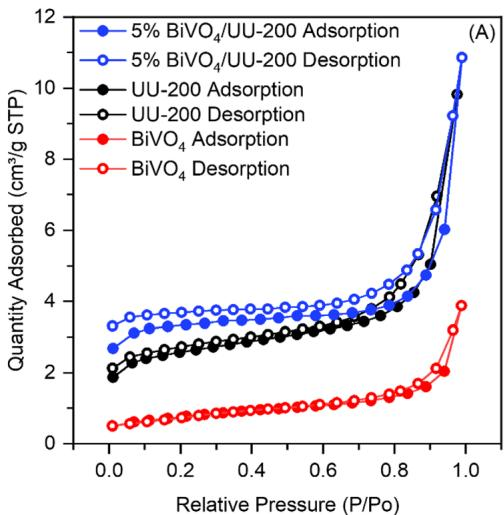

line

| Relative Pressure (P/Po) | 5% BiVO₄/UU-200 Adsorption | 5% BiVO₄/UU-200 Desorption | UU-200 Adsorption | UU-200 Desorption | BiVO₄ Adsorption | BiVO₄ Desorption |
| ------------------------ | -------------------------- | -------------------------- | ----------------- | ----------------- | ---------------- | ---------------- |
| 0.0                      | ~3.0                       | ~3.5                       | ~2.0              | ~2.5              | ~0.5             | ~0.5             |
| 0.2                      | ~3.2                       | ~3.7                       | ~2.2              | ~2.8              | ~0.6             | ~0.6             |
| 0.4                      | ~3.4                       | ~3.9                       | ~2.4              | ~3.0              | ~0.7             | ~0.7             |
| 0.6                      | ~3.6                       | ~4.1                       | ~2.6              | ~3.2              | ~0.8             | ~0.8             |
| 0.8                      | ~4.0                       | ~4.5                       | ~3.0              | ~3.8              | ~1.0             | ~1.0             |
| 1.0                      | ~11.0                      | ~11.0                      | ~5.0              | ~5.0              | ~4.0             | ~4.0             |

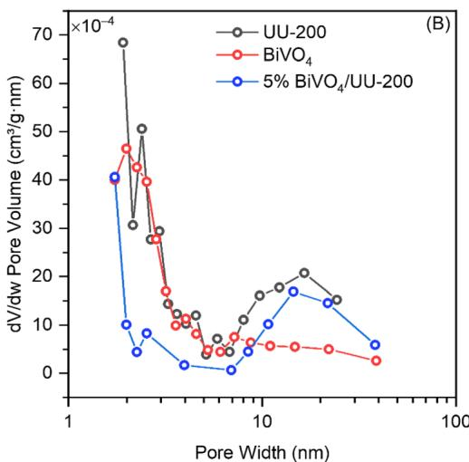

line

| Pore Width (nm) | UU-200 (dV/dw Pore Volume ×10⁻⁴ cm³/g·nm) | BiVO₄ (dV/dw Pore Volume ×10⁻⁴ cm³/g·nm) | 5% BiVO₄/UU-200 (dV/dw Pore Volume ×10⁻⁴ cm³/g·nm) |
| --------------- | ------------------------------------------ | ------------------------------------------ | -------------------------------------------------- |
| 1               | 68.0                                       | 45.0                                       | 40.0                                               |
| 2               | 30.0                                       | 40.0                                       | 10.0                                               |
| 3               | 50.0                                       | 35.0                                       | 8.0                                                |
| 4               | 28.0                                       | 25.0                                       | 5.0                                                |
| 5               | 25.0                                       | 20.0                                       | 3.0                                                |
| 6               | 20.0                                       | 15.0                                       | 2.0                                                |
| 7               | 15.0                                       | 10.0                                       | 1.0                                                |
| 8               | 10.0                                       | 8.0                                        | 0.5                                                |
| 9               | 8.0                                        | 6.0                                        | 0.3                                                |
| 10              | 6.0                                        | 5.0                                        | 0.2                                                |
| 20              | 20.0                                       | 5.0                                        | 15.0                                               |
| 30              | 15.0                                       | 4.0                                        | 10.0                                               |
| 40              | 12.0                                       | 3.0                                        | 8.0                                                |
| 50              | 10.0                                       | 2.0                                        | 6.0                                                |
| 60              | 8.0                                        | 1.5                                        | 5.0                                                |
| 70              | 6.0                                        | 1.0                                        | 4.0                                                |
| 80              | 5.0                                        | 0.8                                        | 3.5                                                |
| 90              | 4.0                                        | 0.6                                        | 3.0                                                |
| 100             | 3.0                                        | 0.5                                        | 2.5                                                |

Fig. 5 (A) N2 adsorption–desorption isotherms and (B) pore size distributions of ${ \mathsf { B i V O } } _ { 4 } ,$ UU-200 and 5% ${ \mathsf { B i V O } } _ { 4 } / { \mathsf { U U } } { - } 2 0 0$ composites.

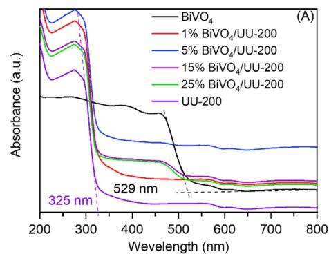

line

| Wavelength (nm) | BiVO₄ | 1% BiVO₄/UU-200 | 5% BiVO₄/UU-200 | 15% BiVO₄/UU-200 | 25% BiVO₄/UU-200 | UU-200 |
| --------------- | ----- | --------------- | --------------- | ---------------- | ---------------- | ------ |
| 325             | -     | -               | -               | -                | -                | -      |
| 529             | -     | -               | -               | -                | -                | -      |

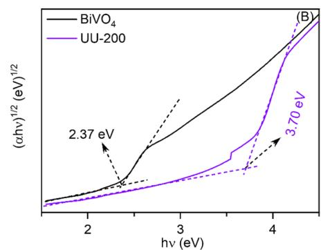

line

| hv (eV) | BiVO₄ (αhv)¹/² (eV)¹/² | UU-200 (αhv)¹/² (eV)¹/² |
| ------- | ------------------------ | ------------------------- |
| 2       | ~0.1                     | ~0.05                     |
| 3       | ~0.8                     | ~0.4                      |
| 4       | ~2.37                    | ~3.70                     |

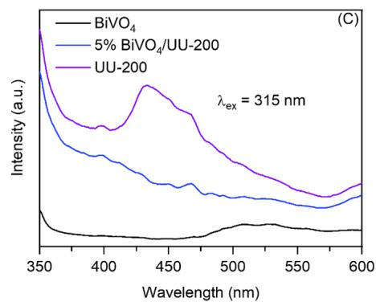

line

| Wavelength (nm) | BiVO₄ | 5% BiVO₄/UU-200 | UU-200 |
| --------------- | ----- | --------------- | ------ |
| 350             | ~0    | ~0              | ~0     |
| 400             | ~0    | ~0              | ~0     |
| 450             | ~0    | ~0              | ~0     |
| 500             | ~0    | ~0              | ~0     |
| 550             | ~0    | ~0              | ~0     |
| 600             | ~0    | ~0              | ~0     |

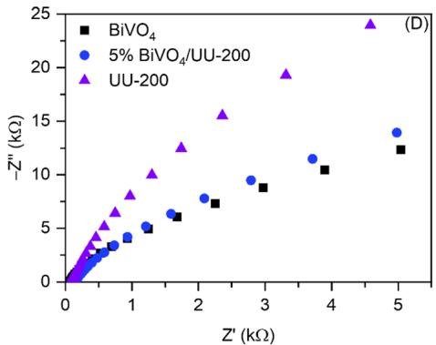

scatter

| Material           | Z' (kΩ) | -Z'' (kΩ) |
| ------------------ | ------- | --------- |
| BiVO₄              | 1.5     | 6.0       |
| BiVO₄              | 2.0     | 7.0       |
| BiVO₄              | 3.0     | 8.0       |
| BiVO₄              | 4.0     | 10.0      |
| BiVO₄              | 5.0     | 12.0      |
| 5% BiVO₄/UU-200    | 1.0     | 4.0       |
| 5% BiVO₄/UU-200    | 1.5     | 5.0       |
| 5% BiVO₄/UU-200    | 2.5     | 9.0       |
| 5% BiVO₄/UU-200    | 3.5     | 11.0      |
| 5% BiVO₄/UU-200    | 4.5     | 13.0      |
| UU-200             | 0.5     | 3.0       |
| UU-200             | 1.0     | 6.0       |
| UU-200             | 1.5     | 10.0      |
| UU-200             | 2.0     | 13.0      |
| UU-200             | 3.0     | 19.0      |
| UU-200             | 4.5     | 24.0      |

Fig. 6 UV-vis diffuse reflectance spectra (A) of ${ \mathsf { B i V O } } _ { 4 } , { \mathsf { U U } } { - } 2 0 0$ , and ${ \mathsf { B i V O } } _ { 4 } / { \mathsf { U U } } { - } 2 0 0$ composites; band gap energies (B), PL spectra, and EIS Nyquist plots (C) and Mott–Schottky plots (D) of ${ \mathsf { B i V O } } _ { 4 } ,$ , UU-200, and 5% ${ \mathsf { B i V O } } _ { 4 } / { \mathsf { U U } } { - } 2 0 0$ composite.

# 3.2. Photocatalytic activity

The photocatalytic performance of the prepared catalysts was evaluated through a photodegradation experiment using RhB. The 5% $\mathrm { B i V O _ { 4 } / U U { - } 2 0 0 }$ catalyst exhibited signicantly enhanced performance compared to UU-200 and ${ \bf B i V O _ { 4 } }$ . As depicted in Fig. 7A, in the absence of catalysts, the self-degradation rate of RhB was negligible. To achieve adsorption–desorption equilibrium, the catalyst-containing solution was stirred in the dark for 60 min before irradiation with LED light. Aer 120 min of LED light exposure, the removal efficiency of RhB for UU-200 and ${ \bf B i V O _ { 4 } }$ reached 92.35% and 11.85%, respectively. The $5 \% \mathrm { B i V O _ { 4 } / }$ UU-200 catalyst achieved a remarkable 96.79% removal efficiency under the same conditions. The removal efficiencies of RhB for 1% $\mathrm { B i V O _ { 4 } / U U - 2 0 0 , 1 5 \% \ B i V O _ { 4 } / U U - 2 0 0 }$ , and $2 5 \% \mathrm { B i V O _ { 4 } / }$ UU-200 were 89.16%, 93.70%, and 92.77%, respectively, slightly lower than that of the 5% $\mathrm { B i V O _ { 4 } / U U - 2 0 0 \ : ( F i g . \ : 7 B ) }$ . The reduced performance at lower $\mathrm { \bf B i V O _ { 4 } }$ content can be attributed to insufficient heterojunction formation, which hinders the effective separation of photogenerated electron–hole pairs, resulting in decreased photocatalytic efficacy. Conversely, a higher ${ \bf B i V O _ { 4 } }$ content may impede RhB adsorption on the photocatalyst surface, thereby reducing photocatalytic activity. Therefore, the 5% $\mathrm { B i V O _ { 4 } / U U - 2 0 0 }$ composite exhibited the highest photocatalytic activity among all samples due to the formation of an optimal heterojunction between BiVO4 and UU-200, facilitating efficient separation and migration of photogenerated charge carriers during the photoreaction.48 Additionally, the pseudo-rst-order kinetic model was employed to t the photocatalytic reaction rates of different photocatalysts.49 As shown in Fig. 7C and D, the apparent rate constant $\left( k _ { \mathrm { a p p } } \right)$ of 5% $\mathrm { B i V O _ { 4 } / U U { - } } 2 0 0$ was the highest at $\left( 2 7 . 8 \times 1 0 ^ { - 3 } \right)$ min−1 , surpassing those of UU-200 $\left( 2 3 \times 1 0 ^ { - 3 } \operatorname* { m i n } ^ { - 1 } \right)$ and BiVO4 (0.82 $\times \ : 1 0 ^ { - 3 } )$ min−1 by 1.21 and 33.90 times, respectively.

To further position the present work within the current research context, a comparison of representative Bi-based photocatalysts for RhB degradation is summarized in Table 1. It can be observed that previously reported systems, such as $\mathrm { B i V O _ { 4 } / C A U { - } 1 7 }$ and BiOCl/CAU-17, achieved high degradation efficiencies under xenon lamp irradiation. However, these systems oen rely on high-intensity light sources or higher catalyst dosages. In contrast, the $\mathrm { B i V O _ { 4 } / U U { - } 2 0 0 }$ composite developed in this study demonstrates competitive photocatalytic performance (96.79% degradation within 120 min) under low-power LED irradiation (40 W) and a relatively low catalyst dosage $( 0 . 1 \mathrm { g } \mathbf { L } ^ { - 1 } )$ , highlighting its potential for energyefficient applications. Although the reaction time is slightly longer than that of some reported systems, the use of milder irradiation conditions and reduced energy input provides a practical advantage.

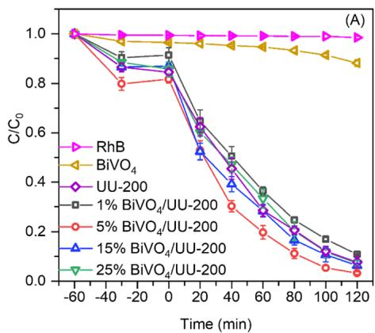

line

| Time (min) | RhB   | BiVO₄ | UU-200 | 1% BiVO₄/UU-200 | 5% BiVO₄/UU-200 | 15% BiVO₄/UU-200 | 25% BiVO₄/UU-200 |
| ---------- | ----- | ----- | ------ | --------------- | --------------- | ---------------- | ---------------- |
| -60        | 1.0   | 1.0   | 1.0    | 1.0             | 1.0             | 1.0              | 1.0              |
| -40        | 1.0   | 1.0   | 1.0    | 1.0             | 1.0             | 1.0              | 1.0              |
| -20        | 1.0   | 1.0   | 1.0    | 1.0             | 1.0             | 1.0              | 1.0              |
| 0          | 1.0   | 1.0   | 1.0    | 1.0             | 1.0             | 1.0              | 1.0              |
| 20         | 1.0   | 1.0   | 1.0    | 1.0             | 1.0             | 1.0              | 1.0              |
| 40         | 1.0   | 1.0   | 1.0    | 1.0             | 1.0             | 1.0              | 1.0              |
| 60         | 1.0   | 1.0   | 1.0    | 1.0             | 1.0             | 1.0              | 1.0              |
| 80         | 1.0   | 1.0   | 1.0    | 1.0             | 1.0             | 1.0              | 1.0              |
| 100        | 1.0   | 1.0   | 1.0    | 1.0             | 1.0             | 1.0              | 1.0              |
| 120        | 1.0   | 1.0   | 1.0    | 1.0             | 1.0             | 1.0              | 1.0              |

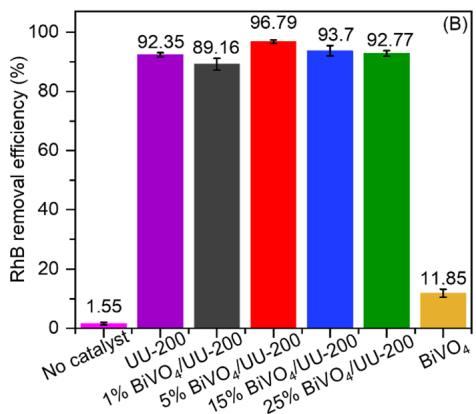

bar

| Catalyst Condition | RhB removal efficiency (%) |
| ------------------ | --------------------------- |
| No catalyst        | 1.55                        |
| UU-200             | 92.35                       |
| 1% BiVO₄/UU-200     | 89.16                       |
| 5% BiVO₄/UU-200     | 96.79                       |
| 15% BiVO₄/UU-200    | 93.7                        |
| 25% BiVO₄/UU-200    | 92.77                       |
| BiVO₄              | 11.85                       |

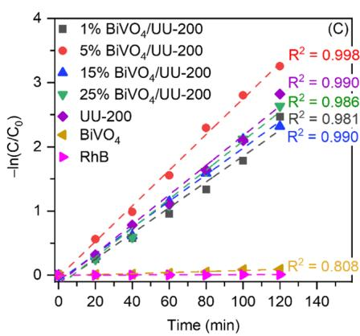

line

| Sample | R² Value |
|--------|----------|
| 1% BiVO₄/UU-200 | 0.998 |
| 5% BiVO₄/UU-200 | 0.990 |
| 15% BiVO₄/UU-200 | 0.986 |
| 25% BiVO₄/UU-200 | 0.981 |
| UU-200 | 0.990 |
| BiVO₄ | 0.808 |

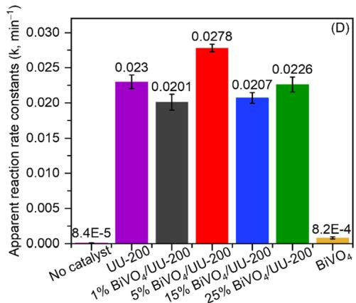

bar

| Catalyst | Apparent reaction rate constants (k, min⁻¹) |
| :--- | :--- |
| No catalyst | 8.4E-5 |
| UU-200 | 0.023 |
| 1% BIVO₄/UU-200 | 0.0201 |
| 5% BIVO₄/UU-200 | 0.0278 |
| 15% BIVO₄/UU-200 | 0.0207 |
| 25% BIVO₄/UU-200 | 0.0226 |
| BiVO₄ | 8.2E-4 |

Fig. 7 Time courses of photocatalytic degradation of RhB (A) and the corresponding removal efficiency of RhB after 120 min of LED light irradiation over ${ \mathsf { B i V O } } _ { 4 } / { \mathsf { U U } }$ -200 composites and their individual components (B); pseudo-first-order kinetics for RhB (C) and the corresponding apparent reaction rate constants k (D). Conditions: [catalyst] = 10 mg, $[ \mathsf { R h B } ] = 1 5 \mathsf { m g L } ^ { - 1 } , V _ { \mathsf { R h B } } = 1 0 0$ mL, pH 5.6. The source data are provided in Table S3.

Table 1 Comparison of photodegradation performances of Bi-MOF-based composite photocatalysts against RhB dye 

<table><tr><td>Photocatalysts</td><td>Light sources</td><td>Dosage (g L-1)</td><td>C0(mg L-1)</td><td>Time (min)</td><td>Photodegradation efficiency (%)</td><td>Refs</td></tr><tr><td>BiVO4/CAU-17</td><td>300 W xenon</td><td>1.0</td><td>10</td><td>60</td><td>99.3</td><td>25</td></tr><tr><td>BiOCl/CAU-17</td><td>40 W LED</td><td>0.15</td><td>15</td><td>60</td><td>96.0</td><td>50</td></tr><tr><td>Bi2WO6/CAU-17</td><td>500 W xenon</td><td>0.4</td><td>10</td><td>60</td><td>80</td><td>51</td></tr><tr><td>BiOBr/CAU-17</td><td>500 W xenon</td><td>0.2</td><td>20</td><td>50</td><td>85.7</td><td>35</td></tr><tr><td>BiVO4/UU-200</td><td>40 W LED</td><td>0.1</td><td>15</td><td>120</td><td>96.8</td><td>This work</td></tr></table>

This enhanced performance can be attributed to the synergistic effect between heterojunction formation and dyesensitization, in which UU-200 acts as an interfacial chargetransfer mediator rather than a primary photoactive component. These results highlight the potential of Bi-MOF-assisted heterostructures for efficient and energy-saving photocatalytic applications.

Fig. S4A illustrates the UV-visible absorption spectra of RhB solution undergoing degradation by 5% $\mathrm { B i V O _ { 4 } / U U { - } } 2 0 0$ over successive irradiation periods. As the irradiation duration increases, the dominant peak at 554 nm, corresponding to the absorption of RhB molecules, gradually decreases and shis to shorter wavelengths. This shi indicates the degradation of RhB molecules via demethylation.52 This observation conrms that the degradation process of RhB is propelled by photocatalysis rather than adsorption. Additionally, the photocatalytic efficacy of the physical blend comprising 5% BiVO4 and 95% UU-200 notably lags behind that of the 5% $\mathrm { \bf B i V O _ { 4 } / U U - }$ 200 composite (Fig. S4B). These results further corroborate that the enhanced photocatalytic performance of the $5 \% \mathrm { B i V O _ { 4 } / U U } \mathrm { - }$ 200 composite is attributable to the establishment of heterojunctions between ${ \bf B i V O _ { 4 } }$ and UU-200, rather than the presence of both catalysts in isolation. Moreover, as shown in Fig. S4B, the composite displays a markedly faster decline in $C / C _ { 0 } ,$ , supported by its higher apparent rate constant $( k _ { \mathrm { a p p } } = 2 . 7 3 ~ \times$ $1 0 ^ { - 2 } \operatorname* { m i n } ^ { - 1 } )$ relative to the physical mixture $\left( 2 . 1 4 \times 1 0 ^ { - 2 } \operatorname* { m i n } ^ { - 1 } \right)$ and pristine UU-200 $\left( 2 . 0 1 \ \ \times \ 1 0 ^ { - 2 } \ \mathrm { \ m i n } ^ { - 1 } \right)$ . This kinetic enhancement, in conjunction with the previously observed PL quenching and reduced charge-transfer resistance, conrms that the improved activity stems from effective heterojunctionmediated charge separation rather than simple physical mixing. To conrm the dye is not only decolourized but also largely converted into inorganic end products rather than remaining as organic intermediates. The TOC of RhB was measured before and aer degradation. Total organic carbon of rhodamine B decreases signicantly aer photodegradation (from 26.96 mg $\mathrm { L } ^ { - 1 }$ to 3.98 mg L−1 ), indicating effective mineralization into $\mathrm { C O } _ { 2 }$ and $\mathbf { H } _ { 2 } \mathbf { O } .$ Studies have reported an over 85.2% reduction in TOC.

# 3.3. The inuence of catalyst dose, initial RhB concentration, and initial solution pH

The impact of catalyst dosage on the photocatalytic degradation rate of RhB was examined. As depicted in Fig. 8A, the escalation in the dosage of 5% $\mathrm { B i V O _ { 4 } / U U { - } } 2 0 0$ in the range of 5 to 10 mg led to a rapid enhancement in the photocatalytic degradation rate of RhB. Subsequently, a gradual increase was observed as the catalyst dosage was increased from 10 to 25 mg, reaching an optimal point at 25 mg. It is well established that a higher catalyst dosage can increase the production of electrons and holes, thereby improving the efficiency of RhB decomposition. However, an excessive amount of catalyst may restrict incident radiation from effectively interacting with the catalytic surface.53 The effect of initial RhB concentration on the photocatalytic efficiency was further examined (Fig. 8B). It was observed that the efficiency of RhB decomposition diminished as the RhB concentration increased. This reduction is attributed to the increased color density surrounding the active catalyst sites, which impede light penetration to the catalytic surface.54 Additionally, the initial pH of the solution plays a signicant role in inuencing photocatalytic activity by affecting both the adsorption behavior of the dye and the generation of reactive species on the catalyst surface.55 The results (Fig. 8C) reveal that the degradation efficiency of 5% $\mathrm { B i V O _ { 4 } / U U { - } } 2 0 0$ for RhB remains relatively stable over a broad pH range (pH 2–6), indicating its applicability under acidic conditions. Notably, the highest RhB degradation efficiency is observed at pH 2 and decreases with increasing pH. The pH point of zero charge $\left( \mathrm { p H } _ { \mathrm { p z c } } \right) \left( \mathrm { F i g } . \ 8 \mathrm { D } \right)$ is approximately 3.26. Below this value, the catalyst surface is positively charged, which is unfavorable for the adsorption of cationic RhB. Conversely, at $\mathrm { \ p H > \mathsf { p H } _ { \mathrm { p z c } } , }$ the negatively charged surface promotes cation adsorption. However, the enhanced photocatalytic activity at low pH is attributed to improved charge-transfer kinetics and increased generation of reactive oxygen species under acidic conditions. In addition, a dyesensitization pathway contributes, where photoexcited RhB molecules inject electrons into the conduction band of UU-200, which subsequently participates in interfacial charge transfer with $\mathrm { \bf B i V O _ { 4 } }$ even with limited adsorption. At higher pH values, although adsorption is enhanced, excessive dye coverage may block active sites and hinder light penetration, thereby reducing photocatalytic efficiency.54 The catalyst was also used for photodegradation of other dyes. Pure $\mathrm { \bf B i V O _ { 4 } }$ achieves ∼45% degradation aer 120 min, while the hybrid UU-200/BiVO4 samples show markedly enhanced performance: 5 wt% UU-200/ $\mathrm { \bf B i V O _ { 4 } }$ reaches 65%, and 15 wt% $\mathrm { U U } { - } 2 0 0 / \mathrm { B i V O } _ { 4 }$ achieves 80% MB removal. The results demonstrated that $\mathrm { U U } { - } 2 0 0 / \mathrm { B i V O } _ { 4 }$ effectively enhances visible-light-driven MB degradation in the hybrid system (Fig. S5).

# 3.4. Photocatalytic mechanism

The proposed photodegradation mechanism of RhB was investigated using a free-radical trapping test. $\mathrm { B Q , K _ { 2 } C r _ { 2 } O _ { 7 } , I P A , }$ and $\mathrm { N a } _ { 2 } \mathrm { C } _ { 2 } \mathrm { O } _ { 4 }$ served as radical scavengers for superoxide radicals $( { \bf \dot { O } } _ { 2 } ^ { - } )$ , electrons (e−), hydroxyl radicals (cOH), and holes (h+ ), respectively.56 Radical-trapping experiments were conducted to identify the reactive species involved in the photocatalytic degradation process. The procedure followed that of the photocatalytic experiment described above, except that 5 mL of the respective scavenger solution was added to the reaction mixture before illumination. $ { \mathrm { K } } _ { 2 }  { \mathrm { C r } } _ { 2 }  { \mathrm { O } } _ { 7 }$ and $\mathrm { N a } _ { 2 } \mathrm { C } _ { 2 } \mathrm { O } _ { 4 }$ were introduced at concentrations of 0.3 M to quench oxidative and reductive species, respectively. IPA (99.7%) was employed as the hydroxyl radical scavenger, while the concentration of BQ was maintained at $2 . 0 \times 1 0 ^ { - 3 }$ M. The photocatalytic efficiency was signicantly inhibited aer adding BQ to the reaction system, resulting in only 4.41% degradation of RhB aer 120 min of LED light exposure (Fig. 9A). This outcome indicates that $\cdot _ { 0 _ { 2 } } ^ { - }$ is the primary active species involved in the RhB decomposition. Similarly, the presence of the electron-trapping agent $ { \mathbf { K } } _ { 2 }  { \mathbf { C } }  { \mathbf { r } } _ { 2 }  { \mathbf { O } } _ { 7 }$ and the hole-trapping agent $\mathrm { N a } _ { 2 } \mathrm { C } _ { 2 } \mathrm { O } _ { 4 }$ led to the capture of photogenerated electrons and holes, thereby diminishing their presence and reducing RhB degradation. Specically, RhB degradation rate recorded at 41.88% and 74.24% in the presence of $ { \mathrm { K } } _ { 2 }  { \mathrm { C r } } _ { 2 }  { \mathrm { O } } _ { 7 }$ and ${ \mathrm { N a } } _ { 2 } { \mathrm { C } } _ { 2 } { \mathrm { O } } _ { 4 } ,$ respectively, underscoring the lesser signicance of electrons and holes compared to $\cdot _ { 0 _ { 2 } } -$ in the degradation process. Meanwhile, cOH was not identied as an active participant in the photocatalytic degradation of RhB. This observation is further supported by the kinetic analysis. The apparent rate constants $\left( k _ { \mathrm { a p p } } \right)$ for $\mathrm { B i V O _ { 4 } / U U { - } } 2 0 0$ in the presence of BQ, ${ \displaystyle \mathrm { K } _ { 2 } \mathrm { C r } _ { 2 } \mathrm { O } _ { 7 } , \mathrm { I P A } , }$ , and $\mathrm { N a } _ { 2 } \mathrm { C } _ { 2 } \mathrm { O } _ { 4 }$ were determined as $k _ { 1 } = 2 . 1 7 \times 1 0 ^ { - 4 }$ min $^ { - 1 } , k _ { 2 } = 4 . 4 6 \times 1 0 ^ { - 3 }$ min−1 , $k _ { 3 } = 2 . 4 0 \ \times$ $1 0 ^ { - 2 } \ \operatorname* { m i n } ^ { - 1 }$ , and $k _ { 4 } ~ = ~ 1 . 0 9 ~ \times ~ 1 0 ^ { - 2 }$ min−1 , respectively. A substantial decrease in $k _ { 1 } , k _ { 2 } ,$ , and $k _ { 4 }$ demonstrates the critical roles of $\cdot _ { 0 _ { 2 } } , \cdot _ { }$ , and $\mathrm { h } ^ { + }$ in the photocatalytic pathway. In contrast, the rate constant $k _ { 3 }$ obtained in the presence of IPA remained comparable to that of the control experiment, con-rming that scavenging cOH exerts minimal inuence on the reaction kinetics. To further verify the limited involvement of hydroxyl radicals, a concentration-dependent investigation of cOH scavengers was performed. As illustrated in Fig. S6, the addition of ethanol (99.8%) or IPA (99.7%) yielded degradation proles nearly identical to those of the control, regardless of the amount of scavenger introduced. When the volumes of ethanol and IPA were varied from 1 to 7 mL, no measurable changes in the degradation kinetics were observed. This negligible variation demonstrates that quenching cOH radicals does not signicantly inuence the photocatalytic performance, con-rming that cOH is not the primary reactive species responsible for RhB oxidation in the $\mathrm { B i V O _ { 4 } / U U { - } } 2 0 0$ system.

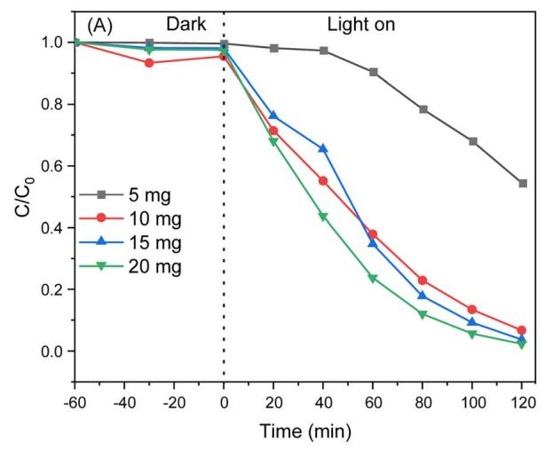

line

| Time (min) | 5 mg  | 10 mg | 15 mg | 20 mg |
| ---------- | ----- | ----- | ----- | ----- |
| -60        | 1.0   | 1.0   | 1.0   | 1.0   |
| -40        | 1.0   | 0.95  | 1.0   | 1.0   |
| -20        | 1.0   | 0.98  | 1.0   | 1.0   |
| 0          | 1.0   | 0.98  | 1.0   | 1.0   |
| 20         | 0.98  | 0.72  | 0.78  | 0.68  |
| 40         | 0.95  | 0.55  | 0.65  | 0.45  |
| 60         | 0.90  | 0.38  | 0.35  | 0.25  |
| 80         | 0.80  | 0.22  | 0.15  | 0.12  |
| 100        | 0.70  | 0.12  | 0.08  | 0.05  |
| 120        | 0.55  | 0.08  | 0.03  | 0.02  |

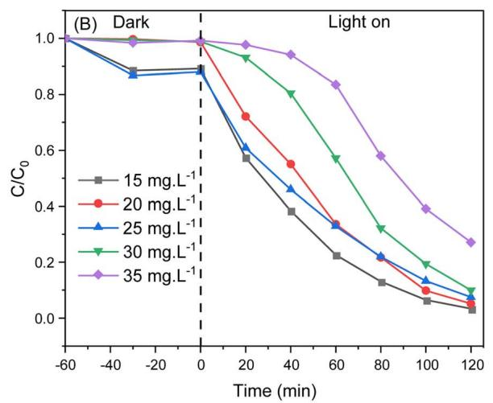

line

| Time (min) | 15 mg.L⁻¹ | 20 mg.L⁻¹ | 25 mg.L⁻¹ | 30 mg.L⁻¹ | 35 mg.L⁻¹ |
| ---------- | --------- | --------- | --------- | --------- | --------- |
| -60        | 1.0       | 1.0       | 1.0       | 1.0       | 1.0       |
| -40        | 0.9       | 0.9       | 0.9       | 0.9       | 0.9       |
| -20        | 0.85      | 0.85      | 0.85      | 0.85      | 0.85      |
| 0          | 0.85      | 0.85      | 0.85      | 0.85      | 0.85      |
| 20         | 0.7       | 0.7       | 0.6       | 0.9       | 0.9       |
| 40         | 0.55      | 0.55      | 0.45      | 0.8       | 0.9       |
| 60         | 0.35      | 0.35      | 0.3       | 0.6       | 0.8       |
| 80         | 0.2       | 0.2       | 0.2       | 0.4       | 0.6       |
| 100        | 0.1       | 0.1       | 0.1       | 0.2       | 0.4       |
| 120        | 0.05      | 0.05      | 0.05      | 0.1       | 0.25      |

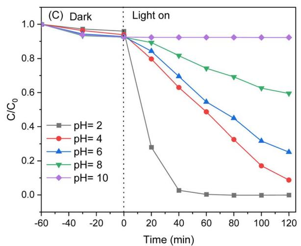

line

| Time (min) | pH=2  | pH=4  | pH=6  | pH=8  | pH=10 |
| ---------- | ----- | ----- | ----- | ----- | ----- |
| -60        | 1.0   | 1.0   | 1.0   | 1.0   | 1.0   |
| -40        | 1.0   | 1.0   | 1.0   | 1.0   | 1.0   |
| -20        | 1.0   | 1.0   | 1.0   | 1.0   | 1.0   |
| 0          | 1.0   | 1.0   | 1.0   | 1.0   | 1.0   |
| 20         | 0.3   | 0.8   | 0.9   | 0.9   | 0.9   |
| 40         | 0.0   | 0.6   | 0.7   | 0.8   | 0.9   |
| 60         | 0.0   | 0.5   | 0.6   | 0.7   | 0.9   |
| 80         | 0.0   | 0.4   | 0.5   | 0.6   | 0.9   |
| 100        | 0.0   | 0.3   | 0.4   | 0.6   | 0.9   |
| 120        | 0.0   | 0.1   | 0.3   | 0.6   | 0.9   |

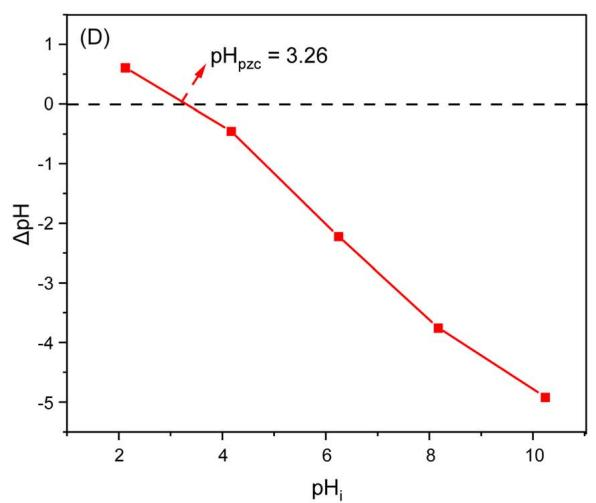

line

| pH_i | ΔpH  |
|------|------|
| 2    | 0.5  |
| 4    | -0.5 |
| 6    | -2.0 |
| 8    | -3.5 |
| 10   | -5.0 |

Fig. 8 (A) Effect of catalyst dosage (conditions: [RhB] = 25 mg $\mathsf { L } ^ { - 1 } , V _ { \mathsf { R h B } } = 1 0 0 \mathsf { m L }$ , pH 4.0, the source data are provided in Table S4); (B) initial RhB concentration (conditions: [catalyst] = 10 mg, $V _ { \mathrm { R h B } } = 1 0 0 \mathrm { m L }$ , pH 4.0, the source data are provided in Table S5); (C) initial pH solution (conditions: [catalyst] = 10 mg, [RhB] = 25 mg L−1 , $V _ { \mathsf { R h B } } = 1 0 0$ mL, the source data are provided in Table S6) on the degradation of RhB over the $5 \% \mathsf { B i V O } _ { 4 } / \mathsf { U U - }$ 200 sample; (D) measurement of $\mathsf { p H } _ { \mathsf { p } z \mathsf { c } }$ (pHi: the initial pH; and pHf: the final pH).

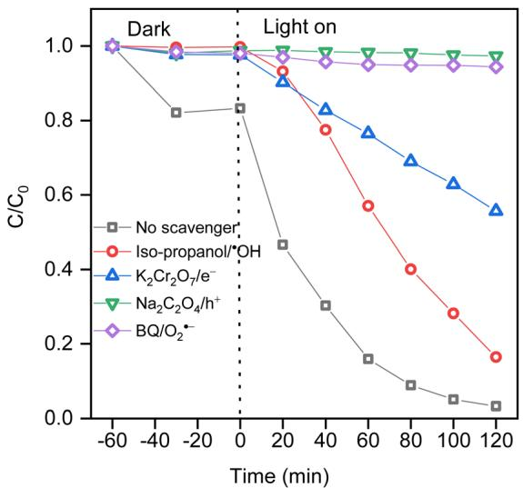

line

| Time (min) | No scavenger | Iso-propanol/OH | K₂Cr₂O₇/e⁻ | Na₂C₂O₄/h⁺ | BQ/O₂⁻ |
| ---------- | ------------ | --------------- | ---------- | ----------- | ------ |
| -60        | 1.0          | 1.0             | 1.0        | 1.0         | 1.0    |
| -40        | 0.8          | 1.0             | 1.0        | 1.0         | 1.0    |
| -20        | 0.8          | 1.0             | 1.0        | 1.0         | 1.0    |
| 0          | 0.8          | 1.0             | 1.0        | 1.0         | 1.0    |
| 20         | 0.5          | 0.9             | 0.9        | 1.0         | 0.95   |
| 40         | 0.3          | 0.75            | 0.8        | 1.0         | 0.95   |
| 60         | 0.15         | 0.55            | 0.7        | 1.0         | 0.95   |
| 80         | 0.05         | 0.4             | 0.6        | 1.0         | 0.95   |
| 100        | 0.0          | 0.25            | 0.55       | 1.0         | 0.95   |
| 120        | 0.0          | 0.15            | 0.5        | 1.0         | 0.95   |

Fig. 9 Effects of different scavengers on the degradation of RhB on 5% ${ \mathsf { B i V O } } _ { 4 } / { \mathsf { U U } }$ -200 (conditions: [catalyst] = 10 mg, [RhB] = 25 mg L−1 , VRhB $= 1 0 0$ mL, pH 4.0. The source data are provided in Table S7).

Based on the radical trapping experiments and the band structure analysis of the BiVO4/UU-200 photocatalyst, the proposed photocatalytic mechanism for RhB degradation is illustrated in Fig. 10. As discussed above, UU-200 exhibits negligible light absorption in the visible region and cannot be directly photoexcited under LED irradiation. Instead, RhB molecules adsorbed on the catalyst surface act as photosensitizers. Upon light irradiation, RhB is excited to an excited state (RhB\*), generating electrons in the LUMO and holes in the HOMO.57 The excited $\mathrm { R h B } ^ { \ast }$ can inject electrons into the conduction band (CB) of UU-200, enabling UU-200 to participate in the photocatalytic process.58 Meanwhile, $\mathrm { \bf B i V O _ { 4 } }$ can be directly excited under visible light to generate electron–hole pairs. According to the Mott–Schottky results, the CB potentials of UU-200 and $\mathrm { \bf B i V O _ { 4 } }$ are approximately −1.10 V and −0.40 V vs. NHE, respectively, indicating that the CB of UU-200 is sufficiently negative to reduce dissolved $\mathrm { O } _ { 2 } \ \mathrm { t o } \ ^ { \cdot } \mathrm { O } _ { 2 } ^ { - \ 5 9 } .$ At the $\mathrm { \bf B i V O _ { 4 } } /$ UU-200 interface, electrons initially transfer from UU-200 to $\mathrm { \bf B i V O _ { 4 } }$ to equilibrate the Fermi levels due to the lower work function of UU-200 (4.14 eV vs. vacuum) compared to $\mathrm { \bf B i V O _ { 4 } }$ (4.20–5.31 eV vs. vacuum).60–64 This results in the formation of an internal electric eld (IEF) directed from $\mathrm { \bf B i V O _ { 4 } }$ to UU-200, accompanied by band bending at the interface. The CB and VB positions referenced to the normal hydrogen electrode (NHE), as shown in Fig. 10, further conrm the feasibility of the proposed charge transfer pathway. Under light irradiation, driven by the IEF, photogenerated electrons in the CB of $\mathrm { \bf B i V O _ { 4 } }$ preferentially recombine with holes in the VB of UU-200 at the interface. As a result, electrons with strong reduction ability are retained in the CB of UU-200 (including those injected from RhB\*), while holes with strong oxidation ability remain in the VB of ${ \bf B i V O _ { 4 } } .$ . These spatially separated charge carriers actively participate in the photocatalytic reactions: electrons accumulated in the CB of UU-200 reduce surface-adsorbed ${ \bf O } _ { 2 }$ to generate $\cdot _ { 0 _ { 2 } } \textrm { -- }$ radicals, while holes in the VB of $\mathrm { \bf B i V O _ { 4 } }$ directly oxidize RhB molecules. Notably, the VB potential of $\mathrm { \bf B i V O _ { 4 } }$ is not sufficiently positive to oxidize $_ { \mathrm { H } _ { 2 } \mathrm { O } }$ to cOH, which is consistent with the radical trapping results indicating that $\cdot _ { 0 _ { 2 } } \cdot , \mathbf { e } ^ { - }$ , and $\mathrm { h } ^ { + }$ are the dominant reactive species.65 Although UU-200 is not intrinsically photoactive, it plays a crucial role as an electron acceptor and transfer mediator through dye sensitization, while the overall photocatalytic process is primarily governed by an Sscheme-heterojunction, which ensures efficient charge separation and strong redox capability. Such dye-sensitized charge injection coupled with S-scheme heterojunction behavior has been widely reported in semiconductor-dye systems, where the dye acts as a photosensitizer to extend light absorption and facilitate interfacial electron transfer.

flowchart

```mermaid
graph LR
    A["UU-200"] -->|CB -1.1 V, CB -0.4 V, +2.6 V VB, BiVO4| B["Potential (V vs. NHE)"]
    B --> C["RhB*"]
    C --> D["RhB"]
    D --> E["UV-200"]
    E --> F["IEF"]
    F --> G["Dye"]
    G --> H["O2+"]
    H --> I["RhB/RhB* (dye)"]
    I --> J["Degradation products"]
    E --> K["UV-200"]
    K --> L["IEF"]
    L --> M["Dye"]
    M --> N["O2+"]
    N --> O["RhB/RhB* (dye)"]
    O --> P["Degradation products"]
    style A fill:#f9f,stroke:#333
    style B fill:#ccf,stroke:#333
    style C fill:#cfc,stroke:#333
    style D fill:#fcc,stroke:#333
    style E fill:#ffc,stroke:#333
    style F fill:#cff,stroke:#333
    style G fill:#ffc,stroke:#333
    style H fill:#cfc,stroke:#333
    style I fill:#fcc,stroke:#333
    style J fill:#ffc,stroke:#333
    style K fill:#cfc,stroke:#333
    style L fill:#fcc,stroke:#333
    style M fill:#ffc,stroke:#333
    style N fill:#cfc,stroke:#333
```

Fig. 10 Photodegradation mechanism of RhB over 5% BiVO4/UU-200 under LED light irradiation.

Fig. 11 (A–C) Plot of $C / C _ { 0 }$ versus the number of $5 \% \mathsf { B i V O } _ { 4 } / \mathsf { U U } - 2 0 0$ catalyst reuses for the degradation of RhB (conditions: [catalyst] = 10 mg, $[ \mathsf { R h B } ] = 1 5 \mathsf { m g L } ^ { - 1 } , V _ { \mathsf { R h B } } = 1 0 0$ mL, pH $5 . 6 ;$ (D) XRD pattern of the $5 \% \mathsf { B i V O } _ { 4 } / \mathsf { U U } - 2 0 0$ sample before and after the reactions; (E) FT-IR spectra of the $5 \% \mathsf { B i V O } _ { 4 } / \mathsf { U U } - 2 0 0$ catalyst before and after the reactions; (F) SEM images of the $5 \% \mathsf { B i V O 4 } / \mathsf { U U }$ -200 catalyst before and after the reactions.

# 3.5. The stability and recyclability

The stability of the ${ \bf B i V O _ { 4 } }$ /UU-200 heterostructure under visiblelight irradiation is a critical factor for its practical application. While $\mathrm { \bf B i V O _ { 4 } } .$ -based photocatalysts are oen considered susceptible to photo-corrosion under prolonged illumination, the incorporation of UU-200 has been reported to improve structural stability and mitigate deactivation effects.39 To evaluate the reusability, photocatalytic degradation experiments were conducted using 5% $\mathrm { B i V O _ { 4 } / U U - 2 0 0 }$ over three consecutive cycles. Aer each cycle, the catalyst was recovered by centrifugation, thoroughly washed with ethanol and deionized water, dried, and reused in subsequent runs.50 As shown in Fig. 11(A– C), the photocatalyst maintains a relatively high degradation efficiency of 85.73% aer three cycles, indicating sustained photocatalytic performance. To further assess cycling stability, the results showed that the photodegradation efficiencies were 78.3% and 74.5% for the fourth and h cycles, respectively. The slight decrease in activity may be attributed to partial coverage of active sites by reaction intermediates and minor material loss during recovery, particularly given the small catalyst dosage used in each experiment (10 mg), rather than to intrinsic structural degradation. The XRD patterns of the recycled 5% $\mathrm { B i V O _ { 4 } / U U - 2 0 0 }$ (Fig. 11D) show that the characteristic diffraction peaks of both $\mathrm { \bf B i V O _ { 4 } }$ and UU-200 are well preserved, with only negligible variations in peak intensity, which can be attributed to the adsorption of intermediate species. Furthermore, the FT-IR spectra and SEM images of 5% $\mathrm { B i V O _ { 4 } / U U { - } } 2 0 0$ cYlowb aer three cycles (Fig. 11E and F) exhibit no noticeable changes in chemical bonding or morphology compared to the fresh samples, conrming that the heterostructure remains structurally intact aer repeated use.

# 4. Conclusions

The formation of a heterojunction between $\mathrm { \bf B i V O _ { 4 } }$ and UU-200 evidently enhanced the photocatalytic performance of the $\mathrm { B i V O _ { 4 } / U U { - } } 2 0 0$ photocatalyst under LED illumination. The 5% $\mathrm { B i V O _ { 4 } / U U { - } } 2 0 0$ composite demonstrated an excellent degradation efficiency of 96.79% for RhB. Additionally, even aer three cycles, the composite retained 85.73% of its RhB degradation efficiency. The S-scheme heterojunction facilitated the transfer of photogenerated electrons from $\mathrm { \bf B i V O _ { 4 } }$ to UU-200, thereby amplifying the specic surface area of the catalyst and enhancing the photocatalytic activity of $\mathrm { \bf B i V O _ { 4 } / U U - } 2 0 0 .$ . Furthermore, through radical-scavenging experiments conducted during the photocatalytic degradation of RhB, the radicals $\cdot _ { 0 _ { 2 } } , \cdot _ { }$ , and $\mathrm { h } ^ { + }$ emerged as the predominant species. Establishing the S-scheme heterojunction between ${ \bf B i V O _ { 4 } }$ and UU-200 provided an effective means to enhance electron–hole separation efficiency.

# Author contributions

Hoang Ai Le Pham: investigation, methodology, validation; Huu Vinh Nguyen: writing – original dra, formal analysis; Huy Anh Bui: methodology and formal analysis, Van Cuong Nguyen: data curation, investigation and Thi Hong Anh Nguyen: writing – review and editing.

# Conflicts of interest

The authors have no conict of interest.

# Data availability

The data supporting this article have been included as part of the Supplementary Information (SI). Supplementary information: detailed experimental procedures, additional characterization data, and supporting gures and tables that complement the main text. See DOI: https://doi.org/10.1039/ d6na00104a.

# Acknowledgements

The authors thank the Industrial University of Ho Chi Minh City, Ho Chi Minh University of Industry and Trade and Nguyen Tat Thanh University for their facilities and support.

# References

1 M. S. Khan, Y. Li, D.-S. Li, J. Qiu, X. Xu and H. Y. Yang, Nanoscale Adv., 2023, 5, 6318–6348.   
2 R. B. Gonz´alez-Gonz´alez, J. A. Rodr´ıguez-Hern´andez, R. G. Araujo, P. Sharma, R. Parra-Sald´ ´ıvar, R. A. Ramirez-Mendoza, M. Bilal and H. M. N. Iqbal, Chemosphere, 2022, 297, 134172.   
3 M. Tariq, M. Muhammad, J. Khan, A. Raziq, M. K. Uddin, A. Niaz, S. S. Ahmed and A. Rahim, J. Mol. Liq., 2020, 312, 113399.   
4 R. B. Gonz´alez-Gonz´alez, A. Sharma, R. Parra-Sald´ıvar, R. A. Ramirez-Mendoza, M. Bilal and H. M. N. Iqbal, J. Hazard. Mater., 2022, 423, 127145.   
5 A. Sharma, M. Tahir, T. Ahamad, N. Kumar, S. Sharma, M. Kumari, M. A. Majeed Khan, S. Takhur and P. Raizada, J. King Saud Univ. Sci., 2023, 35, 102922.   
6 M. A. Hassaan, M. A. El-Nemr, M. R. Elkatory, S. Ragab, V.-C. Niculescu and A. El Nemr, Top. Curr. Chem., 2023, 381, 31.

7 L. Zeng, X. Guo, C. He and C. Duan, ACS Catal., 2016, 6, 7935–7947.   
8 S.-H. Li, M.-Y. Qi, Z.-R. Tang and Y.-J. Xu, Chem. Soc. Rev., 2021, 50, 7539–7586.   
9 Y.-H. Li, Z.-R. Tang and Y.-J. Xu, Chin. J. Catal., 2022, 43, 708– 730.   
10 E. Cort´es, R. Grzeschik, S. A. Maier and S. Schlücker, Nat. Rev. Chem., 2022, 6, 259–274.   
11 X. Li, Y. Chen, Y. Tao, L. Shen, Z. Xu, Z. Bian and H. Li, Chem Catal., 2022, 2, 1315–1345.   
12 K. Obaideen, N. Shehata, E. T. Sayed, M. A. Abdelkareem, M. S. Mahmoud and A. G. Olabi, Energy Nexus, 2022, 7, 100112.   
13 A. K. Inge, M. Köppen, J. Su, M. Feyand, H. Xu, X. Zou, M. O'Keeffe and N. Stock, J. Am. Chem. Soc., 2016, 138, 1970–1976.   
14 A. E. Baumann, D. A. Burns, B. Liu and V. S. Thoi, Commun. Chem., 2019, 2, 86.   
15 J. Duan, S. Chen and C. Zhao, Nat. Commun., 2017, 8, 15341.   
16 Y. Xu, M. Lv, H. Yang, Q. Chen, X. Liu and F. W. Fengyu Wei, RSC Adv., 2015, 5, 43473–43479.   
17 V. C. Nguyen, T. D. Nguyen, Q. Thanh Hoai Ta and A. L. H. Pham, RSC Adv., 2025, 15, 2779–2791.   
18 H. T. Quang, H. A. Le Pham, N. Van Cuong, H. P. Dang and N. T. H. Anh, Top. Catal., 2024, 67, 1155–1168.   
19 Y. Wang, H. Sun, Z. Yang, Y. Zhu and Y. Xia, Carbon Neutralization, 2024, 3, 737–767.   
20 Z. Wang, Z. Zeng, H. Wang, G. Zeng, P. Xu, R. Xiao, D. Huang, S. Chen, Y. He, C. Zhou, M. Cheng and H. Qin, Coord. Chem. Rev., 2021, 439, 213902.   
21 P. V. Hlophe, L. C. Mahlalela and L. N. Dlamini, Sci. Rep., 2019, 9, 10044.   
22 N. Kang, D. Xu and W. Shi, Chin. J. Chem. Eng., 2019, 27, 3053–3059.   
23 Y. Pihosh, I. Turkevych, K. Mawatari, J. Uemura, Y. Kazoe, S. Kosar, K. Makita, T. Sugaya, T. Matsui, D. Fujita, M. Tosa, M. Kondo and T. Kitamori, Sci. Rep., 2015, 5, 11141.   
24 T. D. Nguyen, V. H. Nguyen, A. Le Hoang Pham, T. Van Nguyen and T. Lee, RSC Adv., 2022, 12, 25377–25387.   
25 T. Zhou, J. Liu, H. Zhan, P. Wang, K. Chao, M. Chen, J. Zheng and B. Fu, J. Phys. Chem. Solids, 2024, 188, 111917.   
26 M. Zheng, M. Guo, F. Ma, W. Li and Y. Shao, Nanoscale Adv., 2025, 7, 4780–4802.   
27 A. Sharma, M. Kumari, M. Tahir, S. Jain, S. Sharma and N. Kumar, J. Mol. Liq., 2023, 386, 122429.   
28 M. Tahir, B. Ajiwokewu, A. A. Bankole, O. Ismail, H. Al-Amodi and N. Kumar, J. Environ. Chem. Eng., 2023, 11, 109408.   
29 A. Mittal, G. Kumar, B. Saroha, T. Peppel, V. Kumar, S. Kumar and N. Kumar, J. Mol. Liq., 2024, 398, 124223.   
30 N. Le-Duy, L.-A. T. Hoang, T. D. Nguyen and T. Lee, Chemosphere, 2023, 321, 138118.   
31 M. Shang, W. Wang, L. Zhou, S. Sun and W. Yin, J. Hazard. Mater., 2009, 172, 338–344.   
32 G. Li, D. Zhang and J. C. Yu, Chem. Mater., 2008, 20, 3983– 3992.

33 M. Åhl´en, E. Kapaca, D. Hedbom, T. Willhammar, M. Strømme and O. Cheung, Microporous Mesoporous Mater., 2022, 329, 111548.   
34 J. Cao, C. Zhou, H. Lin, B. Xu and S. Chen, Appl. Surf. Sci., 2013, 284, 263–269.   
35 S.-R. Zhu, M.-K. Wu, W.-N. Zhao, P.-F. Liu, F.-Y. Yi, G.-C. Li, K. Tao and L. Han, Cryst. Growth Des., 2017, 17, 2309–2313.   
36 A. Chauhan, Sonu, P. Raizada, P. Singh, T. Ahamad, V.-H. Nguyen, Q. Van Le, A. Aslam Parwaz Khan, N. Kumar, A. Sudhaik and C. Mustansar Hussain, J. Ind. Eng. Chem, 2024, 130, 25–53.   
37 M. Q. Pham, T. M. Ngo, V. H. Nguyen, L. X. Nong, D.-V. N. Vo, T. Van Tran, T.-D. Nguyen, X.-T. Bui and T. D. Nguyen, Arab. J. Chem., 2020, 13, 8388–8394.   
38 K. Rokesh, M. Sakar and T.-O. Do, Catal. Today, 2023, 407, 252–259.   
39 P. Liu, D. Han, Z. Wang and F. Gu, Catal. Commun., 2023, 177, 106657.   
40 S. Chen, D. Huang, G. Zeng, W. Xue, L. Lei, P. Xu, R. Deng, J. Li and M. Cheng, Chem. Eng. J., 2020, 382, 122840.   
41 S. Dong, G. J. Lee, R. Zhou and J. J. Wu, Sep. Purif. Technol., 2020, 250, 117202.   
42 Y. Wang, D. Yu, W. Wang, P. Gao, S. Zhong, L. Zhang, Q. Zhao and B. Liu, Sep. Purif. Technol., 2020, 239, 116562.   
43 M. Batzill, Energy Environ. Sci., 2011, 4, 3275.   
44 J. Tauc, R. Grigorovici and A. Vancu, Phys. Status Solidi B, 1966, 15, 627–637.   
45 W. Sun, S. Meng, S. Zhang, X. Zheng, X. Ye, X. Fu and S. Chen, J. Phys. Chem. C, 2018, 122, 15409–15420.   
46 A. Torres-Pinto, C. G. Silva, J. L. Faria and A. M. T. Silva, Adv. Sci., 2021, 8, 2003900.   
47 M. Ling, F. Ma, H. Zheng, Z. Yang, Y. Wu, R. Ji, Y. Yu and L. Li, J. Alloys Compd., 2025, 1010, 177288.   
48 Y. Hao, Z. Min, H. Guo, P. Shi, Y. Min, J. Fan and Q. Xu, Appl. Surf. Sci., 2021, 546, 149137.

49 J. P. S. Valente, P. M. Padilha and A. O. Florentino, Chemosphere, 2006, 64, 1128–1133.   
50 V. H. Nguyen, H. A. Le Pham, T. Lee and T. D. Nguyen, Inorg. Chem., 2024, 63, 12027–12041.   
51 L. Yang, Y. Xin, C. Yao and Y. Miao, J. Mater. Sci.: Mater. Electron., 2021, 32, 13382–13395.   
52 T. Zhang, T. Oyama, A. Aoshima, H. Hidaka, J. Zhao and N. Serpone, Phys. Status Solidi B, 2001, 140, 163–172.   
53 Y. Gao, S. Li, Y. Li, L. Yao and H. Zhang, Appl. Catal., B, 2017, 202, 165–174.   
54 V. H. Nguyen, T. D. Nguyen and T. Van Nguyen, Top. Catal., 2020, 63, 1109–1120.   
55 K. M. Reza, A. Kurny and F. Gulshan, Appl. Water Sci., 2017, 7, 1569–1578.   
56 V. H. Nguyen, L. X. Nong, O. T. K. Nguyen, Q.-M. T. Doan, A. Le Hoang Pham, T. Lee and T. D. Nguyen, Mater. Chem. Phys., 2024, 316, 129098.   
57 G. Naresh and T. K. Mandal, ACS Sustain. Chem. Eng., 2015, 3, 2900–2908.   
58 J. He, J. Wang, Y. Chen, J. Zhang, D. Duan, Y. Wang and Z. Yan, Chem. Commun., 2014, 50, 7063–7066.   
59 Y. Dai, C. Poidevin, C. Ochoa-Hern´andez, A. A. Auer and H. Tüysüz, Angew. Chem., Int. Ed., 2020, 59, 5788–5796.   
60 J. Zuo, H. Guo, S. Chen, Y. Pei and C. Liu, Catal. Sci. Technol., 2023, 13, 3963–3973.   
61 J. W. Yoon, Y.-M. Jo and J.-H. Lee, Energy Adv., 2022, 1, 197– 204.   
62 N. Kodan, M. Ahmad and B. R. Mehta, Int. J. Hydrogen Energy, 2021, 46, 189–196.   
63 C.-M. Fung, B.-J. Ng, C.-C. Er, W.-K. Chong, J. Low, X. Guo, X. Y. Kong, H. W. Lee, L.-L. Tan, A. R. Mohamed and S.-P. Chai, Small Struct., 2023, 4, 2300083.   
64 S. S. Kalanur and H. Seo, J. Energy Chem., 2022, 68, 612–623.   
65 R. Keyiko˘glu, I. N. Do˘gan, A. Khataee, Y. Orooji, M. Kobya and Y. Yoon, Chemosphere, 2022, 309, 136534.

Support information

# A BiVO₄/UU-200 Heterojunction for Efficient Visible-Light Photocatalytic Degradation of Rhodamine B

Hoang Ai Le Pham1, Huu Vinh Nguyen2, Huy Anh Bui1, Van Cuong Nguyen1, and Thi Hong Anh Nguyen3,\*

1Faculty of Chemical Engineering, Industrial University of Ho Chi Minh City, No. 12 Nguyen Van Bao, Hanh Thong Ward, Ho Chi Minh City, Viet Nam.

2Institute of Applied Technology and Sustainable Development, Nguyen Tat Thanh University, Ho Chi Minh City, Viet Nam

3Faculty of Chemical Engineering, Ho Chi Minh City University of Industry and Trade, 140 Le Trong Tan Street, Tay Thanh Ward, Ho Chi Minh City 70000, Vietnam.

\* Corresponding authors: Associate Professor Thi Hong Anh Nguyen, PhD

Email: anhnth@huit.edu.vn

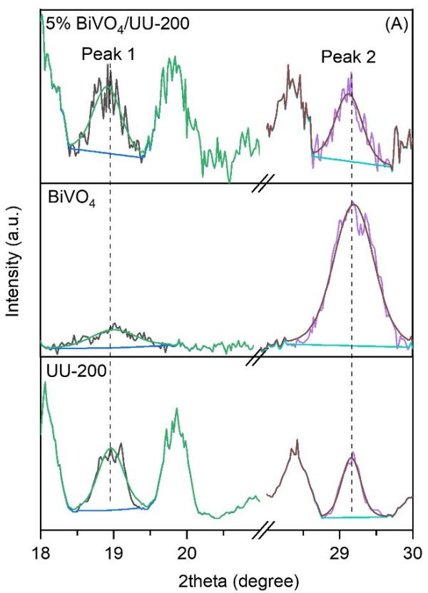

line

| Sample     | Peak 1 Intensity (a.u.) | Peak 2 Intensity (a.u.) | Peak 3 Intensity (a.u.) |
|------------|--------------------------|--------------------------|--------------------------|
| 5% BiVO₄/UU-200 | ~18.5                  | ~19.5                    | ~20.0                    |
| BiVO₄      | ~19.0                  | ~20.0                    | ~29.0                    |
| UU-200     | ~18.0                  | ~19.0                    | ~20.0                    |

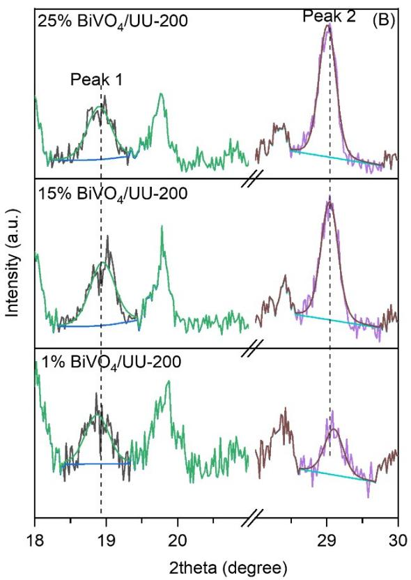

line

| Condition | Peak 1 Intensity (a.u.) | Peak 2 Intensity (a.u.) |
| --------- | ------------------------ | ------------------------ |
| 25% BiVO₄/UU-200 | ~19.5 | Peak 2 (B) |
| 15% BiVO₄/UU-200 | ~19.8 | Peak 2 (B) |
| 1% BiVO₄/UU-200 | ~19.6 | Peak 2 (B) |

Figure S1. The magnified part of XRD data from $1 8 ^ { \circ }$ to $3 0 ^ { \circ }$ and the deconvolution of the XRD data

Table S1: The weight crystalline fractions of the prepared materials 

<table><tr><td rowspan="2" colspan="2">Samples</td><td colspan="2">Peak</td><td rowspan="2">Peak2/Peak1 ratio</td></tr><tr><td>1</td><td>2</td></tr><tr><td rowspan="3">UU-200</td><td>Position (degree)</td><td>18.96</td><td>29.16</td><td></td></tr><tr><td>Area</td><td>20.040</td><td>14.536</td><td>0.725</td></tr><tr><td>FWHM</td><td>0.414</td><td>0.311</td><td></td></tr><tr><td rowspan="3"> $BiVO_4$ </td><td>Position (degree)</td><td>19.16</td><td>29.23</td><td></td></tr><tr><td>Area</td><td>13.043</td><td>91.878</td><td>7.044</td></tr><tr><td>FWHM</td><td>0.697</td><td>0.624</td><td></td></tr><tr><td rowspan="3">1%  $BiVO_4/UU-200$ </td><td>Position (degree)</td><td>18.87</td><td>29.10</td><td></td></tr><tr><td>Area</td><td>32.232</td><td>23.722</td><td>0.736</td></tr><tr><td>FWHM</td><td>0.392</td><td>0.310</td><td></td></tr><tr><td rowspan="3">5%  $BiVO_4/UU-200$ </td><td>Position (degree)</td><td>18.91</td><td>29.13</td><td></td></tr><tr><td>Area</td><td>13.732</td><td>13.149</td><td>0.957</td></tr><tr><td>FWHM</td><td>0.453</td><td>0.428</td><td></td></tr><tr><td rowspan="3">15%  $BiVO_4/UU-200$ </td><td>Position (degree)</td><td>18.95</td><td>29.04</td><td></td></tr><tr><td>Area</td><td>64.761</td><td>82.867</td><td>1.280</td></tr><tr><td>FWHM</td><td>0.417</td><td>0.285</td><td></td></tr><tr><td rowspan="3">25%  $BiVO_4/UU-200$ </td><td>Position (degree)</td><td>18.90</td><td>29.01</td><td></td></tr><tr><td>Area</td><td>55.841</td><td>97.902</td><td>1.753</td></tr><tr><td>FWHM</td><td>0.396</td><td>0.279</td><td></td></tr></table>

natural_image

Microscopic view of fibrous material under BiVO₄/UU-200 treatment, scale bar 10 μm (no text or symbols on the fibers themselves)

natural_image

Microscopic view of fibrous material under 1% BiVO4/UU-200 condition, scale bar 5 μm (no text or symbols on the fibers themselves)

natural_image

Microscopic image of fibrous material under 1% BiVO4/UU-200 condition, scale bar 300 nm (no text or symbols on fibers)

text_image

(B1) 15% BiVO₄/UU-200
10 µm

text_image

(B2) 15% BiVO₄/UU-200
5 µm

text_image

(B3) 15% BiVO₄/UU-200
300 nm

natural_image

Microscopic image of BiVO4/UU-200 material with 25% label and 10 μm scale bar (no other text or symbols)

natural_image

Microscopic view of fibrous material under 25% BiVO4/UD-200 condition, scale bar 5 μm (no text or symbols on the fibers themselves)

natural_image

Microscopic view of BiVO4/UU-200 composite material with 300 nm scale bar (no text or symbols on the structure itself)

Figure S2. SEM images of 1% $\mathrm { B i V O _ { 4 } / U U - 2 0 0 }$ (A1–A3), 15% $\mathrm { B i V O _ { 4 } / U U - 2 0 0 }$ (B1–B3), and 25% $\mathrm { B i V O _ { 4 } / U U - 2 0 0 }$ (C1–C3)

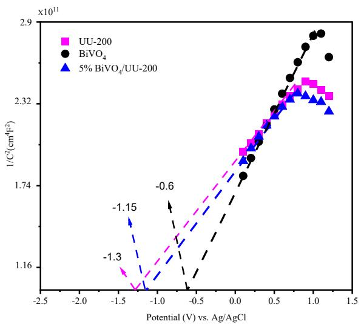

line

| Potential (V) vs. Ag/AgCl | 1/C² (cm⁻¹F²) for UU-200 | 1/C² (cm⁻¹F²) for BiVO₄ | 1/C² (cm⁻¹F²) for 5% BiVO₄/UU-200 |
| ------------------------- | ------------------------ | ------------------------ | ---------------------------------- |
| -1.3                      | ~1.16                    | ~1.16                    | ~1.16                              |
| -1.15                     | ~1.16                    | ~1.16                    | ~1.16                              |
| -0.6                      | ~1.74                    | ~1.74                    | ~1.74                              |
| -0.6                      | ~2.32                    | ~2.32                    | ~2.32                              |
| 0.6                       | ~2.32                    | ~2.32                    | ~2.32                              |
| 1.0                       | ~2.32                    | ~2.9                     | ~2.32                              |
| 1.5                       | ~2.32                    | ~2.9                     | ~2.32                              |

Figure S3. Mott−Schottky plots of BiVO4, UU-200 and 5% BiVO4/UU-200 composite.

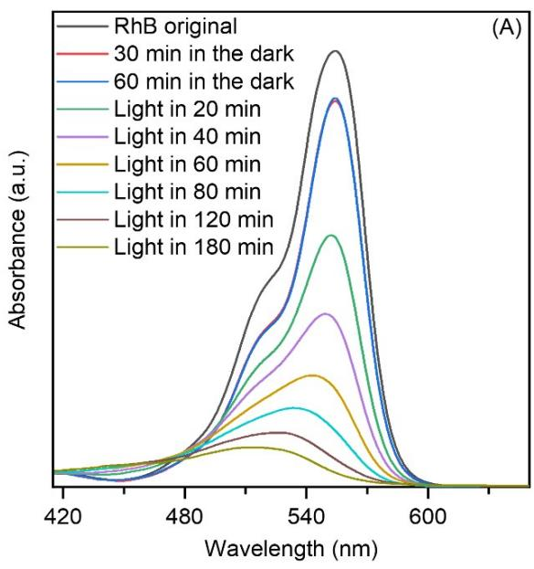

line

| Wavelength (nm) | RhB original | 30 min in the dark | 60 min in the dark | Light in 20 min | Light in 40 min | Light in 60 min | Light in 80 min | Light in 120 min | Light in 180 min |
| --------------- | ------------ | ------------------ | ------------------ | --------------- | --------------- | --------------- | --------------- | ---------------- | ---------------- |
| 420             | ~0           | ~0                 | ~0                 | ~0              | ~0              | ~0              | ~0              | ~0               | ~0               |
| 480             | ~0           | ~0                 | ~0                 | ~0              | ~0              | ~0              | ~0              | ~0               | ~0               |
| 540             | ~1.0         | ~1.0               | ~1.0               | ~1.0            | ~1.0            | ~1.0            | ~1.0            | ~1.0             | ~1.0             |
| 600             | ~0           | ~0                 | ~0                 | ~0              | ~0              | ~0              | ~0              | ~0               | ~0               |

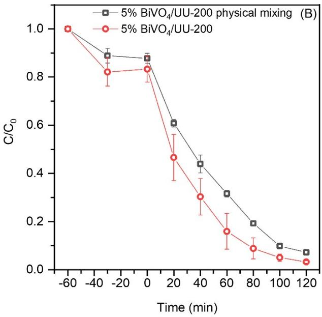

line

| Time (min) | 5% BiVO₄/UU-200 physical mixing (B) | 5% BiVO₄/UU-200 |
| ---------- | ----------------------------------- | ---------------- |
| -60        | 1.0                                 | 1.0              |
| -40        | 0.9                                 | 0.8              |
| 0          | 0.85                                | 0.85             |
| 20         | 0.6                                 | 0.45             |
| 40         | 0.45                                | 0.3              |
| 60         | 0.3                                 | 0.15             |
| 80         | 0.2                                 | 0.1              |
| 100        | 0.1                                 | 0.05             |
| 120        | 0.05                                | 0.02             |

Figure S4. (A) Time courses of UV−vis absorption spectra of RhB over 5% $\mathrm { B i V O _ { 4 } / U U } { - 2 0 0 } \mathrm { : }$ ; (B) Time courses of photocatalytic degradation of RhB over 5% Bi $\mathrm { V O _ { 4 } / U U { - } } 2 0 0$ composites and 5% $\mathrm { B i V O _ { 4 } / U U - 2 0 0 }$ physical mixing.

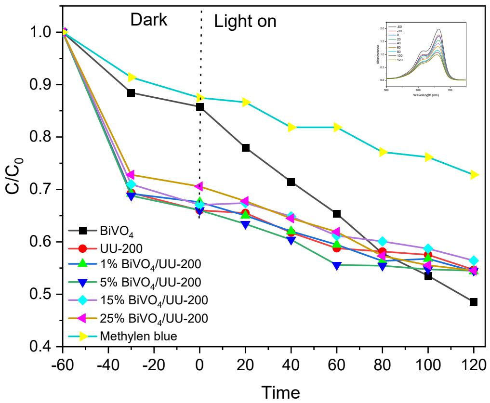

line

| Time | BiVO₄ | UU-200 | 1% BiVO₄/UU-200 | 5% BiVO₄/UU-200 | 15% BiVO₄/UU-200 | 25% BiVO₄/UU-200 | Methylen blue |
|------|--------|--------|-----------------|-----------------|------------------|------------------|---------------|
| -60  | 1.0    | 1.0    | 1.0             | 1.0             | 1.0              | 1.0              | 1.0           |
| -40  | 0.88   | 0.69   | 0.69            | 0.69            | 0.71             | 0.73             | 0.91          |
| 0    | 0.86   | 0.66   | 0.67            | 0.66            | 0.67             | 0.71             | 0.87          |
| 20   | 0.78   | 0.65   | 0.65            | 0.63            | 0.67             | 0.68             | 0.86          |
| 40   | 0.71   | 0.63   | 0.62            | 0.61            | 0.65             | 0.65             | 0.82          |
| 60   | 0.65   | 0.59   | 0.59            | 0.55            | 0.61             | 0.62             | 0.82          |
| 80   | 0.58   | 0.58   | 0.57            | 0.55            | 0.60             | 0.57             | 0.77          |
| 100  | 0.53   | 0.57   | 0.57            | 0.54            | 0.58             | 0.54             | 0.76          |
| 120  | 0.48   | 0.54   | 0.54            | 0.54            | 0.56             | 0.54             | 0.73          |

Figsure S5. Photocatalytic degradation of Methylene Blue over BiVO₄/UU-200 composites under dark and light irradiation.

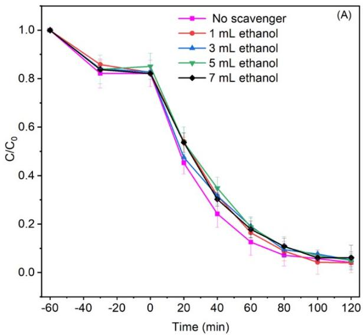

line

| Time (min) | No scavenger | 1 mL ethanol | 3 mL ethanol | 5 mL ethanol | 7 mL ethanol |
| ---------- | ------------ | ------------ | ------------ | ------------ | ------------ |
| -60        | 1.0          | 1.0          | 1.0          | 1.0          | 1.0          |
| -40        | 0.83         | 0.85         | 0.83         | 0.84         | 0.83         |
| -20        | 0.82         | 0.83         | 0.82         | 0.83         | 0.82         |
| 0          | 0.82         | 0.82         | 0.82         | 0.83         | 0.82         |
| 20         | 0.45         | 0.47         | 0.46         | 0.48         | 0.52         |
| 40         | 0.23         | 0.25         | 0.24         | 0.26         | 0.30         |
| 60         | 0.12         | 0.14         | 0.13         | 0.15         | 0.18         |
| 80         | 0.07         | 0.09         | 0.08         | 0.10         | 0.12         |
| 100        | 0.05         | 0.06         | 0.07         | 0.08         | 0.10         |
| 120        | 0.04         | 0.05         | 0.06         | 0.07         | 0.08         |

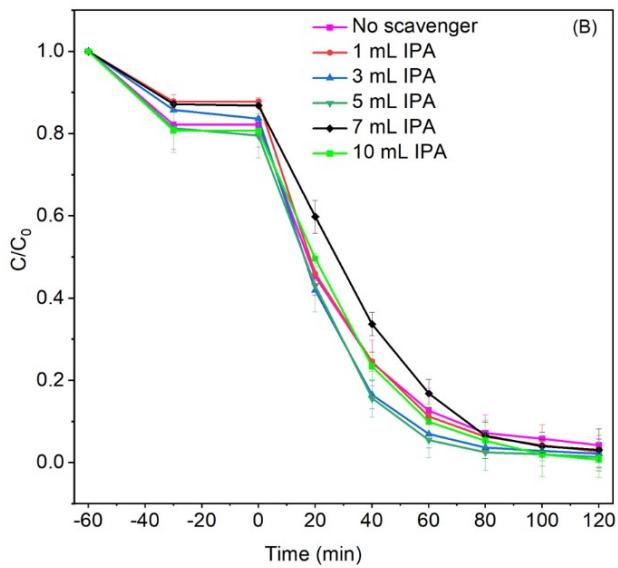

line

| Time (min) | No scavenger | 1 mL IPA | 3 mL IPA | 5 mL IPA | 7 mL IPA | 10 mL IPA |
| ---------- | ------------ | -------- | -------- | -------- | -------- | --------- |
| -60        | 1.0          | 1.0      | 1.0      | 1.0      | 1.0      | 1.0       |
| -40        | 0.85         | 0.85     | 0.85     | 0.85     | 0.85     | 0.85      |
| -20        | 0.82         | 0.82     | 0.82     | 0.82     | 0.82     | 0.82      |
| 0          | 0.82         | 0.82     | 0.82     | 0.82     | 0.82     | 0.82      |
| 20         | 0.45         | 0.45     | 0.45     | 0.45     | 0.45     | 0.45      |
| 40         | 0.25         | 0.25     | 0.25     | 0.25     | 0.25     | 0.25      |
| 60         | 0.15         | 0.15     | 0.15     | 0.15     | 0.15     | 0.15      |
| 80         | 0.10         | 0.10     | 0.10     | 0.10     | 0.10     | 0.10      |
| 100        | 0.05         | 0.05     | 0.05     | 0.05     | 0.05     | 0.05      |
| 120        | 0.02         | 0.02     | 0.02     | 0.02     | 0.02     | 0.02      |

Figure S6. The effect of ethanol (A) and isopropanol (B) as •OH scavengers on the degradation of RhB over the 5% BiVO₄/UU-200 photocatalyst.

Table S3. Control experiments for photodegradation of RhB over the as-synthesized samples. C and $\mathrm { C } _ { 0 }$ (in units of mol/L) denote the respective concentrations of RhB dye at time points t and 0, where t represents the current time, and 0 denotes the initial time. σ is the standard deviation calculated from 3 samples.   
Table S2. Comparison of photodegradation performances of Bi-MOF-based composite photocatalysts 

<table><tr><td>Photocatalysts</td><td>Contaminant</td><td>Light sources</td><td>Dosage (g·L-1)</td><td>C0(mg·L-1)</td><td>Time (min)</td><td>Degradation rates (%)</td><td>Ref.</td></tr><tr><td>BiVO4/UU-200</td><td>RhB</td><td>40 W LED</td><td>0.1</td><td>15</td><td>120</td><td>96.8</td><td rowspan="2">This work (Zhang et al., 2023)</td></tr><tr><td>BiBDC/BiVO4</td><td>TC</td><td>300 W Xenon</td><td>0.2</td><td>10</td><td>30</td><td>96.2</td></tr><tr><td>BiVO4/CAU-17</td><td>RhB</td><td>300 W Xenon</td><td>1.0</td><td>10</td><td>60</td><td>99.3</td><td>(Zhou et al., 2024)</td></tr><tr><td>BiOCl/CAU-17</td><td>RhB</td><td>40 W LED</td><td>0.15</td><td>15</td><td>60</td><td>96.0</td><td>(Ngu yen et al., 2024)</td></tr><tr><td> $Bi_{2}WO_{6}/CAU-17$ </td><td>RhB</td><td>500 W Xenon</td><td>0.4</td><td>10</td><td>60</td><td>80</td><td>(Yang et al., 2021)</td></tr><tr><td>Bi-MOF/BiOI</td><td>TC</td><td>Xenon</td><td>1.0</td><td>40</td><td>60</td><td>77</td><td>(Dai et al., 2023)</td></tr><tr><td>BiOCl@Bi-MOF</td><td>CTC</td><td>300 W Xenon</td><td>0.5</td><td>50</td><td>90</td><td>75.8</td><td>(Zhang et al., 2022)</td></tr><tr><td>BiOBr/CAU-17</td><td>RhB</td><td>500 W Xenon</td><td>0.2</td><td>20</td><td>50</td><td>85.7</td><td>(Zhu et al., 2017)</td></tr></table>

<table><tr><td>Sample</td><td>Time [min]</td><td> $C/C_0 \pm \sigma$ </td><td> $-\ln(C/C_0)^{(a)}$ </td><td>Sample</td><td>Time [min]</td><td> $C/C_0 \pm \sigma$ </td><td> $-\ln(C/C_0)^{(a)}$ </td></tr><tr><td rowspan="9">No catalyst</td><td>-60</td><td>1±0</td><td>--</td><td rowspan="9">BiVO4</td><td>-60</td><td>1±0</td><td>--</td></tr><tr><td>-30</td><td>0.99438±0.00197</td><td>--</td><td>-30</td><td>0.96985±0.00658</td><td>--</td></tr><tr><td>0</td><td>0.99392±0.00226</td><td>0</td><td>0</td><td>0.96439±0.000560 367</td><td>0</td></tr><tr><td>20</td><td>0.99252±0.00378</td><td>8.56773E-4</td><td>20</td><td>0.96034±0.00785</td><td>0.00866</td></tr><tr><td>40</td><td>0.99167±0.00278</td><td>0.00139</td><td>40</td><td>0.95206±0.00304</td><td>0.01472</td></tr><tr><td>60</td><td>0.99114±0.00273</td><td>0.00281</td><td>60</td><td>0.94631±0.00179</td><td>0.02927</td></tr><tr><td>80</td><td>0.98973±0.00303</td><td>0.00258</td><td>80</td><td>0.93264±0.00775</td><td>0.04963</td></tr><tr><td>100</td><td>0.98996±0.00802</td><td>0.00805</td><td>100</td><td>0.91384±0.00501</td><td>0.08559</td></tr><tr><td>120</td><td>0.98456±0.00472</td><td>0.01048</td><td>120</td><td>0.88156±0.01343</td><td>0.09116</td></tr><tr><td rowspan="9">UU-200</td><td>-60</td><td>1±0</td><td>--</td><td rowspan="9">1% BiVO4/U U-200</td><td>-60</td><td>1±0</td><td>--</td></tr><tr><td>-30</td><td>0.86438±0.01798</td><td>--</td><td>-30</td><td>0.90269±0.02483</td><td>--</td></tr><tr><td>0</td><td>0.84498±0.01242</td><td>0</td><td>0</td><td>0.91373±0.02935</td><td>0</td></tr><tr><td>20</td><td>0.62436±0.03735</td><td>0.31731</td><td>20</td><td>0.64731±0.04491</td><td>0.24783</td></tr><tr><td>40</td><td>0.4546±0.04305</td><td>0.78126</td><td>40</td><td>0.50522±0.03973</td><td>0.57529</td></tr><tr><td>60</td><td>0.28585±0.02348</td><td>1.10706</td><td>60</td><td>0.36414±0.01696</td><td>0.95903</td></tr><tr><td>80</td><td>0.20637±0.01674</td><td>1.64209</td><td>80</td><td>0.24809±0.00993</td><td>1.33709</td></tr><tr><td>100</td><td>0.12086±0.02043</td><td>2.09917</td><td>100</td><td>0.16999±0.0068</td><td>1.78617</td></tr><tr><td>120</td><td>0.07652±0.02206</td><td>2.821</td><td>120</td><td>0.10849±0.00267</td><td>2.4672</td></tr><tr><td rowspan="9">5% BiVO4/U U-200</td><td>-60</td><td>1±0</td><td>--</td><td rowspan="9">15% BiVO4/U U-200</td><td>-60</td><td>1±0</td><td>--</td></tr><tr><td>-30</td><td>0.79802±0.02601</td><td>--</td><td>-30</td><td>0.86495±0.00571</td><td>--</td></tr><tr><td>0</td><td>0.817±0.01536</td><td>0</td><td>0</td><td>0.86949±0.01319</td><td>0</td></tr><tr><td>20</td><td>0.52961±0.03803</td><td>0.56003</td><td>20</td><td>0.52384±0.03338</td><td>0.28918</td></tr><tr><td>40</td><td>0.30251±0.02242</td><td>0.98711</td><td>40</td><td>0.39229±0.03086</td><td>0.61419</td></tr><tr><td>60</td><td>0.19736±0.02733</td><td>1.5565</td><td>60</td><td>0.28344±0.02323</td><td>1.14739</td></tr><tr><td>80</td><td>0.11168±0.0199</td><td>2.29265</td><td>80</td><td>0.1663±0.02061</td><td>1.58808</td></tr><tr><td>100</td><td>0.05349±0.01048</td><td>2.80266</td><td>100</td><td>0.10703±0.02865</td><td>2.11773</td></tr><tr><td>120</td><td>0.03212±0.00561</td><td>3.25595</td><td>120</td><td>0.06302±0.00876</td><td>2.3139</td></tr><tr><td>25% BiVO4/U</td><td>-60</td><td>1±0</td><td>--</td><td>5% BiVO4/U U-200</td><td>-60</td><td>1±0</td><td></td></tr></table>

<table><tr><td rowspan="8">U-200</td><td>-30</td><td>0.88431±0.00236</td><td>--</td><td rowspan="8">physical mixing</td><td>-30</td><td>0.889±0.0304</td></tr><tr><td>0</td><td>0.85692±0.02826</td><td>0</td><td>0</td><td>0.878±0.0208</td></tr><tr><td>20</td><td>0.60211±0.0054</td><td>0.24605</td><td>20</td><td>0.608±0.0154</td></tr><tr><td>40</td><td>0.47078±0.03151</td><td>0.59062</td><td>40</td><td>0.439±0.0369</td></tr><tr><td>60</td><td>0.33356±0.03834</td><td>1.08787</td><td>60</td><td>0.316±0.0139</td></tr><tr><td>80</td><td>0.20287±0.03779</td><td>1.62291</td><td>80</td><td>0.193±0.00811</td></tr><tr><td>100</td><td>0.11881±0.02145</td><td>2.11851</td><td>100</td><td>0.0978±0.00626</td></tr><tr><td>120</td><td>0.07238±0.01106</td><td>2.63476</td><td>120</td><td>0.0718±0.00803</td></tr></table>

(a) $\mathrm { C } _ { 0 }$ (in units of mol/L) denote the respective concentrations of RhB at time points $\mathrm { { t } = 0 }$ min

Table S4. Effect of catalyst dosage on the degradation of RhB over the 5% $\mathrm { B i V O _ { 4 } / U U - 2 0 0 }$ sample. C and $\mathrm { C } _ { 0 }$ (in units of mol/L) denote the respective concentrations of RhB dye at time points t and 0, where t represents the current time, and 0 denotes the initial time. 

<table><tr><td>Catalyst dosage</td><td>Time [min]</td><td> $C/C_0$ </td><td>Sample</td><td>Time [min]</td><td> $C/C_0$ </td></tr><tr><td rowspan="7">m = 5 mg</td><td>0</td><td>1</td><td rowspan="7">m = 10 mg</td><td>0</td><td>1</td></tr><tr><td>20</td><td>0.986</td><td>20</td><td>0.748</td></tr><tr><td>40</td><td>0.978</td><td>40</td><td>0.577</td></tr><tr><td>60</td><td>0.908</td><td>60</td><td>0.397</td></tr><tr><td>80</td><td>0.788</td><td>80</td><td>0.240</td></tr><tr><td>100</td><td>0.684</td><td>100</td><td>0.141</td></tr><tr><td>120</td><td>0.548</td><td>120</td><td>0.0702</td></tr><tr><td rowspan="7">m = 15 mg</td><td>0</td><td>1</td><td rowspan="7">m = 20 mg</td><td>0</td><td>1</td></tr><tr><td>20</td><td>0.776</td><td>20</td><td>0.698</td></tr><tr><td>40</td><td>0.666</td><td>40</td><td>0.449</td></tr><tr><td>60</td><td>0.354</td><td>60</td><td>0.243</td></tr><tr><td>80</td><td>0.182</td><td>80</td><td>0.123</td></tr><tr><td>100</td><td>0.0937</td><td>100</td><td>0.0576</td></tr><tr><td>120</td><td>0.0371</td><td>120</td><td>0.0234</td></tr></table>

Table S5. Effect of initial RhB concentration on the degradation of RhB over the 5% $\mathrm { B i V O _ { 4 } / U U - 2 0 0 }$ sample. C and $\mathrm { C } _ { 0 }$ (in units of mol/L) denote the respective concentrations of RhB dye at time points t and 0, where t represents the current time, and 0 denotes the initial time. 

<table><tr><td>RhB concentration</td><td>Time [min]</td><td> $C/C_0$ </td><td>Sample</td><td>Time [min]</td><td> $C/C_0$ </td></tr><tr><td rowspan="7">[RhB] = 15 ppm</td><td>0</td><td>1</td><td rowspan="7">[RhB] = 20 ppm</td><td>0</td><td>1</td></tr><tr><td>20</td><td>0.643</td><td>20</td><td>0.731</td></tr><tr><td>40</td><td>0.430</td><td>40</td><td>0.558</td></tr><tr><td>60</td><td>0.254</td><td>60</td><td>0.341</td></tr><tr><td>80</td><td>0.147</td><td>80</td><td>0.220</td></tr><tr><td>100</td><td>0.0729</td><td>100</td><td>0.0998</td></tr><tr><td>120</td><td>0.0377</td><td>120</td><td>0.0524</td></tr><tr><td rowspan="7">[RhB] = 25 ppm</td><td>0</td><td>1</td><td rowspan="7">[RhB] = 30 ppm</td><td>0</td><td>1</td></tr><tr><td>20</td><td>0.691</td><td>20</td><td>0.942</td></tr><tr><td>40</td><td>0.522</td><td>40</td><td>0.813</td></tr><tr><td>60</td><td>0.373</td><td>60</td><td>0.578</td></tr><tr><td>80</td><td>0.249</td><td>80</td><td>0.325</td></tr><tr><td>100</td><td>0.150</td><td>100</td><td>0.196</td></tr><tr><td>120</td><td>0.0848</td><td>120</td><td>0.100</td></tr><tr><td rowspan="7">[RhB] = 35 ppm</td><td>0</td><td>1</td><td rowspan="7"></td><td></td><td></td></tr><tr><td>20</td><td>0.985</td><td></td><td></td></tr><tr><td>40</td><td>0.949</td><td></td><td></td></tr><tr><td>60</td><td>0.841</td><td></td><td></td></tr><tr><td>80</td><td>0.584</td><td></td><td></td></tr><tr><td>100</td><td>0.394</td><td></td><td></td></tr><tr><td>120</td><td>0.273</td><td></td><td></td></tr></table>

Table S6. Effect of initial solution pH on the degradation of RhB over the $5 \% \mathrm { B i V O } _ { 4 } / \mathrm { U U } { - } 2 0 0$ sample. C and $\mathrm { C } _ { 0 }$ (in units of mol/L) denote the respective concentrations of RhB dye at time points t and 0, where t represents the current time, and 0 denotes the initial time. 

<table><tr><td>initial solution pH</td><td>Time [min]</td><td> $C/C_0$ </td><td>Sample</td><td>Time [min]</td><td> $C/C_0$ </td></tr><tr><td rowspan="7">pH 2</td><td>0</td><td>1</td><td rowspan="7">pH 4</td><td>0</td><td>1</td></tr><tr><td>20</td><td>0.298</td><td>20</td><td>0.874</td></tr><tr><td>40</td><td>0.0283</td><td>40</td><td>0.691</td></tr><tr><td>60</td><td>0.00353</td><td>60</td><td>0.534</td></tr><tr><td>80</td><td>0.00199</td><td>80</td><td>0.357</td></tr><tr><td>100</td><td>0.00202</td><td>100</td><td>0.187</td></tr><tr><td>120</td><td>0.00106</td><td>120</td><td>0.0955</td></tr><tr><td rowspan="7">pH 6</td><td>0</td><td>1</td><td rowspan="7">pH8</td><td>0</td><td>1</td></tr><tr><td>20</td><td>0.869</td><td>20</td><td>0.936</td></tr><tr><td>40</td><td>0.717</td><td>40</td><td>0.856</td></tr><tr><td>60</td><td>0.562</td><td>60</td><td>0.779</td></tr><tr><td>80</td><td>0.463</td><td>80</td><td>0.726</td></tr><tr><td>100</td><td>0.327</td><td>100</td><td>0.656</td></tr><tr><td>120</td><td>0.259</td><td>120</td><td>0.624</td></tr><tr><td rowspan="7">pH 10</td><td>0</td><td>1</td><td rowspan="7"></td><td></td><td></td></tr><tr><td>20</td><td>1.006</td><td></td><td></td></tr><tr><td>40</td><td>1.000</td><td></td><td></td></tr><tr><td>60</td><td>1.002</td><td></td><td></td></tr><tr><td>80</td><td>0.997</td><td></td><td></td></tr><tr><td>100</td><td>0.997</td><td></td><td></td></tr><tr><td>120</td><td>1.000</td><td></td><td></td></tr></table>

Table S7. Active species trapping experiments for photodegradation of RhB over 5% $\mathrm { B i V O _ { 4 } / U U - 2 0 0 }$ sample. C and $\mathrm { C } _ { 0 }$ (in units of mol/L) denote the respective concentrations of RhB and TCH at time points t and 0, where t represents the current time, and 0 denotes the initial time. σ is the standard deviation calculated from 3 samples.

<table><tr><td>Scavenger</td><td>Time [min]</td><td>C/C0 ± σ</td><td>Scavenger</td><td>Time [min]</td><td>C/C0 ± σ</td></tr><tr><td rowspan="9">IPA</td><td>-60</td><td>1±0</td><td></td><td>-60</td><td>1±0</td></tr><tr><td>-30</td><td>0.981±0.00724</td><td></td><td>-30</td><td>0.987±0.00319</td></tr><tr><td>0</td><td>0.986±0.000756</td><td></td><td>0</td><td>0.985±0.00579</td></tr><tr><td>20</td><td>0.852±0.0399</td><td></td><td>20</td><td>0.973±0.00637</td></tr><tr><td>40</td><td>0.617±0.0283</td><td>BQ</td><td>40</td><td>0.968±0.00992</td></tr><tr><td>60</td><td>0.361±0.0343</td><td></td><td>60</td><td>0.965±0.0129</td></tr><tr><td>80</td><td>0.218±0.0334</td><td></td><td>80</td><td>0.961±0.0129</td></tr><tr><td>100</td><td>0.126±0.0160</td><td></td><td>100</td><td>0.961±0.0119</td></tr><tr><td>120</td><td>0.0560±0.00577</td><td></td><td>120</td><td>0.956±0.0120</td></tr><tr><td rowspan="9">Na2C2O4</td><td>-60</td><td>1±0</td><td></td><td>-60</td><td>1±0</td></tr><tr><td>-30</td><td>0.987±0.00223</td><td></td><td>-30</td><td>0.980±0.0170</td></tr><tr><td>0</td><td>0.989±0.00571</td><td></td><td>0</td><td>0.981±0.0103</td></tr><tr><td>20</td><td>0.928±0.0122</td><td></td><td>20</td><td>0.907±0.0168</td></tr><tr><td>40</td><td>0.786±0.0336</td><td>K2Cr2O7</td><td>40</td><td>0.855±0.0237</td></tr><tr><td>60</td><td>0.626±0.0337</td><td></td><td>60</td><td>0.771±0.0197</td></tr><tr><td>80</td><td>0.521±0.0269</td><td></td><td>80</td><td>0.706±0.0400</td></tr><tr><td>100</td><td>0.410±0.00243</td><td></td><td>100</td><td>0.629±0.0507</td></tr><tr><td>120</td><td>0.257±0.0155</td><td></td><td>120</td><td>0.581±0.0526</td></tr></table>

Table S8. Recycling runs for photodegradation of RhB over 5% BiVO4/UU-200 sample. C and $\mathrm { C } _ { 0 }$ (in units of mol/L) denote the respective concentrations of RhB dye at time points t and 0, where t represents the current time, and 0 denotes the initial time. σ is the standard deviation calculated from 3 samples. 

<table><tr><td>Cycle run</td><td>Time [min]</td><td>C/C0 ± σ</td><td>Cycle run</td><td>Time [min]</td><td>C/C0 ± σ</td></tr><tr><td rowspan="9">Cycle 1</td><td>-60</td><td>1±0</td><td rowspan="9">Cycle 2</td><td>-60</td><td>1±0</td></tr><tr><td>-30</td><td>0.867±0.00958</td><td>-30</td><td>0.951±0.0153</td></tr><tr><td>0</td><td>0.880±0.0152</td><td>0</td><td>0.950±0.0158</td></tr><tr><td>20</td><td>0.608±0.107</td><td>20</td><td>0.743±0.0231</td></tr><tr><td>40</td><td>0.459±0.0713</td><td>40</td><td>0.637±0.00360</td></tr><tr><td>60</td><td>0.328±0.0630</td><td>60</td><td>0.521±0.0290</td></tr><tr><td>80</td><td>0.219±0.0674</td><td>80</td><td>0.392±0.0192</td></tr><tr><td>100</td><td>0.132±0.0487</td><td>100</td><td>0.227±0.0384</td></tr><tr><td>120</td><td>0.0746±0.0196</td><td>120</td><td>0.0946±0.0171</td></tr><tr><td rowspan="9">Cycle 3</td><td>-60</td><td>1±0</td><td rowspan="9"></td><td></td><td></td></tr><tr><td>-30</td><td>0.969±0.0148</td><td></td><td></td></tr><tr><td>0</td><td>0.974±0.0172</td><td></td><td></td></tr><tr><td>20</td><td>0.844±0.0110</td><td></td><td></td></tr><tr><td>40</td><td>0.706±0.0120</td><td></td><td></td></tr><tr><td>60</td><td>0.556±0.0280</td><td></td><td></td></tr><tr><td>80</td><td>0.406±0.0212</td><td></td><td></td></tr><tr><td>100</td><td>0.311±0.0255</td><td></td><td></td></tr><tr><td>120</td><td>0.1423±0.00512</td><td></td><td></td></tr></table>

# REFERENCES

Dai, D., Qiu, J., Xia, G., Tang, Y., Wu, Z., Yao, J., 2023. Competitive coordination initiated one-pot synthesis of core–shell Bi-MOF@BiOX (X = I, Br and Cl) heterostructures for photocatalytic elimination of mixed pollutants. Sep Purif Technol 316, 123819. https://doi.org/10.1016/j.seppur.2023.123819   
Nguyen, V.H., Pham, H.A. Le, Lee, T., Nguyen, T.D., 2024. Synthesis of a 3D Flower-Like BiOCl/Bi-MOF Heterostructure for High-Performance Removal of Rhodamine B and Tetracycline Hydrochloride. Inorg Chem 63, 12027–12041. https://doi.org/10.1021/acs.inorgchem.4c00877   
Yang, L., Xin, Y., Yao, C., Miao, Y., 2021. In situ preparation of Bi2WO6/CAU-17 photocatalyst with excellent photocatalytic activity for dye degradation. Journal of Materials Science: Materials in Electronics 32, 13382–13395. https://doi.org/10.1007/s10854-021-05917-3   
Zhang, B., Xu, H., Wang, M., Su, L., Wu, C., Wang, Q., 2023. Construction of a novel Bi-MOF/BiVO4 heterojunction with enhanced visible light photocatalytic performance. J Environ Chem Eng 11, 110417. https://doi.org/10.1016/j.jece.2023.110417   
Zhang, Y., Ma, F., Ling, M., Zheng, H., Wu, Y., Li, L., 2022. In-Situ Constructed Indirect Z-Type Heterojunction By Plasma Bi and Bio2-X–Bi2o2co3 Co-Modified with Biocl@Bi–Mof for Enhanced Photocatalytic Efficiency Toward Antibiotics. SSRN Electronic Journal. https://doi.org/10.2139/ssrn.4268874   
Zhou, T., Liu, J., Zhan, H., Wang, P., Chao, K., Chen, M., Zheng, J., Fu, B., 2024. Facile preparation of BiVO4/Bi-MOF composites for photocatalytic dye removal. Journal of Physics and Chemistry of Solids 188, 111917. https://doi.org/10.1016/j.jpcs.2024.111917   
Zhu, S.-R., Wu, M.-K., Zhao, W.-N., Liu, P.-F., Yi, F.-Y., Li, G.-C., Tao, K., Han, L., 2017. In Situ Growth of Metal–Organic Framework on BiOBr 2D Material with Excellent Photocatalytic Activity for Dye Degradation. Cryst Growth Des 17, 2309–2313. https://doi.org/10.1021/acs.cgd.6b01811