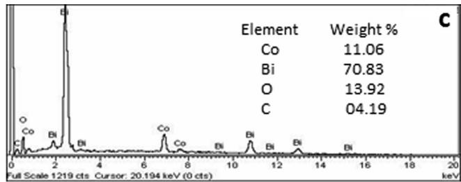
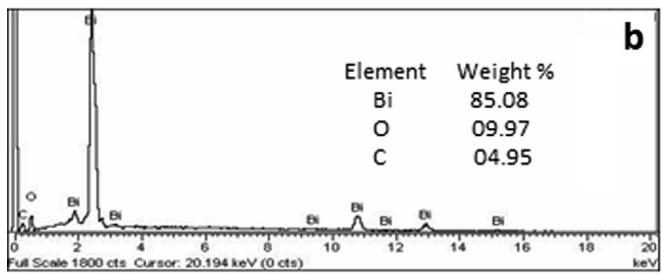
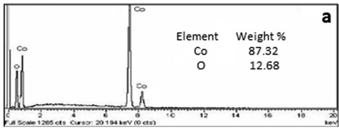
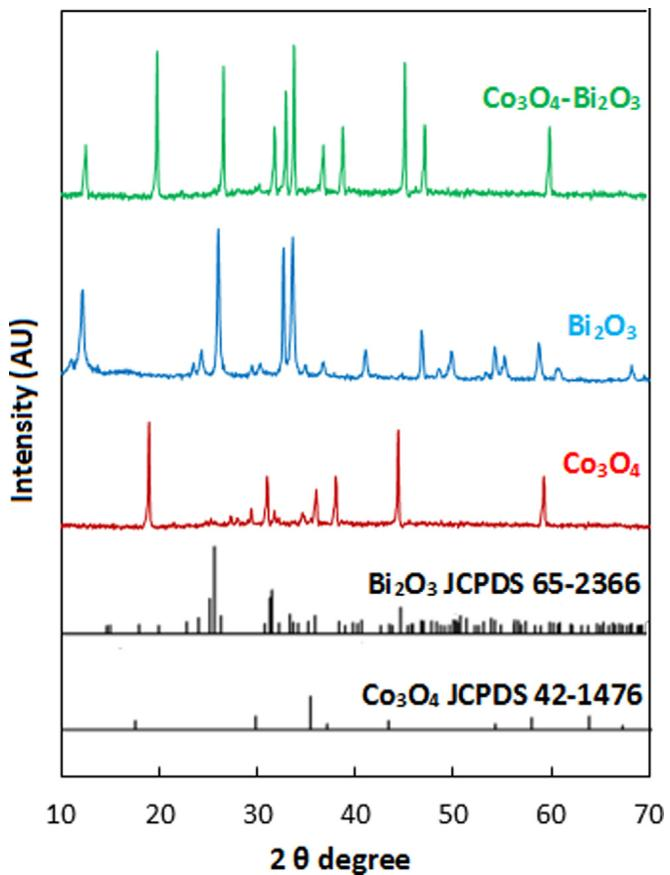
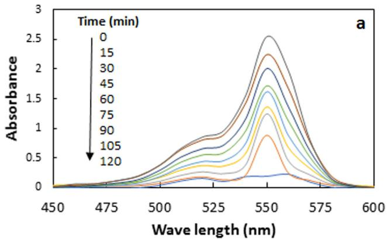
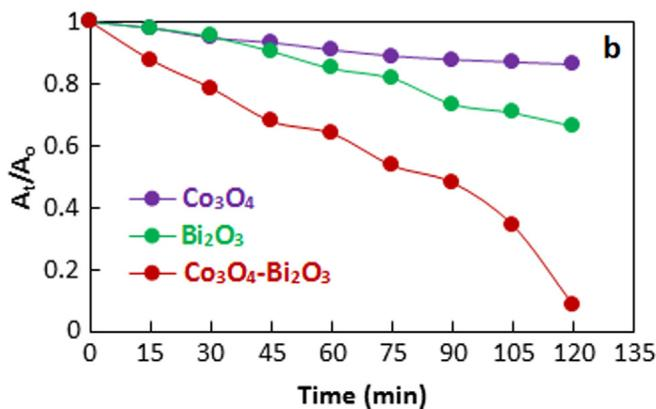
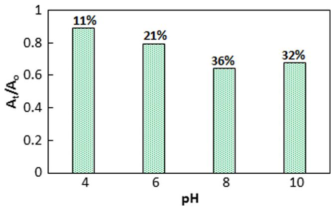
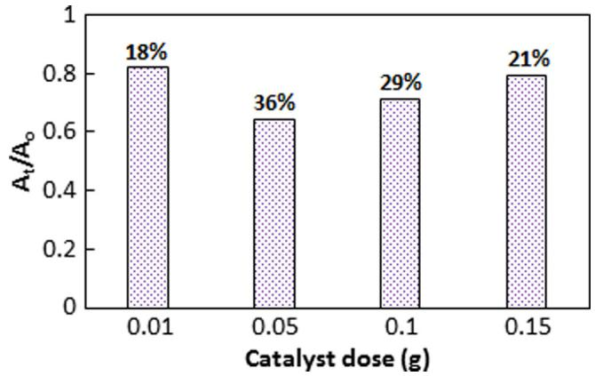
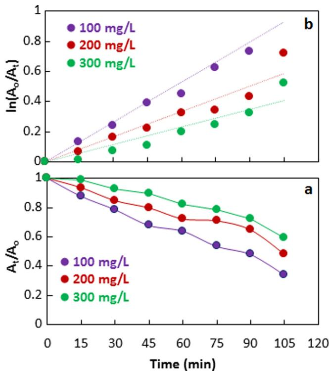

# ORIGINAL ARTICLE

# $\mathbf { C _ { 0 } } _ { 3 } \mathbf { O _ { 4 } } \mathbf { - B i _ { 2 } O _ { 3 } }$ heterojunction: An effective photocatalyst for photodegradation of rhodamine B dye

Muhammad Saeed a, \*, Norah Alwadai b, \*, Lamia Ben Farhat c,d , Afifa Baig a , Walid Nabgan e , Munawar Iqbal

a Department of Chemistry, Government College University Faisalabad, Pakistan   
b Department of Physics, College of Sciences, Princess Nourah bint Abdulrahman University, P.O. Box 84428, Riyadh 11671, Saudi Arabia   
c Department of Chemistry, College of Sciences, King Khalid University, P.O. Box 9004, Abha, Saudi Arabia   
d Laboratoire des mate´riaux et de l’environnement pour le de´veloppement durable LR18ES10, 9 Avenue Dr.Zoheir Sai, 1006, Tunis, Tunisia   
e School of Chemical and Energy Engineering, Faculty of Engineering, Universiti Teknologi Malaysia, Johor, Malaysia   
f Department of Chemistry, The University of Lahore, Lahore, Pakistan

Received 26 November 2021; accepted 23 January 2022

Available online 29 January 2022

# KEYWORDS

Co O -Bi O ;

Heterojunction;

Photodegradation;

Rhodamine B;

Kinetics analysis

Abstract Recently, the research on the remediation of aqueous organic pollutants over visible-lightactive photocatalysts has got much attention. Therefore, this study reports the fabrication of visiblelight-active $\mathrm { C o } _ { 3 } \mathrm { O } _ { 4 } { \cdot } \mathrm { B i } _ { 2 } \mathrm { O } _ { 3 }$ heterojunction photocatalyst for the photodegradation of rhodamine B dye. The $\mathrm { C o } _ { 3 } \mathrm { O } _ { 4 } { \cdot } \mathrm { B i } _ { 2 } \mathrm { O } _ { 3 }$ heterojunction was synthesized by the coprecipitation method and characterized by XRD, EDS, SEM, TEM, TGA, and FTIR. The as-prepared $\mathrm { C o } _ { 3 } \mathrm { O } _ { 4 } { \cdot } \mathrm { B i } _ { 2 } \mathrm { O } _ { 3 }$ heterojunction was utilized as a photocatalyst for the abatement of rhodamine B dye. It was observed that $\mathrm { C o } _ { 3 } \mathrm { O } _ { 4 } { \cdot } \mathrm { B i } _ { 2 } \mathrm { O } _ { 3 }$ showed the best catalytic performance with 92% degradation of rhodamine B dye than $\mathrm { C o } _ { 3 } \mathrm { O } _ { 4 }$ and $\mathbf { B i } _ { 2 } \mathbf { O } _ { 3 }$ with 14 and 34% removal of rhodamine B dye, respectively. The rate constant for $\mathrm { C o } _ { 3 } \mathrm { O } _ { 4 } { \cdot } \mathrm { B i } _ { 2 } \mathrm { O } _ { 3 }$ catalyzed photodegradation of rhodamine B was 6 times and 3 times higher than the rate constant for $\mathrm { C o } _ { 3 } \mathrm { O } _ { 4 }$ catalyzed and $\mathbf { B i } _ { 2 } \mathbf { O } _ { 3 }$ catalyzed photodegradation of rhodamine B, respectively. The as-prepared $\mathrm { C o } _ { 3 } \mathrm { O } _ { 4 } { \cdot } \mathrm { B i } _ { 2 } \mathrm { O } _ { 3 }$ exhibited the highest catalytic performance at pH 8.

 2022 The Author(s). Published by Elsevier B.V. on behalf of King Saud University. This is an open access article under the CC BY-NC-ND license (http://creativecommons.org/licenses/by-nc-nd/4.0/).

ELSEVIER

Production and hosting by Elsevier

# 1. Introduction

The industrial revolution has not only extended the land to mitigate overbuilding but also contributed significantly to environmental pollution (Lo Piccolo and Landi, 2021). The textile industry is one of the industries that pollute the aqueous system due to the discharge of its dyes contaminated wastewater. Several techniques have been proposed for the abatement of wastewater. The removal of organic pollutants from an aqueous system by photocatalysis employing semiconductor metal oxides as photocatalysts play a crucial role in the treatment of wastewater due to its advantages of mild reaction conditions, complete mineralization of pollutants, and low processing cost (S. Li et al., 2017; S. Li et al., 2020b; Chen et al., 2018a; Meng et al., 2019). An ideal photocatalyst for photodegradation of organic pollutants can effectively degrade the pollutants under irradiation of visible light. A narrow band gap semiconductor can be used as a photocatalyst under irradiation of visible light, however, the fast recombination of photo-induced positive holes and electrons inhibits the photocatalytic activity (Li et al., 2019; Huang et al., 2017; Zhong et al., 2017). Therefore, attempts are made to inhibit the recombination of photo-induced positive holes and electrons by developing composite materials. In this respect, several studies have been reported for the synthesis of active visible-light photocatalysts for the treatment of wastewater contaminated with organic pollutants (Li et al., 2018; Gan et al., 2018). The development of visible light-responsive active photocatalyst for dyes contaminated wastewater is a hot topic among the researchers of photocatalysis (Wang et al., 2022; Li et al., 2021; Li et al., 2022a).

The semiconductor bismuth oxide, $B \mathrm { i } _ { 2 } \mathrm { O } _ { 3 } ,$ has recently attracted the interest of researchers due to its suitable price, stable structure, and suitable band gap energies. The bismuth oxide, ${ \bf \cal B i } _ { 2 } { \bf O } _ { 3 } .$ , exists in different crystal types: the a-Bi2O3, b-Bi2O3, c-Bi2O3, d-Bi2O3, e-${ \bf B i } _ { 2 } { \bf O } _ { 3 }$ and x-Bi2O3 (Zhang et al., 2018; Ho et al., 2013). Among different crystal types, ${ \bf { \Delta } } \mathrm { { \sf { a } } } { \mathrm { - { \bf { B } } { \mathrm { i } } _ { 2 } { \mathrm { O } } _ { 3 } } } , \ \mathrm { { \beta } } { \mathrm { - { \bf { B } } { \mathrm { i } } _ { 2 } } } { \mathrm { { O } } } _ { 3 } \quad$ have been widely used in catalysis, chemical sensors, fuel cells, photovoltaic cells, and optical thin films. The ${ \mathsf { \alpha } } { \cdot } { \mathrm { B i } } _ { 2 } { \mathrm { O } } _ { 3 }$ and ${ \beta } { \cdot } { \mathrm { B i } _ { 2 } } { \mathrm { O } } _ { 3 }$ have band gap of 2.85 and 2.58 eV respectively, hence both can be activated under visible irradiation (Chen et al., 2018b; Song et al., 2020). However, the fast recombination photoinduced electron-hole limits the practical application of $\mathbf { B i } _ { 2 } \mathbf { O } _ { 3 }$ as a visible light photocatalyst. Therefore, attempts have been made to reduce the rate of recombination of photoinduced electronhole. The coupling of $\mathbf { B i } _ { 2 } \mathbf { O } _ { 3 }$ with semiconductors is one of the effective ways to separate the photoinduced electron and hole. The coupling of $\mathbf { B i } _ { 2 } \mathbf { O } _ { 3 }$ with semiconductor metal oxides results in the formation of a heterojunction interface with an electric field between two semiconductors. In this way, the electric field created at the heterojunction assists the transport of charges from one semiconductor to another resulting in an effective separation between the photoinduced charges (Bhaviya Raj et al., 2021; Kaur et al., 2020; Ansari et al., 2021; Balachandran and Swaminathan, 2012). Hence in ${ \bf B } \mathrm { i } _ { 2 } { \bf O } _ { 3 }$ -semiconductor heterojunctions, advantages such as separation of charges increased lifetime of charges, and enhanced transfer efficiency of the charges to the adsorbed substrate can be achieved. In this study, the development of heterojunction formed by the coupling of $\mathbf { B i } _ { 2 } \mathbf { O } _ { 3 }$ with spinel cobalt tetroxide $\left( \mathrm { C o } _ { 3 } \mathrm { O } _ { 4 } \right)$ is reported. The spinel cobalt oxide $\left( \mathrm { C o } _ { 3 } \mathrm { O } _ { 4 } \right)$ which is composed of Co (II) and Co (III) has been studied extensively due to its extraordinary properties. The high catalytic activity of $\mathrm { C o } _ { 3 } \mathrm { O } _ { 4 }$ is thought to be due to adsorption of oxygen in different states, oxygen defects, and variance in oxygen holes in $\mathrm { C o } _ { 3 } \mathrm { O } _ { 4 } .$ . Furthermore, the narrow band gap in the range of $1 . 2 { - } 2 . 1$ eV makes $\mathrm { C o } _ { 3 } \mathrm { O } _ { 4 }$ attractive in photocatalysis for the treatment of wastewater contaminated with organic pollutants (Malefane, 2020; Hu et al., 2019; Luo et al., 2019; Zhao et al., 2019; Rao and Sunandana, 2008). As $\mathbf { B i } _ { 2 } \mathbf { O } _ { 3 }$ has oxygen vacancies in its crystals, and $\mathrm { C o } _ { 3 } \mathrm { O } _ { 4 }$ is rich with oxygen content, therefore $\mathbf { B i } _ { 2 } \mathbf { O } _ { 3 }$ promotes mobility and activity of lattice oxygen in $\mathrm { C o } _ { 3 } \mathrm { O } _ { 4 }$ which results in separation of photoinduced electron-hole pair and ultimately enhances the photocatalytic activity. Hence, we attempted to develop an environmentally friendly and cost-effective method for synthesis of $\mathrm { C o } _ { 3 } \mathrm { O } _ { 4 } { \cdot } \mathrm { B i } _ { 2 } \mathrm { O } _ { 3 }$ photocatalyst by one step co-precipitation method and evaluate the photocatalytic activity by degradation of rhodamine B dye.

# 2. Experimental

# 2.1. Synthesis of photocatalyst

The $\mathrm { C o } _ { 3 } \mathrm { O } _ { 4 } { \cdot } \mathrm { B i } _ { 2 } \mathrm { O } _ { 3 }$ hetero-structure was prepared by the coprecipitation method. Typically, 12.5 mmol of cobalt nitrate hexahydrate and 12.5 mmol of bismuth nitrate pentahydrate were dissolved in 10 mL (1 M) nitric acid solution under vigorous stirring. Then, 1 M of sodium hydroxide solution was added dropwise to the above-mixed solution under continuous stirring at $6 0 ~ ^ { \circ } \mathrm { C }$ till pH 12 was obtained. The solution was further stirred for 2 h at 60 C. As a result, a green precipitate was formed. The resultant precipitate was filtered, washed with ethanol, and distilled water till all unreacted ions were eliminated from the prepared precipitate. Then, the washed precipitate was dried at $1 0 0 ~ ^ { \circ } \mathrm { C }$ overnight. Finally, the dried residue was calcined at 500 C for 3 h which resulted in black colored $\mathrm { C o } _ { 3 } \mathrm { O } _ { 4 } { \cdot } \mathrm { B i } _ { 2 } \mathrm { O } _ { 3 }$ hetero-structure.

For comparison, $\mathrm { C o } _ { 3 } \mathrm { O } _ { 4 }$ and $\mathrm { B i } _ { 2 } \mathrm { O } _ { 3 }$ were also prepared. The $\mathrm { C o } _ { 3 } \mathrm { O } _ { 4 }$ was prepared as follows. A 100 mL solution of cobalt nitrate hexahydrate (0.03 M) was mixed with a 100 mL solution of potassium carbonate (0.06 M) under sitting. The resultant reaction mixture was stirred for 7 h at $7 0 ^ { \circ } \mathbf { C } .$ . the obtained residue was filtered, washed, and dried at $1 0 0 ~ ^ { \circ } \mathrm { C }$ for 12 h. Finally, the dried sample was calcined at $5 0 0 ~ ^ { \circ } \mathrm { C }$ for 3 h to get $\mathrm { C o } _ { 3 } \mathrm { O } _ { 4 }$ particles.

The ${ \bf B i } _ { 2 } { \bf O } _ { 3 }$ was prepared by adding 1 M sodium hydroxide solution to a solution containing 4.85 g bismuth nitrate pentahydrate in 100 mL till pH 12 was obtained. Concentrated nitric acid was used for the dissolution of bismuth nitrate. The resultant precipitate was filtered, washed, and dried at 100 C for 12 h. The dried product was calcined at $5 0 0 ~ ^ { \circ } \mathrm { C }$ to get light yellow $\mathrm { B i } _ { 2 } \mathrm { O } _ { 3 }$ particles

# 2.2. Characterization

X-rays diffraction, energy dispersive spectroscopy, scanning electron microscopy, thermal gravimetric analysis, and infrared spectroscopy was used for characterization of prepared material using JOEL-JDX-3532 Japan X-ray diffractometer, JEOL-JSM 5910 Japan Scanning electron microscope, JSM5910 UK Energy dispersive X-rays spectrophotometer, Perkin Elmer 6300 TGA analyzer, and Bruker VRTEX70 Infrared spectrophotometer, respectively.

# 2.3. Catalytic activity

The photocatalytic activities of synthesized particles were determined with photodegradation of rhodamine B dye. Typically, a solution of rhodamine B dye was charged with a predetermined catalyst dose and stirred under sunlight irradiation for 120 min. Progress of photocatalytic degradation was monitored by sampling and analyzing the reaction mixture at a regular time interval. Blank experiments were performed by stirring the dye solution and dye solution with catalyst under irradiation and dark conditions, respectively. UV/Vis spectrophotometer (U-2800, HITACHI, Japan) was used for the measurement of photocatalytic activity.

# 3. Results and discussion

# 3.1. Characterization

The formation of $\mathrm { C o } _ { 3 } \mathrm { O } _ { 4 } , \mathrm { B i } _ { 2 } \mathrm { O } _ { 3 } .$ and $\mathrm { C o } _ { 3 } \mathrm { O } _ { 4 } { \cdot } \mathrm { B i } _ { 2 } \mathrm { O } _ { 3 }$ was confirmed by XRD analysis. The XRD of $\mathrm { C o } _ { 3 } \mathrm { O } _ { 4 }$ given in Fig. 1 consists of sharp diffraction peaks which show the crystalline nature of $\mathrm { C o } _ { 3 } \mathrm { O } _ { 4 } .$ The diffraction peaks observed at $2 \Theta \sim 1 8$ , 30, 37, 43, and $5 8 ^ { \circ }$ have been indexed to the spinel structure of $\mathrm { C o } _ { 3 } \mathrm { O } _ { 4 }$ (Manickam et al., 2016; Rao and Sunandana, 2008; Manigandan et al., 2013). Similarly, the diffraction peaks at 2h 12, 26, 33, 36, 41, 46, 54, and 58 are observed in the XRD of $\mathrm { B i } _ { 2 } \mathrm { O } _ { 3 }$ . All these diffraction peaks correspond to $\beta { \cdot } \mathrm { B i } _ { 2 } \mathrm { O } _ { 3 }$ . The remaining weak diffraction peaks represent the $\gamma { \mathrm { - } } \mathrm { B i } _ { 2 } \mathrm { O } _ { 3 }$ (Z. Li et al., 2020; Iyyapushpam et al., 2015; Liang et al., 2014; Huang et al., 2016). The existence of characteristic peaks of $\mathrm { C o } _ { 3 } \mathrm { O } _ { 4 }$ and $\mathrm { B i } _ { 2 } \mathrm { O } _ { 3 }$ in the XRD pattern of $\mathrm { C o } _ { 3 } \mathrm { O } _ { 4 } { \cdot } \mathrm { B i } _ { 2 } \mathrm { O } _ { 3 }$ suggest the successful formation of $\mathrm { C o } _ { 3 } \mathrm { O } _ { 4 } { \cdot }$ $\mathrm { B i } _ { 2 } \mathrm { O } _ { 3 }$ heterojunction (Z. Li et al., 2020).

The elemental composition of $\mathrm { C o } _ { 3 } \mathrm { O } _ { 4 } , \ \mathrm { B i } _ { 2 } \mathrm { O } _ { 3 }$ , and $\mathrm { C o } _ { 3 } \mathrm { O } _ { 4 } \mathrm { - }$ $\mathrm { B i } _ { 2 } \mathrm { O } _ { 3 }$ was investigated by energy dispersive spectroscopy using JSM5910, INCA200 UK. Fig. 2 shows the energy-dispersive spectra of the samples. The energy dispersive spectrum of $\mathrm { C o } _ { 3 } \mathrm { O } _ { 4 }$ given in Fig. 2a shows peaks for Co and O only which confirms the purity of the sample. The EDS analysis showed that prepared cobalt oxide is composed of 87.3 wt% Co and 12.68 wt% O. The energy dispersive spectrum of bismuth oxide (Fig. 2b) shows peaks for Bi, O, and C. The EDS analysis showed that prepared bismuth oxide is composed of 58.08, 9.97, and 4.95% Bi, O, and C respectively. The existence of C may be due to impurities in precursor material. Similarly, the energy dispersive spectrum of cobalt oxide-bismuth oxide composite (Fig. 2c) shows that the composite is composed of 11.6, 70.83, 13.92, and 4.19% Co, Bi, O, and C respectively.

line

| Element | Weight % |
| ------- | -------- |
| Co      | 11.06    |
| Bi      | 70.83    |
| O       | 13.92    |
| C       | 0.419    |

line

| Element | Weight % |
| ------- | -------- |
| Bi      | 85.08    |
| O       | 09.97    |
| C       | 04.95    |

line

| Element | Weight % |
| ------- | -------- |
| Co      | 87.32    |
| O       | 12.68    |

Fig. 2 EDS analysis of $\mathrm { C o } _ { 3 } \mathrm { O } _ { 4 }$ (a), $\mathrm { B i } _ { 2 } \mathrm { O } _ { 3 }$ (b), and $\mathrm { C o } _ { 3 } \mathrm { O } _ { 4 } { \cdot } \mathrm { B i } _ { 2 } \mathrm { O } _ { 3 }$ 3 (c).

line

| 2 θ degree | Intensity (AU) for Co₃O₄-Bi₂O₃ | Intensity (AU) for Bi₂O₃ | Intensity (AU) for Co₃O₄ | Intensity (AU) for Bi₂O₃ JCPDS 65-2366 | Intensity (AU) for Co₃O₄ JCPDS 42-1476 |
| ---------- | ------------------------------- | ------------------------ | ------------------------ | -------------------------------------- | -------------------------------------- |
| 10         | ~0                              | ~0                       | ~0                       | ~0                                     | ~0                                     |
| 20         | ~1.5                            | ~0.8                     | ~0.9                     | ~0                                     | ~0                                     |
| 30         | ~1.2                            | ~1.0                     | ~0.7                     | ~0                                     | ~0                                     |
| 40         | ~1.0                            | ~0.9                     | ~0.8                     | ~0                                     | ~0                                     |
| 50         | ~0.8                            | ~0.7                     | ~0.6                     | ~0                                     | ~0                                     |
| 60         | ~1.0                            | ~0.8                     | ~0.9                     | ~0                                     | ~0                                     |
| 70         | ~0                              | ~0                       | ~0                       | ~0                                     | ~0                                     |

Fig. 1 X-ray diffraction analyses $\mathrm { C o } _ { 3 } \mathrm { O } _ { 4 } , \ \mathrm { B i } _ { 2 } \mathrm { O } _ { 3 } ,$ and $\mathrm { C o } _ { 3 } \mathrm { O } _ { 4 } { \cdot }$ - $\mathbf { B i } _ { 2 } \mathbf { O } _ { 3 }$ .

The morphology of $\mathrm { C o } _ { 3 } \mathrm { O } _ { 4 } , \mathrm { B i } _ { 2 } \mathrm { O } _ { 3 } ,$ and $\mathrm { B i } _ { 2 } \mathrm { O } _ { 3 } { \mathrm { - C o } } _ { 3 } \mathrm { O } _ { 4 }$ was studied by scanning electron microscopy with JEOL-JSM-5910, Japan scanning electron microscope. JEOL-JSM-420, Japan coating machine was used for mounting and coating the samples with gold foil. The scanning electron micrographs given in Fig. 3a-c show that the particles of as-prepared samples are irregular in shape, non-agglomerated, and dispersed. The non-agglomerated and dispersed particles have enhanced catalytic activity as the active centers are easily accessible to substrate molecules. Fig. 3d and Fig. 3e show the TEM and HR-TEM of $\mathrm { \bf B i } _ { 2 } \mathrm { O } _ { 3 } { \mathrm { - C o } _ { 3 } } \mathrm { O } _ { 4 }$ respectively. Fig. 3d shows that $\mathrm { B i _ { 2 } O _ { 3 }  – C o _ { 3 } O _ { 4 } \Gamma _ { i s } }$ composed of particles with sizes less than 50 nm. The well-defined lattice fringes indicated in HR-TEM show that as prepared $\mathrm { \bf B i } _ { 2 } \mathrm { O } _ { 3 }  – \mathrm { C o } _ { 3 } \mathrm { O } _ { 4 }$ is highly crystallized (Ding et al., 2012).

Thermal stability of as-prepared samples was estimated by thermal gravimetric analysis using Perkin Elmer 6300 TGA analyzer. As given in Fig. 4, there was only about a 5% loss in weight of the samples up to $7 0 0 ~ ^ { \circ } \mathrm { C } ,$ which is attributed to loss of moisture content. The non-significant weight loss shows the stability of as-prepared samples over a wide range of temperatures.

The typical bonds and functional groups of as-prepared samples were estimated by Fourier transform infrared spectroscopy (FTIR) using Bruker (VRTEX70 series). Fig. 5 shows the FTIR spectra of as-prepared samples in which several peaks can be observed. The absorption peak at 1634 $\mathrm { c m } ^ { - 1 }$ is attributed to –OH groups present at the surface of $\mathrm { C o } _ { 3 } \mathrm { O } _ { 4 } \mathrm { - }$ ${ \bf B i } _ { 2 } { \bf O } _ { 3 }$ heterojunction. The absorption bands at 445 cm1 and 846 $\mathrm { c m } ^ { - 1 }$ have been assigned to stretching vibrations of Bi-O and Bi-O-Bi bonds, respectively. The absorption bands at 571 and 668 are representative peaks of $\mathrm { C o } _ { 3 } \mathrm { O } _ { 4 }$ due to Co-O stretching vibrations (Hammad et al., 2016; Ilyas, M,

Fig. 3 SEM of $\mathrm { C o _ { 3 } O _ { 4 } ( a ) , B i _ { 2 } O _ { 3 } }$ (b) and $\mathrm { C o } _ { 3 } \mathrm { O } _ { 4 } { \cdot } \mathrm { B i } _ { 2 } \mathrm { O } _ { 3 }$ (c) TEM (d) and HR-TEM (e) images of $\mathrm { C o } _ { 3 } \mathrm { O } _ { 4 } { \cdot } \mathrm { B i } _ { 2 } \mathrm { O } _ { 3 }$

Fig. 4 TGA analysis of $\mathrm { C o _ { 3 } O _ { 4 } ( a ) , B i _ { 2 } O _ { 3 } ( b ) }$ , and $\mathrm { C o } _ { 3 } \mathrm { O } _ { 4 } { \cdot } \mathrm { B i } _ { 2 } \mathrm { O } _ { 3 }$ 3 (c).   
Fig. 5 FTIR analysis of $\mathrm { C o _ { 3 } O _ { 4 } ( a ) , B i _ { 2 } O _ { 3 } ( b ) } .$ , and $\mathrm { C o } _ { 3 } \mathrm { O } _ { 4 } { \cdot } \mathrm { B i } _ { 2 } \mathrm { O } _ { 3 }$ (c).

2010; Li et al., 2017a; Saeed et al., 2012; Tang et al., 2018). The FTIR result shows the successful formation of $\mathrm { C o } _ { 3 } \mathrm { O } _ { 4 } { \cdot } \mathrm { B i } _ { 2 } \mathrm { O } _ { 3 }$ heterojunction.

# 3.2. Catalytic activity

The photocatalytic activity of $\mathrm { C o } _ { 3 } \mathrm { O } _ { 4 } , \mathrm { B i } _ { 2 } \mathrm { O } _ { 3 } ,$ , and $\mathrm { C o } _ { 3 } \mathrm { O } _ { 4 } { \cdot } \mathrm { B i } _ { 2 } \mathrm { O } _ { 3 }$ was evaluated by performing photodegradation experiments of rhodamine B dye in the presence of 0.05 g of aforementioned catalysts under visible irradiation. A 50 mL rhodamine B (100 mg/L) was taken in a Pyrex glass beaker and was stirred under irradiation for 30 min. Then, as a blank reaction, 0.05 g $\mathrm { C o _ { 3 } O _ { 4 } / B i _ { 2 } O _ { 3 } / C o _ { 3 } O _ { 4 } { - } B i _ { 2 } O _ { 3 } }$ was added to the dye solution and stirred for 30 min under dark to clarify the effect of adsorption. For evaluation of catalytic performance, the reaction mixture was then irradiated under stirring. The change in concentration of rhodamine B due to catalytic degradation was monitored by measurement of absorbance at wavelength 554 nm using a UV–visible spectrophotometer. Fig. 6a shows the visible spectra of the reaction samples taken from the solution of rhodamine B dye treated with $\mathrm { C o } _ { 3 } \mathrm { O } _ { 4 } { \cdot } \mathrm { B i } _ { 2 } \mathrm { O } _ { 3 } .$ . As the normalized temporal changes in absorbance $\mathbf { ( A _ { t } / A _ { o } ) }$ of rhodamine B during the photocatalytic process are proportional to normalized concentrations $\displaystyle ( \mathbf { C } _ { \mathrm { t } } / \mathbf { C } _ { \mathrm { o } } )$ of rhodamine B dye, therefore, the photocatalytic activity was expressed as $\mathbf { A _ { t } } / \mathbf { A _ { \mathrm { o } } }$ vs t as given in Fig. 6b $( \mathrm { A } _ { \mathrm { t } } )$ absorbance of rhodamine B at time $\mathrm { t } , \mathrm { A } _ { \mathrm { o } } \mathrm { ; }$ Initial absorbance of rhodamine B, $\mathrm { { C } _ { t } \mathrm { { : } } }$ concentration of rhodamine B at time $\operatorname { t } , \mathbf { C } _ { \mathrm { o } } \colon$ initial concentration of rhodamine B). It was observed that $\mathrm { C o } _ { 3 } \mathrm { O } _ { 4 } { \cdot } \mathrm { B i } _ { 2 } \mathrm { O } _ { 3 }$ showed the best catalytic performance with ${ \sim } 9 2 \%$ degradation of rhodamine B dye than $\mathrm { C o } _ { 3 } \mathrm { O } _ { 4 }$ and $\mathrm { B i } _ { 2 } \mathrm { O } _ { 3 }$ with 14 and 34% removal of rhodamine B dye, respectively. The obtained results show that coupling of $\mathrm { C o } _ { 3 } \mathrm { O } _ { 4 }$ with $\mathrm { B i } _ { 2 } \mathrm { O } _ { 3 }$ significantly promotes catalytic activity.

A leaching experiment was also performed to confirm whether the photodegradation of rhodamine B is a heterogeneous or homogeneous reaction. For this purpose, 0.1 g $\mathrm { C o } _ { 3 } \mathrm { O } _ { 4 } { \cdot } \mathrm { B i } _ { 2 } \mathrm { O } _ { 3 }$ was suspended in 50 mL distilled water and stirred under irradiation for 120 min. Then, the $\mathrm { C o } _ { 3 } \mathrm { O } _ { 4 } { \cdot } \mathrm { B i } _ { 2 } \mathrm { O } _ { 3 }$ was filtered and a known solution of rhodamine B was added to the filtrate to get a 100 mg/L dye solution and analyzed with a UV–visible spectrophotometer. Finally, the dye solution was again treated with irradiation and analyzed with a UV–visible spectrophotometer after 120 min. The analysis showed that there was no change in the concentration of the dye. Hence, it is concluded that $\mathrm { C o } _ { 3 } \mathrm { O } _ { 4 } { \cdot } \mathrm { B i } _ { 2 } \mathrm { O } _ { 3 }$ does not leach to an aqueous medium in this study.

line

| Time (min) | Absorbance at 450 nm | Absorbance at 500 nm | Absorbance at 525 nm | Absorbance at 550 nm | Absorbance at 575 nm | Absorbance at 600 nm |
|------------|----------------------|----------------------|----------------------|----------------------|----------------------|----------------------|
| 0          | ~0.0                 | ~0.0                 | ~0.0                 | ~0.0                 | ~0.0                 | ~0.0                 |
| 15         | ~0.0                 | ~0.0                 | ~0.0                 | ~0.0                 | ~0.0                 | ~0.0                 |
| 30         | ~0.0                 | ~0.0                 | ~0.0                 | ~0.0                 | ~0.0                 | ~0.0                 |
| 45         | ~0.0                 | ~0.0                 | ~0.0                 | ~0.0                 | ~0.0                 | ~0.0                 |
| 60         | ~0.0                 | ~0.0                 | ~0.0                 | ~0.0                 | ~0.0                 | ~0.0                 |
| 75         | ~0.0                 | ~0.0                 | ~0.0                 | ~0.0                 | ~0.0                 | ~0.0                 |
| 90         | ~0.0                 | ~0.0                 | ~0.0                 | ~0.0                 | ~0.0                 | ~0.0                 |
| 105        | ~0.0                 | ~0.0                 | ~0.0                 | ~0.0                 | ~0.0                 | ~0.0                 |
| 120        | ~0.0                 | ~0.0                 | ~0.0                 | ~2.5                 | ~2.5                 | ~2.5                 |

line

| Time (min) | Co₃O₄ | Bi₂O₃ | Co₃O₄-Bi₂O₃ |
| ---------- | ----- | ----- | ----------- |
| 0          | 1.0   | 1.0   | 1.0         |
| 15         | 0.98  | 0.98  | 0.88        |
| 30         | 0.96  | 0.96  | 0.78        |
| 45         | 0.94  | 0.92  | 0.68        |
| 60         | 0.92  | 0.88  | 0.64        |
| 75         | 0.90  | 0.84  | 0.54        |
| 90         | 0.88  | 0.76  | 0.48        |
| 105        | 0.86  | 0.72  | 0.36        |
| 120        | 0.84  | 0.68  | 0.10        |

Fig. 6 a) Visible absorption spectra of reaction mixture treated with $\mathrm { C o } _ { 3 } \mathrm { O } _ { 4 } { \cdot } \mathrm { B i } _ { 2 } \mathrm { O } _ { 3 }$ b) Comparison of photocatalytic activity of $\mathrm { C o } _ { 3 } \mathrm { O } _ { 4 } .$ , $\mathrm { B i } _ { 2 } \mathrm { O } _ { 3 } ,$ and $\mathrm { C o } _ { 3 } \mathrm { O } _ { 4 } { \cdot } \mathrm { B i } _ { 2 } \mathrm { O } _ { 3 }$ towards photodegradation of rhodamine B dye.

The stability and recycling ability of $\mathrm { C o } _ { 3 } \mathrm { O } _ { 4 } { - } \mathrm { B i } _ { 2 } \mathrm { O } _ { 3 }$ as photocatalyst was also confirmed. For this purpose, the spent photocatalyst was washed with ethanol and DD water followed by drying. Then, the dried $\mathrm { C o } _ { 3 } \mathrm { O } _ { 4 } { \cdot } \mathrm { B i } _ { 2 } \mathrm { O } _ { 3 }$ was re-employed for photodegradation of rhodamine B dye under pre-determined experimental conditions. In the same way, the $\mathrm { C o } _ { 3 } \mathrm { O } _ { 4 } { \cdot } \mathrm { B i } _ { 2 } \mathrm { O } _ { 3 }$ .) was recycled for three-time. The results showed that there was no significant loss in photocatalytic activity of $\mathrm { C o } _ { 3 } \mathrm { O } _ { 4 } \mathrm { - }$ ${ \bf B i } _ { 2 } { \bf O } _ { 3 }$ towards the photodegradation of rhodamine B dye. Hence, it is concluded that the prepared $\mathrm { C o } _ { 3 } \mathrm { O } _ { 4 } { \cdot } \mathrm { B i } _ { 2 } \mathrm { O } _ { 3 }$ is stable under present experimental conditions and can be recycled again.

$\mathrm { C o } _ { 3 } \mathrm { O } _ { 4 } { \cdot } \mathrm { B i } _ { 2 } \mathrm { O } _ { 3 }$ is a second-generation photocatalyst. The second-generation photocatalysts, also called as heterojunctions were developed to overcome the drawback of firstgeneration photocatalysts (Li et al., 2022b; Liu et al., 2022; Saeed et al., 2022; Anwer et al., 2019). The single-component metal oxides are classified as first-generation photocatalysts. The fast recombination of electron-hole is a basic drawback of first-generation photocatalysts. In second-generation photocatalysts, the photoinduced electrons are confined in the conduction band of one component of heterojunction while the holes are confined in the valence band of the other component. This spatial separation of the photoinduced electrons and holes inhibits their recombination. As a result, active sites are generated at which degradation of organic pollutants takes place. The second-generation photocatalytic materials show light absorbance in the visible region $( \lambda \ge 4 2 0 ~ \mathrm { n m } )$ accompanied with lower band gap energies than first-generation photocatalytic materials. The Mott-Schottky measurement has been reported for band-edge position and conductivity types of ${ \bf B i } _ { 2 } { \bf O } _ { 3 }$ and $\mathrm { C o } _ { 3 } \mathrm { O } _ { 4 }$ having band potentials of 0.28 and 0.5 V vs. $\mathbf { A g } / \mathbf { A g } \mathbf { C l } .$ , respectively. The $\operatorname { E } _ { \mathbf { C B } }$ of ${ \bf B i } _ { 2 } { \bf O } _ { 3 }$ and $\operatorname { E } _ { \mathbf { V B } }$ of $\mathrm { C o } _ { 3 } \mathrm { O } _ { 4 }$ has been estimated as 0.28 and 0.90 V vs NHE, respectively. Accordingly, the $\operatorname { E } _ { \operatorname { V B } }$ of $\mathbf { B i } _ { 2 } \mathbf { O } _ { 3 }$ and $\operatorname { E } _ { \mathbf { C B } }$ of $\mathrm { C o } _ { 3 } \mathrm { O } _ { 4 }$ has been estimated as 2.73 and $- 1 . 4 7 \mathrm { ~ V } ,$ , respectively (Ma et al., 2022; X. Liu et al., 2021; Xu et al., 2018; Zhu et al., 2018). Hence, the energy band diagram for $\mathrm { C o } _ { 3 } \mathrm { O } _ { 4 } { \cdot } \mathrm { B i } _ { 2 } \mathrm { O } _ { 3 }$ is constructed as given in Fig. 7. The VB of $\mathrm { C o } _ { 3 } \mathrm { O } _ { 4 }$ can accept the photoexcited electrons from the CB of $\mathbf { B i } _ { 2 } \mathbf { O } _ { 3 }$ due to the short distance between the bands. This transfer of electrons offers a Z-scheme charge transfer model in $\mathrm { C o } _ { 3 } \mathrm { O } _ { 4 } { \cdot } \mathrm { B i } _ { 2 } \mathrm { O } _ { 3 }$ heterojunction. Hence, the photodegradation of rhodamine B dye over $\mathrm { C o } _ { 3 } \mathrm { O } _ { 4 } { \cdot } \mathrm { B i } _ { 2 } \mathrm { O } _ { 3 }$ photocatalyst can be described by a direct Zscheme charge transfer mechanism. According to this mechanism, the photoexcited electrons in CB of $\mathrm { B i } _ { 2 } \mathrm { O } _ { 3 }$ flow to the VB of $\mathrm { C o } _ { 3 } \mathrm { O } _ { 4 }$ under visible light irradiation. The flow of electrons from CB of $\mathrm { B i } _ { 2 } \mathrm { O } _ { 3 }$ to the VB of $\mathrm { \dot { C } o _ { 3 } O _ { \angle } }$ 4 reduces the recombination of positive holes and electrons and ultimately it results in enhancement of the photocatalytic activity towards photodegradation of rhodamine B dye (S. Li et al., 2020a; C. Liu et al., 2021; Wang et al., 2020; Zhang et al., 2020).

Hence, the photodegradation of rhodamine B dye in the present study can be described as follow.

chemical

Energy level diagram of carbon nanotubes (CB) showing electron transitions and transition states under sunlight, oxygen, and hydrogen conditions

Fig. 7 Schematic diagram of Z-scheme mechanism.

$$
\begin{array}{l} C o _ {3} O _ {4} - B i _ {2} O _ {3} + \text { Visible   irradiation } \\ \rightarrow h ^ {+} (C o _ {3} O _ {4} - B i _ {2} O _ {3}) + e ^ {-} (C o _ {3} O _ {4} - B i _ {2} O _ {3}) \tag {1} \\ \end{array}
$$

$$
h ^ {+} (C o _ {3} O _ {4} - B i _ {2} O _ {3}) + H _ {2} O \rightarrow O H \tag {2}
$$

$$
e ^ {-} (C o _ {3} O _ {4} - B i _ {2} O _ {3}) + (O _ {2}) _ {a d s} \rightarrow \rightarrow O H \tag {3}
$$

$$
[ R H ] + O H \rightarrow \text { Degradation   products } \tag {4}
$$

The photoinduced electron, positive hole, and OH radicals are the active species that contribute to the photodegradation of rhodamine B dye. The role played by these species was confirmed by scavenging experiments. For this purpose, EDTA and BQ were separately used as scavengers each of which significantly suppressed the photodegradation activity. Since the EDTA arrests the positive holes, therefore the activity decreased in the presence of EDTA. Similarly, the addition of BQ suppresses photodegradation because it reacts with superoxide anion radicals (Song et al., 2020; Xu et al., 2019).

Based on the above mechanism, the rate expression is written as

$$
- \frac {d [ R H ]}{d t} = k (O _ {2}) _ {a d s} [ R H ] ^ {n} \tag {5}
$$

$$
- \frac {d [ R H ]}{d t} = k _ {o b s} [ R H ] ^ {n} \tag {6}
$$

$$
\ln \frac {A _ {o}}{A _ {t}} = k _ {1} t (\text { For   n } = 1) \tag {7}
$$

$$
\frac {1}{A _ {t}} = \frac {1}{A _ {o}} + k _ {2} t (\text { For   n } = 2) \tag {8}
$$

kobs, k1, k2, $\mathbf { A } _ { \mathbf { o } , \mathbf { \ell } }$ and $\mathbf { A } _ { \mathrm { t } }$ is observed rate constant, 1st order rate constant, 2nd order rate constant, initial absorbance of rhodamine B, and absorbance at time t respectively.

Fig. 8 shows the kinetics treatment of the photodegradation degradation data of rhodamine B. The 1st order rate constant (k1) and 2nd order rate constant (k2) are given in Table 1. As the regression coefficient $( \mathbf { R } ^ { 2 } )$ values are higher for 1st order kinetics treatment, therefore, it is proposed that the degradation of rhodamine B dye in this study follows 1st order reaction kinetics. The rate constant for $\mathrm { C o } _ { 3 } \mathrm { O } _ { 4 } { \cdot } \mathrm { B i } _ { 2 } \mathrm { O } _ { 3 }$ catalyzed photodegradation of rhodamine B was 6 times and 3 times higher than the rate constant for $\mathrm { C o } _ { 3 } \mathrm { O } _ { 4 }$ catalyzed and $\mathrm { B i } _ { 2 } \mathrm { O } _ { 3 }$ catalyzed photodegradation of rhodamine B respectively. Hence, the formation of $\mathrm { C o } _ { 3 } \mathrm { O } _ { 4 } { \cdot } \mathrm { B i } _ { 2 } \mathrm { O } _ { 3 }$ heterostructure significantly boosts the catalytic performance of $\mathrm { C o } _ { 3 } \mathrm { O } _ { 4 }$ and ${ \bf B i } _ { 2 } { \bf O } _ { 3 }$ .

# 3.3. Effect of pH

The pH of the solution significantly affects the catalytic activity; therefore, the pH was optimized as well in this study. The

Fig. 8 Kinetics treatment of experimental data with $\mathrm { C o } _ { 3 } \mathrm { O } _ { 4 }$ (a), $\mathrm { { B i } } _ { 2 } \mathrm { { O } } _ { 3 } \mathrm { { \ } ( b ) }$ , and $\mathrm { C o } _ { 3 } \mathrm { O } _ { 4 } { \cdot } \mathrm { B i } _ { 2 } \mathrm { O } _ { 3 }$ (c).   
Table 1 The 1st order and 2nd order rate constants for photodegradation of rhodamine B. 

<table><tr><td rowspan="2">Catalyst</td><td colspan="2"> $\ln \frac{A_o}{A_t} = k_1 t$ </td><td colspan="2"> $\frac{1}{A_t} = \frac{1}{A_o} + k_2 t$ </td><td rowspan="2">*Catalytic efficiency (%)</td></tr><tr><td> $k_1$ </td><td> $R^2$ </td><td> $k_2$ </td><td> $R^2$ </td></tr><tr><td> $Co_3O_4$ </td><td>0.0015</td><td>0.994</td><td>0.006</td><td>0.975</td><td>14</td></tr><tr><td> $Bi_2O_3$ </td><td>0.003</td><td>0.977</td><td>0.0137</td><td>0.951</td><td>34</td></tr><tr><td> $Co_3O_4-Bi_2O_3$ </td><td>0.0089</td><td>0.988</td><td>0.0541</td><td>0.879</td><td>92</td></tr></table>

\*Reaction duration: 120 min.

effect of pH on the catalytic activity of $\mathrm { C o } _ { 3 } \mathrm { O } _ { 4 } { \cdot } \mathrm { B i } _ { 2 } \mathrm { O } _ { 3 }$ was evaluated by performing a degradation experiment at pH 4, 6, 8, and 10. Fig. 9 shows the effect of pH on photocatalytic degradation of rhodamine B dye (the numbers given in bar graphs represent the catalytic efficiency). Every experimental cycle was performed with $\mathrm { ~ a ~ } 0 . 0 5 \mathrm { ~ g ~ C o } _ { 3 } \mathrm { O } _ { 4 } { \cdot } \mathrm { B i } _ { 2 } \mathrm { O } _ { 3 }$ per 50 mL solution (100 mg/L). The reaction duration was 60 min. It was observed that an increase in pH up to 8 favored the catalytic activity. The point of zero charges (PZC) for $\mathrm { C o } _ { 3 } \mathrm { O } _ { 4 } – \mathrm { B i } _ { 2 } \mathrm { O } _ { 3 }$ 3 has been reported as pH 8.4 (Ivanova-Kolcheva et al., 2020), hence the surface of $\mathrm { C o } _ { 3 } \mathrm { O } _ { 4 } { \cdot } \mathrm { B i } _ { 2 } \mathrm { O } _ { 3 }$ becomes negative at pH higher than PZC and positive at pH lower than PZC. At pH lower than PZC, both the rhodamine B and surface of the $\mathrm { C o } _ { 3 } \mathrm { O } _ { 4 } { \cdot } \mathrm { B i } _ { 2 } \mathrm { O } _ { 3 }$ are positive, therefore the catalytic activity is low at low pH due to electrostatic repulsion. Similarly, the negative surface of $\mathrm { C o } _ { 3 } \mathrm { O } _ { 4 } { \cdot } \mathrm { B i } _ { 2 } \mathrm { O } _ { 3 }$ at higher pH also opposes the adsorption of rhodamine B, hence the maximum catalytic activity exhibited at pH 8.

# 3.4. Effect of catalyst dose

The dependence of the photocatalytic activity of $\mathrm { C o } _ { 3 } \mathrm { O } _ { 4 } { \cdot } \mathrm { B i } _ { 2 } \mathrm { O } _ { 3 }$ towards photodegradation of rhodamine B on photocatalyst dosage has been investigated by performing photodegradation experiments with different dosages of $\mathrm { C o } _ { 3 } \mathrm { O } _ { 4 } { \cdot } \mathrm { B i } _ { 2 } \mathrm { O } _ { 3 }$ under identical conditions. In a model experiment, a 50 mL solution of rhodamine B dye (100 mg/L) was treated with a known amount of $\mathrm { C o } _ { 3 } \mathrm { O } _ { 4 } { \cdot } \mathrm { B i } _ { 2 } \mathrm { O } _ { 3 }$ for 60 min. Fig. 10 shows the dependence of catalytic activity on catalyst dosage. It was observed that an increase in catalyst dose from 0.01 to 0.05 g increased the degradation from 18 to 36%, however, further increase in catalyst dose caused a decrease in degradation efficiency. The enhancement in catalytic efficiency with an increase in catalyst dose is due to two reasons: (1) The number of molecules of rhodamine B adsorbed increases with catalyst dosage, (2) the density of $\mathrm { C o } _ { 3 } \mathrm { O } _ { 4 } { \cdot } \mathrm { B i } _ { 2 } \mathrm { O } _ { 3 }$ particles under illumination increases with catalyst dosage. The decrease in catalytic efficiency at higher catalyst dosage is due to the scattering of light. Hence, a catalyst dose of 0.05 $\mathbf { g } / 5 0$ mL of dye solution is found to be the optimum catalyst dosage in this study.

# 3.5. Effect of concentration

The initial concentration of dye also affects the catalytic activity, therefore the concentration dependence of catalytic activity has been also investigated. This investigation was carried out by performing separate photodegradation experiments of rhodamine B dye in the presence of $0 . 0 5 \mathrm { ~ g ~ C o _ { 3 } O _ { 4 } { \cdot } B i _ { 2 } O _ { 3 } }$ using 100, 200, and 300 mg/L solutions of rhodamine B dye. Fig. 11a shows the effect of concentration on catalytic activity $\mathrm { C o } _ { 3 } \mathrm { O } _ { 4 } \mathrm { - }$ ${ \bf B i } _ { 2 } { \bf O } _ { 3 }$ towards photodegradation of rhodamine B dye. It was found that catalytic activity decreased with an increase in the initial concentration of rhodamine B dye. The decrease in catalytic activity with an increase in the concentration of dye is due to three reasons (Adeel et al., 2021; Balcha et al., 2016; Nisar et al., 2022; Saeed et al., 2018):

bar

| pH | A_t/A_o (%) |
|---|---|
| 4 | 11 |
| 6 | 21 |
| 8 | 36 |
| 10 | 32 |

Fig. 9 Effect of pH on the catalytic activity of $\mathrm { C o } _ { 3 } \mathrm { O } _ { 4 } { \cdot } \mathrm { B i } _ { 2 } \mathrm { O } _ { 3 }$ towards photodegradation of rhodamine B.

bar

| Catalyst dose (g) | A_t/A_o (%) |
|---|---|
| 0.01 | 18 |
| 0.05 | 36 |
| 0.1 | 29 |
| 0.15 | 21 |

Fig. 10 Effect of catalyst dose on the catalytic activity of $\mathrm { C o } _ { 3 } \mathrm { O } _ { 4 } { \cdot }$ $\mathbf { B i } _ { 2 } \mathbf { O } _ { 3 }$ towards photodegradation of rhodamine B.

1. The pathlength of a photon decreases with an increase in the concentration of dye

line

| Time (min) | ln(A₀/A₁) 100 mg/L | ln(A₀/A₁) 200 mg/L | ln(A₀/A₁) 300 mg/L | A₁/A₀ 100 mg/L | A₁/A₀ 200 mg/L | A₁/A₀ 300 mg/L |
| ---------- | ------------------ | ------------------ | ------------------ | -------------- | -------------- | -------------- |
| 0          | 0.0                | 0.0                | 0.0                | 1.0            | 1.0            | 1.0            |
| 15         | 0.1                | 0.05               | 0.0                | 0.9            | 0.9            | 1.0            |
| 30         | 0.25               | 0.15               | 0.05               | 0.8            | 0.85           | 0.95           |
| 45         | 0.4                | 0.25               | 0.1                | 0.7            | 0.8            | 0.9            |
| 60         | 0.5                | 0.35               | 0.2                | 0.65           | 0.75           | 0.85           |
| 75         | 0.6                | 0.4                | 0.3                | 0.6            | 0.7            | 0.8            |
| 90         | 0.7                | 0.45               | 0.35               | 0.5            | 0.65           | 0.75           |
| 105        | 0.8                | 0.5                | 0.4                | 0.4            | 0.6            | 0.6            |
| 120        | 0.9                | 0.6                | 0.5                | 0.3            | 0.5            | 0.5            |

Fig. 11 Effect of concentration of dye on the catalytic activity of $\mathrm { C o } _ { 3 } \mathrm { O } _ { 4 } { \cdot } \mathrm { B i } _ { 2 } \mathrm { O } _ { 3 }$ towards photodegradation of rhodamine B.

Table 2 Kinetics parameters for $\mathrm { C o } _ { 3 } \mathrm { O } _ { 4 } { \cdot } \mathrm { B i } _ { 2 } \mathrm { O } _ { 3 }$ catalyzed photodegradation of rhodamine B. 

<table><tr><td>Parameter</td><td>100 mg/L</td><td>200 mg/L</td><td>300 mg/L</td></tr><tr><td> $k_{1}$  (min $^{-1}$ )</td><td>0.0089</td><td>0.0056</td><td>0.0039</td></tr><tr><td> $R^{2}$ </td><td>0.988</td><td>0.969</td><td>0.948</td></tr><tr><td>*Catalytic efficiency (%)</td><td>92</td><td>72</td><td>50</td></tr></table>

\*Reaction duration: 120 min.

2. The rhodamine B dye absorbs photons significantly than catalyst at a higher concentration of dye   
3. The ratio of OH radicals to rhodamine B molecules decreases with an increase in concentration

The degradation data given in Fig. 11a was analyzed for kinetics studies using kinetics equation (7). Fig. 11b shows the fitting of the 1st order kinetics model (equation (7)) to experimental data. The kinetics parameters given in Table 2 shows that the rate constant decreases with an increase in the initial concentration of rhodamine B dye.

# 4. Conclusions

Herein, we prepared the $\mathrm { C o } _ { 3 } \mathrm { O } _ { 4 } { \cdot } \mathrm { B i } _ { 2 } \mathrm { O } _ { 3 }$ heterojunction as visible-light responsive photocatalyst by coprecipitation method for photodegradation of rhodamine B dye successfully. The $\mathrm { C o } _ { 3 } \mathrm { O } _ { 4 } { \cdot } \mathrm { B i } _ { 2 } \mathrm { O } _ { 3 }$ heterojunction was characterized by XRD, EDS, SEM, TGA, and FTIR. The asprepared $\mathrm { C o } _ { 3 } \mathrm { O } _ { 4 } { \cdot } \mathrm { B i } _ { 2 } \mathrm { O } _ { 3 }$ heterojunction was utilized as a photocatalyst for photodegradation of rhodamine B dye using a 100 mg/L solution. The photocatalytic activity of $\mathrm { C o _ { 3 } O _ { 4 } \mathrm { - } \mathbf { B i _ { 2 } O _ { 3 } , C o _ { 3 } O _ { 4 } } }$ , and $\mathbf { B i } _ { 2 } \mathbf { O } _ { 3 }$ towards photodegradation of rhodamine B dye was found as 92, 14, and 34%, respectively. The 1st order and 2nd order kinetics models were applied to the data of photocatalytic degradation of rhodamine b dye. The effect of pH, catalyst dose, and initial concentration of rhodamine B dye on photocatalytic performance was investigated. The $\mathrm { C o } _ { 3 } \mathrm { O } _ { 4 } \mathrm { - }$ Bi2O3 heterojunction was found as an efficient visible-light-driven photocatalyst for photodegradation of rhodamine B dye.

# Declaration of Competing Interest

The authors declare that they have no known competing financial interests or personal relationships that could have appeared to influence the work reported in this paper.

# Acknowledgements

The authors express their gratitude to Princess Nourah bint Abdulrahman University Researchers Supporting Project (Grant No. PNURSP2022R11), Princess Nourah bint Abdulrahman University, Riyadh, Saudi Arabia. The authors extend their appreciation to the Deanship of Scientific Research at King Khalid University, Saudi Arabia for funding this work through the Research Groups Program under grant number G.R.P.: 349/43.

# References

Adeel, M., Saeed, M., Khan, I., Muneer, M., Akram, N., 2021. Synthesis and Characterization of Co-ZnO and Evaluation of Its Photocatalytic Activity for Photodegradation of Methyl Orange. ACS Omega 6, 1426–1435. https://doi.org/10.1021/ acsomega.0c05092.

Ansari, S., Ansari, M.S., Satsangee, S.P., Jain, R., 2021. Bi ${ } _ { 2 } \mathrm { O } _ { 3 } / Z \mathrm { n O }$ nanocomposite: Synthesis, characterizations and its application in electrochemical detection of balofloxacin as an anti-biotic drug. J. Pharm. Anal. 11, 57–67. https://doi.org/10.1016/j. jpha.2020.03.013.   
Anwer, H., Mahmood, A., Lee, J., Kim, K.H., Park, J.W., Yip, A.C. K., 2019. Photocatalysts for degradation of dyes in industrial effluents: Opportunities and challenges. Nano Res. 12, 955–972. https://doi.org/10.1007/s12274-019-2287-0.   
Balachandran, S., Swaminathan, M., 2012. Facile fabrication of heterostructured Bi2O3-ZnO photocatalyst and its enhanced photocatalytic activity. J. Phys. Chem. C 116, 26306–26312. https://doi. org/10.1021/jp306874z.   
Balcha, A., Yadav, O.P., Dey, T., 2016. Photocatalytic degradation of methylene blue dye by zinc oxide nanoparticles obtained from precipitation and sol-gel methods. Environ. Sci. Pollut. Res. 23, 25485–25493. https://doi.org/10.1007/s11356-016-7750-6.   
Bhaviya Raj, R., Umadevi, M., Parimaladevi, R., 2021. Synergy photodegradation of basic dyes by zno/bi2o3 nanocomposites under visible light irradiation. Iran. J. Chem. Chem. Eng. 40, 1121– 1131 https://doi.org/10.30492/ijcce.2020.105225.3506.   
Chen, M., Chu, W., Beiyuan, J., Huang, Y., 2018a. Enhancement of UV-assisted TiO2 degradation of ibuprofen using Fenton hybrid process at circumneutral pH. Chin. J. Catal. 39, 701–709. https:// doi.org/10.1016/S1872-2067(18)63070-0.   
Chen, M., Yao, J., Huang, Y., Gong, H., Chu, W., 2018b. Enhanced photocatalytic degradation of ciprofloxacin over $\mathrm { \bf B i } _ { 2 } \mathrm { O } _ { 3 } / ( \mathrm { B i O } ) _ { 2 } \mathrm { C O } _ { 3 }$ heterojunctions: efficiency, kinetics, pathways, mechanisms and toxicity evaluation. Chem. Eng. J. 334, 453–461. https://doi.org/ 10.1016/j.cej.2017.10.064.   
Ding, Y., Zhu, L., Huang, A., Zhao, X., Zhang, X., Tang, H., 2012. A heterogeneous $\mathrm { C o _ { 3 } O _ { 4 } { \cdot } B i _ { 2 } O _ { 3 } }$ composite catalyst for oxidative degradation of organic pollutants in the presence of peroxymonosulfate. Catal. Sci. Technol. 2, 1977–1984. https://doi.org/10.1039/ c2cy20080e.   
Gan, L., Xu, L.J., Qian, K., Wang, Y.D., Jiang, F.Y., 2018. Hydrothermal synthesis of magnetic graphene-BiFeO hybrids and their photocatalytic properties. Xinxing Tan Cailiao/New Carbon Materials 33, 221–228.   
Hammad, A.H., Marzouk, M.A., ElBatal, H.A., 2016. The Effects of Bi2O3 on Optical, FTIR and Thermal Properties of SrO-B2O3 Glasses. Silicon 8, 123–131. https://doi.org/10.1007/s12633-015- 9283-x.   
Ho, C.-H., Chan, C.-H., Huang, Y.-S., Tien, L.-C., Chao, L.-C., 2013. The study of optical band edge property of bismuth oxide nanowires a-Bi2O3. Opt. Express 21, 11965. https://doi.org/ 10.1364/oe.21.011965.   
Hu, L., Zhang, G., Liu, M., Wang, Q., Dong, S., Wang, P., 2019. Application of nickel foam-supported $\mathrm { C o } _ { 3 } \mathrm { O } _ { 4 } { \cdot } \mathrm { B i } _ { 2 } \mathrm { O } _ { 3 }$ as a heterogeneous catalyst for BPA removal by peroxymonosulfate activation. Sci. Total Environ. 647, 352–361. https://doi.org/10.1016/j. scitotenv.2018.08.003.   
Huang, X., Zhang, W., Tan, Y., Wu, J., Gao, Y., Tang, B., 2016. Facile synthesis of rod-like Bi O nanoparticles as an electrode material for pseudocapacitors. Ceram. Int. 42, 2099–2105. https:// doi.org/10.1016/j.ceramint.2015.09.157.   
Huang, Y., Liang, Y., Rao, Y., Zhu, D., Cao, J.J., Shen, Z., Ho, W., Lee, S.C., 2017. Environment-Friendly Carbon Quantum Dots/ ZnFe O Photocatalysts: Characterization, Biocompatibility, and Mechanisms for NO Removal. Environ. Sci. Technol. 51, 2924– 2933. https://doi.org/10.1021/acs.est.6b04460.   
Ilyas, M M, Saeed, 2010. Oxidation of benzyl alcohol in liquid phase catalyzed by cobalt oxide. Int. J. Chem. Reactor Eng. 8, A77. https://doi.org/10.2202/1542-6580.2162.   
Ivanova-Kolcheva, V., Sygellou, L., Stoyanova, M., 2020. Enhanced catalytic degradation of acid orange 7 dye by peroxymonosulfate on $\mathrm { C o } _ { 3 } \mathrm { O } _ { 4 }$ promoted by Bi O . Acta Chim. Slov. 67, 609–621 https://doi.org/10.17344/ACSI.2019.5617.

Iyyapushpam, S., Nishanthi, S.T., Padiyan, D.P., 2015. Synthesis of b-$\mathbf { B i } _ { 2 } \mathbf { O } _ { 3 }$ towards the application of photocatalytic degradation of methyl orange and its instability. J. Phys. Chem. Solids 81, 74–78. https://doi.org/10.1016/j.jpcs.2015.02.005.   
Kaur, G., Sharma, S., Bansal, P., 2020. Visible light responsive heterostructured a-Bi2O3/ZnO doped b-Bi2O3 photocatalyst for remediation of organic pollutants. Desalin. Water Treat. 201, 349– 355. https://doi.org/10.5004/dwt.2020.26062.   
Li, R., Zhou, D., Luo, J., Xu, W., Li, J., Li, S., Cheng, P., Yuan, D., 2017a. The urchin-like sphere arrays Co3O4 as a bifunctional catalyst for hydrogen evolution reaction and oxygen evolution reaction. J. Power Sources 341, 250–256. https://doi.org/10.1016/j. jpowsour.2016.10.096.   
Li, S., Chen, J., Hu, S., Wang, H., Jiang, W., Chen, X., 2020a. Facile construction of novel Bi2WO6/Ta3N5 Z-scheme heterojunction nanofibers for efficient degradation of harmful pharmaceutical pollutants. Chem. Eng. J. 402. https://doi.org/10.1016/j. cej.2020.126165.   
Li, S., Hu, S., Jiang, W., Liu, Y., Zhou, Y., Liu, J., Wang, Z., 2018. Facile synthesis of cerium oxide nanoparticles decorated flower-like bismuth molybdate for enhanced photocatalytic activity toward organic pollutant degradation. J. Colloid Interface Sci. 530, 171– 178. https://doi.org/10.1016/j.jcis.2018.06.084.   
Li, S., Hu, S., Jiang, W., Zhang, J., Xu, K., Wang, Z., 2019. In situ construction of WO3 nanoparticles decorated Bi2MoO6 microspheres for boosting photocatalytic degradation of refractory pollutants. J. Colloid Interface Sci. 556, 335–344. https://doi.org/ 10.1016/j.jcis.2019.08.077.   
Li, S., Shen, X., Liu, J., Zhang, L., 2017b. Synthesis of $\mathrm { T a } _ { 3 } \mathrm { N } _ { 5 } / \mathrm { B i } _ { 2 ^ { - } }$ MoO6 core-shell fiber-shaped heterojunctions as efficient and easily recyclable photocatalysts. Environ. Sci. Nano 4, 1155–1167. https://doi.org/10.1039/c6en00706f.   
Li, S., Wang, C., Cai, M., Yang, F., Liu, Y., Chen, J., Zhang, P., Li, X., Chen, X., 2022a. Facile fabrication of TaON/Bi2MoO6 core– shell S-scheme heterojunction nanofibers for boosting visible-light catalytic levofloxacin degradation and Cr(VI) reduction. Chem. Eng. J. 428. https://doi.org/10.1016/j.cej.2021.131158.   
Li, S., Wang, C., Liu, Y., Cai, M., Wang, Y., Zhang, H., Guo, Y., Zhao, W., Wang, Z., Chen, X., 2022b. Photocatalytic degradation of tetracycline antibiotic by a novel Bi Sn O /Bi MoO S-scheme heterojunction: performance, mechanism insight and toxicity assessment. Chem. Eng. J. 429. https://doi.org/10.1016/j. cej.2021.132519.   
Li, S., Wang, C., Liu, Y., Xue, B., Chen, J., Wang, H., Liu, Y.u., 2020b. Facile preparation of a novel Bi2Wo6/calcined mussel shell composite photocatalyst with enhanced photocatalytic performance. Catalysts 10, 1–11. https://doi.org/10.3390/catal10101166.   
Li, S., Wang, C., Liu, Y., Xue, B., Jiang, W., Liu, Y.u., Mo, L., Chen, X., 2021. Photocatalytic degradation of antibiotics using a novel Ag $\mathrm { \langle A g _ { 2 } S / B i _ { 2 } M o O _ { 6 } }$ plasmonic p-n heterojunction photocatalyst: mineralization activity, degradation pathways and boosted charge separation mechanism. Chem. Eng. J. 415. https://doi.org/10.1016/ j.cej.2021.128991.   
Li, Z., Tang, X., Huang, G., Luo, X., He, D., Peng, Q., Huang, J., Ao, M., Liu, K., 2020c. Bismuth MOFs based hierarchical Co3O4- Bi O composite: an efficient heterogeneous peroxymonosulfate activator for azo dyes degradation. Sep. Purif. Technol. 242. https://doi.org/10.1016/j.seppur.2020.116825.   
Liang, J., Zhu, G., Liu, P., Luo, X., Tan, C., Jin, L., Zhou, J., 2014. Synthesis and characterization of Fe-doped b-Bi2O3 porous microspheres with enhanced visible light photocatalytic activity. Superlattices Microstruct. 72, 272–282. https://doi.org/10.1016/j. spmi.2014.05.005.   
Liu, C., Mao, S., Shi, M., Wang, F., Xia, M., Chen, Q., Ju, X., 2021a. Peroxymonosulfate activation through 2D/2D Z-scheme CoAl-LDH/BiOBr photocatalyst under visible light for ciprofloxacin degradation. J. Hazard. Mater. 420. https://doi.org/10.1016/j. jhazmat.2021.126613.

Liu, C., Mao, S., Wang, H., Wu, Y., Wang, F., Xia, M., Chen, Q., 2022. Peroxymonosulfate-assisted for facilitating photocatalytic degradation performance of 2D/2D WO3/BiOBr S-scheme heterojunction. Chem. Eng. J. 430. https://doi.org/10.1016/j. cej.2021.132806.   
Liu, X., Yang, Z., Zhang, L., 2021b. In-situ fabrication of 3D hierarchical flower-like b-Bi2O3@CoO Z-scheme heterojunction for visible-driven simultaneous degradation of multi-pollutants. J. Hazard. Mater. 403. https://doi.org/10.1016/j. jhazmat.2020.123566.   
Lo Piccolo, E., Landi, M., 2021. Red-leafed species for urban ‘‘greening” in the age of global climate change. J. For. Res. 32, 151–159. https://doi.org/10.1007/s11676-020-01154-2.   
Luo, S., Wang, R., Yin, J., Jiao, T., Chen, K., Zou, G., Zhang, L., Zhou, J., Zhang, L., Peng, Q., 2019. Preparation and dye degradation performances of self-assembled MXene-Co3O4 nanocomposites synthesized via solvothermal approach. ACS Omega 4, 3946–3953. https://doi.org/10.1021/acsomega.9b00231.   
Ma, H., Yang, X., Tang, X., Cao, X., Dai, R., 2022. Self-assembled Co-doped b-Bi2O3 flower-like structure for enhanced photocatalytic antibacterial effect under visible light. Appl. Surf. Sci. 572. https://doi.org/10.1016/j.apsusc.2021.151348.   
Malefane, M.E., 2020. Co3O4/Bi4O5I2/Bi5O7I C-Scheme Heterojunction for Degradation of Organic Pollutants by Light-Emitting Diode Irradiation. ACS Omega. https://doi.org/10.1021/ acsomega.0c03881.   
Manickam, M., Ponnuswamy, V., Sankar, C., Suresh, R., Mariappan, R., Chandrasekaran, J., 2016. The Effect of Solution pH on the Properties of Cobalt Oxide Thin Films Prepared by Nebulizer Spray Pyrolysis Technique. Int. J. Thin Films Sci. Technol. 5, 155– 161 https://doi.org/10.18576/ijtfst/050302.   
Meng, L., Sun, Y., Gong, H., Wang, P., Qiao, W.C., Gan, L., Xu, L.J., 2019. Research progress of the application of graphene-based materials in the treatment of water pollutants. Xinxing Tan Cailiao/New Carbon Materials 34, 220–237. https://doi.org/ 10.1016/j.carbon.2019.06.092.   
Manigandan, R., Giribabu, K., Suresh, R., Vijayalakshmi, L., Stephen, A., Narayanan, V., 2013. Cobalt Oxide Nanoparticles: Characterization and its Electrocatalytic Activity towards Nitrobenzene. Chem. Sci. Trans. 2. https://doi.org/10.7598/ cst2013.10.   
Nisar, A., Saeed, M., Muneer, M., Usman, M., Khan, I., 2022. Synthesis and characterization of ZnO decorated reduced graphene oxide (ZnO-rGO) and evaluation of its photocatalytic activity toward photodegradation of methylene blue. Environ. Sci. Pollut. Res. 29, 418–430. https://doi.org/10.1007/s11356-021-13520-6.   
Rao, K.V., Sunandana, C.S., 2008. Synthesis and characterization of Co3O4 nanoparticles. AIP Conf. Proc. 1003, 97–99. https://doi.org/ 10.1063/1.2928996.   
Saeed, M., Ilyas, M., Siddique, M., 2012. Oxidative degradation of phenol in aqueous medium catalyzed by lab prepared cobalt oxide. J. Chem. Soc. Pak. 34, 626–633.   
Saeed, M., Ahmad, A., Boddula, R., Inamuddin, Haq, A. ul, Azhar, A., 2018. Ag@Mn O : an effective catalyst for photo-degradation of rhodamine B dye. Environ. Chem. Lett. 16, 287-294. doi: 10.1007/s10311-017-0661-z.   
Saeed, M., Muneer, M., Haq, A. ul, Akram, N., 2022. Photocatalysis: an effective tool for photodegradation of dyes—a review. Envi-

ronmental Science and Pollution Research 29, 293–311. https://doi. org/10.1007/s11356-021-16389-7   
Song, C., Wang, L.J., Sun, S.M., Wu, Y., Xu, L.J., Gan, L., 2020. Preparation of visible-light photocatalysts of Bi2O /Bi embedded in porous carbon from Bi-based metal organic frameworks for highly efficient Rhodamine B removal from water. Xinxing Tan Cailiao/ New Carbon Materials 35, 609–618. https://doi.org/10.1016/S1872- 5805(20)60513-3.   
Tang, X., Feng, Q., Huang, J., Liu, K., Luo, X., Peng, Q., 2018. Carbon-coated cobalt oxide porous spheres with improved kinetics and good structural stability for long-life lithium-ion batteries. J. Colloid Interface Sci. 510, 368–375. https://doi.org/10.1016/j. jcis.2017.09.086.   
Wang, C., Cai, M., Liu, Y., Yang, F., Zhang, H., Liu, J., Li, S., 2022. Facile construction of novel organic–inorganic tetra (4-carboxyphenyl) porphyrin/Bi2MoO6 heterojunction for tetracycline degradation: performance, degradation pathways, intermediate toxicity analysis and mechanism insight. J. Colloid Interface Sci. 605, 727–740. https://doi.org/10.1016/j.jcis.2021.07.137.   
Wang, Z., Wang, H., Zeng, Z., Zeng, G., Xu, P., Xiao, R., Huang, D., Chen, X., He, L., Zhou, C., Yang, Y., Wang, Z., Wang, W., Xiong, W., 2020. Metal-organic frameworks derived Bi2O2CO3/porous carbon nitride: A nanosized Z-scheme systems with enhanced photocatalytic activity. Appl. Catal. B 267. https://doi.org/10.1016/ j.apcatb.2020.118700.   
Xu, L., Meng, L., Zhang, X., Mei, X., Guo, X., Li, W., Wang, P., Gan, L., 2019. Promoting Fe3+/Fe2+ cycling under visible light by synergistic interactions between P25 and small amount of Fenton reagents. J. Hazard. Mater. 379. https://doi.org/10.1016/j.jhazmat.2019.120795.   
Xu, Q., Zhang, L., Yu, J., Wageh, S., Al-Ghamdi, A.A., Jaroniec, M., 2018. Direct Z-scheme photocatalysts: Principles, synthesis, and applications. Mater. Today 21, 1042–1063. https://doi.org/10.1016/ j.mattod.2018.04.008.   
Zhang, L., Ghimire, P., Phuriragpitikhon, J., Jiang, B., Gonc¸ alves, A. A.S., Jaroniec, M., 2018. Facile formation of metallic bismuth/ bismuth oxide heterojunction on porous carbon with enhanced photocatalytic activity. J. Colloid Interface Sci. 513, 82–91. https:// doi.org/10.1016/j.jcis.2017.11.011.   
Zhang, W., Mohamed, A.R., Ong, W.J., 2020. Z-Scheme Photocatalytic Systems for Carbon Dioxide Reduction: Where Are We Now? Angewandte Chemie - International Edition 59, 22894– 22915. https://doi.org/10.1002/anie.201914925.   
Zhao, Z., Fan, J., Deng, X., Liu, J., 2019. One-step synthesis of phosphorus-doped g-C3N4/Co3O4 quantum dots from vitamin B12 with enhanced visible-light photocatalytic activity for metronidazole degradation. Chem. Eng. J. 360, 1517–1529. https://doi.org/ 10.1016/j.cej.2018.10.239.   
Zhong, Y.K., Zhou, B., Zhang, C.J., Wu, D., 2017. Effects of surface oxygen functional groups on activated carbon on the adsorption and photocatalytic degradation activities of a TiO2-AC hybrid for methylene blue and methylene orange. Xinxing Tan Cailiao/New Carbon Materials 32, 460–466. https://doi.org/10.1016/ j.carbon.2017.10.059.   
Zhu, M., Sun, Z., Fujitsuka, M., Majima, T., 2018. Z-Scheme Photocatalytic Water Splitting on a 2D Heterostructure of Black Phosphorus/Bismuth Vanadate Using Visible Light. Angewandte Chemie - International Edition 57, 2160–2164. https://doi.org/ 10.1002/anie.201711357.