# OPEN

# ZnO/WO composite for efficient photocatalytic degradation of methylene blue dye under solar light

Yerkanat N. Kanafin1, Kuralay Rustembekkyzy1, Altynay Seiilbek2, Kamshat Kutzhanova3, Shanazar Atabaev4, Marat Kaikanov5,6 & Timur Sh. Atabaev1,6

In this study, a ZnO/WO composite structure has been formed using a hydrothermal approach for the potential photocatalytic degradation of Methylene blue (MB) dye, one of the most frequent colorants found in textile wastewater. The main goal of the study was to investigate the impacts of ZnO content on the structural, morphological, and photocatalytic properties of the $Z n O N W O _ { 3 }$ composite structure. It was found that 5% $z _ { \mathsf { n o } N M }$ composite structure exhibited the highest photocatalytic efficiency under simulated solar light irradiation, achieving approximately 93.8% degradation of MB dye within 60 min (volume=30 mL, catalyst mass=3 mg, MB concentration=5 ppm). The observed superior photocatalytic performance of the catalyst can be attributed to the optimal synergy between ZnO and $\mathsf { w o } _ { 3 } ,$ which facilitated the improved light absorption and enhanced charge separation. It also highlights the potential of $Z _ { \mathsf { n O } / \mathsf { w } 0 _ { 3 } }$ composite structures for water treatment applications, offering an effective approach for the degradation of hazardous dye pollutants under solar light irradiation.

Keywords ZnO/WO , Methylene blue, Photocatalysis, Heterojunction, Water treatment

The textile industry is one of the largest consumers of water, requiring an estimated 100–200  L of water to produce just 1 kilogram of textile product1 . After textile mills treat their fabrics with dyes such as MB, the resulting wastewater is often discharged into natural water bodies, negatively impacting water quality and disrupting ecosystems. Existing literature indicates that approximately 15% of non-biodegradable textile dyes are released into natural water sources annually2 . MB is widely utilized as a blue colorant in the textile industry; however, its ingestion can lead to symptoms such as dizziness, diarrhea, and anaphylaxis3–6 . Moreover, exposure to MB can result in a range of adverse effects, including skin irritation, discoloration, and permanent eye burns, which pose risks to both human health and marine ecosystems3–6 . Therefore, the issue of water bodies pollution caused by the discharge of MB and other dye colorants is urgent and demands prompt action.

Various wastewater treatment methods have been employed to tackle this issue. Adsorption7 , and coagulation/ flocculation8,9 are among the physical techniques used to treat wastewater, whereas biological methods, such as degradation by microorganisms10 and biofilms11, have also been widely researched and tested. While these methods have been proven effective, they are limited by their dye removal efficiency, dependence on contact time, and sensitivity to the presence of other compounds and/or reagents. Therefore, the advanced oxidation process, particularly in the form of photocatalysis, can be considered an effective and alternative method for the degradation of organic pollutants in water. Such a process requires a photocatalyst that transforms organic pollutants into less harmful degradation products like $\mathrm { H } _ { 2 } \mathrm { O }$ and $\mathrm { C O } _ { 2 } ,$ along with a light source that typically activates the photocatalyst. In most cases, natural sunlight and high-intensity light-emitting diodes (LEDs) can be used as light sources, while designing and selecting the appropriate photocatalyst remains a challenge. Ideally, the photocatalyst should be easily activated by a wide range of wavelengths, possess a large specific surface area, be made from low-cost elements, and maintain chemical stability12,13. On the other hand, most metal oxide photocatalysts made from low-cost materials suffer from high electron-hole recombination rates, which reduce

1Department of Chemistry, Nazarbayev University, Astana, Kazakhstan. 2Department of Chemistry, Utrecht University, Utrecht, The Netherlands. 3Department of Physical and Analytical Chemistry, Karaganda Buketov University, Karaganda, Kazakhstan. 4Department of General Educational Disciplines, Chirchik Branch of Auezov University, Chirchik, Uzbekistan. 5Department of Physics, Nazarbayev University, Astana, Kazakhstan. 6Institute of Functional Materials, Astana, Kazakhstan. email: marat.kaikanov@nu.edu.kz; timur.atabaev@nu.edu.kz

their photocatalytic efficiency. In this context, the development of a heterojunction structure can help reduce the electron-hole recombination rate, enhance the specific surface area, and potentially modify the bandgap14.

Recently, WO has emerged as an effective photocatalyst for a variety of organic pollutants, ranging from 3textile dyes to antibiotics/pesticides15–17. Typically, WO is a low-cost and chemically stable n-type semiconductor with a narrow band gap of around $2 . 4 { - } \dot { 2 } . \dot { 8 } ~ \mathrm { e V } ,$ 3 enabling it to absorb both UV and visible $\mathrm { \bar { l i g h t } } ^ { 1 5 - 1 7 }$ . On the other hand, the conduction band (CB) level of ${ \mathrm { W O } } _ { 3 }$ is less negative than the potential for the single-electron reduction of oxygen. As a result, the photogenerated electrons in the CB of WO cannot be effectively consumed by the adsorbed oxygen molecules to form the superoxide anion $( \mathrm { ^ { \cdot } O } _ { 2 } ^ { - } ) .$ This leads to the accumulation of photogenerated electrons on the surface of the WO when exposed to the light, which in turn promotes the electron-hole recombination18. To tackle this issue, $\breve { \mathrm { W O } } _ { 3 }$ can be combined with other wide bandgap materials such as ZnO, where the conduction and valence bands are properly aligned, enabling efficient charge carrier transfer. Moreover, ZnO exhibits higher electron mobility $( { \sim } 2 0 0 { - } 3 0 0 ~ \mathrm { c m ^ { 2 } / V { \cdot } s } )$ compared to $\mathrm { T i } \mathrm { \bar { O } } _ { \gamma } ( \sim 0 . 1 -$ 24.0 cm²/V·s), making it more favorable for photocatalytic reactions19. For example, Adhikari and coworkers20 synthesized and tested $\mathrm { W O } _ { 3 } – \mathrm { Z n O }$ mixed oxides for the photocatalytic degradation of cationic MB and anionic Orange G dyes. Experimental results revealed that the 10% ${ \mathrm { W O } } _ { \mathrm { { 3 } } }$ -containing ZnO exhibited better photocatalytic performance than the other compositions for both dyes. Sajjad and coworkers examined the impact of ZnO incorporation (1–4 wt%) into WO to create $Z _ { \mathrm { { n O / W O } _ { \it { 3 } } } }$ composites and evaluated their photocatalytic performance using methyl orange $\mathrm { d y } \mathrm { e } ^ { 2 1 }$ . It was found that 2 wt% $\mathrm { Z n O / W O _ { 3 } }$ sample demonstrated the highest photocatalytic performance under visible light illumination. In general, the efficiency of the system is governed by multiple parameters, including the synthesis methodology, catalyst size and morphology, specific surface area and porosity, the $\mathrm { Z n O / W O _ { 3 } }$ ratio, etc.

In our study, a hydrothermal treatment was employed to facilitate the deposition of ZnO onto the surface of the WO structure, which differs from the methods reported before20,21, resulting in a composite that combines enhanced crystallinity, increased pore volume, and improved charge separation without the need for noble metals or complex surface modifications. Several $\mathrm { Z n O / \bar { W } O _ { 3 } }$ ratios were evaluated based on their photocatalytic 3performance using MB as a model pollutant under simulated solar light for optimization purposes. The use of simulated solar light, compared to UV irradiation, enhances the applicability of photocatalysts under natural sunlight, thereby improving energy efficiency and environmental sustainability.

# Materials and methods

# Materials and photocatalyst synthesis

High-purity reagents were procured from Merck and used without further purification. WO was synthesized via a precipitation-calcination method. In brief, 0.75 g of $\mathrm { N a } , \mathrm { W O } _ { 4 } { \cdot } 2 \mathrm { H } , \mathrm { O }$ 3 was dispersed in 10 mL of deionized water, and the pH of the solution was adjusted to 1 using 1  M HCl. The mixture was stirred for 2  h, then centrifuged at 7000 rpm for 5 min. The resulting precipitate was washed with deionized water and ethanol, dried at 60 °C overnight, and subsequently calcined at 500 ${ } ^ { \circ } \mathrm { C }$ for 2 h.

The synthesis of ZnO/WO -based catalysts was performed using a hydrothermal method. In this procedure, equimolar amounts of $\mathrm { Z n ( N O } _ { 3 } \mathrm { ) } _ { 2 } { \cdot } 6 \mathrm { H } _ { 2 } \mathrm { O }$ and $\mathrm { C } _ { 6 } \mathrm { H } _ { 1 2 } \mathrm { N } _ { 4 }$ (hexamethylenetetramine, HMTA) were added. The amount of the zinc precursor was controlled at 5%, 10%, and 25% by weight relative to the mass of WO . The reagents were added to 20 mL of deionized (DI) water and sonicated for 1 min to ensure homogeneity. The suspension was then transferred to a Teflon-lined autoclave and subjected to hydrothermal treatment at $9 5 ~ ^ { \circ } \mathrm { C }$ for 12 h. After natural cooling, the precipitate was separated by centrifugation, washed several times with DI water and ethanol, and dried overnight at $6 0 ^ { \circ } \mathrm { C }$ .

# Catalyst characterization

The surface morphology of the catalysts was examined using a Crossbeam 540 (Carl Zeiss, Germany) scanning electron microscope (SEM) equipped with energy-dispersive X-ray (EDX). In addition, samples were characterized using a JEM2010F transmission electron microscope (TEM, JEOL Ltd, Japan). The crystallographic analysis of the prepared catalysts was evaluated using a SmartLab X-ray diffractometer (XRD, Rigaku Corp., Japan). The surface area and pore size distribution were determined using an Autosorb iQ nitrogen porosimeter (Quantachrome Instruments, USA). Elemental analysis was performed employing an Inductively Coupled Plasma Optical Emission Spectroscopy (ICP-OES, iCap 6000, Thermo Fischer Scientific, USA). Light absorbance measurements were carried out using an absolute quantum yield spectrometer equipped with an integrated camera (C9920-02, Hamamatsu Photonics, Japan).

# Photocatalytic activity measurements

Prior to the photocatalytic treatment, the MB solution with the catalyst was kept in the dark for 30  min to establish an adsorption-desorption equilibrium. The photocatalytic efficiency of the synthesized catalysts was assessed using an LCS-100 solar simulator (100 W, AM 1.5G filter, Newport-Spectra Physics, GmbH, Germany) under controlled conditions: MB concentration of 5 mg/L, MB solution volume of 30 mL, catalyst dosage of 100 mg/L, and 5 µL of H O (35%). The light intensity was calibrated to 1 sun using a silicon reference cell. After a predetermined reaction time, the solution was centrifuged at 7000 rpm for 4 min, and the absorbance of the MB solution was measured at 554 nm using a Genesys 50 UV-Vis spectrophotometer (Thermo Fisher Scientific Inc., USA). All experiments were conducted in triplicate to ensure reproducibility.

To investigate the photocatalytic degradation mechanism, radical scavenger experiments were conducted using 5 mM of each scavenger22. Ethylene diamine tetra-acetate (EDTA) was used to quench photogenerated holes (h+), isopropyl alcohol (IPA) was employed as a hydroxyl radical scavenger, and benzoquinone (p-BQ) was used to capture superoxide radicals. The scavengers were added individually to the reaction solution prior to irradiation, and the degradation of MB was monitored under the same experimental conditions as the standard photocatalytic tests.

# Results and discussion Samples characterization

The morphology of the prepared samples was analyzed using SEM. Figure  1a illustrates that the bare ${ \mathrm { W O } } _ { 3 }$ exhibits a typical plate-like structure with a relatively smooth surface morphology. One can notice that with increasing $\bar { Z } \mathrm { n O }$ content, the particles exhibit a rougher and more porous structure, which could potentially enhance the photocatalytic performance of the $\mathrm { W O } _ { 3 }$ -based catalysts by increasing their specific surface area (Figs. 1b-d). Pure ZnO (Fig. 1e) consists of hexagonal-shaped, rod-like structures, which are commonly formed as a result of the anisotropic growth $\operatorname { o f } Z \mathrm { n O } ^ { 2 3 , 2 4 }$ . Elemental mapping of 5% ZnO/WO (Fig. 1f) reveals a uniform distribution of ZnO across the surface of ${ \mathrm { W O } } _ { 3 }$ . The actual ZnO content on the WO surface was quantitatively determined using ICP-OES and presented in Table S1 (Supporting Information). It can be observed that the actual concentrations were slightly lower than the theoretical values, which can be mainly attributed to losses of the Zn precursor during the synthesis process or detachment of ZnO during the purification process.

Next, XRD analysis (Figure S1, Supporting Information) was performed to assess the crystallographic structure of the prepared catalysts. Bare ${ \mathrm { W O } } _ { 3 }$ exhibited prominent XRD peaks assigned to the (002), (020), 3(200), and (112) planes, which are consistent with its monoclinic crystalline structur $^ { 2 5 , 2 6 }$ Following the incorporation of 5% $Z _ { \mathrm { { n O } , \ l } }$ the catalyst retained the characteristic XRD pattern of $\mathrm { W O } _ { 3 } ,$ suggesting that the ${ \mathrm { W O } } _ { 3 }$ crystal structure remains dominant. Among all the catalysts, 5% $\mathrm { Z n O / W O _ { 3 } }$ exhibited the highest XRD peak intensities, indicating better crystallinity. Although the primary $\mathrm { W O } _ { 3 }$ peaks are still present in the XRD pattern of 10% $\mathrm { Z n O / W O _ { 3 } } ,$ 3 their decreased intensity indicates that the ZnO phase becomes more prominent at higher ZnO concentrations. At 25% ZnO, the $\mathrm { W O } _ { 3 } ^ { \cdot }$ diffraction peaks become less distinct, suggesting that the stronger crystallinity and higher proportion of $\mathrm { Z n } \breve { \mathrm { O } }$ may be masking the presence of the $\mathrm { W O } _ { 3 }$ phase. The diffraction profile of pure ${ \mathrm { Z n O } }$ reveals well-defined peaks corresponding to its hexagonal wurtzite structure27. Notably, the intense peaks at $3 1 . 8 ^ { \circ }$ (100), 34.4° (002), and 36.2° (101) confirm that the synthesized ZnO is highly crystalline and exhibits phase purity, with no detectable secondary phases28.

The average crystallite size (D) of the prepared photocatalysts was calculated from XRD data using the wellknown Debye-Scherrer equation. Based on the calculated results (Table S2, Supporting Information), bare ZnO exhibits the highest crystallite size of 41.36 nm, while 5% ZnO/WO has the smallest one \~ 18.05 nm. The crystallite size of bare $\mathrm { W O } _ { 3 }$ 3 is found to be 22.88 nm, suggesting that the presence of a small ZnO amount (5%) 3hinders the crystallite growth of WO . With a higher ZnO percentage (10% and 25%), the crystallite size of ZnO/ $\mathrm { W O } _ { 3 }$ 3 composites increases, potentially indicating a stabilization effect.

3Dislocation density represents the number of defects within the sample, defined as the total length of dislocation lines per unit volume of the crystal, and is calculated using Eq. $( { \dot { 1 } } ) ^ { 2 9 }$ .

$$
\delta = \frac {1}{\mathrm{D} ^ {2}} \tag {1}
$$

natural_image

Microscopic view of rod-shaped bacterial cells (no text or symbols visible)

text_image

100 nm
Mag = 100.00 kX H2O = 3.6 mm
EHT = 5.00 kV
Signal A = 34 mm
F/Probe = 100 µA
Columen Mode = High Photovoltaic-Scan Speed + 3
Noise Reduction = Line Int. Eury
Time: 10:14:04
d)
100 nm
Mag = 100.00 kX H2O = 3.7 mm
EHT = 5.00 kV
Signal A = 34 mm
F/Probe = 100 µA
Columen Mode = High Photovoltaic-Scan Speed + 2
Noise Reduction = Diff Comp. Frame Int. Eury
Time: 10:24:21
NAZARAYEY UNIVERSITY
NAZARAYEY UNIVERSITY

natural_image

Microscopic view of granular material with irregular particles (no text or symbols visible)

text_image

100 nm
Mag = 100.00 K X WD = 3.8 mm
EHT = 5.00 kV Signal A = 34.000
Pulse = 700 pA
Column Mode = High Resolution Scan Speed = 3
Noise Reduction = Line Int. Grey
Time: 31 Jul 2024
Time: 13:32:16
NAZARBAIYM
UNIVERSITY
e)
5 µm
Mag = 5.00 K X WD = 3.8 mm
EHT = 5.00 kV Signal A = 34.000
Pulse = 700 pA
Column Mode = High Resolution Scan Speed = 2
Noise Reduction = Line Int. Grey
Date: 29 May 2024
Time: 11:33:03
NAZARBAIYM
UNIVERSITY

natural_image

Microscopic view of a granular, porous material structure (no text or symbols visible)

text_image

100 nm
Mag = 100.00 K X
EVE = 3.90 kV
WD = 3.8 mm
15nmol A = 56 nm
7Phone = 70 µK
Columbus Mode - High Resolution Scan Speed = 3
Noise Reduction - Line Avg
Time: 31 Jul 2024
Time: 13:36:34
f)
Au W Zn O C Electron
2.5 µm

Fig. 1. SEM images of the synthesized catalysts: (a) $\mathrm { W O } _ { 3 } ,$ (b) 5% $\mathrm { Z n O / W O } _ { 3 } , ( \mathbf { c } )$ 10% $\mathrm { Z n O / W O } _ { 3 } , ( \mathbf { d } )$ 25% ZnO/WO , (e) ZnO, and EDS analysis of (f) 5% $\mathrm { Z n O / W \bar { O } _ { 3 } } .$ 3 3. Note: The scale bars are 100 nm for (a–d) and 1 μm for (e) due to different particle sizes.

<table><tr><td>Catalysts</td><td>BET surface area,  $m^{2}/g$ </td><td>Pore volume,  $cm^{3}/g$ </td></tr><tr><td> $WO_{3}$ </td><td>16.02</td><td>0.080</td></tr><tr><td>5% ZnO/ $WO_{3}$ </td><td>21</td><td>0.139</td></tr><tr><td>10% ZnO/ $WO_{3}$ </td><td>22.42</td><td>0.106</td></tr><tr><td>25% ZnO/ $WO_{3}$ </td><td>25.58</td><td>0.132</td></tr><tr><td>ZnO</td><td>25</td><td>0.114</td></tr></table>

Table 1. BET/BJH analysis data.

<table><tr><td>Catalysts</td><td>Direct bandgap, eV</td><td>Indirect bandgap, eV</td></tr><tr><td> $\mathrm {WO}_{3}$ </td><td>2.61</td><td>2.54</td></tr><tr><td>5%  $\mathrm {ZnO}/\mathrm {WO}_{3}$ </td><td>2.67</td><td>2.60</td></tr><tr><td>10%  $\mathrm {ZnO}/\mathrm {WO}_{3}$ </td><td>2.68</td><td>2.61</td></tr><tr><td>25%  $\mathrm {ZnO}/\mathrm {WO}_{3}$ </td><td>2.68</td><td>2.63</td></tr><tr><td> $\mathrm {ZnO}$ </td><td>3.12</td><td>3.06</td></tr></table>

Table 2. The bandgap energy values for the prepared structures.

The dislocation density (δ) exhibits an anticipated inverse relationship with crystallite size: bare ${ \mathrm { Z n O } }$ shows the lowest dislocation density, whereas the 5% ZnO/WO composite shows the highest dislocation density, indicating a greater concentration of structural defects (Table S2, Supporting Information). For bare WO and other $\mathrm { Z n { \bar { O } } / { \bar { W } } O } _ { 3 }$ composites, the dislocation density remains relatively consistent but decreases slightly as the ZnO content increases, possibly due to structural stabilization.

The lattice strain (ε) of the photocatalysts was calculated using Eq. (2) (Stokes-Wilson equation)29 :

$$
\epsilon = \beta \cos \theta / 4 \tag {2}
$$

The highest lattice strain is observed in 5% ZnO/WO composite, aligning well with the higher dislocation 3density and reduced crystallite size (Table S2, Supporting Information). The composites containing 10% and 25% ZnO exhibit slightly higher strain values compared to bare $\mathrm { W O } _ { 3 } ,$ indicating that ZnO incorporation induces lattice distortion; however, the strain appears to stabilize with increasing ZnO content, suggesting a potential structural accommodation of ZnO.

Next, the specific surface area and pore volume of the catalysts were evaluated using the Brunauer-Emmett-Teller (BET) and Barrett-Joyner-Halenda (BJH) analyses derived from nitrogen adsorption-desorption isotherms. The results of the porosimetry analysis are presented in Figure S2 (Supporting Information) and Table  1. According to the IUPAC classification, the N adsorption-desorption isotherms of the catalysts 2  correspond to type IV with H3 hysteresis loops, confirming the presence of mesoporous structures30. As shown in Table 1, incorporation of ZnO resulted in an increase in both the BET-specific surface area and pore volume of the catalysts. Although the specific surface areas of 10% $\mathrm { Z n O / W O } _ { 3 } ,$ 25% $\bar { Z } _ { \mathrm { { n O / W O } _ { 3 } , } }$ and even ZnO were higher, the 5% ZnO/WO catalyst exhibited the largest pore volume among all samples. In addition, the 5% $\mathrm { Z n O / W O _ { 3 } }$ 3 3catalyst exhibited higher dislocation density and lattice strain, which can synergistically govern its photocatalytic activity.

The band gaps of all prepared structures were estimated using the Tauc equation, with the graphs presented in Figure S3 (Supporting Information) and values summarized in Table 2.

While ${ \mathrm { W O } } _ { 3 }$ is generally classified as an indirect bandgap semiconductor, both direct and indirect transitions are frequently reported, reflecting the influence of crystal phase, morphology, and related structural parameters on its electronic structure. For example, bare $\mathrm { W O } _ { 3 }$ displayed bandgap values of 2.61 eV (direct) and 2.54 eV 3 (indirect), which align well with those reported in the literature31,32. With a direct bandgap of 3.12  eV, the ZnO catalyst showed a higher value than all WO -based photocatalysts, but in good agreement with previously 3reported data33. It can be observed that both the direct and indirect band gaps of ZnO/WO₃ composites increase slightly with ZnO incorporation; however, these changes do not substantially alter their light absorption properties.

Next, the surface chemical composition and oxidation states of the 5% $Z _ { \mathrm { { n O } / W O _ { 3 } } }$ composite were examined using XPS (Fig. 2).

The survey spectrum confirms the presence of W, Zn, O, and C elements, with no additional impurity signals detected, demonstrating the high purity of the synthesized composite. The carbon peak originates from adventitious surface hydrocarbons and was used for charge calibration. The high-resolution W 4f spectrum can be deconvoluted into two characteristic peaks located at binding energies of 37.6 eV (W $4 \mathrm f _ { 5 / 2 } )$ and $3 5 . 5 \mathrm { e V }$ $\mathrm { ( W ~ } 4 \mathrm { f } _ { 7 / 2 } )$ . The \~ 2.1 eV spin-orbit separation corresponds well to reported values for $\mathrm { W } ^ { 6 + }$ 5/2 species, confirming 7/2that tungsten exists predominantly in the 6 + oxidation state within the WO lattice34. The Zn 2p core-level spectrum exhibits two spin-orbit components centered at 1044.4 $\mathrm { e V } ( \mathrm { Z n } 2 \mathsf { p } _ { 1 / 2 } )$ and 1021.3 eV $( \mathrm { Z n } \bar { 2 \mathrm { p } } _ { 3 / 2 } ) .$ . These values match well with literature-reported positions for $Z \mathrm { n } ^ { 2 + } \mathrm { i n } \ Z \mathrm { n O } ,$ 1/2 3/2, indicating that Zn is present in its typical 2 + oxidation state in the composite35. The O 1 s spectrum can be fitted into two peaks at 530.1 eV and 531.7 eV.

Fig. 2. XPS survey and high-resolution spectra of the 5% $\mathrm { Z n O / W O _ { 3 } }$ composite.

The dominant peak at 530.1 eV is attributed to lattice oxygen $( \mathrm { O } ^ { 2 - } )$ in ${ \mathrm { W O } } _ { 3 }$ and $Z _ { \mathrm { { n O } , \ l } }$ , while the higher-binding-3energy component at 531.7 eV corresponds to surface hydroxyl groups (-OH) and adsorbed oxygen species. The presence of these surface oxygen species is beneficial for photocatalysis, as they can serve as active sites for radical generation. Overall, the XPS results confirm the successful formation of the $Z _ { \mathrm { { n O / W O } _ { 3 } } }$ composite containing $\Breve { \mathrm { W } } ^ { 6 + }$ and $Z \mathrm { n } ^ { 2 + }$ 3 species, with abundant surface oxygen functionalities that can support photocatalytic activity.

# Photocatalytic degradation of methylene blue

The photocatalytic activity of the ZnO/WO structures was assessed through the degradation of MB dye under simulated solar irradiation (Fig. 3). The tests were conducted with reaction times of 30 and 60 min, an initial MB concentration of 5  mg/L (volume − 30 mL), a catalyst dosage of 100  mg/L, and the addition of 5 µL of $\mathrm { H } , \mathrm { O } _ { \gamma }$ (35%). It is clear that bare ${ \mathrm { W O } } _ { 3 }$ and ZnO showed moderate photocatalytic performance, whereas the 2 2 3ZnO/WO -based composites demonstrated enhanced activity under simulated solar light. In particular, 5% ZnO/WO samples achieved 93.8% MB degradation after 60 min, representing a 21.2% improvement over bare WO and the highest photocatalytic activity among all the samples. After 60 min, the $1 0 \% \mathrm { \bar { Z n O / W O _ { 3 } } }$ and 25% $\mathrm { Z n O } / \mathrm { W O } _ { 3 }$ composites achieved MB degradation efficiencies of 82.3% and 80.4%, respectively, while pure ZnO 3showed the lowest activity (\~ 68.5%). These results indicate that 5% $\mathrm { Z n O / W O _ { 3 } }$ composite provides the highest photocatalytic efficiency, likely due to an optimal ${ \mathrm { Z n O - W O } } _ { 3 }$ 3 ratio that improves the light absorption and charge separation. Hence, 5% $\mathrm { { \dot { Z } n O / \dot { W } O } _ { 3 } }$ composite was selected for further in-depth evaluation of its photocatalytic activity under different experimental conditions.

A more detailed kinetic study of MB degradation can be observed in Fig. 4. Since $\mathrm { H } , \mathrm { O } _ { \gamma }$ is also capable of degrading organic pollutants, the photocatalytic degradation of MB was studied under three conditions: MB only, MB+H ${ } _ { 2 } \mathrm { O } _ { 2 } ,$ and $\begin{array} { r } { \mathrm { M B } + \mathrm { H } , \mathrm { O } , } \end{array}$ + 5% $\mathrm { Z n O / W O _ { 3 } }$ photocatalyst.

Figure 4a demonstrates that MB undergoes minimal self-degradation under simulated solar irradiation, with only \~ 10% degradation observed after 60 min. The addition of ${ \mathrm { \bf \ddot { H } } } _ { 2 } { \mathrm { O } } _ { 2 }$ had a more pronounced effect, enhancing 2 2MB degradation up to 55%. In comparison, the introduction of the 5% $\mathrm { Z n O / W \hat { O } _ { 3 } }$ photocatalyst substantially 3enhanced the reaction rate, resulting in \~ 93.8% MB degradation after 60 min. Figure 4b compares the kinetics of each degradation method. In the presence of 5% $\mathrm { Z n O / W O _ { 3 } }$ photocatalyst, the apparent rate constant for MB degradation under simulated solar light reached 0.02054  min⁻¹, representing \~ 3.24-fold and \~ 9.13-fold enhancements relative to the ${ \mathrm { M B } } + { \mathrm { H } } _ { 2 } { \mathrm { O } } _ { 2 }$ and MB-only systems, respectively. For reference, a comparative

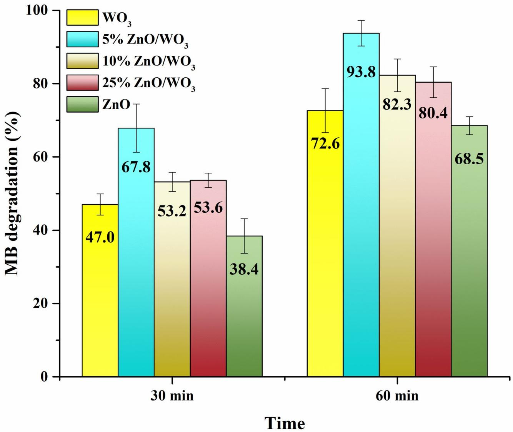

bar

| Time   | WO₃  | 5% ZnO/WO₃ | 10% ZnO/WO₃ | 25% ZnO/WO₃ | ZnO  |
| ------ | ---- | ---------- | ----------- | ----------- | ---- |
| 30 min | 47.0 | 67.8       | 53.2        | 53.6        | 38.4 |
| 60 min | 72.6 | 93.8       | 82.3        | 80.4        | 68.5 |

Fig. 3. Degradation of MB dye (5 mg/L) under simulated solar light irradiation.

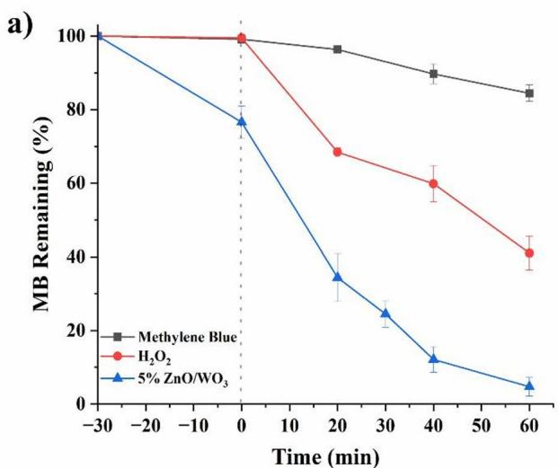

line

| Time (min) | Methylene Blue | H₂O₂ | 5% ZnO/WO₃ |
| ---------- | -------------- | ---- | ---------- |
| -30        | 100            | 100  | 100        |
| 0          | 100            | 100  | 78         |
| 20         | 98             | 68   | 34         |
| 40         | 90             | 60   | 12         |
| 60         | 85             | 42   | 5          |

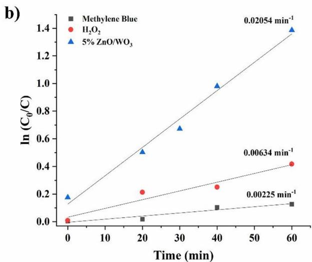

line

| Time (min) | Methylene Blue | H₂O₂     | 5% ZnO/WO₃ |
| ---------- | -------------- | -------- | ----------- |
| 0          | 0.0            | 0.0      | 0.18        |
| 20         | 0.0225         | 0.2      | 0.5         |
| 40         | -              | 0.25     | 1.0         |
| 60         | -              | 0.4      | 1.4         |

Fig. 4. Photodegradation of MB versus time (a) and kinetics (b).

<table><tr><td>Catalyst type</td><td>Catalyst, mg/L</td><td>Light source</td><td> $H_{2}O_{2}$ , mL/L</td><td>MB, mg/L</td><td>MB deg., %</td><td>Time, min</td><td>k,  $min^{-1}$ </td><td>Refs.</td></tr><tr><td>Monoclinic- $WO_{3}$ </td><td>500</td><td>Visible</td><td>0</td><td>40</td><td>96</td><td>120</td><td>-</td><td>36</td></tr><tr><td>1%rGO- $WO_{3}$ </td><td>300</td><td>Visible</td><td>0</td><td>10</td><td>65</td><td>60</td><td>0.01129</td><td>37</td></tr><tr><td> $MnO_{x}/WO_{3}$ </td><td>200</td><td>-</td><td>200 (0.1 M)</td><td>10</td><td>95</td><td>60</td><td>-</td><td>38</td></tr><tr><td>Pt/cubic- $WO_{3}$ </td><td>1000</td><td>Visible</td><td>0</td><td>3.2</td><td>67</td><td>60</td><td>0.0531</td><td>39</td></tr><tr><td> $WO_{3}$ </td><td>300</td><td>Solar</td><td>0.167 (35%)*</td><td>4</td><td>98</td><td>40</td><td>-</td><td>40</td></tr><tr><td> $WO_{3}-GO$ </td><td>500</td><td>Visible</td><td>0</td><td>3.2</td><td>82</td><td>70</td><td>-</td><td>41</td></tr><tr><td>Pt/ $WO_{3}-GO$ </td><td>500</td><td>Visible</td><td>0</td><td>3.2</td><td>94</td><td>70</td><td>-</td><td>41</td></tr><tr><td>5%ZnO/ $WO_{3}$ </td><td>100</td><td>Solar</td><td>0.167 (35%)</td><td>5</td><td>93.8</td><td>60</td><td>0.02054</td><td>This work</td></tr></table>

Table 3. Comparison of ${ \mathrm { W O } } _ { 3 }$ -based photocatalytic systems for MB degradation. \*One drop of $\mathrm { H } _ { 2 } \mathrm { O } _ { 2 } .$

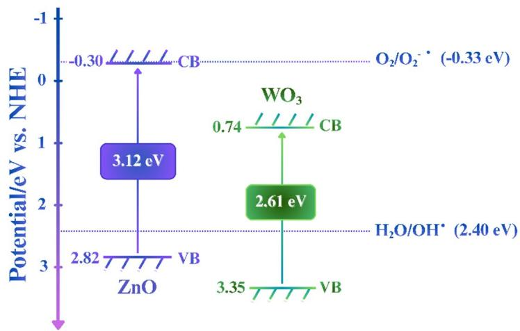

other

| Material | Potential (eV) |
| -------- | -------------- |
| ZnO      | 3.12           |
| WO₃      | 2.61           |
| O₂/O₂⁻   | -0.33          |
| H₂O/OH⁺  | 2.40           |
| VB       | 2.82           |
| CB       | 0.74           |

Fig. 5. Estimated energy band positions of ZnO and ${ \mathrm { W O } } _ { 3 } .$

analysis with other WO -based photocatalysts reported for MB degradation was carried out, and the outcomes 3are presented in Table 3. Several parameters were taken into account, including catalyst type/dosage, irradiation source and duration, pollutant and oxidant concentrations, as well as degradation percentage and reaction rate.

According to Table 3, the 5% $Z _ { \mathrm { { n O / W O } _ { \it { i } } } }$ photocatalyst exhibited a high degradation efficiency of MB (93.8%) 3at a relatively low dosage of 100 mg/L, which is below the catalyst loadings employed in all other studies. Unlike most studies that used visible light, this work employed solar irradiation, which is preferable for future practical applications. With respect to photocatalytic activity, the 5% $Z _ { \mathrm { { n O } / W O _ { 3 } } }$ photocatalyst achieved a notable apparent rate constant of 0.02054 $\mathrm { m i n } ^ { \tt L _ { 1 } }$ without relying on costly metals or complex surface modifications. Hence, it can be inferred that the 5% $\mathrm { Z n O / W O } _ { z }$ photocatalyst offers an optimal balance between low catalyst dosage and high MB degradation relative to other $\mathrm { \bar { W } O } _ { 3 }$ -based systems.

ZnO and ${ \mathrm { W O } } _ { 3 }$ 3 are both n-type semiconductors, exhibiting direct bandgap energies of 3.12 eV and 2.61 eV, 3respectively. Using Mulliken electronegativities (X) and the empirical relations, the valence- and conductionband potentials (Eqs. 3 and 4) were calculated42:

$$
\mathrm{E} _ {\mathrm{VB}} = \mathrm{X} - \mathrm{E} _ {\mathrm{e}} + 0. 5 \mathrm{E} _ {\mathrm{g}} \tag {3}
$$

$$
\mathrm{E} _ {\mathrm{CB}} = \mathrm{E} _ {\mathrm{VB}} - \mathrm{E} _ {\mathrm{g}} \tag {4}
$$

For $\mathrm { W O } _ { 3 } ( \mathrm { X } = 6 . 5 4 ~ \mathrm { e V } ) ^ { 4 2 }$ , the VB and CB edge positions are + 3.35 eV and + 0.74 eV vs. NHE, respectively. For ZnO $( \mathrm { X } { = } 5 . 7 6 ~ \mathrm { e V } ) ^ { 4 2 }$ , the corresponding VB and CB edges are + 2.82 eV and − 0.30 eV. Based on these band positions, the $\mathrm { Z n O / W O _ { 3 } }$ composite forms a type-II staggered heterojunction. The slight bandgap narrowing observed for the 5% $\mathrm { Z n { \bar { O } } / W { \bar { O } } _ { 3 } }$ composite $( 2 . 6 7 ~ \mathrm { e V } )$ further supports enhanced interfacial charge interaction between the two oxides.

Figures 5 and 6 and the corresponding Eqs. (5–9) present the proposed energy band positions and pathway for MB degradation via ZnO/WO photocatalysis in the presence of H $\phantom { } _ { \gamma } O _ { \gamma }$ . Upon light activation, electrons and 3holes will be formed in both semiconductors $( \operatorname { E q } . 5 )$ 2 2. Since the Fermi level of ZnO is higher than that of $\mathrm { W O } _ { 3 } ,$ electrons preferentially transfer from ZnO to $\mathrm { W O } _ { 3 } ,$ rendering WO an effective electron sink in the coupled oxide system43,44. The reduction of $\mathrm { O } _ { \gamma }$ 3 by electrons in the CB of $\check { \mathrm { W O } } _ { 3 }$ is thermodynamically unfavorable as the CB edge potential of ${ \mathrm { W O } } _ { 3 }$ 2 3 is more positive than the standard redox potential of the $_ { \mathrm { 0 } , / \mathrm { 0 } , \cdot }$ -couple45. Thus, 3 2 2accumulated electrons can react with hydrogen peroxide to produce one hydroxyl radical and one hydroxide ion $( \operatorname { E q } . 6 )$ . At the same time, the photogenerated holes can be transferred from the valence band (VB) of WO to the VB of ZnO. Photogenerated holes can either directly oxidize MB or generate highly reactive hydroxyl radicals using hydroxide ions or water molecules $( \mathrm { E q s . } 7 , 8 ) ^ { 4 6 , 4 7 }$ . Radical scavenger experiments (Figure S4) confirmed the dominant role of hydroxyl radicals in MB degradation: in the absence of scavengers, MB degradation reached 93.8%, whereas in the presence of IPA (OH• scavenger), it decreased to 75.8%, indicating a significant contribution of hydroxyl radicals. The addition of EDTA (h⁺ scavenger) and p-BQ ${ ( \mathrm { O } _ { 2 } ^ { \bullet - } }$ scavenger) slightly 2reduced the degradation efficiency to 89.2% and 86.7%, respectively, suggesting that holes and superoxide radicals also participate in the degradation process, but to a lesser extent. Finally, MB molecules are mineralized by producing $\mathrm { C O } _ { 2 } , \mathrm { \bar { H } } _ { 2 } \mathrm { O } ,$ and some degradation by-products (Eq. 9).

chemical

Diagram illustrating the photocatalytic mechanism of ZnO and WO₃ ions, showing degradation products, electron-hole separation, and excitation steps.

Fig. 6. Proposed mechanism for MB degradation using ZnO/WO photocatalyst.

$$
\mathrm{ZnO} / \mathrm{WO} _ {3} + \mathrm{hv} \rightarrow \mathrm{ZnO} ^ {*} / \mathrm{WO} _ {3} ^ {*} + \mathrm{e} ^ {-} + \mathrm{h} ^ {+} \tag {5}
$$

$$
\mathrm{H} _ {2} \mathrm{O} _ {2} + \mathrm{e} ^ {-} \rightarrow \mathrm{OH} ^ {\bullet} + \mathrm{OH} ^ {-} \tag {6}
$$

$$
\mathrm{OH} ^ {-} + \mathrm{h} ^ {+} \rightarrow \mathrm{OH} ^ {\bullet} \tag {7}
$$

$$
\mathrm{H} _ {2} \mathrm{O} + \mathrm{h} ^ {+} \rightarrow \mathrm{OH} ^ {\bullet} + \mathrm{H} ^ {+} \tag {8}
$$

$$
\mathrm{OH} ^ {\bullet} + \mathrm{MB} \rightarrow \text { degradation   products } + \mathrm{CO} _ {2} + \mathrm{H} _ {2} \mathrm{O} \tag {9}
$$

The influence of pH on MB degradation was also examined after 60  min of photocatalytic reaction (Figure S5a, Supporting Information). At acidic conditions (pH 4.4), MB degradation reached 81%, whereas complete degradation was achieved under alkaline conditions (pH 8.5). This enhancement can be attributed to the higher concentration of hydroxyl ions in basic media, which are readily oxidized by photogenerated holes to form highly reactive OH• radicals (Eq. 7). Moreover, under alkaline conditions, the catalyst surface acquires a negative charge, while MB is a cationic dye, leading to enhanced dye adsorption through the electrostatic interactions48. In contrast, under acidic conditions, ZnO component can be easily etched or ZnO/WO photocatalyst acquires a positive surface charge, which can repel the dye molecules. As shown in Figure S5b (Supporting Information), a catalyst dosage of 33.3 mg/L resulted in 87.6% MB degradation, whereas increasing the dosage to 166.7 mg/L enhanced the degradation efficiency up to 95.9%. Typically, regulation of the photocatalyst concentration provides control over degradation efficiency, but very high loadings can have an adverse effect due to the turbidity of the solution and reduced light penetration49. Furthermore, employing excessively high catalyst dosages is not economically feasible; therefore, adjusting the solution pH or extending the treatment duration provides a more practical alternative, as noted earlier. The reusability tests over five consecutive runs revealed a marked loss of activity, with degradation efficiency decreasing from 93.8% initially to 81.0% and 64.2% in the second and third cycles, respectively, followed by 62.8% and 59.9% in the fourth and fifth cycles (Figure S5c, Supporting Information). The XPS analysis of the recycled $\mathrm { Z n O / W O _ { 3 } }$ composite showed no significant shifts in the binding energies of the W 4f, Zn 2p, or O 1 s core levels, with peaks appearing at 35.7 and 37.9 eV (W6+), 1021.3 and 1044.4 eV $( Z \boldsymbol { \mathrm { n } } ^ { 2 + } )$ , and 530.0 and 532.5 eV for lattice and surface oxygen species, respectively (Figure S6, Supporting Information). These values closely match those of the fresh photocatalyst, indicating that the chemical states of $\mathrm { W } , \mathrm { Z n } ,$ and O remain preserved after repeated photocatalytic cycles. Therefore, a reduction in performance is likely attributable to catalyst photocorrosion or surface fouling by reaction intermediates not detectable by XPS, highlighting its limited durability during prolonged operation50. This stability issue can be resolved by depositing a more stable thin TiO layer on the surface of the photocatalyst, which will be addressed in future work.

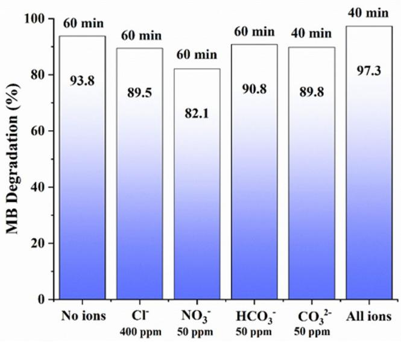

bar

| Condition | MB Degradation (%) |
| :--- | :--- |
| No ions | 93.8 |
| Cl⁻ (400 ppm) | 89.5 |
| NO₃⁻ (50 ppm) | 82.1 |
| HCO₃⁻ (50 ppm) | 90.8 |
| CO₃²⁻ (50 ppm) | 89.8 |
| All ions | 97.3 |
60 min; 40 min; 60 min; 40 min

Fig. 7. MB degradation with 5% $Z _ { \mathrm { { n O } / W O _ { 3 } } }$ in the presence of different ions.

Figure 7 shows the effect of different anions on the photocatalytic degradation efficiency of MB by 5% ZnO/ $\mathrm { W O } _ { 3 } ,$ with the concentrations selected to mimic those occurring in wastewater26. In the presence of 400 ppm Cl⁻, the degradation efficiency reached 89% under the same conditions, indicating a moderate inhibitory influence of Cl⁻ ions on the photocatalytic process. By contrast, $\mathrm { N O } _ { 3 } ^ { - }$ ions (50 ppm) exerted a slightly stronger suppression, reducing the efficiency to 82%. Unlike Cl⁻ and ${ \mathrm { N O } } _ { 3 } ^ { - } ,$ 3, bicarbonate ions $\mathrm { ( H C O } _ { 3 } ^ { - } ,$ 50 ppm) showed a minimal inhibitory influence, with 91% of MB degradation achieved after 1 h. Notably, the addition of 50 ppm $\mathrm { C O } _ { 3 } ^ { 2 - }$ led to 90% degradation, whereas the mixture of all anions enhanced the efficiency to 97% with a shortened reaction time of 40  min. Carbonate ions are common constituents of natural waters, and can interact with hydroxyl radicals to yield carbonate radicals according to Eq. $( 1 0 ) ^ { 5 1 }$ .

$$
\mathrm{OH} ^ {\bullet} + \mathrm{CO} _ {3} ^ {2 -} \rightarrow \mathrm{CO} _ {3} ^ {\bullet -} + \mathrm{OH} ^ {-} \tag {10}
$$

Although hydroxyl radicals possess a higher redox potential than carbonate radicals, the latter can still promote MB degradation owing to their extended lifespan and high selectivity27,51. In summary, anions introduced at near-natural or elevated concentrations showed no significant impact on the photocatalytic degradation process, suggesting that subsequent studies may be carried out with actual textile wastewater.

# Conclusions

This study demonstrates that the synthesized $Z _ { \mathrm { { n O } / W O _ { 3 } } }$ composite structure achieves markedly improved photocatalytic activity toward MB degradation under simulated solar irradiation, outperforming bare ZnO and ${ \mathrm { W O } } _ { 3 }$ structures.  Notably, the 5% ZnO/WO composite was found to be the most effective, offering larger pore volume, improved charge carrier separation, and enhanced photocatalytic performance in MB dye degradation. A comparative analysis with other $\mathrm { \bar { \Delta W O } } _ { 3 }$ -based photocatalysts suggested that the 5% $\mathrm { Z n O / W O _ { 3 } }$ composite is more effective in terms of cost, catalyst dosage, light source, degradation time, and apparent rate constant. Furthermore, assessment of photocatalytic performance in the presence of anions typically found in wastewater confirms that the proposed catalyst can operate effectively under realistic conditions. Mechanistic investigations provided additional insight into the photocatalytic behavior of the composite. Radical scavenger experiments revealed that hydroxyl radicals are the dominant reactive species responsible for MB degradation, while photogenerated holes and superoxide radicals contribute to a lesser extent. The XPS analysis confirmed that the oxidation states of $\mathrm { W } ^ { 6 + } , \mathrm { Z n } ^ { 2 + }$ , and lattice oxygen remained unchanged after 5 photocatalytic cycles, indicating that the bulk chemical structure is preserved during operation. While reusability tests indicated certain stability concerns due to the possible partial photocorrosion of ZnO or surface fouling by degradation intermediates, the proposed 5% $\mathrm { Z n { \dot { O } } / W O _ { 3 } }$ composite still represents a viable option for the efficient degradation of organic pollutants. Future improvements, such as coating with a thin and stable $\mathrm { T i O } _ { 2 }$ layer, may help overcome these limitations and will be addressed in future studies.

# Data availability

The data supporting this article have been included as part of the Supporting Information.

Received: 18 September 2025; Accepted: 11 February 2026

Published online: 18 February 2026

# References

1. Dal, A., Yesil, E. S., Ozturk, E. & Kitis, M. Investigation of water and carbon footprint reductions employing best available techniques in the textile sector. J. Clean. Prod. 466, 142913 (2024).   
2. Ajmal, A., Majeed, I., Malik, R. N., Idriss, H. & Nadeem, M. A. Principles and mechanisms of photocatalytic dye degradation on TiO based photocatalysts: a comparative overview. RSC Adv. 4, 37003–37026 (2014).   
3. Auerbach, S. S. et al. Toxicity and carcinogenicity studies of methylene blue trihydrate in F344N rats and B6C3F1 mice. Food Chem. Toxicol. 48, 169–177 (2009).   
4. Khan, I. et al. Review on methylene blue: its properties, uses, toxicity and photodegradation. Water 14, 242 (2022).   
5. Oladoye, P. O., Ajiboye, T. O., Omotola, E. O. & Oyewola, O. J. Methylene blue dye: toxicity and potential elimination technology from wastewater. Results Eng. 16, 100678 (2022).   
6. Li, S., Cui, Y., Wen, M. & Ji, G. Toxic effects of methylene blue on the growth, reproduction and physiology of daphnia magna. Toxics 11, 594 (2023).   
7. Dimbo, D. et al. Methylene blue adsorption from aqueous solution using activated carbon of Spathodea campanulata. Results Eng. 21, 101910 (2024).   
8. Ihaddaden, S., Aberkane, D., Boukerroui, A. & Robert, D. Removal of methylene blue (basic dye) by coagulation-flocculation with biomaterials (bentonite and opuntia ficus indica). J. Water Process. Eng. 49, 102952 (2022).   
9. Teixeira, Y. N. et al. Removal of methylene blue from a synthetic effluent by ionic flocculation. Heliyon 8, e10868 (2022).   
10. Wu, K. et al. Decolourization and biodegradation of methylene blue dye by a ligninolytic enzyme-producing Bacillus thuringiensis: degradation products and pathway. Enzym. Microb. Technol. 156, 109999 (2022).   
11. Haque, M. M. et al. Enhanced biofilm-mediated degradation of carcinogenic and mutagenic Azo dye by novel bacteria isolated from tannery wastewater. J. Environ. Chem. Eng. 11, 110731 (2023).   
12. Lee, D. E., Kim, M. K., Danish, M. & Jo, W. K. State-of-the-art review on photocatalysis for efficient wastewater treatment: attractive approach in photocatalyst design and parameters affecting the photocatalytic degradation. Catal Commun. 183, 106764 (2023).   
13. Kumari, S. et al. A comprehensive study on photocatalysis: materials and applications. CrystEngComm 26, 4886–4915 (2024).   
14. Lee, K. M., Lai, C. W., Ngai, K. S. & Juan, J. C. Recent developments of zinc oxide based photocatalyst in water treatment technology: A review. Water Res. 88, 428–448 (2015).   
15. Samuel, O. et al. Kurniawan, WO –based photocatalysts: A review on synthesis, performance enhancement and photocatalytic memory for environmental applications. Ceram. Int. 48, 5845–5875 (2021).   
16. Kanafin, Y. N., Abduvalov, A., Kaikanov, M., Poulopoulos, S. G. & Atabaev, T. S. A review on WO photocatalysis used for wastewater treatment and pesticide degradation. Heliyon 11, e40788 (2024).   
17. Yuju, S., Xiujuan, T., Dongsheng, S., Zhiruo, Z. & Meizhen, W. A review of tungsten trioxide (WO )-based materials for antibiotics removal via photocatalysis. Ecotoxicol. Environ. Saf. 259, 114988 (2023).   
18. Dong, P., Hou, G., Xi, X., Shao, R. & Dong, F. WO -based photocatalysts: morphology control, activity enhancement and 3multifunctional applications. Environ. Sci. Nano. 4, 539–557 (2017).   
19. Turkten, N. & Bekbolet, M. Photocatalytic performance of titanium dioxide and zinc oxide binary system on degradation of humic matter. J. Photochem. Photobiol., A. 401, 112748 (2020).   
20. Adhikari, S., Sarkar, D. & Madras, G. Highly efficient WO –ZnO mixed oxides for photocatalysis. RSC Adv. 5, 11895–11904 (2015).   
21. Sajjad, A. K. L., Sajjad, S., Iqbal, A. & Ryma, N. U. A. ZnO/WO nanostructure as an efficient visible light catalyst. Ceram. Int. 44, 9364–9371 (2018).   
22. Jain, K., Maan, D., Kumar, A., Jain, S. K. & Tripathi, B. Mechanically synthesized S @ RGO nanocomposites for dye photodegradation. Discover Mater. 5, 181 (2025).   
23. Wang, Y. et al. Anisotropic growth of ZnO nanoparticles driven by the structure of amine surfactants: the role of surface dynamics in nanocrystal growth. Nanoscale Adv. 3, 6088–6099 (2021).   
24. Em, S. et al. Uncovering the role of surface-attached ag nanoparticles in photodegradation improvement of Rhodamine B by ZnO-Aa nanorods. Nanomaterials 12, 2882 (2022).   
25. Aldrees, A., Khan, H., Alzahrani, A. & Dan’azumi, S. Synthesis and characterization of tungsten trioxide (WO ) as photocatalyst against wastewater pollutants. Appl. Water Sci. 13, 156 (2023).   
26. Sarkar, A. et al. In-situ synthesis of star-shaped Ni supported on WO nanoparticles for selective hydrogenation of cinnamaldehyde. Int. J. Hydrog. Energy. 59, 1174–1182 (2024).   
27. Rustembekkyzy, K. et al. Microwave-assisted synthesis of ZnO structures for effective degradation of methylene blue dye under solar light illumination. RSC Adv. 14, 16293–16299 (2024).   
28. Hunge, Y. M., Yadav, A. A., Mohite, B. M., Mathe, V. L. & Bhosale, C. H. Photoelectrocatalytic degradation of sugarcane factory wastewater using WO /ZnO thin films. J. Mater. Sci. Mater. Electron. 29, 3808–3816 (2018).   
329. Fatehmulla, A. et al. Physical characteristics, blue-green band emission and photocatalytic activity of Au-decorated ZnO quantum dots-based Thick films prepared using the Doctor blade technique. Molecules 28, 4644 (2023).   
30. Thommes, M. et al. Physisorption of gases, with special reference to the evaluation of surface area and pore size distribution (IUPAC Technical Report). Pure Appl. Chem. 87, 1051–1069 (2015).   
31. Li, L., Li, J., Kim, B. K. H. & Huang, J. The effect of morphology and crystal structure on the photocatalytic and photoelectrochemical performances of WO . RSC Adv. 14, 2080–2087 (2024).   
332. Abduvalov, A. et al. Creation of light trapping structures on spin-coated PVA containing WO photo anodes by intense pulsed ion beam irradiation and their photocatalytic studies. Appl. Surf. Sci. 709, 163874 (2025).   
33. Davis, K., Yarbrough, R., Froeschle, M., White, J. & Rathnayake, H. Band gap engineered zinc oxide nanostructures via a sol–gel synthesis of solvent driven shape-controlled crystal growth. RSC Adv. 9, 14638–14648 (2019).   
34. Hunge, Y. M., Yadav, A. A., Mahadik, M. A., Mathe, V. L. & Bhosale, C. H. A highly efficient Visible-Light responsive sprayed WO3/ FTO photoanode for photoelectrocatalytic degradation of brilliant blue. J. Taiwan. Inst. Chem. Eng. 85, 273–281 (2018).   
35. Hunge, Y. M., Yadav, A. A., Kang, S. & Kim, H. Facile synthesis of multitasking composite of silver nanoparticle with zinc oxide for 4-Nitrophenol Reduction, photocatalytic hydrogen Production, and 4-Chlorophenol degradation. J. Alloys Compd. 928, 167133 (2022).   
36. Zhang, S., Li, H. & Yang, Z. Controllable synthesis of WO with different crystalline phases and its applications on methylene blue removal from aqueous solution. J. Alloys Compd. 722, 555–563 (2017).   
37. Prabhu, S., Manikumar, S., Cindrella, L. & Kwon, O. J. Charge transfer and intrinsic electronic properties of rGO-WO nanostructures for efficient photoelectrochemical and photocatalytic applications. Mater. Sci. Semiconduct. Process. 74, 136–146 (2017).   
38. Amini, M., Pourbadiei, B., Ruberu, T. P. A. & Woo, L. K. Catalytic activity of MnO /WO nanoparticles: synthesis, structure x 3characterization and oxidative degradation of methylene blue. New J. Chem. 38, 1250–1255 (2014).   
39. Fujii, A. et al. Preparation of Pt-loaded WO with different types of morphology and photocatalytic degradation of methylene blue. Surf. Coat. Technol. 271, 251–258 (2014).

40. Azmat, S. et al. Solar light triggered photocatalytic performance of WO nanostructures; waste water treatment. Mater. Res. Express. 5, 115025 (2018).   
41. Ismail, A. A., Faisal, M. & Al-Haddad, A. Mesoporous WO -graphene photocatalyst for photocatalytic degradation of methylene blue dye under visible light illumination. J. Environ. Sci. 66, 328–337 (2017).   
42. Ghattavi, S. & Nezamzadeh-Ejhieh, A. A brief study on the boosted photocatalytic activity of AgI/WO3/ZnO in the degradation of methylene blue under visible light irradiation. Desalin. Water Treat. 166, 92–104 (2019).   
43. Tu, C. et al. Constructing a directional ion acceleration layer at WO /ZnO heterointerface to enhance Li-ion transfer and storage. Compos. Part. B: Eng. 205, 108511 (2020).   
44. Xu, Y. & Chen, T. Development of nanostructured based ZnO@WO photocatalyst and its photocatalytic and electrochemical properties: degradation of Rhodamine B. Int. J. Electrochem. Sci. 18, 100055 (2023).   
45. Murillo-Sierra, J. C., Hernández-Ramírez, A., Hinojosa-Reyes, L. & Guzmán-Mar, J. L. A review on the development of visible light-responsive WO -based photocatalysts for environmental applications. Chem. Eng. J. Adv. 5, 100070 (2020).   
46. Yelpale, A. M. et al. Ag-Doped ZnO nanostructures synthesized via Co-Precipitation method for enhanced photodegradation of crystal Violet dye. Mater. Sci. Eng. B. 314, 118038 (2025).   
47. Kale, V. et al. Modification of energy level diagram of Nano-Crystalline ZnO by its composites with ZnWO4 suitable for sunlight assisted photo catalytic activity. Mater. Today Commun. 26, 102101 (2021).   
48. Chanu, L. A., Singh, W. J., Singh, K. J. & Devi, K. N. Effect of operational parameters on the photocatalytic degradation of methylene blue dye solution using manganese doped ZnO nanoparticles. Results Phys. 12, 1230–1237 (2019).   
49. Mzimela, N., Tichapondwa, S. & Chirwa, E. Visible-light-activated photocatalytic degradation of Rhodamine B using WO nanoparticles. RSC Adv. 12, 34652–34659 (2022).   
50. Dimitropoulos, M. et al. Unveiling the photocorrosion mechanism of zinc oxide photocatalyst: interplay between surface corrosion and regeneration. J. Environ. Chem. Eng. 12, 112102 (2024).   
51. Wang, J. & Wang, S. Effect of inorganic anions on the performance of advanced oxidation processes for degradation of organic contaminants. Chem. Eng. J. 411, 128392 (2021).

# Author contributions

This manuscript was written through the contributions of all authors. All authors approved the final version of the manuscript.

# Funding

This research has been funded by the Committee of Science of the Ministry of Science and Higher Education of the Republic of Kazakhstan (Grant No. BR28712489). This research was also funded by Nazarbayev University FDCRDG (Grant No. 20122022FD4111).

# Declarations

# Competing interests

The authors declare no competing interests.

# Additional information

Supplementary Information The online version contains supplementary material available at https://doi.org/1 0.1038/s41598-026-40207-0.

Correspondence and requests for materials should be addressed to M.K. or T.S.A.

Reprints and permissions information is available at www.nature.com/reprints.

Publisher’s note Springer Nature remains neutral with regard to jurisdictional claims in published maps and institutional affiliations.

Open Access This article is licensed under a Creative Commons Attribution-NonCommercial-NoDerivatives 4.0 International License, which permits any non-commercial use, sharing, distribution and reproduction in any medium or format, as long as you give appropriate credit to the original author(s) and the source, provide a link to the Creative Commons licence, and indicate if you modified the licensed material. You do not have permission under this licence to share adapted material derived from this article or parts of it. The images or other third party material in this article are included in the article’s Creative Commons licence, unless indicated otherwise in a credit line to the material. If material is not included in the article’s Creative Commons licence and your intended use is not permitted by statutory regulation or exceeds the permitted use, you will need to obtain permission directly from the copyright holder. To view a copy of this licence, visit http://creativecommo ns.org/licenses/by-nc-nd/4.0/.

© The Author(s) 2026

# SUPPORTING INFORMATION

# ZnO/WO3 composite for efficient photocatalytic degradation of Methylene blue dye under solar light

Yerkanat N. Kanafin,a Kuralay Rustembekkyzy,a Altynay Seiilbek,b Kamshat Kutzhanova,c Shanazar Atabaev,d Marat Kaikanov,e,f\* and Timur Sh. Atabaeva,f \*

a Department of Chemistry, Nazarbayev University, Astana, Kazakhstan   
b Department of Chemistry, Utrecht University, Utrecht, The Netherlands   
c Department of Physical and Analytical Chemistry, Karaganda Buketov University, Karaganda, Kazakhstan   
d Department of General Educational Disciplines, Chirchik Branch of Auezov University, Chirchik, Uzbekistan   
e Department of Physics, Nazarbayev University, Astana, Kazakhstan   
f Institute of Functional Materials, Astana, Kazakhstan   
\* Correspondence: marat.kaikanov@nu.edu.kz and timur.atabaev@nu.edu.kz

Table S1. ZnO content in ZnO/WO3 structures determined by ICP-OES. 

<table><tr><td>Catalysts</td><td>ZnO, %</td></tr><tr><td>5% ZnO/WO3</td><td>3.76</td></tr><tr><td>10% ZnO/WO3</td><td>7.27</td></tr><tr><td>25% ZnO/WO3</td><td>20.56</td></tr></table>

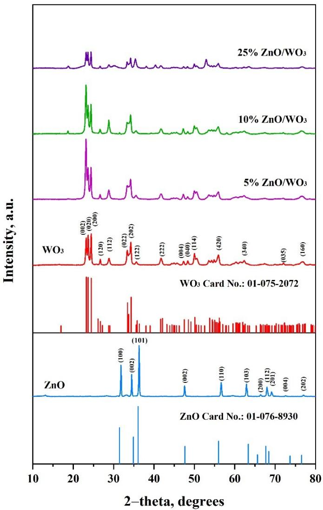  
Figure S1. XRD patterns of bare $\mathrm { W O _ { 3 } } , \mathrm { Z n O } ,$ and synthesized $\mathrm { Z n O / W O _ { 3 } }$ composites.

Table S2. Average crystallite size, dislocation density, and lattice strain of the prepared structures. 

<table><tr><td>Catalysts</td><td>Crystallite size, nm</td><td> $\delta \times 10^{-3}$  (nm $^{-2}$ )</td><td> $\varepsilon \times 10^{-3}$ </td></tr><tr><td>WO $_3$ </td><td>22.88</td><td>4.97</td><td>4.97</td></tr><tr><td>5% ZnO/WO $_3$ </td><td>18.05</td><td>8.4</td><td>6.67</td></tr><tr><td>10% ZnO/WO $_3$ </td><td>23.63</td><td>4.96</td><td>5.42</td></tr><tr><td>25% ZnO/WO $_3$ </td><td>21.32</td><td>4.92</td><td>5.81</td></tr><tr><td>ZnO</td><td>41.36</td><td>2.72</td><td>5.02</td></tr></table>

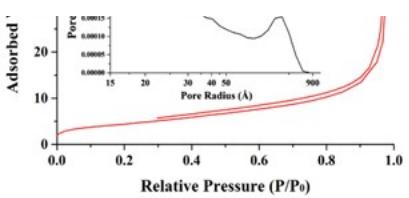

line

| Relative Pressure (P/P₀) | Adsorbed |
| ------------------------ | -------- |
| 0.0                      | 0        |
| 0.2                      | 2        |
| 0.4                      | 4        |
| 0.6                      | 8        |
| 0.8                      | 12       |
| 1.0                      | 20       |

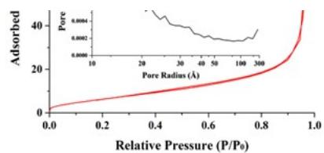

line

| Relative Pressure (P/P₀) | Adsorbed |
| ------------------------ | -------- |
| 0.0                      | 0        |
| 0.2                      | ~5       |
| 0.4                      | ~10      |
| 0.6                      | ~15      |
| 0.8                      | ~25      |
| 1.0                      | ~40      |

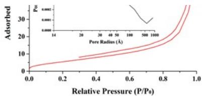

line

| Relative Pressure (P/P₀) | Adsorbed (P₀) |
|---|---|
| 0.0 | 2 |
| 0.2 | 4 |
| 0.4 | 6 |
| 0.6 | 10 |
| 0.8 | 15 |
| 1.0 | 30 |

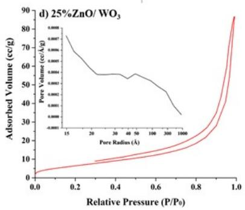

line

| Relative Pressure (P/P₀) | Adsorbed Volume (cc/g) |
| ------------------------ | ---------------------- |
| 0.0                      | 0.0                    |
| 0.2                      | 5.0                    |
| 0.4                      | 10.0                   |
| 0.6                      | 15.0                   |
| 0.8                      | 25.0                   |
| 1.0                      | 90.0                   |

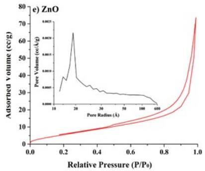

line

| Relative Pressure (P/P₀) | Adsorbed Volume (cc/g) |
| ------------------------ | ---------------------- |
| 0.0                      | 0                      |
| 0.2                      | ~5                     |
| 0.4                      | ~10                    |
| 0.6                      | ~15                    |
| 0.8                      | ~25                    |
| 1.0                      | ~75                    |

Figure S2. Nitrogen adsorption-desorption isotherms and pore size distribution data (inset) for the bare $\mathrm { W O _ { 3 } } , \mathrm { Z n O / W O _ { 3 } }$ heterojunctions, and bare ZnO.

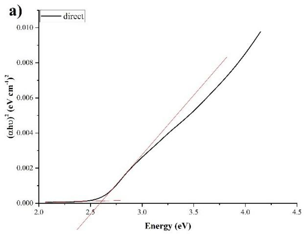

line

| Energy (eV) | (zhu)² (eV cm⁻¹)² |
|-------------|-------------------|
| 2.0         | 0.000             |
| 2.5         | 0.000             |
| 3.0         | 0.002             |
| 3.5         | 0.006             |
| 4.0         | 0.008             |
| 4.5         | 0.010             |

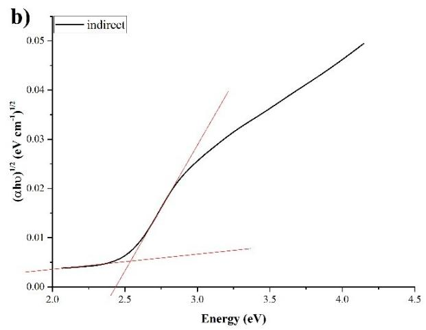

line

| Energy (eV) | (αħω)^(1/2) (eV cm⁻¹)^(1/2) |
|-------------|-----------------------------|
| 2.0         | 0.00                        |
| 2.5         | 0.005                       |
| 3.0         | 0.025                       |
| 3.5         | 0.035                       |
| 4.0         | 0.045                       |
| 4.5         | 0.05                        |

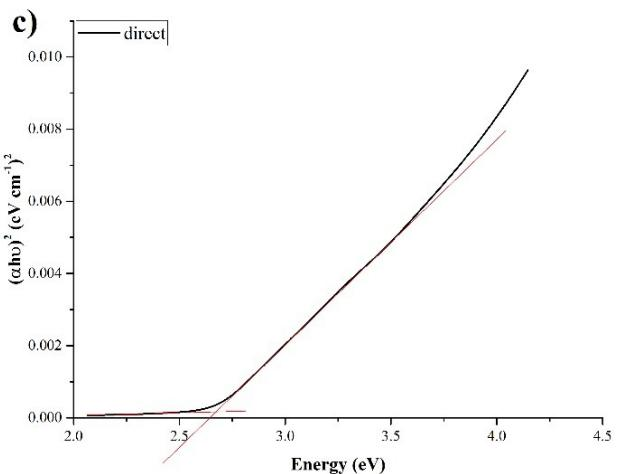

line

| Energy (eV) | direct     | direct_line |
|-------------|------------|-------------|
| 2.0         | 0.0000     | 0.0000      |
| 2.5         | 0.0001     | 0.0001      |
| 3.0         | 0.0020     | 0.0020      |
| 3.5         | 0.0060     | 0.0060      |
| 4.0         | 0.0085     | 0.0085      |
| 4.5         | 0.0100     | 0.0100      |

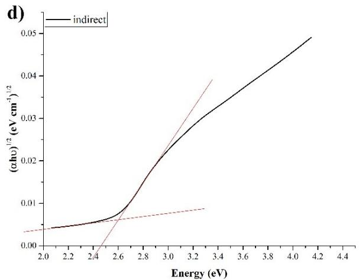

line

| Energy (eV) | (αħω)¹/² (eV cm⁻¹)¹/² |
|-------------|------------------------|
| 2.0         | 0.003                  |
| 2.4         | 0.005                  |
| 2.6         | 0.008                  |
| 3.0         | 0.025                  |
| 3.4         | 0.035                  |
| 4.2         | 0.05                   |

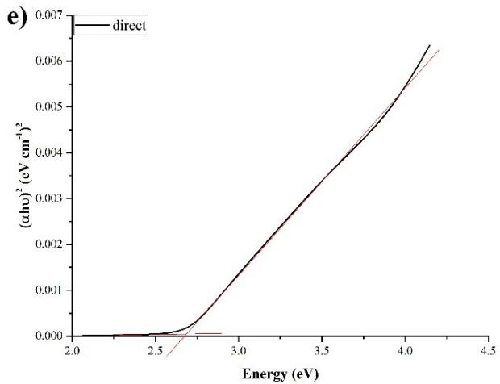

line

| Energy (eV) | (αhu)² (eV cm⁻¹)² |
|-------------|-------------------|
| 2.0         | 0.000             |
| 2.5         | 0.000             |
| 3.0         | 0.001             |
| 3.5         | 0.003             |
| 4.0         | 0.005             |
| 4.5         | 0.006             |

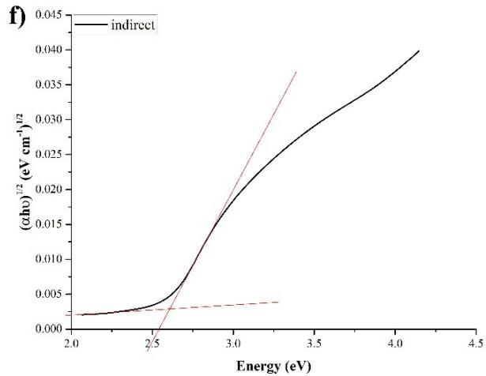

line

| Energy (eV) | indirect (αhν)^(1/2) (eV cm⁻¹)^(1/2) |
|-------------|-------------------------------------|
| 2.0         | 0.002                               |
| 2.5         | 0.003                               |
| 3.0         | 0.015                               |
| 3.5         | 0.028                               |
| 4.0         | 0.038                               |
| 4.5         | 0.040                               |

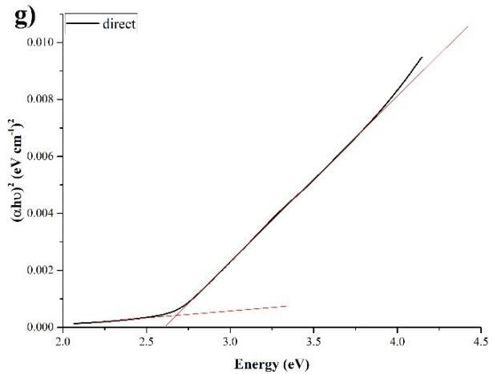

line

| Energy (eV) | direct       | direct_line |
|-------------|--------------|-------------|
| 2.0         | 0.0000       | 0.0000      |
| 2.5         | 0.0001       | 0.0001      |
| 3.0         | 0.0020       | 0.0020      |
| 3.5         | 0.0060       | 0.0060      |
| 4.0         | 0.0090       | 0.0090      |
| 4.5         | 0.0110       | 0.0110      |

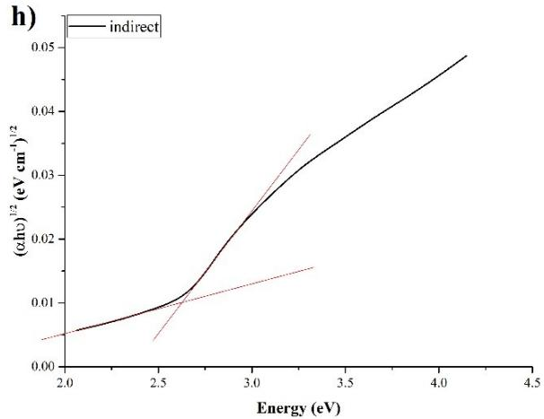

line

| Energy (eV) | indirect (αħν)^(1/2) (eV cm⁻¹/²) |
|-------------|----------------------------------|
| 2.0         | 0.005                            |
| 2.5         | 0.01                             |
| 3.0         | 0.025                            |
| 3.5         | 0.035                            |
| 4.0         | 0.045                            |
| 4.5         | 0.05                             |

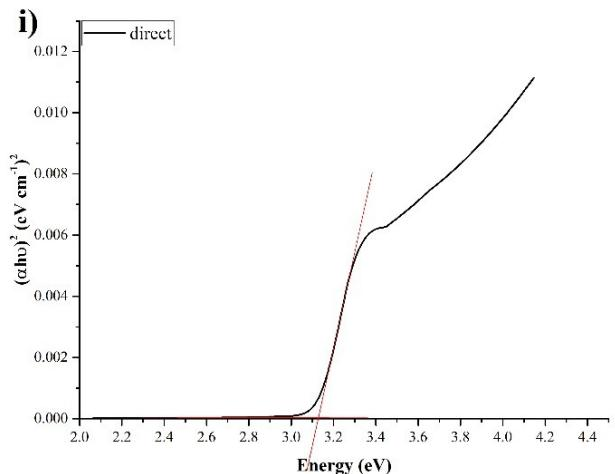

line

| Energy (eV) | (αħν)² (eV cm⁻¹)² |
|-------------|-------------------|
| 2.0         | 0.000             |
| 2.2         | 0.000             |
| 2.4         | 0.000             |
| 2.6         | 0.000             |
| 2.8         | 0.000             |
| 3.0         | 0.000             |
| 3.2         | 0.002             |
| 3.4         | 0.006             |
| 3.6         | 0.007             |
| 3.8         | 0.008             |
| 4.0         | 0.010             |
| 4.2         | 0.011             |
| 4.4         | 0.012             |

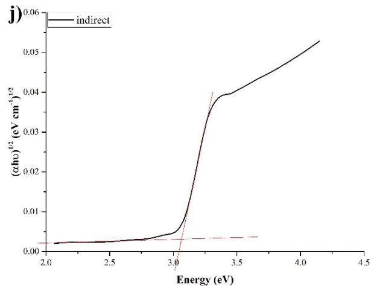

line

| Energy (eV) | (αħu)^(1/2) (eV cm⁻¹)^(1/2) |
|-------------|-----------------------------|
| 2.0         | 0.00                        |
| 2.5         | 0.00                        |
| 3.0         | 0.00                        |
| 3.5         | 0.04                        |
| 4.0         | 0.05                        |
| 4.5         | 0.06                        |

Figure S3. Direct and indirect band gap calculation graphs of (a-b) pure $\mathrm { W O } _ { 3 } ,$ (c-d) $5 \% Z \mathrm { n O } / \mathrm { W O } _ { 3 } ,$ (ef) $1 0 \% Z \mathrm { n O } / \mathrm { W O } _ { 3 } ,$ (g-h) $2 5 \% Z \mathrm { n O } / \mathrm { W O } _ { 3 }$ and (i-j) pure ZnO.

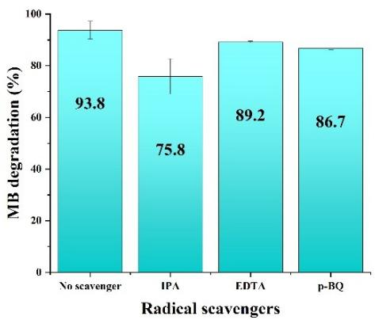

bar

| Radical scavengers | MB degradation (%) |
|---|---|
| No scavenger | 93.8 |
| IPA | 75.8 |
| EDTA | 89.2 |
| p-BQ | 86.7 |

Figure S4. Radical quenching experiments (scavenger concentrations – 5 mM each).

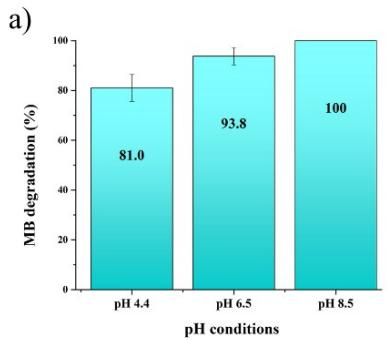

bar

| pH conditions | MB degradation (%) |
|---|---|
| pH 4.4 | 81.0 |
| pH 6.5 | 93.8 |
| pH 8.5 | 100 |

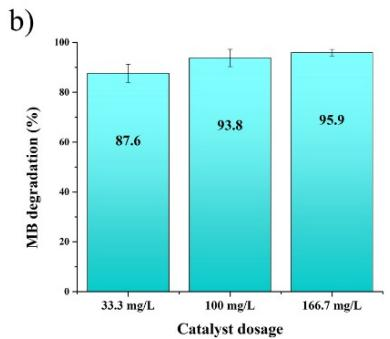

bar

| Catalyst dosage | MB degradation (%) |
| :--- | :--- |
| 33.3 mg/L | 87.6 |
| 100 mg/L | 93.8 |
| 166.7 mg/L | 95.9 |

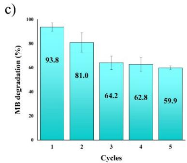

bar

| Cycles | MB degradation (%) |
|---|---|
| 1 | 93.8 |
| 2 | 81.0 |
| 3 | 64.2 |
| 4 | 62.8 |
| 5 | 59.9 |

Figure S5. The effects of pH (a) and catalyst dosage (b) on MB degradation. Recyclability (c) of 5% ${ \mathrm { Z n O / W O _ { 3 } } }$ catalyst.

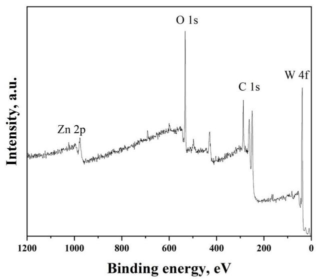

line

| Binding energy, eV | Intensity, a.u. |
| ------------------ | --------------- |
| ~1000              | Zn 2p           |
| ~650               | O 1s            |
| ~150               | C 1s            |
| ~200               | W 4f            |

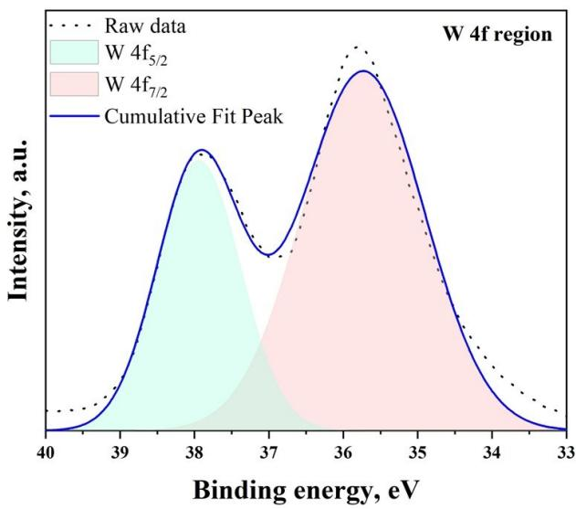

area

| Binding energy, eV | Raw data | W 4f₅/₂ | W 4f₇/₂ | Cumulative Fit Peak |
| ------------------ | -------- | ------- | ------- | ------------------- |
| 38                 |          | High    |         | High                |
| 37                 |          | Low     |         | Low                 |
| 36                 |          |         | High    | High                |
| 35                 |          |         |         | Medium              |
| 34                 |          |         |         | Low                 |
| 33                 |          |         |         | Low                 |

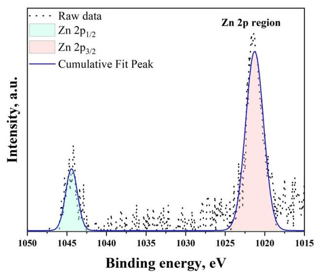

line

| Binding energy, eV | Intensity, a.u. |
| ------------------ | --------------- |
| 1045               | ~0.8            |
| 1020               | Peak (~1.0)     |

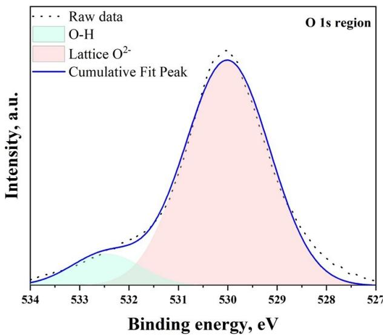

area

| Binding energy, eV | Raw data | O-H | Lattice O²⁻ | Cumulative Fit Peak |
| ------------------ | -------- | --- | ----------- | ------------------- |
| 534                | 0        | 0   | 0           | 0                   |
| 533                | 0        | 0   | 0           | 0                   |
| 532                | 0        | 0   | 0           | 0                   |
| 531                | 0        | 0   | 0           | 0                   |
| 530                | 1        | 0   | 1           | 1                   |
| 529                | 0        | 0   | 0           | 0                   |
| 528                | 0        | 0   | 0           | 0                   |
| 527                | 0        | 0   | 0           | 0                   |

Figure S6. XPS survey and high-resolution spectra of the 5% ${ \mathrm { Z n O / W O _ { 3 } } }$ composite after 5 cycles.